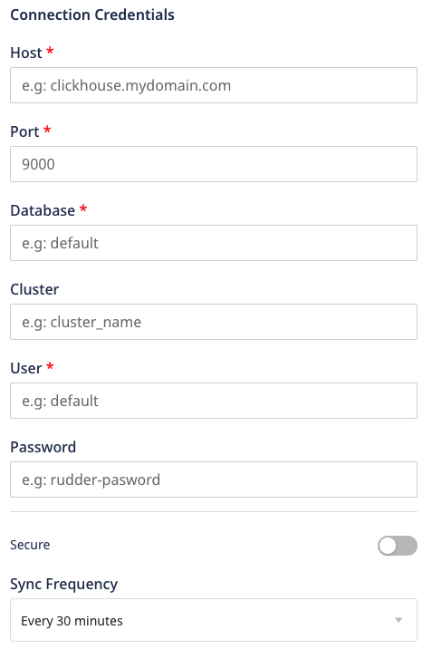
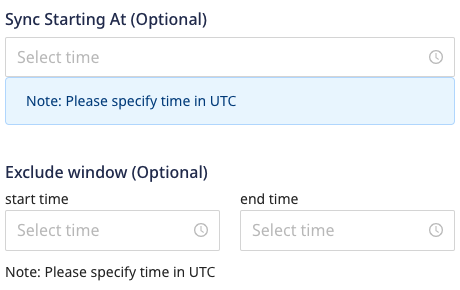

[ClickHouse](https://clickhouse.tech/) is an open-source, column-oriented database management system mainly used for online analytical processing (OLAP). It is fast, and allows for real-time analysis of your data.

RudderStack lets you configure ClickHouse as a destination to which you can send your event data seamlessly.

<div class="infoBlock">
Refer to the <Link to="/destinations/warehouse-destinations/warehouse-schema/">Warehouse Schema</Link> guide for more information on how the events are mapped to the tables in ClickHouse.
</div>

<div class="successBlock">
Find the open source transformer code for this destination in the <a href="https://github.com/rudderlabs/rudder-transformer/tree/master/src/v0/destinations/clickhouse">GitHub repository</a>.
</div>

## Setting user permissions in ClickHouse

Make sure your ClickHouse user has read access to `system.columns` table for fetching the table schemas.

You also to need to set `date_time_input_format` to `best_effort` for ClickHouse to parse all the [ISO 8601](https://en.wikipedia.org/wiki/ISO_8601) date and time formats, as shown:

```bash
set date_time_input_format = 'best_effort';
```

<div class="infoBlock">
RudderStack uses the <code class="inline-code">UInt8</code> datatype to set Boolean values and map <code class="inline-code">UInt8</code>to Boolean internally. So when a schema is fetched from ClickHouse, RudderStack treats <code class="inline-code">UInt8</code> as Boolean.
</div>

<div class="warningBlock">
If you are creating tables in the same database where RudderStack loads, it is highly recommend to not use <code class="inline-code">UInt8</code>as a datatype except for Boolean values (0,1).
</div>

## Configuring ClickHouse in RudderStack

To send event data to ClickHouse, you first need to add it as a destination in RudderStack and connect it to your data source. Once the destination is enabled, events will automatically start flowing to ClickHouse via RudderStack.

To configure ClickHouse as a destination in RudderStack, follow these steps:

1. In your [RudderStack dashboard](https://app.rudderstack.com), set up the data source. Then, select **ClickHouse** from the list of destinations.
2. Assign a name to your destination and then click on **Next**.

### Connection Settings




Enter the following credentials in the **Connection Credentials** page:

- **Host**: The host name of your ClickHouse database.
- **Port**: The TCP port of your ClickHouse host. If you want the connection to be secure, use the secure TCP port `9440`. Refer to the [ClickHouse guide](https://clickhouse.tech/docs/en/operations/server-configuration-parameters/settings/#server_configuration_parameters-tcp_port) for more information.
- **Database**: The database name in your ClickHouse instance where the data gets loaded.
- **Cluster**: The name of your ClickHouse cluster. **If you are running a single host ClickHouse cluster, leave this field blank.**
- **User**: The name of the user with the required read/write access to the above database.
- **Password**: The password for the above user.
- **Secure**: Enable this setting to establish a secure connection.
- **Sync Frequency**: Specify how often RudderStack should sync the data to your ClickHouse database.
- **Sync Starting At**: This optional setting lets you specify the particular time of the day (in UTC) when you want RudderStack to sync the data to the warehouse.
- **Exclude Window**: This optional setting lets you set a time window when RudderStack will **not sync** the data to your database.

### Configuring the object storage

RudderStack lets you configure the following object storage configuration settings while setting up your ClickHouse destination:

- **Use RudderStack-managed object storage**: Enable this setting to use RudderStack-managed buckets for object storage.

<div class="warningBlock">
This option is applicable only for RudderStack-hosted data planes. For <Link to="/get-started/rudderstack-open-source/data-plane-setup/">self-hosted data planes</Link>, you will have to specify your own object storage configuration settings.
</div>

- **Choose your storage provider**: If **Use RudderStack-managed object storage** is **disabled** in the dashboard, select the cloud provider for your object storage and enter the relevant settings:

   - <Link to="/destinations/streaming-destinations/amazon-s3#setting-up-amazon-s3">Amazon S3 bucket storage settings</Link>
   - <Link to="/destinations/streaming-destinations/microsoft-azure-blob-storage#setting-up-azure-blob-storage">Azure Blob Storage settings</Link>
   - <Link to="/destinations/streaming-destinations/google-cloud-storage#setting-up-google-cloud-storage">Google Cloud Storage bucket settings</Link>
   - <Link to="/destinations/streaming-destinations/minio#setting-up-minio">MinIO bucket storage settings</Link>

## IPs to be allowlisted
<Iplist/>

## FAQ

### How does RudderStack de-duplicate the events that are loaded into the warehouse?

RudderStack creates tables with the engine `ReplacingMergeTree order by (received_at, id)` and column `dataType` as `Nullable(dataType)`.[`ReplacingMergeTree`](https://clickhouse.tech/docs/en/engines/table-engines/mergetree-family/replacingmergetree/) replaces the latest event which has the same `received_at, id` while merging. Note that `Nullable` is not applicable for `sortKeys`.

### How does RudderStack merge the user properties in the user's table?

For the user's table, RudderStack creates a table with an engine `AggregatingMergeTree` ordered by `id` and a column `dataType` as `SimpleAggregateFunction(anyLast, Nullable(dataType))`. Merging the columns with the same`id`picks the last value which is not null. Note that `Nullable` is not applicable for `sortKeys`.

### How does RudderStack handle cases when loading data into ClickHouse?

RudderStack converts the event keys into the lower case before exporting the data into ClickHouse. This is so that it does not create two tables in case the event name has two different cases.

<div class="infoBlock">
For a more comprehensive FAQ list, refer to the <Link to="/destinations/warehouse-destinations/faq/">Warehouse FAQ</Link> guide.
</div>
