[Delta Lake](https://databricks.com/product/delta-lake-on-databricks) is a popular data lake used for both streaming and batch operations. It lets you store structured, unstructured, and semi-structured data securely and reliably.

<div class="infoBlock">
Find the open source code for this destination in the <a href="https://github.com/rudderlabs/rudder-transformer/tree/master/src/v0/destinations/deltalake">GitHub repository</a>.
</div>

## Configuring Delta Lake destination in RudderStack

<div class="infoBlock">
Before configuring Delta Lake as a destination in RudderStack, it is highly recommended to go through the following sections to obtain the necessary configuration settings. These sections also contain the steps to grant RudderStack and Databricks the necessary permissions to your preferred storage bucket.

<ul>
<li><Link to="#granting-rudderstack-access-to-your-storage-bucket">Granting RudderStack access to your storage bucket</Link></li>
<li><Link to="#granting-databricks-access-to-your-staging-bucket">Granting Databricks access to your storage bucket</Link></li>
<li><Link to="#creating-a-new-databricks-cluster">Creating a new Databricks cluster</Link></li>
<li><Link to="#generating-the-databricks-access-token">Generating the Databricks access token</Link></li>
<li><Link to="#obtaining-the-jdbcodbc-configuration">Obtaining the JDBC/ODBC configuration</Link></li>
</ul>
</div>

To send event data to Delta Lake, you first need to add it as a destination in RudderStack and connect it to your data source. Once the destination is enabled, events will automatically start flowing to Delta Lake via RudderStack.

To configure Delta Lake as a destination in RudderStack, follow these steps:

1. In your [RudderStack dashboard](https://app.rudderstack.com), set up the data source. Then, select **Databricks Delta Lake** from the list of destinations.
2. Assign a name to your destination and then click **Next**.

### Connection settings

* **Host**: Enter your server hostname from the Databricks dashboard. 
* **Port**: Enter the port number. 
* **HTTP Path**: Enter the cluster's HTTP path.

<div class="infoBlock">
For more information on obtaining the server hostname, port, and the cluster's HTTP path, refer to the <Link to="#obtaining-the-jdbcodbc-configuration">Obtaining the JDBC/ODBC configuration</Link> section below.
</div>

* **Personal Access Token**: Enter your Databricks access token. For more information on generating the access token, refer to the <Link to="#generating-the-databricks-access-token">Generating the Databricks access token</Link> section below.

* **Enable delta tables creation in an external location**: Enable this setting to specify the external location to create the delta tables. By default, RudderStack creates the delta tables at a default storage location for the non-external Apache Hive tables. When enabled, it lets you specify the external location to create delta tables.

<div class="infoBlock">
The delta tables can be accessed at <code class="inline-code">&#123; externalLocation &#125;/&#123;schema&#125;/&#123;table&#125;</code>.
</div>

<div class="warningBlock">
This feature is currently in beta.
</div>

* **Namespace**: Enter the the name of the schema where RudderStack will create the tables. If you don't specify a namespace in the dashboard settings, RudderStack will set it to the source name, by default.
* **Sync Frequency**: Specify how often RudderStack should sync the data to your Delta Lake instance.
* **Sync Starting At**: This optional setting lets you specify the particular time of the day (in UTC) when you want RudderStack to sync the data to the Delta Lake instance.
* **Exclude Window**: This optional setting lets you specify the time window (in UTC) when RudderStack will **skip** the data sync.
* **Object Storage Configuration**: RudderStack currently supports the following platforms for storing the staging files:
  - <Link to="/destinations/streaming-destinations/amazon-s3/#connection-settings">Amazon S3 bucket storage settings</Link>
  - <Link to="/destinations/streaming-destinations/microsoft-azure-blob-storage#setting-up-azure-blob-storage">Azure Blob Storage settings</Link>
  - <Link to="/destinations/streaming-destinations/google-cloud-storage#setting-up-google-cloud-storage">Google Cloud Storage bucket settings</Link>

<div class="infoBlock">
If you select S3 as your storage provider, RudderStack provides the option to specify your IAM role ARN or the AWS access key ID/secret access key by enabling the <strong>Use STS Tokens to copy staging files</strong> setting. For more information, refer to the <Link to="#case-2-use-sts-token-to-copy-staging-files-is-enabled-in-the-dashboard">Amazon S3 storage bucket settings</Link> section below.
</div>

## Granting RudderStack access to your storage bucket

This section contains the steps to edit your bucket policy to grant RudderStack the necessary permissions, depending on your preferred cloud platform.

### Amazon S3

Follow these steps to grant RudderStack access to your S3 bucket based on the following two cases:

#### Case 1: Use STS Token to copy staging files is disabled in the dashboard

<div class="warningBlock">
Follow the steps listed in this section if the <strong>Use STS Token to copy staging files</strong> option is disabled, that is, you <strong>don't want to specify</strong> the AWS credentials while configuring your Delta Lake destination.
</div>

#### For RudderStack Cloud

If you are using RudderStack Cloud, edit your bucket policy using the following JSON:

```json
{
  "Version": "2012-10-17",
  "Statement": [{
    "Effect": "Allow",
    "Principal": {
      "AWS": "arn:aws:iam::422074288268:user/s3-copy"
    },
    "Action": [
      "s3:GetObject",
      "s3:PutObject",
      "s3:PutObjectAcl",
      "s3:ListBucket"
    ],
    "Resource": [
      "arn:aws:s3:::YOUR_BUCKET_NAME/*",
      "arn:aws:s3:::YOUR_BUCKET_NAME"
    ]
  }]
}
```

<div class="infoBlock">
Make sure you replace <code class="inline-code">YOUR_BUCKET_NAME</code> with the name of your S3 bucket.
</div>

#### For self-hosted RudderStack

If you are <Link to="/get-started/rudderstack-open-source/">self-hosting RudderStack</Link>, follow these steps:

1. Create an IAM policy with the following JSON:

```json
{
  "Version": "2012-10-17",
  "Statement": [{
    "Effect": "Allow",
    "Action": "*",
    "Resource": "arn:aws:s3:::*"
  }]
}
```

2. Then, create an [IAM user with programmatic access](https://docs.aws.amazon.com/IAM/latest/UserGuide/id_users_create.html). Attach the above IAM policy to this user. 

<div class="infoBlock">
Copy the ARN of this newly-created user. This is required in the next step.
</div>

3. Next, edit your bucket policy with the following JSON to allow RudderStack to write to your S3 bucket.

```json
{
  "Version": "2012-10-17",
  "Statement": [{
    "Effect": "Allow",
    "Principal": {
      "AWS": "arn:aws:iam::ACCOUNT_ID:user/USER_ARN"
    },
    "Action": [
      "s3:GetObject",
      "s3:PutObject",
      "s3:PutObjectAcl",
      "s3:ListBucket"
    ],
    "Resource": [
      "arn:aws:s3:::YOUR_BUCKET_NAME/*",
      "arn:aws:s3:::YOUR_BUCKET_NAME"
    ]
  }]
}
```
<div class="infoBlock">
Make sure you replace <code class="inline-code">USER_ARN</code> with the ARN copied in the previous step. Also, replace <code class="inline-code">ACCOUNT_ID</code> with your AWS account ID and <code class="inline-code">YOUR_BUCKET_NAME</code> with the name of your S3 bucket.
</div>

4. Finally, add the programmatic access credentials to the `env` file present in your RudderStack installation, as shown:

```
RUDDER_AWS_S3_COPY_USER_ACCESS_KEY_ID=<user_access_key>
RUDDER_AWS_S3_COPY_USER_ACCESS_KEY=<user_access_key_secret>
```

#### Case 2: Use STS Token to copy staging files is enabled in the dashboard

In this case, provide the configuration directly while setting up the Delta Lake destination in RudderStack, as shown:

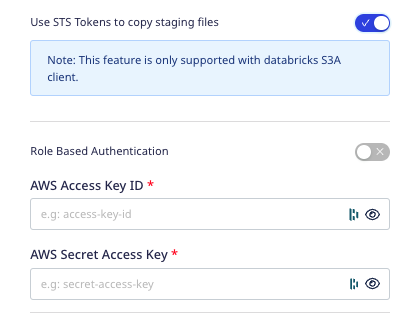

- **Role-based Authentication**: Enable this setting to use the RudderStack IAM role for authentication. For more information on creating an AWS IAM role for RudderStack, refer to <Link to="/destinations/aws-iam-role-for-rudderstack/#creating-a-rudderstack-iam-role">this guide</Link>.
  - **IAM Role ARN**: Enter the ARN of the IAM role.

<div class="warningBlock">
It is highly recommended to enable this setting as the access keys-based authentication method is now deprecated.
</div>

If **Role-based Authentication** is disabled, you need to enter the **AWS Access Key ID** and **AWS Secret Access Key** to authorize RudderStack to write to your S3 bucket.

<div class="infoBlock">
In both the role-based and access key-based authentication methods, you need to set a policy specifying the required permissions for RudderStack to write to your intermediary S3 bucket. Refer to the <Link to="/destinations/streaming-destinations/amazon-s3/#s3-permissions-for-warehouse-destinations">S3 permissions for warehouse destinations</Link> section for more information. 
</div>

### Google Cloud Storage

You can provide the necessary GCS bucket configuration while setting up the Delta Lake destination in RudderStack. For more information, refer to the <Link to="/destinations/streaming-destinations/google-cloud-storage/#setting-up-google-cloud-storage">Google Cloud Storage bucket settings</Link>.

### Azure Blob Storage

You can provide the necessary Blob Storage container configuration while setting up the Delta Lake destination in RudderStack. For more information, refer to the <Link to="/destinations/streaming-destinations/microsoft-azure-blob-storage/#setting-up-azure-blob-storage">Azure Blob Storage settings</Link>.

## Granting Databricks access to your staging bucket

This section contains the steps to grant Databricks the necessary permissions to access your staging bucket, depending on your preferred cloud platform.

### Amazon S3

Follow these steps to grant Databricks access to your S3 bucket depending on your case:

#### Case 1: Use STS Token to copy staging files is disabled in the dashboard

<div class="warningBlock">
Follow the steps listed in this section if the <strong>Use STS Token to copy staging files</strong> option is disabled, i.e. you <strong>don't want to specify</strong> the AWS access key and secret access key while configuring your Delta Lake destination.
</div>

In this case, you will be required to configure your AWS account to [create an instance profile](https://docs.databricks.com/administration-guide/cloud-configurations/aws/instance-profiles.html) which will then be attached with your Databricks cluster. 

Follow these steps in the exact order:

1.  [Create an instance profile to access the S3 bucket](https://docs.databricks.com/administration-guide/cloud-configurations/aws/instance-profiles.html#step-1-create-an-instance-profile-to-access-an-s3-bucket).
2. [Create a bucket policy for the target S3 bucket](https://docs.databricks.com/administration-guide/cloud-configurations/aws/instance-profiles.html#step-2-create-a-bucket-policy-for-the-target-s3-bucket).
3. [Note the IAM role used to create the Databricks deployment](https://docs.databricks.com/administration-guide/cloud-configurations/aws/instance-profiles.html#step-3-note-the-iam-role-used-to-create-the-databricks-deployment).
4. [Add the S3 IAM role to the EC2 policy](https://docs.databricks.com/administration-guide/cloud-configurations/aws/instance-profiles.html#step-4-add-the-s3-iam-role-to-the-ec2-policy).
5. [Add the instance profile to Databricks](https://docs.databricks.com/administration-guide/cloud-configurations/aws/instance-profiles.html#step-5-add-the-instance-profile-to-databricks).

#### Case 2: Use STS Token to copy staging files is enabled in the dashboard

<div class="infoBlock">
Follow the steps listed in this section if the <strong>Use STS Token to copy staging files</strong> option is enabled, i.e. you are specifying the AWS access key and secret access key in the dashboard while configuring your Delta Lake destination.
</div>

Add the following Spark configuration to your Databricks cluster:

```
spark.hadoop.fs.s3.impl shaded.databricks.org.apache.hadoop.fs.s3a.S3AFileSystem
spark.hadoop.fs.s3a.impl shaded.databricks.org.apache.hadoop.fs.s3a.S3AFileSystem
spark.hadoop.fs.s3n.impl shaded.databricks.org.apache.hadoop.fs.s3a.S3AFileSystem
spark.hadoop.fs.s3.impl.disable.cache true
spark.hadoop.fs.s3a.impl.disable.cache true
spark.hadoop.fs.s3n.impl.disable.cache true
```

<div class="infoBlock">
For more information on adding custom Spark configuration properties in a Databricks cluster, refer to <a href="https://docs.databricks.com/clusters/configure.html#spark-configuration">Spark configuration guide</a>.
</div>

### Google Cloud Storage

To grant Databricks access to your GCS bucket, follow these steps:

1. Follow the steps listed in this <Link to="/destinations/warehouse-destinations/gcs-datalake/#setting-user-permissions-in-gcs-data-lake">user permissions</Link> section to set up the required role and user permissions.
2. Then, add the following Spark configuration to your Databricks cluster:

```
spark.hadoop.fs.gs.auth.service.account.email <client_email>
spark.hadoop.fs.gs.project.id <project_id>
spark.hadoop.fs.gs.auth.service.account.private.key <private_key>
spark.hadoop.fs.gs.auth.service.account.private.key.id <private_key_id>
```

<div class="infoBlock">
For more information on adding custom Spark configuration properties in a Databricks cluster, refer to <a href="https://docs.databricks.com/clusters/configure.html#spark-configuration">Spark configuration guide</a>.
</div>

3. Finally, replace the following fields with the values obtained from the downloaded JSON in the previous step: `<project_id>`,`<private_key>`, `<private_key_id>`,`<client_email>`.

### Azure Blob Storage

To grant Databricks access to your Azure Blob Storage container, follow these steps:

1. Add the following Spark configuration to your Databricks cluster. 

```
spark.hadoop.fs.azure.account.key.<storage-account-name>.blob.core.windows.net <storage-account-access-key>
```
<div class="infoBlock">
For more information on adding custom Spark configuration properties in a Databricks cluster, refer to <a href="https://docs.databricks.com/clusters/configure.html#spark-configuration">Spark configuration guide</a>.
</div>

2. Replace the following fields with the relevant values from your Blob Storage account settings: `<storage-account-name>`,`<storage-account-access-key>`.

## Creating a new Databricks cluster

To create a new Databricks cluster, follow these steps:

1. Sign into your Databricks account. Then, click the **Compute** option on the dashboard, as shown:

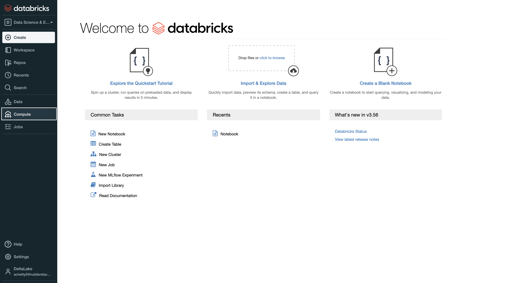

2. Click on the **Create Cluster** option.
3. Next, enter the cluster details. Fill in the **Cluster Name**, as shown:

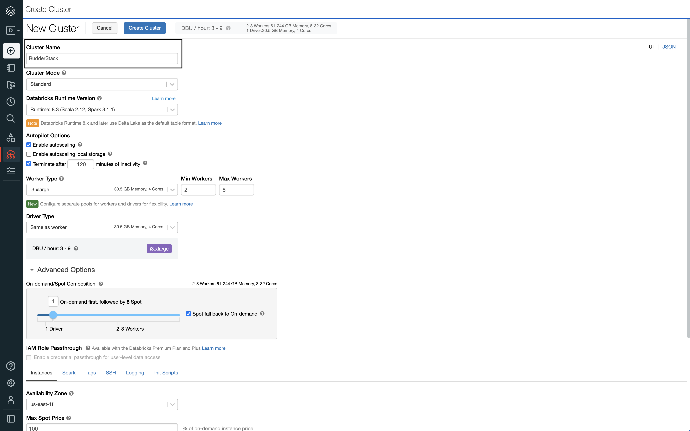

4. Select the **Cluster Mode** depending on your use-case. The following image highlights the three cluster modes:

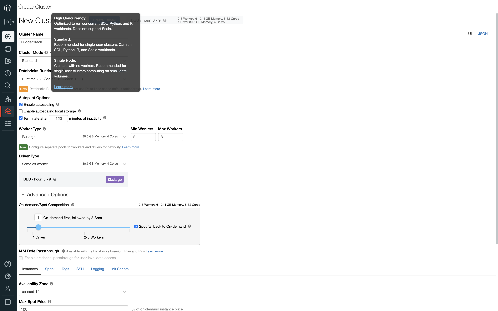

5. Then, select the **Databricks Runtime Version** as **7.1** or higher, as shown:

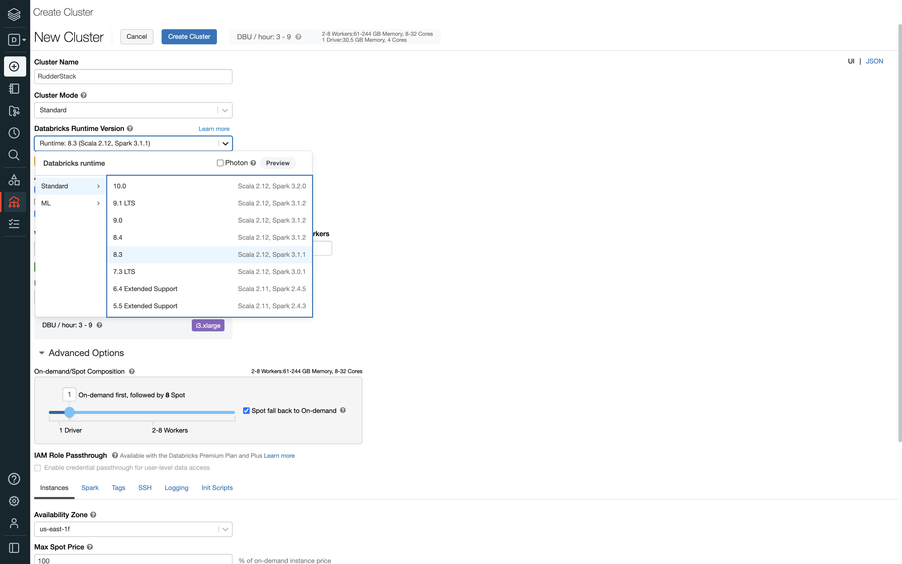

6. Configure the rest of the settings as per your requirement.
7. In the **Advanced Options** section, configure the **Instances** field as shown in the following image:

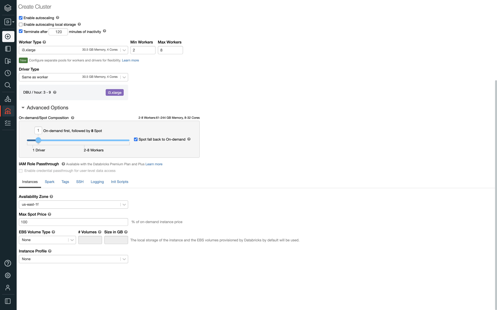

8. In the **Instance Profile** dropdown menu, select the Databricks instance profile that you added to your account in the previous step.

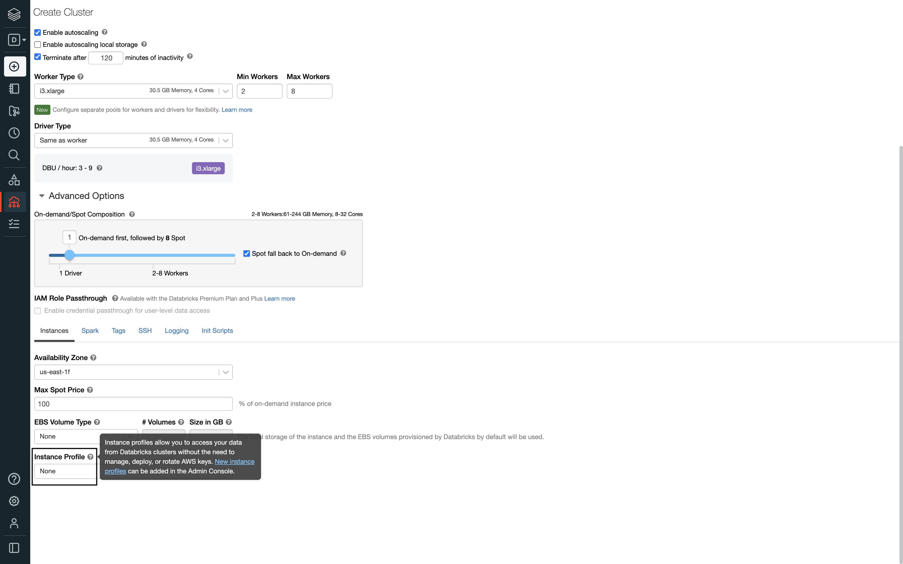

9. Finally, click the **Create Cluster** button to complete the configuration and create the Databricks cluster.

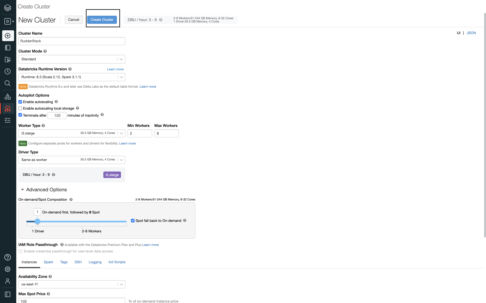

## Obtaining the JDBC/ODBC configuration

Follow these steps to get the JDBC/ODBC configuration:

1. In your Databricks dashboard, click the **Compute** option, as shown:


2. Then, select the cluster you created in the previous section.

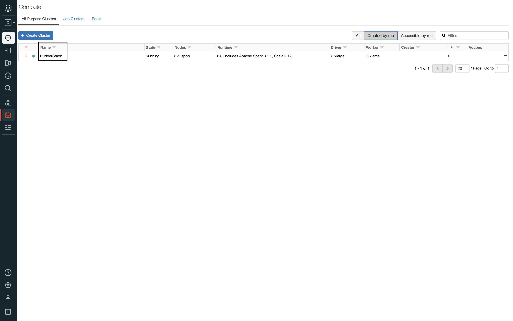

3. In the **Advanced Options** section, select the **JDBC/ODBC** field and copy the **Server Hostname**, **Port**, and **HTTP Path** values, as shown:

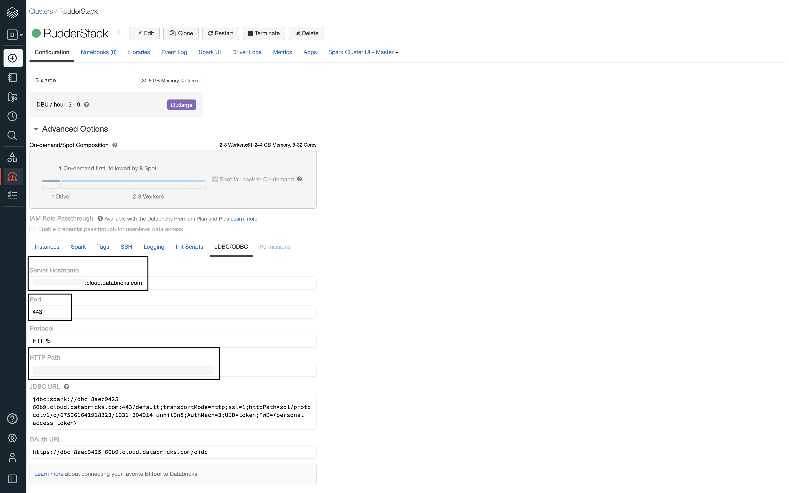

<div class="infoBlock">
The <strong>Server Hostname</strong>, <strong>Port</strong>, and <strong>HTTP Path</strong> values are required to configure Delta Lake as a destination in RudderStack.
</div>

## Generating the Databricks access token

To generate the Databricks access token, follow these steps:

1. In your Databricks dashboard, go to **Settings** and click **User Settings**, as shown:

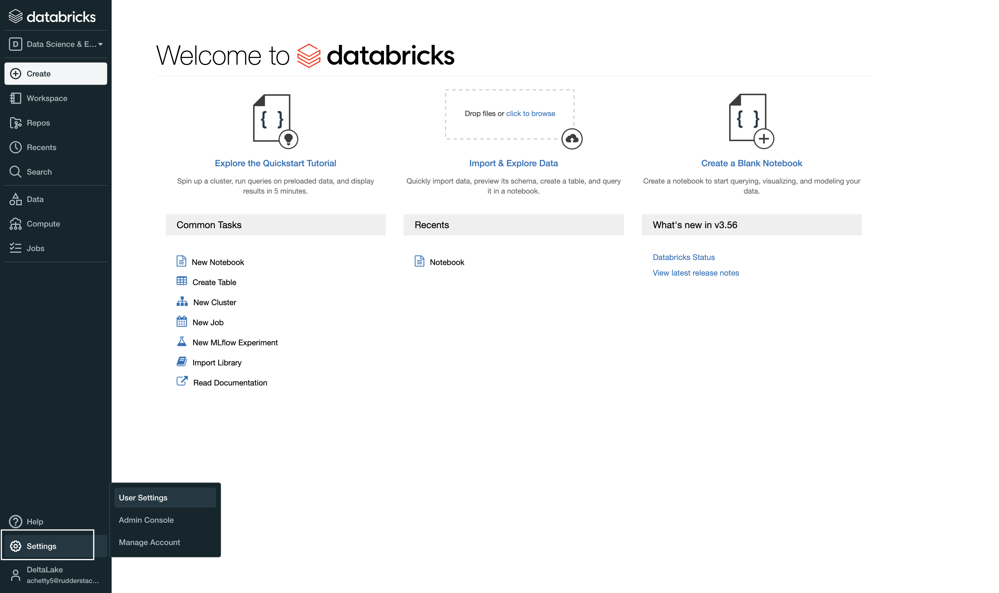

2. Then, go to the **Access Tokens** section and click **Generate New Token**, as shown:

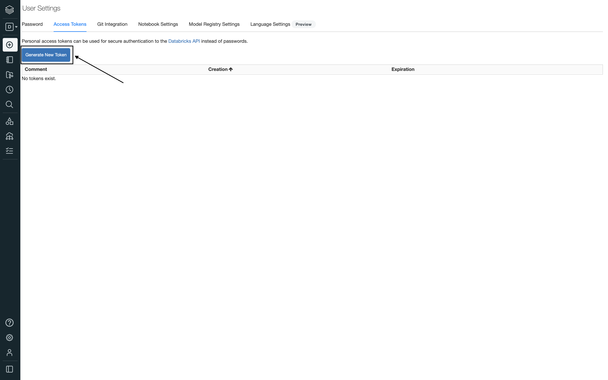

3. Enter your comment in the **Comment** field and click **Generate**, as shown:

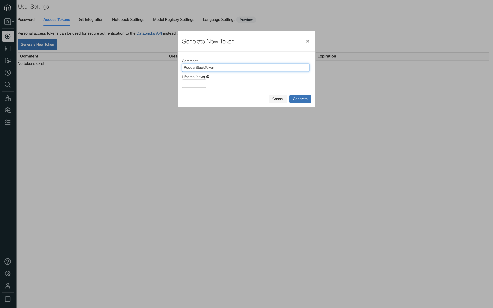

<div class="warningBlock">
Keep the <strong>Lifetime (days)</strong> field blank. If you enter a number, your access token will expire after that number of days.
</div>

4. Finally, copy the access token as it will be used during the Delta Lake destination setup in RudderStack.

## IPs to be allowlisted
<Iplist/>

## FAQ

### What are the reserved keys for Delta Lake?

Refer to this [documentation](https://docs.microsoft.com/bs-cyrl-ba/azure/databricks/sql/language-manual/sql-ref-reserved-words) for a complete list of the reserved keywords.

### Does the Databricks cluster attached to the destination need to be up all the time?

No, your Databricks cluster attached to the destination need not be up all the time.

### What happens if the cluster or the destination service is down? Is there a possibility of data loss?

If a warehouse destination is down or unavailable, RudderStack will continue to retry sending events (on an exponential backoff basis, for up to 3 hours).

RudderStack stores the syncs as staging files and retries sending them at a later time when the cluster is up again. This allows for a successful delivery without any missing data.

After retrying for up to 3 hours, RudderStack marks the syncs as aborted. Once the service is up and running again, you can go to the <Link to="/dashboard-guides/overview/#syncs">**Syncs**</Link> tab in the RudderStack dashboard and retry sending the data.

###  Does RudderStack automatically spin the Databricks cluster/SQL endpoint every time it needs to write?

No, RudderStack does not spin the Databricks cluster or the SQL endpoint on its own every time it needs to write to the cluster. 

Databricks itself starts up the cluster/endpoint when the connection is established. You just need to configure the <Link to="https://docs.databricks.com/clusters/clusters-manage.html#automatic-termination-1">automatic termination</Link> settings in the **Autopilot Options** on the cluster creation page, as shown:

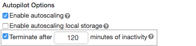

### How does RudderStack handle the reserved words in a column, table, or schema?

There are some limitations when it comes to using reserved words as a schema, table, or column name. If such words are used in event names, traits or properties, they will be prefixed with a `_` when RudderStack creates tables or columns for them in your schema.

Also, integers are **not** allowed at the start of a schema or table name. Hence, such schema, column, or table names will be prefixed with a `_`. For example, `'25dollarpurchase'` will be changed to `'_25dollarpurchase'`.

### How can I modify an existing table to a partitioned table?

To modify an existing table to a partitioned table, follow these steps:

1. Set an exclusion window (using the **Exclude window** connection setting) so that RudderStack does not process any data while performing the below changes.
2. Make the required changes in connection settings of the configured Delta Lake destination.
3. Run the following queries in the Databricks Cluster/SQL endpoints to:
    - Rename the existing table with `_temp` suffix.
    - Add `event_date` column to the `_temp` table.
    - Backfill the data into original table.

```sql
ALTER TABLE x RENAME TO x_temp;
ALTER TABLE x_temp ADD COLUMN TO event_date DATE;
INSERT INTO x SELECT * FROM x_temp;
```

<div class="infoBlock">
RudderStack will create the new tables with partition support. Refer to the <a href="https://docs.databricks.com/sql/language-manual/sql-ref-partition.html">Databricks documentation on partitions</a> for more information.
</div>

### How can I convert an existing managed or unmanaged table at a location to an unmanaged table at a new location?

1. Set an exclusion window (using the **Exclude window** connection setting) so that RudderStack does not process any data while performing the below changes.
2. Run the following queries in the Databricks Cluster/SQL endpoints to:
   - Create a temporary table using the new location.
   - Drop the temporary table.
   - Drop the original table.

```sql
CREATE OR REPLACE TABLE namespace.x_temp DEEP CLONE namespace.x LOCATION '/path/to/new/location/namespace/x';
// where namespace represents the namespace attached to the destination in RudderStack.
// where x represents the original table created by RudderStack.

DROP TABLE namespace.x_temp;
DROP TABLE namespace.x;
```

3. Enable the **Enable delta tables creation in an external location** setting in RudderStack dashboard and update the location.
4. Remove the exclusion window and make the required changes in connection settings of the configured Delta Lake destination.

RudderStack will create the table again during the subsequent data syncs.

<div class="infoBlock">
Refer to the <a href="https://docs.databricks.com/data/tables.html#managed-and-unmanaged-tables">Databricks documentation on managed and unmanaged tables</a> for more information.
</div>

### How do I convert an existing unmanaged table at a specific location to a managed table (at default location)?

1. Set an exclusion window (using the **Exclude window** connection setting) so that RudderStack does not process anything while performing the below changes.
2. Run the following queries in the Databricks Cluster/SQL Endpoints to:
    - Create a temporary table.
    - Drop original table.
    - Rename temporary table to original table.

```sql
CREATE TABLE IF NOT EXISTS namespace.x_temp DEEP CLONE namespace.x;
// where namespace represents the namespace attached to the destination in RudderStack.
// where x represents the original table created by RudderStack.

DROP TABLE namespace.x;
ALTER TABLE namespace.x_temp RENAME TO namespace.x;
```
3. Remove the exclusion window and make sure the **Enable delta tables creation in an external location** setting is disabled in the RudderStack dashboard.

RudderStack will create the table again during the subsequent data syncs.

<div class="infoBlock">
For a more comprehensive FAQ list, refer to the <Link to="/destinations/warehouse-destinations/faq/">Warehouse FAQ</Link> guide.
</div>