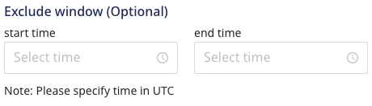
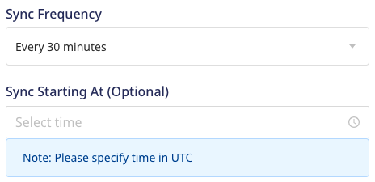

## IP allowlist

### Which RudderStack IPs should I allowlist?

You will need to allowlist the following RudderStack IPs to enable network access:

- 3.216.35.97
- 34.198.90.241
- 54.147.40.62
- 23.20.96.9
- 18.214.35.254
- 35.83.226.133
- 52.41.61.208
- 44.227.140.138
- 54.245.141.180

The EU cluster IPs are listed below:

- 3.66.99.198
- 3.64.201.167

<div class="infoBlock">
All the outbound traffic is routed through these RudderStack IPs.
</div>

## Data syncs and retries

### When does Rudderstack load data into the warehouse destination?

RudderStack lets you choose how frequently it should sync the data into the data warehouse. The default time is 30 minutes. However, you can choose to extend this value up to 24 hours. You can also configure the time of the day when RudderStack loads the data.

### Is there a way to force load my data into the warehouse?

Yes, there is - you can configure the below values in your `config.yaml` file:

```yaml
warehouseSyncFreqIgnore = true #if set true this will ignore syncFrequency and syncStartingAt values which are configured in UI. By default this is false
uploadFreqInS=1800 #This field lets you control syncPeriod if above field set to true 
```

### Where can I view the status of my data sync?

You can view the warehouse upload status in the <Link to="/dashboard-guides/live-events/#destination-live-events">**Live Events**</Link> section of the destination in the RudderStack dashboard.

### What happens if the cluster or the destination service is down? Is there a possibility of data loss?

If a warehouse destination is down or unavailable, RudderStack will continue to retry sending the events (on an exponential backoff basis, for up to 3 hours).

RudderStack stores the syncs as staging files and retries sending them at a later time when the cluster is up again. This allows for a successful delivery without any missing data.

### Does RudderStack keep retrying sending events indefinitely? How long can a service be down without losing any data?

After retrying for up to 3 hours, RudderStack marks the syncs as aborted. Once the service is up and running again, you can go to the <Link to="/dashboard-guides/overview/#syncs">**Syncs**</Link> tab in the RudderStack dashboard and retry sending the data.

### Is there a scenario where I can lose my data without the ability to retry syncs?

RudderStack stores the data in the form of staging files in the object storage associated with the warehouse destination. Usually, the data is stored in the bucket for 30 days. **However, it completely depends on the retention policy you have set for the bucket.**

<div class="infoBlock">
RudderStack also provides the <Link to="/user-guides/administrators-guide/event-replay/">event replay</Link> feature for the <a href="https://www.rudderstack.com/enterprise-quote/">enterprise customers</a> wherein you can back up your event data and replay it in case of any failures.
</div>

## Staging

### What are the files written in the location `<namespace>/rudder-warehouse-staging-logs/`?

RudderStack collects all the unprocessed data flowing to the warehouse destinations as staging files. It stores these files in the object storage at the location `<namespace>/rudder-warehouse-staging-logs/`. 

Once the staging files are processed, RudderStack separates them by the event name and sends them to the specified destination.

### How can I delete the staging files in my buckets?

RudderStack loads all the events configured with your warehouse into staging buckets. You can set a retention policy to delete these files from the staging bucket after a certain time. If you do not set any retention policy, the files will keep on accumulating.

Make sure that the retention policy duration is longer than the warehouse sync frequency duration so that RudderStack can re-run event uploads for a longer time, if required. It is recommended to set the retention policy duration to **30 days/1 month**.

## Optimizing syncs

### How do I avoid lags in data syncs while heavy loads are running on my data warehouse?

You can use either of the following approaches to avoid data sync lags in your warehouse:

- **Approach 1**: In the warehouse destination connection settings, set an **exclusion window** which lets you set a start and end time when Rudderstack will not sync data to your warehouse. You can run heavy loads during this time interval.



- **Approach 2**: In the warehouse destination connection settings, your can increase the **sync frequency** interval so that there are lesser number of warehouse syncs throughout the day. You can also run the data syncs during the non-peak hours by setting the **Sync Starting At** time interval.



- **Approach 3**: If you are performing only writes/updates on your data warehouse, you can set up a read replica of your database and connect it to your load generation tool. Connect the read/write replica to RudderStack, as shown:


### How can I speed up my warehouse uploads?

You can speed up your warehouse uploads by configuring the following parameters in the `config.yaml` file in your RudderStack setup:

<table style="width:100%">
  <tr>
    <th style="width:300px">Parameter</th>
    <th>Description</th>
     <th>Tip</th>
    <th>Default value</th>
  </tr>
  <tr>
    <td style="width:300px"><code class="inline-code">RSERVER_WAREHOUSE_REDSHIFT_MAX_PARALLEL_LOADS</code></td>
    <td>Defines the number of concurrent tables that are synced to redshift in a given upload.</td>
    <td>Increase this as per your infra capability.</td>
    <td><code class="inline-code">3</code></td>
  </tr>
  <tr>
    <td style="width:300px"><code class="inline-code">RSERVER_WAREHOUSE_STAGING_FILES_BATCH_SIZE</code></td>
    <td>Defines the number of staging files that are batched and synced in a single upload.</td>
    <td>Increase this to batch more files together and reduce the number of uploads needed for a given volume of data.</td>
    <td><code class="inline-code">960</code></td>
  </tr>
  <tr>
    <td style="width:300px"><code class="inline-code">RSERVER_WAREHOUSE_NO_OF_WORKERS</code></td>
    <td>Number of concurrent uploads to a warehouse. For example, 8 uploads to different schemas in Redshift can be done simultaneously.</td>
    <td>-</td>
    <td><code class="inline-code">8</code></td>
  </tr>
   <tr>
    <td style="width:300px"><code class="inline-code">RSERVER_WAREHOUSE_NO_OF_SLAVE_WORKER_ROUTINES</code></td>
    <td>Number of go-routines creating load files in a warehouse slave process.</td>
    <td>Increase or decrease this as per memory allocated to the warehouse slave pod.</td>
    <td><code class="inline-code">4</code></td>
  </tr>
</table>

## Namespace and warehouse schema

### How is the Namespace field populated for a warehouse destination?

RudderStack sets the **Namespace** field depending on the following conditions:

- If the **Namespace** and **Database** fields are present in your warehouse configuration:
  - For ClickHouse destination, the **Database** field is set as the namespace.
  - For all the other destinations, the **Namespace** field is populated as it is.

- If `RSERVER_WAREHOUSE_(DEST_TYPE)_CUSTOM_DATA_SET_PREFIX` parameter is present, the namespace is populated as `(CUSTOM_DATA_SET_PREFIX)_(SOURCE_NAME)`. For example:

```
Parameter value:
RSERVER_WAREHOUSE_SNOWFLAKE_CUSTOM_DATA_SET_PREFIX="<some_value>"

Namespace:
<some_value>_<source_name>
```

- If none of the above fields are specified in the warehouse configuration settings, the source name is populated as the namespace for the first sync and picked up from the cache for all the subsequent syncs. In case the source name is changed, the namespace still remains the same as it is picked from cache. 

<div class="infoBlock">
To update the namespace as the new source name, you need to configure a new source.
</div>

### Can I change the namespace (schema name) of my data warehouse in RudderStack?

Yes, you can. RudderStack lets you change the namespace (schema name) where it loads all the data in your warehouse.

You can specify your desired schema name in the **Namespace** field while configuring your warehouse destination in RudderStack, as shown:


<div class="infoBlock">
Refer to the <Link to ="/destinations/warehouse-destinations/">warehouse-specific documentation</Link> for more information on configuring a namespace while setting up the destination in RudderStack.
</div>

<div class="warningBlock">
If you do not set the <strong>Namespace</strong> field, RudderStack sets the source name as the schema name, with some modifications.
</div>

### How does RudderStack configure the schema name before loading the data in the warehouse?

RudderStack configures the schema name based on the values mentioned in the below table. The table columns are defined as follows:

- **Sync**: Indicates whether RudderStack performs the first data sync after the source is set up or the subsequent syncs.
- **Namespace**: The **Namespace** field set by the user while configuring the warehouse destination in the RudderStack dashboard.
- **Warehouse.&lt;destType&gt;.customDataset Prefix**: The `RSERVER_WAREHOUSE_(DEST_TYPE)_CUSTOM_DATA_SET_PREFIX` parameter in the `config.yaml` file, in case the user has a RudderStack deployment locally/in their own environment.
- **Source name**: Name of the source connected to the warehouse destination.

| Sync  | Namespace    | `customDataset` Prefix | Source name | Schema name| Notes|
| :-------- | :------------ | :------- | :------- | :------- |:------- |
| First sync   | AB | XY | S | AB | The namespace is given priority over all the other values. |    
| First sync   | Not set | XY | S | XY_S | RudderStack combines the `customDataset` prefix and the source name to set the schema name, if the namespace is absent.|
| First sync   | Not set | Not set | S | S | RudderStack sets the source name as the schema name if the namespace and `customDataset` prefix are absent.|
| First sync   | AB | Not set | S | AB |The namespace is given priority over the other values.|
| Second sync onwards   | ABC | XYZ | SS | ABC | The namespace, source name and the `customDataset` prefix have all been modified. The new namespace is given priority and set as the schema name. <br /><br />All the data from the second sync will now be stored in the new schema (ABC) and the original schema (AB) will be left as is. |
| Second sync onwards   | Not set | XYZ | S | XYZ_S | The `customDataset` prefix name has been modified. <br /><br />RudderStack combines the `customDataset` prefix and the source name to set the schema name. |
| Second sync onwards   | Not set | XYZ | SS | XYZ_SS | The source name and `customDataset` prefix have been modified. <br /><br />RudderStack combines them together to set the schema name. |
| Second sync onwards   | ABC | Not set | SS | ABC | The namespace and source names have been modified. <br /><br />The namespace is given priority and set as the schema name.|
| Second sync onwards   | Not set | Not set | SS | S | The source name has been modified. However, it does not impact the schema name and it remains the same as in the first sync. |

<div class="infoBlock">
<strong>Key takeaways</strong>:
<ul>
  <li>The namespace set in the RudderStack dashboard always takes precedence when setting the schema name in the warehouse.</li>
  <li>If the <code class="inline-code">RSERVER_WAREHOUSE_(DEST_TYPE)_CUSTOM_DATA_SET_PREFIX</code> parameter is set in the <code class="inline-code">config.yaml</code> file of your RudderStack deployment, RudderStack sets the schema name in the <code class="inline-code">customDataset_sourcename</code> format, as noted in this <Link to="#how-is-the-namespace-field-populated-for-a-warehouse-destination">FAQ</Link>.</li>
  <li>If the namespace and <code class="inline-code">RSERVER_WAREHOUSE_(DEST_TYPE)_CUSTOM_DATA_SET_PREFIX</code> parameter, both are absent, RudderStack sets the source name as the schema name.</li>
</ul>
</div>

### How does Rudderstack configure the table names?

RudderStack sets the table names by picking up the event names and modifying them to follow the snake case convention (for example, `source name` -> `source_name`). 

For the following sample snippet, RudderStack sets the table name as **product_purchased**.

```json
{
  "userId": "user123",
  "event": "Product Purchased",
  "properties": {
    "name": "Rubik's Cube",
    "revenue": 4.99
  },
  "context": {
    "ip": "14.5.67.21"
  },
  "timestamp": "2020-02-02T00:23:09.544Z"
}
```

The table name truncation logic is as follows:

- For **PostgreSQL**, the table name is truncated after 63 characters.
- For **Data Lake** destinations (**S3 Data Lake, GCS Data Lake, Azure Data Lake**), there is no set limit.
- For **other** destinations, the table name is truncated after 127 characters.

### Can I change the name of the table in which my events are synced?

Yes, you can add a <Link to="/features/transformations/">transformation</Link> to change the event name and, consequently, the name of the table in which the events are synced. 

As seen in the above <Link to="#how-does-rudderstack-configure-the-table-names">FAQ</Link>, RudderStack sets the table names to the event names modified in the snake case.

A sample transformation used to change the event name is as shown:

```javascript
export function transformEvent(event, metadata) {    
  if (event.event.toLowerCase() === '<old_event_name>') {
      event.event = '<new_event_name>';
  }
  return event;
}
```

<div class="warningBlock">
Note that this change is applicable to the subsequent events sent to the warehouse destination, after the transformation is applied.
</div>

<div class="successBlock">
You can also migrate the previously created table data in the warehouse to the new table.
</div>

### How does Rudderstack configure the column names? / How does RudderStack normalize arrays and complex event properties in the warehouse schema?

RudderStack flattens the event properties and converts them into snake case (for example, `source name` -> `source_name`). Further, each of these event properties acts as a warehouse column.

1. The below example shows how the standard properties are normalized:

```javascript
{
  product: {
    name: "iPhone",
    version: 11
  }
}
```

Normalized properties (Column names)

```javascript
product_name : "iPhone"
product_version : 11
```

2. The below example shows how the array properties are normalized:

```javascript
{
  products: [
    {
      name: "iPhone",
      version: 11
    },
    {
      name: "Android",
      version: 16
    }
  ]
}
```

Normalized property (Column name)

```javascript
products: "[{ \"name\": \"iPhone\", \"version\": 11  },  { \"name\": \"Android\", \"version\": 16  }]"
```

3. The below example shows how the complex properties are normalized:

```javascript
{
  products: {
    iPhone: {
      version: 11
    },
    Android: {
      version: 16
    }
  }
}
```

Normalized properties (Column names)

```javascript
products_i_phone_version : 11
products_android_version : 16
```

### How does RudderStack determine the column data type? Can I change an existing data type for a column?

RudderStack determines the data type of a column based on its value in the first event (during the first upload sync).

For example, suppose `column_x` is received with the value as `1`. RudderStack then sets the data type of this column as `int` in the event table.

<div class="infoBlock">
Although you can change the columns' data type in the warehouse any time, the changes will be applicable to the events from the next sync.
</div>

To set your preferred data type for a particular column, it is highly recommended to follow these steps:

1. Create a column in the warehouse with a dummy name and the required data type.
2. Cast the data from the original column and load it into the dummy column.
3. Drop the original column.
4. Rename the dummy column to the original column name.

<div class="warningBlock">
During steps 3 and 4, the tables will be in a locked state. This might impact real-time data uploads/syncs.
If the above steps take too long to complete, you can halt the warehouse operations in the interim. For more information, refer to this <Link to="#how-do-i-avoid-lags-in-data-syncs-while-heavy-loads-are-running-on-my-datawarehouse">FAQ</Link>.
</div>

### Why am I not able to see the properties added at the top level of an event in warehouse destination?

RudderStack drops any non-standard properties (properties apart from the <Link to="/destinations/warehouse-destinations/warehouse-schema/#standard-rudderstack-properties">standard properties</Link>) declared at the top level of an event. However, you can add such properties in the `context` or `properties` section of the event payload.


## Warehouse-specific

### While configuring the Snowflake destination, what should I enter in the Account field?

While configuring Snowflake as a destination in RudderStack, you need to enter your <Link to="/destinations/warehouse-destinations/snowflake/#connection-settings">Snowflake connection credentials</Link> which includes the **Account** field, as shown below:


The **Account** field corresponds to your Snowflake account ID and is a part of the Snowflake URL.

The following examples illustrate the slight differences in the Snowflake account ID for various cloud providers:

| Account ID example            | Corresponding Snowflake URL                                                    | Snowflake cloud provider                                        |
| :-------------------------- | :--------------------------------------------------------------- | :-------------------------------------------------------------- |
| `qya56091.us-east-1`<br /><br />  `qya56091.us-east-2.aws`        | `https://`**`qya56091.us-east-1`**`.snowflakecomputing.com`  <br /><br />  `https://`**`qya56091.us-east-2.aws`**`.snowflakecomputing.com`   | AWS                                   |
| `rx18795.east-us-2.azure` | `https://`**`rx18795.east-us-2.azure`**`.snowflakecomputing.com` | Microsoft Azure  |
| `ah76025.us-central1.gcp` | `https://`**`ah76025.us-central1.gcp`**`.snowflakecomputing.com` | Google Cloud Platform                          |

<div class="warningBlock">
In case of AWS, <code class="inline-code">.aws</code> is present in the account locator of some region accounts and hence must be included in the <strong>Account</strong> field above. 

For more information on the different account locator formats depending on your region or cloud provider, refer to the <a href="https://docs.snowflake.com/en/user-guide/admin-account-identifier.html#non-vps-account-locator-formats-by-cloud-platform-and-region">Snowflake documentation</a>.
</div>

## Identity resolution

### How can I achieve identity resolution with multiple sources connected to one warehouse destination?

The default namespace will be the source name with some modifications. This will cause issues while creating mappings for <Link to ="/features/identity-resolution/">identity resolution</Link> across different sources, leading to multiple `RUDDER_ID` created for the same user.

To avoid this, you can set the same namespace **for each source**, as shown:


Setting a namespace ensures that the mappings are consistent and only one `RUDDER_ID` is created for each user - irrespective of the number of sources connected to your warehouse destination.


