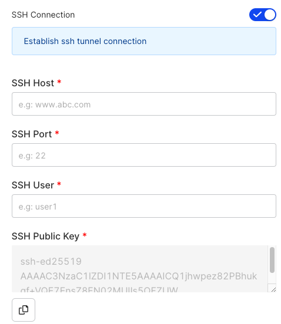
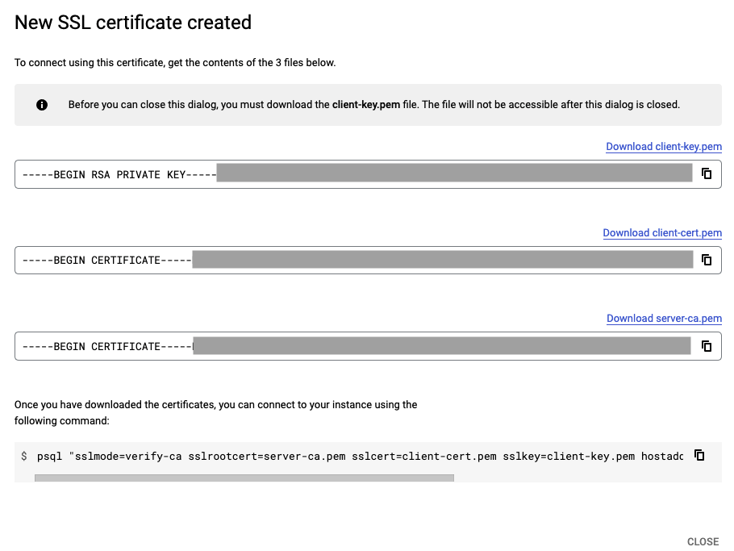
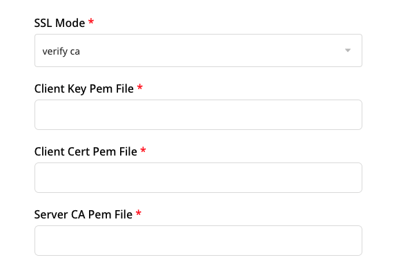

[PostgreSQL](https://www.postgresql.org/) is an enterprise-grade, open source database management system. It supports both SQL and JSON for relational and non-relational queries respectively. Many companies in the market use PostgreSQL as their low-cost data warehousing solution in order to deliver efficient analytics and user insights.

<div class="infoBlock">
Refer to the <Link to="/destinations/warehouse-destinations/warehouse-schema/">Warehouse Schema</Link> guide for more information on how the events are mapped to the PostgreSQL tables.
</div>

<div class="successBlock">
Find the open source code for this destination in the <a href="https://github.com/rudderlabs/rudder-transformer/tree/master/src/v0/destinations/postgres">GitHub repository</a>.
</div>

## Setting user permissions in PostgreSQL

After setting up your PostgreSQL database, create a user with the necessary privileges to create schemas and temporary tables in this database.

Run the following query to create a new user in PostgreSQL:

```sql
CREATE USER <username> WITH PASSWORD '<password>';
```

Run the following query to grant permissions to the user to create new schemas and temporary tables in the database:

```sql
GRANT CREATE, TEMPORARY ON DATABASE <databasename> TO <username>;
```

<div class="warningBlock">
You must grant the <code class="inline-code">CREATE, TEMPORARY</code> privileges to the user. Otherwise, RudderStack will not be able to export the events to PostgreSQL.
</div>

## Configuring PostgreSQL destination in RudderStack

To send event data to PostgreSQL, you first need to add it as a destination in RudderStack and connect it to your data source. Once the destination is enabled, events will automatically start flowing to PostgreSQL via RudderStack.

To configure PostgreSQL as a destination in RudderStack, follow these steps:

1. In your [RudderStack dashboard](https://app.rudderstack.com), set up the data source. Then, select **PostgreSQL** from the list of destinations.
2. Assign a name to your destination and click **Next**.

### Connection settings

- **Host**: Enter the host name of your PostgreSQL service.
- **Database**: Enter your PostgreSQL database name where RudderStack will load the data.
- **User**: Enter the name of the user created in the <Link to="#setting-user-permissions-in-postgresql">Setting user permissions in PostgreSQL</Link> section above.
- **Password**: Enter the password you set for the above user.
- **Port**: Enter the port number associated with your PostgreSQL instance.
- **Namespace**: Enter the schema name where RudderStack will create all the tables. If you don't specify any namespace, RudderStack will set this to the source name, by default.

### SSH connection

<div class="infoBlock">
This feature is available only for the <a href="https://www.rudderstack.com/pricing/">Growth and Enterprise plan</a> users.
</div>

SSH tunneling is a method of transferring data over an encrypted SSH connection. You can use it to add encryption to your legacy applications as well as achieve compliance such as HIPAA, PCI-DSS, and other standards without having the need to modify the existing applications.

RudderStack lets you connect to your PostgreSQL database securely over an SSH connection. Enter the following details to do the same:



- **SSH Connection**: Toggle on this boolean setting to use the SSH connection while connecting to your PostgreSQL database.
- **SSH Host**: Enter the IP address of your bastion host.
- **SSH Port**: Enter the port for the above host.
- **SSH User**: Enter the username you use to access the bastion host.
- **SSH Public Key**: Copy the public key provided in this field and add it to the `authorizated_keys` file on your bastion host. Rudderstack will use the private key corresponding to this public key to establish the connection successully.

You can also enable the SSH connection for an existing PostgreSQL destination by navigating to the destination's **Configuration** tab, selecting **Edit configuration** and enabling the **SSH connection** setting.

### Sync settings

- **SSL Mode**: Choose the SSL mode through which RudderStack will connect to your PostgreSQL instance. RudderStack provides three options - **disable**, **require**, and **verify-ca**. For more information on these options, refer to the <Link to="#ssl-modes">SSL Modes</Link> section below.
- **Sync Frequency**: Specify how often RudderStack should sync the data to your PostgreSQL database.
- **Sync Starting At**: This optional setting lets you specify the particular time of the day (in UTC) when you want RudderStack to sync the data to the warehouse.
- **Exclude Window**: This optional setting lets you set a time window when RudderStack will **not sync** the data to your database.
- **JSON Columns**: Use this optional setting to specify the required JSON column paths in dot notation, separated by commas. **This option applies to all the incoming `track` events for this destination.**

<div class="infoBlock">
With the JSON columns feature, you can now ingest semi-structured event data not defined by a fixed schema. For more information on this feature, refer to the <Link to="/destinations/warehouse-destinations/json-column-support/">JSON Column Support</Link> guide.
</div>

### Configuring the object storage

RudderStack lets you configure the following object storage configuration settings while setting up your PostgreSQL destination:

- **Use RudderStack-managed object storage**: Enable this setting to use RudderStack-managed buckets for object storage.

<div class="warningBlock">
This option is applicable only for RudderStack-hosted data planes. For self-hosted data planes, you will have to specify your own object storage configuration settings.
</div>

- **Choose your storage provider**: If **Use RudderStack-managed object storage** is **disabled** in the dashboard, select the cloud provider for your object storage and enter the relevant settings:

   - <Link to="/destinations/streaming-destinations/amazon-s3/#connection-settings">Amazon S3 bucket storage settings</Link>
   - <Link to="/destinations/streaming-destinations/microsoft-azure-blob-storage#setting-up-azure-blob-storage">Azure Blob Storage settings</Link>
   - <Link to="/destinations/streaming-destinations/google-cloud-storage#setting-up-google-cloud-storage">Google Cloud Storage bucket settings</Link>
   - <Link to="/destinations/streaming-destinations/minio#setting-up-minio">MinIO bucket storage settings</Link>

 ## SSL modes

Based on your security preferences, RudderStack lets you specify the SSL mode through which you can send the data to PostgreSQL.

RudderStack supports the following three SSL modes defined by PostgreSQL:

| SSL mode | Eavesdropping protection | MITM (Man in the middle) protection | Description |
| :----------| :--------------------------| :------------------------------------|:-------------|
| disable      |  No                                        | No                                                         | SSL mode is disabled. Use it in cases where security is not an issue and you don't want the encryption overhead. |  
| require      | Yes                                        | No                                                         | Use this mode when you want to encrypt your data and can deal with the resulting encryption overhead. |
| verify-ca   | Yes                                        | Dependent on the CA policy              | Use this mode when you want to encrypt your data, can bear the encryption overhead, and want to be sure that you connect to a server you trust. |

<div class="infoBlock">
For more information, refer to the <a href="https://www.postgresql.org/docs/9.1/libpq-ssl.html">PostgreSQL SSL Support</a> documentation.
</div>

### Using verify-ca to configure PostgreSQL destination

To use verify-ca as the SSL mode while configuring your PostgreSQL destination, you need to copy the contents of the following three files from your SSL certificate:

- **Client Key Pem File** 
- **Client Cert Pem File**
- **Server CA Pem File**

<div class="infoBlock">
Although you can use an existing certificate to obtain the above credentials, it is recommend you create a new SSL certificate to avoid any issues.
</div>

The following steps demonstrate how you can create a new SSL certificate in [Google Cloud SQL](https://cloud.google.com/sql/) and obtain the above-mentioned credentials:

1. Go to your PostgreSQL instance in your [Cloud SQL console](https://console.cloud.google.com/sql/).
2. In the left panel, click **Connections** and go to the **SECURITY** tab.
3. Under **Manage client certificates**, click **CREATE CLIENT CERTIFICATE**.
4. Assign a unique identifier for your SSL certificate and click **CREATE**. Your new SSL certificate will be created, as shown:



5. Finally, copy the contents of the three fields and paste it in the RudderStack dashboard settings as seen below:



<div class="infoBlock">
For other cloud providers, this procedure might vary slightly.
</div>

## IPs to be allowlisted
<Iplist/>

## FAQ

### RudderStack does not create the corresponding PostgreSQL tables when I press on 'sync'. What do I do?

- Firstly, check the status of your data sync in the [RudderStack dashboard](https://app.rudderstack.com/syncs).
- Make sure you have set up the <Link to="#setting-user-permissions-in-postgresql">user permissions</Link> for your PostgreSQL instance.
- Check if your database is accessible to RudderStack by <Link to ="#ips-to-be-allowlisted">allowlisting the RudderStack IPs</Link>.
- Ensure that all the security group policies are appropriately set.

### How does RudderStack handle reserved words?

There are some limitations when it comes to using [reserved words](https://www.postgresql.org/docs/current/sql-keywords-appendix.html) in a schema, table, or column names. If such words are used as event names, traits or properties, they will be prefixed with a `_` when RudderStack creates tables or columns for them in your schema.

Also, it is important to note that integers are not allowed at the start of the schema or table name. Hence, RudderStack prefixes such schema, column or table names with a `_`.

For instance, `'25dollarpurchase'` will be changed by RudderStack to `'_25dollarpurchase`'.

### How does RudderStack handle cases when loading data into PostgreSQL?

RudderStack converts the event keys into the lower case before exporting the data into PostgreSQL, so that it does not create multiple tables if the event name is written in different cases.

<div class="infoBlock">
For a more comprehensive FAQ list, refer to the <Link to="/destinations/warehouse-destinations/faq/">Warehouse FAQ</Link> guide.
</div>