Amazon S3 is a popular object storage service used to store both structured and unstructured data. With an S3-powered data lake, you can easily use the native AWS services for data processing, analytics, machine learning, and more.

<div class="infoBlock">
For more information on how the events are mapped to the tables in S3 data lake tables, refer to the <Link to="/destinations/warehouse-destinations/warehouse-schema/">Warehouse Schema</Link> guide .
</div>

<div class="successBlock">
Find the open source code for this destination in the <a href="https://github.com/rudderlabs/rudder-transformer/tree/master/src/v0/destinations/s3_datalake">GitHub repository</a>.
</div>

## S3 permissions for data lake destination

To successfully send data to your S3 data lake, you need to set the following permissions in your S3 policy:

```json
"Action": [
    "s3:GetObject",
    "s3:PutObject",
    "s3:PutObjectAcl",
    "s3:ListBucket"
]
```

<div class="infoBlock">
For detailed steps on creating the IAM user credentials from scratch, refer to the <Link to="/destinations/streaming-destinations/amazon-s3/#permissions">Amazon S3 permissions</Link> section.
</div>

## Configuring S3 Data Lake destination in RudderStack

To set up S3 data lake as a destination in RudderStack, follow these steps:

1. In your [RudderStack dashboard](https://app.rudderstack.com), set up the data source. Then, select **S3 Data Lake** from the list of destinations.
2. Assign a name to your destination and then click **Continue**.

### Connection settings

* **S3 Storage Bucket Name**: Enter the name of the S3 bucket used to store the data before loading it into the S3 data lake.
* **Register schema on AWS Glue**: Enable this option to register the schema of your incoming data on AWS Glue's data catalog.

<div class="infoBlock">
For more information on registering your schema in AWS Glue, refer to the <a href="https://docs.aws.amazon.com/glue/latest/dg/schema-registry.html">AWS Glue documentation</a>.
</div>

<div class="warningBlock">
If AWS Glue is enabled, make sure you grant the following permissions to it:
<ul>
<li>glue:CreateTable</li>
<li>glue:UpdateTable</li>
<li>glue:CreateDatabase</li>
<li>glue:GetTables</li>
</ul>
<br />

If you have enabled <a href="https://docs.aws.amazon.com/glue/latest/dg/aws-glue-api-catalog-partitions.html">catalog partitions</a> on AWS Glue, you need the following additional permissions:
<ul>
<li>glue:BatchCreatePartition</li>
<li>glue:GetPartition</li>
</ul>
</div>

* **AWS Glue Region**: Enter your AWS Glue region. For example, for `N.Virginia`, it would be `us-east-1`.

<div class="infoBlock">
For more information on getting your AWS Glue region and the associated service endpoints, refer to the <a href="https://docs.aws.amazon.com/general/latest/gr/glue.html">AWS Glue</a> documentation.
</div>

* **S3 Prefix**: If specified, RudderStack creates a folder in the S3 bucket with this prefix and pushes all the data within that folder.
* **Namespace**: If specified, all the data for the destination will be pushed to the location `s3://<bucketName>/<prefix>/rudder-datalake/<namespace>`.

<div class="infoBlock">
If AWS Glue is enabled, all the table definitions are created in a database with the name set to this namespace.
</div>

<div class="warningBlock">
If you don't specify a namespace in the settings, it is set to the source name, by default.
</div>

* **Role Based Authentication**: Enable this setting to use the RudderStack IAM role for authentication. For more information on creating an AWS IAM role for RudderStack, refer to <Link to="/destinations/aws-iam-role-for-rudderstack/#creating-a-rudderstack-iam-role">this guide</Link>.
  - **IAM Role ARN**: Enter the ARN of the IAM role.

<div class="warningBlock">
It is highly recommended to enable this setting as the access keys-based authentication method is now deprecated.
</div>

If **Role-based Authentication** is disabled, you need to enter the **AWS Access Key ID** and **AWS Secret Access Key** to authorize RudderStack to write to your S3 bucket.

<div class="infoBlock">
In both the role-based and access key-based authentication methods, you need to set a policy specifying the required permissions for RudderStack to write to your S3 bucket. Refer to the <Link to="#s3-permissions-for-data-lake-destination">S3 permissions for data lake destination</Link> section for more information.
</div>

- **Sync Frequency**: Specify how often RudderStack should sync the data to your S3 data lake.
- **Sync Starting At**: This optional setting lets you specify the particular time of the day (in UTC) when you want RudderStack to sync the data.

## Finding your data in S3 data lake

RudderStack converts your events into Apache Parquet files and stores them into the configured S3 bucket. Before storing the events, RudderStack groups them by the event name based on the UTC time they were received. 

The folder structure is shown below:

```
s3://<bucketName>/<prefix>/rudder-datalake/<namespace>/<tableName>/YYYY/MM/DD/HH
```

As mentioned in the <Link to="#connection-settings">Connection settings</Link> section:

* `prefix`: This is the S3 prefix in the destination settings. If not specified, RudderStack will omit this value. 
* `namespace`: The namespace specified in the destination settings. If not specified, RudderStack sets this field to the source name by default.
* `tableName`: RudderStack sets this to the event name.
* `YYYY`, `MM`, `DD`, and `HH` are replaced by actual time values. A combination of these values represents the UTC time.

For example, suppose RudderStack tracks the following two events:

| Event name | Timestamp |
| :--- | :--- |
| `Product Purchased` | `"2019-10-12T08:40:50.52Z" UTC` |
| `Cart Viewed` | `"2019-11-12T09:34:50.52Z" UTC` |

RudderStack will convert these events into Parquet files and dump them into the following folders:

| Event Name | Folder Location |
| :--- | :--- |
| `Product Purchased` | `s3://<bucketName>/<prefix>/rudder-datalake/<namespace>/product_purchased/2019/10/12/08` |
| `Cart Viewed` | `s3://<bucketName>/<prefix>/rudder-datalake/<namespace>/cart_viewed/2019/11/12/09` |

<div class="infoBlock">
If AWS Glue is enabled, all the table definitions are created in a database with the name set to the namespace specified in the destination settings.
</div>

## Creating a crawler

<div class="warningBlock">
Refer to this section <strong>only</strong> if you haven't enabled the <strong>Register Schema on AWS Glue</strong> setting while configuring the S3 data lake destination in RudderStack.
</div>

In the absence of AWS Glue, you can create a crawler to go through your data and create table definitions out of it. Follow these steps:

1. Go to your AWS Glue console and select **Crawler** from the left pane. 
2. Select **Add Crawler**. 
3. Specify a name for your crawler and click **Next**, as shown:

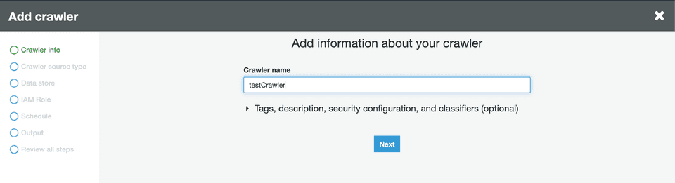

4. Next, under the **Crawler source type** section, choose **Data stores**.

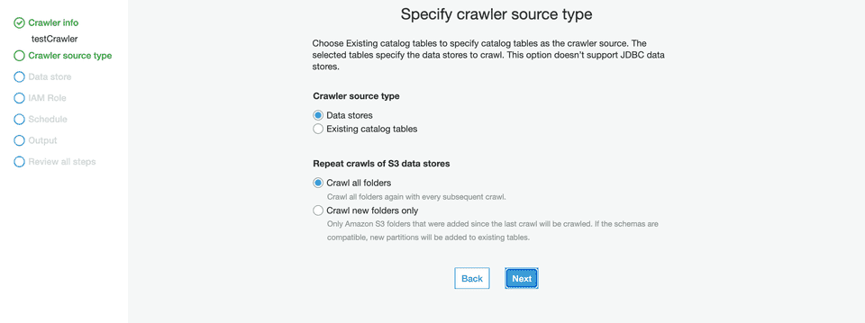

5. Configure the **Repeat crawls of S3 data stores** based on your requirement.
6. Then, under the **Data store** section, select **S3** from the dropdown for the **Choose a data store** setting:

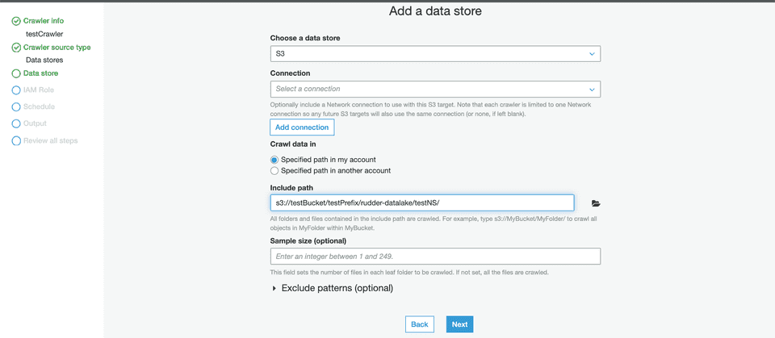

7. For the **Crawl data in** setting, choose **Specified path in my account**. 
8. In the **Include path** setting, enter the S3 URI of your configured bucket followed by the suffix `/<prefix>/rudder-datalake/<namespace>/`.

<div class="infoBlock">
If your S3 bucket name is <code class="inline-code">testBucket</code> and the configured prefix and namespace are <code class="inline-code">testPrefix</code> and <code class="inline-code">testNameSpace</code> respectively, then your path should be:
<code class="inline-code">s3://testBucket/testPrefix/rudder-datalake/testNameSpace/</code>
</div>

<div class="warningBlock">
If you have not configured any prefix while setting up the S3 data lake destination in RudderStack, omit the prefix. The path would then be:
<code class="inline-code">s3://testBucket/rudder-datalake/testNameSpace/</code>.
</div>

9. Then, under the **Add another data store** setting, select **No**, as shown:

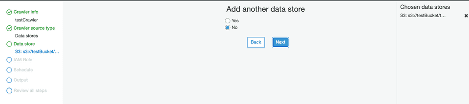

10. In the **IAM Role** section, configure a suitable IAM role.

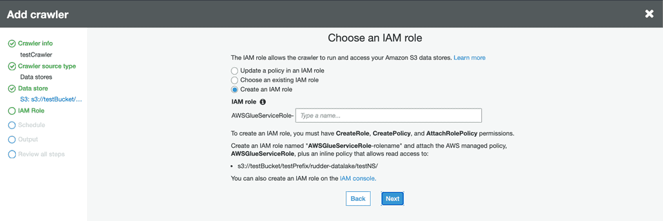

11. In the **Schedule** section, select the frequency of your crawler from the dropdown options, as shown:

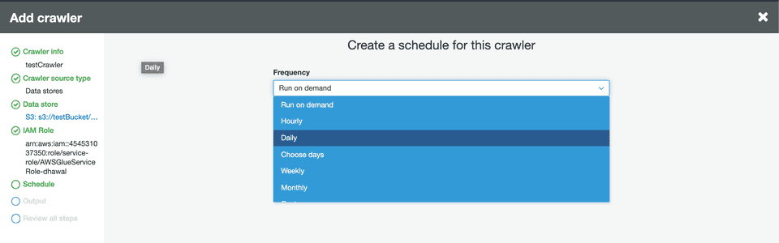

12. In the **Output** section, configure the database that stores all the tables. Under the Grouping behavior for S3 data section, enable the **Create a single schema for each S3 path** option:

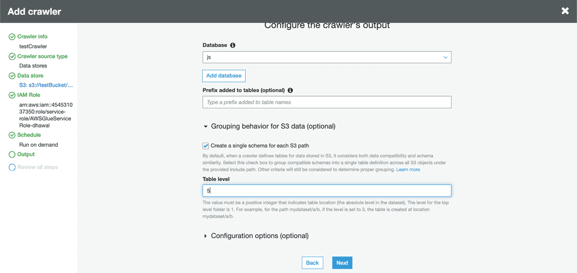

13. Specify the **Table level** as **5** or **4** \(refer to the tips below\). This value indicates the absolute level of the table location in the bucket.

<div class="infoBlock">
The level for the top-level folder is 1. For example, for the path <code class="inline-code">mydataset/a/b</code>, if the level is set to 3, the table will be created at the location <code class="inline-code">mydataset/a/b</code>. Similarly, if the level is set to 2, the table will be created at the location <code class="inline-code">mydataset/a</code>.
</div>

<div class="warningBlock">
Since all tables are created in the path <code class="inline-code">s3://testBucket/&lt;prefix&gt;/rudder-datalake/&lt;namespace&gt;/</code>, make sure the table level is set to:
<ul>
<li><strong>5</strong>:  If a prefix is configured.</li>
<li><strong>4</strong>: If a prefix is <strong>not</strong> configured.</li>
</ul>
</div>

14. Review your crawler configuration and click **Finish** to confirm.

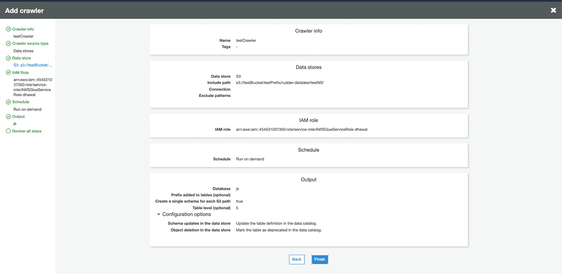

15. Finally, click your crawler and run it. Wait for the process to finish - you should see some tables created in your configured database.

## Querying data using AWS Athena

You can query your S3 data using a tool like [AWS Athena](https://aws.amazon.com/athena/) which lets you run SQL queries on S3.

<div class="warningBlock">
Before querying your data on S3, make sure that you have sent some data to S3 and that the sync is completed.
</div>

Follow these steps to start querying your data on s3:

1. Open your AWS Athena console. Then, go to the same AWS region which was used while configuring AWS Glue.
2. In the left pane, select `AwsDataCatalog` as your data source, as shown:

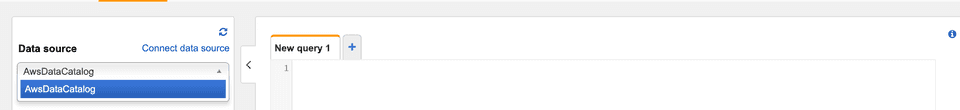

3. Select your configured namespace \(or the database you specified while configuring the crawler\) from the database dropdown menu.

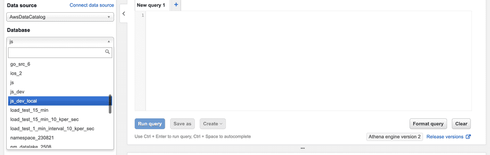

<div class="infoBlock">
By default, RudderStack sets the namespace to your source name if it is not explicitly specified in the destination settings.
</div>

4. You should see some tables already created under the **Tables** section in the left pane. 
5. You can preview the data by clicking on the three dots next to the table and selecting the **Preview Data** option. Alternatively, you can run your own SQL queries in the workspace on the right, as shown:

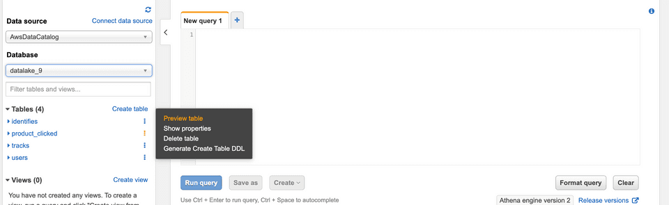

## IPs to be allowlisted
<Iplist/>

## FAQ

For a comprehensive FAQ list, refer to the <Link to="/destinations/warehouse-destinations/faq/">Warehouse FAQ</Link> guide.
