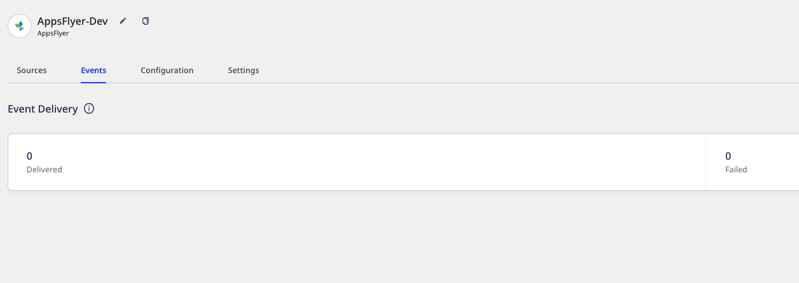
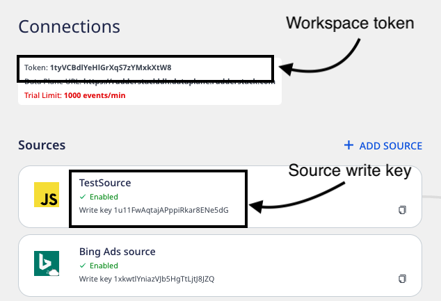
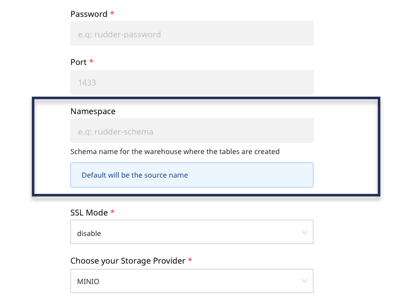

# FAQ

This section aims to address the queries and issues you might encounter while using RudderStack.

<div class="infoBlock">

If you come across any issue not listed in this guide, feel free to start a conversation in our [Slack](https://rudderstack.com/join-rudderstack-slack-community) community.
</div>

## Installation and setup

#### How do I quickly get started with RudderStack?

To quickly [get started](https://rudderstack.com/docs/get-started/), you can [sign up for RudderStack](https://app.rudderstack.com/). Here, you can configure your sources and destinations and start building your data pipelines in no time.

#### What is a data plane URL? Where do I get it?

For routing and processing the events to the RudderStack backend, a data plane URL is required.

<div class="infoBlock">

Refer to the [RudderStack Architecture](https://rudderstack.com/docs/get-started/rudderstack-architecture/) guide for more information the RudderStack Data Plane.
</div>

You can get the data plane URL depending on your RudderStack plan:

* **RudderStack Open Source** - Set up your own data plane by [installing and setting up RudderStack](https://rudderstack.com/docs/rudderstack-open-source/installing-and-setting-up-rudderstack/) in your preferred environment. 

<div class="successBlock">

An open source data plane URL looks like `http:localhost:8080` where `8080` is typically the port where your data plane is hosted.  
</div>

* [RudderStack Cloud](https://app.rudderstack.com/signup?type=freetrial) - The data plane URL is provided in the dashboard at the top of the **Connections** page.
* [RudderStack Pro/Enterprise](https://rudderstack.com/pricing) - [Contact us](https://rudderstack.com/join-rudderstack-slack-community) for the data plane URL with the email ID you used to sign up for RudderStack.

#### To get started with RudderStack on my local machine, is it mandatory to get the workspace token from RudderStack dashboard?

The token (also referred to as the workspace token) is required if you are installing RudderStack in your own environment and wish to use the RudderStack-hosted control plane. It is a unique identifier for your configuration settings which the RudderStack can fetch to track your instrumentations. 

If you are [self-hosting your control plane](https://rudderstack.com/docs/rudderstack-open-source/control-plane-lite/), this token is not required.

#### Can I self-host the RudderStack control plane?

Yes. Use the open source [Control Plane Lite](https://rudderstack.com/docs/rudderstack-open-source/control-plane-lite/) utility to self-host the control plane and configure your sources and destinations. Refer to the **Control Plane Lite** section below for more information.

#### While running `git submodule update`, I get this error:

```
Please make sure you have the correct access rights and the repository exists.
fatal: clone of 'git@github.com:rudderlabs/rudder-transformer.git' into submodule path '/home/ubuntu/rudder-server/rudder-transformer' failed
Failed to clone 'rudder-transformer'. Retry scheduled.
Cloning into '/home/ubuntu/rudder-server/rudder-transformer'...
git@github.com: Permission denied (publickey).
fatal: Could not read from remote repository.
```

Verify if the SSH keys are correctly set in your GitHub account as they are used when cloning using the git protocol. For more information, refer to this [Stack Overflow thread](https://stackoverflow.com/questions/25957125/git-submodule-permission-denied).

#### How do I verify my RudderStack installation?

You can verify your RudderStack installation by sending some test events and checking if they are delivered correctly. For more information, refer to the [Sending Test Events](https://www.rudderstack.com/docs/rudderstack-open-source/installing-and-setting-up-rudderstack/sending-test-events/) guide.

#### My open source RudderStack setup keeps creating a new database automatically. What could be the reason?

This can happen if you have changed your workspace token. Also, ensure that the RudderStack server is running on the latest version.

### Docker

#### Is there any recommended size for the EC2 instance? I am running a self-hosted Docker setup.

A **c4.xlarge** or **c4.2xlarge** machine should work just fine for your setup.

#### I'm running RudderStack in Docker on a GCP VM instance. I upgraded the instance to have more CPU and now the RudderStack container is stuck on this message:

```
sh -c '/wait-for db:5432 -- /rudder-server'
```

This message indicates that the RudderStack server is waiting on the PostgreSQL database dependency to be up and running. Verify if your PostgreSQL container is up.

## RudderStack backend (server)

#### How do I check the status of the RudderStack data plane?

To check the status of the data plane, run the following command:

```bash
CURL <DATA_PLANE_URL>/health
```

A sample command would look something like:

```bash
CURL https://hosted.rudderlabs.com/health
```

#### How many events can a single RudderStack node handle?

The number of events a single RudderStack node can handle depends on the destinations that you are sending the event data to. It also depends on the transformations that you are running.

Here are some ballpark figures:

| Activity | Events handled |
| :-------| :---------------|
| Dumping to S3 | Approx. 1.5K events/sec |
| Dumping to warehouse | Approx. 1K events/sec |
| Dumping to warehouse and a few cloud destinations | Approx. 750 events/sec |

<div class="warningBlock">

These are conservative numbers. A single RudderStack node can handle close to 5x event load at the peak - just that those events get cached locally and are drained as per the regular throughput.
</div>

#### How can I speed up the number of events sent to a destination?

There is a [config variable](https://github.com/rudderlabs/rudder-server/blob/master/config/config.yaml#L107) to configure the number of workers that send data to destinations. The default value is `64`, which itself is an aggressive number. You can increase the number of workers. However, note that some destinations generally throttle the number of requests per account.

#### How I can know the number of events that are sent to a destination?

Go to the **Events** tab of the destination page to see the event-related metrics, as shown below:



<div class="warningBlock">

Events sent through the <a href="https://rudderstack.com/docs/rudderstack-cloud/rudderstack-connection-modes/#device-mode">device mode</a> are not visible in this option. 
</div>

#### Do I need to change the data plane URL associated with the RudderStack Cloud to my self-hosted data plane?

No, you need not change the URL. As long as your self-hosted data plane has the same workspace token, the RudderStack-hosted control plane will use your data plane for processing events.

#### While trying to start rudder-server, I get the following error:

```
backend_1 | 2021/06/09 08:12:14 notifying bugsnag: During db.vlog.open: Value log truncate required to run DB. This might result in data loss 
backend_1 | 2021/06/09 08:12:14 bugsnag.Notify: bugsnag/payload.deliver: invalid api key: '' 
backend_1 | 2021/06/09 08:12:14 bugsnag/sessions/publisher.publish invalid API key: '' 
backend_1 | panic: During db.vlog.open: Value log truncate required to run DB. This might result in data loss [recovered] 
backend_1 | panic: During db.vlog.open: Value log truncate required to run DB. This might result in data loss [recovered] 
backend_1 | panic: During db.vlog.open: Value log truncate required to run DB. This might result in data loss
```

Check for the folder `/tmp/badgerdbv2` and delete it. This should resolve the issue and you should be able to start rudder-server.

## Control Plane Lite

#### How do I self-host the UI configuration?

For self-hosting the UI, you can use the [RudderStack Control Plane Lite](https://github.com/rudderlabs/config-generator) utility.

Note that this utility will only generate the source-destination configurations which are required by RudderStack.

<div class="warningBlock">

The self-hosted control plane set up using Control Plane Lite does not support features like <a href="https://rudderstack.com/docs/transformations/">Transformations</a> and <a href="https://rudderstack.com/docs/rudderstack-cloud/live-events/">Live Events Debugger</a>, which are included in the [RudderStack-hosted control plane](https://app.rudderstack.com).
</div>

#### I am using the Control Plane Lite to generate the `workspaceConfig.json` file. But when I import this file, I get this error:

```
TypeError: Cannot read property 'name' of undefined"
```

This issue can occur when you have some old data left in your browser's local storage. Use the latest version of the Control Plane Lite after clearing your browser cache and local storage.

#### For a self-hosted environment, how do I obtain the control plane URL?

To use the control plane URL to initialize your SDKs, follow these steps:

1. Set up the control plane using the Control Plane Lite utility.
2. Go to dashboard, configure the source, and export the source configuration by clicking the **EXPORT SOURCE CONFIG** button as shown:


3. Host the exported file on your own server such that the configuration is available at  `<CONTROL_PLANE_URL>/sourceConfig`.

<div class="infoBlock">

This solution assumes that you have already set up the RudderStack data plane (backend) locally.
</div>

## Transformations

#### How do I add user transformations in RudderStack?

RudderStack lets you implement your own custom transformations that leverage the event data to implement specific use-cases based on your business requirements. Refer to the [Adding a transformation](https://rudderstack.com/docs/transformations/#adding-a-transformation) section to add transformations in RudderStack. 

#### Can I apply a transformation to a source configured in RudderStack?

Currently, transformations can only be configured and used for destinations. If you want to write some custom logic specific to the source, you can get the [source ID](https://rudderstack.com/docs/rudderstack-cloud/sources/) in the transformation function and use it to include the logic. Refer to the [Accessing metadata](https://rudderstack.com/docs/transformations#accessing-metadata) section for more information.

## RudderStack Cloud

#### Can I change my workspace name?

Unfortunately, your workspace name is not changeable currently. We are planning to include this feature in our future releases.

#### What is the difference between source write key and the workspace token?

The write key is different from your workspace token. The write key is associated with the source, while the workspace token is associated with your RudderStack workspace, as shown:



#### I see a few events that show up in the live stream but do not reach the destination. How do I see the logs or data that is sent to my destination?

To view the data or events that are sent to your destination, you can use the [Live Events](https://rudderstack.com/docs/rudderstack-cloud/live-events/) tab in your destination's page.

#### Do I need to change the data plane URL associated with the cloud-hosted RudderStack to my self-hosted data plane?

No, you need not change the URL. As long as your self-hosted data plane has the same workspace token, the RudderStack-hosted control plane will use your data plane for processing events.

#### How can I switch from RudderStack Open Source to RudderStack Cloud and vice-versa?

Switching between RudderStack Open Source and RudderStack Cloud is quite straightforward. Replace the URL of your self-hosted data plane to the RudderStack-hosted data plane URL. You can use the same sources and destinations as before - all you need to do is just change the URL to where the events are sent.

#### What is a personal access token? Where do I find it?

The personal access token is a unique token associated with your RudderStack account. It is required to access and consume the RudderStack APIs.

<div class="infoBlock">

For more information on generating a personal access token, refer to the <a href="https://www.rudderstack.com/docs/rudderstack-api/personal-access-tokens/">Personal Access Tokens</a> guide.
</div>

## Integrations

### SDKs

#### I want to use the RudderStack JavaScript SDK to track impressions in an eCommerce site. How can I send the impression data in batches? I could not find the `batch` method in the SDK.

You should use the `track` method instead. For JavaScript SDK's `track` method parameters specific to e-commerce, you can refer to the [E-commerce Events Spec](https://www.rudderstack.com/docs/rudderstack-api/api-specification/rudderstack-ecommerce-events-specification/).

#### Is Shopify compatible as a data source for Rudderstack?

Yes, Shopify is compatible as an event stream data source. For more information, refer to [Shopify](https://www.rudderstack.com/docs/stream-sources/shopify/). We also have users that integrate the JavaScript SDK into their Shopify sites. In some cases, they even do it through Google Tag Manager.
However, we strongly recommend using the Shopify source integration for better tracking.

### Cloud Extract sources

#### While trying to set up the Zendesk Chat Cloud Extract source, I get the following error:

```
""Unauthorized"",""description"": The server could not verify that you are authorized to access the requested resource.""
```

If you encounter this error, it is most likely because of faulty permissions. Try editing the Zendesk Chat source and reauthorizing it again.

#### When syncing data from Cloud Extract sources, how does RudderStack determine the new events? Is this data kept in RudderStack or S3?

RudderStack does not persist any data on its own. Rather, it fetches the data from the source based on the last timestamp till it was extracted.

### Destinations

#### Would a destination connected with a source work if it is connected to a new source?

Yes, you can use the same destination without any problem.

#### How do I see the logs or the data that is sent to my destination?

To view the data or events that are sent to your destination, you can use the [Live Events](https://www.rudderstack.com/docs/rudderstack-cloud/live-events/) tab on your destination page.

#### I would like to send events to Mixpanel via RudderStack. However, I would like to set a filtering condition on the source events before routing them to Mixpanel. How do I go about doing this?

You can use  [Transformations](https://rudderstack.com/docs/transformations/) to set custom logic on your events before sending them to Mixpanel.

#### I am seeing a `Message type not supported` error. What does this mean?

This error is being returned from the RudderStack backend. It means that a particular destination does not support the event you are trying to send.

For example, Salesforce only supports `identify` events. Therefore, if a `track` call is sent to Salesforce, the `Message type not supported` error will be returned. This error does not affect any other events and is harmless. However, a simple user transformation can be written to filter out these events so you will no longer see this error.

### Warehouse destinations

#### How to force RudderStack to push all the data to a data warehouse in real-time with no delay? During the implementation, it would be better to see how the data is collected in real-time, rather than 30 minutes later.

You can override the UI set sync frequency by setting `warehouseSyncFreqIgnore` to true in [`config.yaml`](https://github.com/rudderlabs/rudder-server/blob/master/config/config.yaml) \(or `config.toml`, in case you have an older RudderStack deployment\). You can set your desired frequency by changing the `uploadFreqInS` parameter.

#### I am using Rudderstack to mirror my source tables to PostgreSQL. I have all of the data in the S3 staging folders. But RudderStack doesn't create the corresponding PostgreSQL tables when I press on 'sync'. What do I do?

1. Firstly, make sure you have set up the required [user permissions](https://www.rudderstack.com/docs/data-warehouse-integrations/postgresql/#setting-user-permissions-in-postgresql) for PostgreSQL.
2. Then, check the status of the sync in the [RudderStack dashboard](https://app.rudderstack.com/syncs).
3. Check if the database is accessible by whitelisting all the RudderStack IPs listed [here](https://www.rudderstack.com/docs/data-warehouse-integrations/warehouse-faqs/#which-ips-should-be-whitelisted).
4. Ensure that all the security group policies for S3 are set as specified [here](https://rudderstack.com/docs/destinations/storage-platforms/amazon-s3#permissions).

#### When sending data into a data warehouse, how can I change the table where this data is sent?

By default, RudderStack sends the data to the table / dataset based on the source it is connected to. For example, if the source is Google Tag Manager, RudderStack sets the schema name as **`gtm_*`**.

You can override this by setting a **Namespace** in the destination settings as shown:



#### I am trying to set `warehouseSyncFreqIgnore = true` to have a real-time sync with BigQuery but I can't find the `config.yaml` file. How can I do this using the Docker setup?

You can do so by setting this value via the following `.env` variables:

* `RSERVER_WAREHOUSE_WAREHOUSE_SYNC_FREQ_IGNORE`
* `RSERVER_WAREHOUSE_UPLOAD_FREQ_IN_S`

#### I'm looking to send data to my data warehouse through RudderStack and I'm trying to understand what data is populated in each column. How do I go about this?

Refer to the [Warehouse Schema](https://rudderstack.com/docs/data-warehouse-integrations/warehouse-schemas/) guide for details on how RudderStack generates the schemas in the warehouse.

#### I am trying to load data into my BigQuery destination and I get this error:

```
backend_1 | {Location: “”; Message: “Cannot read and write in different locations: 
source: US, destination: us-central1""; Reason: “invalid”}"
```

Make sure that both your BigQuery dataset and the bucket have the same region. For more information, refer to the [BigQuery documentation](https://cloud.google.com/bigquery/docs/locations#data-locations).

#### When sending data to BigQuery, I can set the bucket but not a folder within the bucket. Is there a way to put Rudderstack data in a specific bucket folder?

Yes, you can set the desired folder name in the **Prefix** input field while configuring your BigQuery destination. For more information, refer to the [BigQuery setup guide](https://www.rudderstack.com/docs/data-warehouse-integrations/google-bigquery/#configuring-google-bigquery-destination-in-rudderstack).

## RudderStack Pro/Enterprise

#### I don't want to configure my API keys and secrets with RudderStack's control plane. But I want to use its features like Transformations. How can I do this?

RudderStack lets you fill in the values with variable names. These variables should be prepended with `env.`. You can populate these secrets as environment variables and run the data plane.

Suppose you are configuring Amazon S3 as a destination but you don't want to enter the AWS access key credentials in the destination settings. Fill the value with a placeholder that starts with `env.` It should look like this `env.MY_AWS_ACCESS_KEY`. Then set the value of the environment variable `MY_AWS_ACCESS_KEY`while running the data plane.

## RudderStack failover, hardening, and security

#### What cloud infrastructure is the RudderStack hosted solution running on? Do you have failover to alternate availability zones?

RudderStack's hosted solution is running on AWS EKS with the cluster spanning 3 availability zones (`east-1a`, `east-1b`, `east-1c`).

#### How does RudderStack ensure uptime with a single node?

* At the infrastructure layer, RudderStack runs on a multi-availability zone EKS cluster. So hardware failures, if any, are handled by Kubernetes by relocating pods.
* At an application level, RudderStack operates in either of the following 3 modes:
  * **Normal** mode, where everything is normal and there are no issues.
  * If for some reason the system fails \(e.g. because of a bug\), it enters the **Degraded** mode, where RudderStack processes incoming requests but doesn't send it to destinations. 
  * If the system continues to fail to process the data \(e.g. internal database corruption\), it enters the **Maintenance** mode where we save the previous state \(which can be debugged and processed\) and start from scratch - still receiving requests. 
* All of RudderStack's SDKs also have failure handling. They can store events in local storage and retry on failure.
* RudderStack provides isolation between the data and control planes. For example, if the control plane \(where you manage the source and destination configurations\) goes offline, the data plane continues to operate.

All this is done to ensure that RudderStack can always receive events and no events are lost.

#### Would adding an additional node to RudderStack cause an outage, and if so what is the expected downtime? How long would it take to recover from backup?

Adding a new node requires a bit of downtime. However, RudderStack is built in a way that minimizes this downtime as much as possible. 

When a new node is added, the users need to be rebalanced across nodes \(to keep event ordering\). While the re-balancing takes place \(can take a few minutes\), RudderStack does not send events to downstream destinations, but continues to receive events so that your SDKs don't see any failures \(ignoring the small ELB switch over time\). 

Also, the SDKs have a built-in local caching and retrying capability. So even if there is a failure, no events are lost.

## Whitelisting

#### What are the IPs to be whitelisted?

To enable network access to RudderStack, you will need to whitelist the following RudderStack IPs:

- 3.216.35.97
- 34.198.90.241
- 54.147.40.62
- 23.20.96.9
- 18.214.35.254
- 35.83.226.133
- 52.41.61.208
- 44.227.140.138
- 54.245.141.180
- 3.66.99.198
- 3.64.201.167

<div class="infoBlock">

If you have your deployment in the EU region, you can whitelist only the following two IPs:
  <ul>
    <li>3.66.99.198</li>
    <li>3.64.201.167</li>
  </ul>
</div>

<div class="infoBlock">

All the outbound traffic is routed through these RudderStack IPs.
</div>

#### Which URLs should be whitelisted for a content security policy?

For a content security policy, the following URLs should be whitelisted:

- **Control plane**
  - `https://api.rudderstack.com`
  - `https://api.rudderlabs.com`
- **Data plane**
  - `DATA_PLANE_URL`

<div class="infoBlock">

Refer to this [FAQ](#what-is-a-data-plane-url-where-do-i-get-it) for more information on obtaining your data plane URL.
</div>

- **SDK**
  - `https://cdn.rudderlabs.com`

## Retry behavior

#### How does RudderStack handle retries for failed events in case of destination failure?

Sometimes, the downstream destination can be unavailable or send a failure code for a variety of reasons. RudderStack retries sending the events depending on the type of failure:

| Failure Code | Retry Behavior |
| :--- | :--- |
| `5XX`, `429` | Retry for a time window of 3 hours with exponential backoff and a minimum of 3 times. |
| `4XX` | Retry for a minimum of 3 times without any backoff . |

The above behavior is configurable via config variables in [`config.yaml`](https://github.com/rudderlabs/rudder-server/blob/master/config/config.yaml).

```
[Router]
retryTimeWindowInMins = 180
minRetryBackoffInS = 10
maxRetryBackoffInS = 300
maxFailedCountForJob = 8
```

<div class="warningBlock">

If a user event fails, the other events are not sent until the failed event is successfully sent or aborted \(as per above behavior\). This is to ensure event ordering for all events of a single user.
</div>

<div class="infoBlock">

For more information on the SDK-specific retry and backoff logic, refer to the [SDK FAQ](https://www.rudderstack.com/docs/stream-sources/rudderstack-sdk-integration-guides/sdk-faqs/#what-is-the-rudderstack-retry-and-backoff-logic-after-the-connection-fails) guide.
</div>

## Throttling behavior

#### Some destinations have limits on the number of events they accept. How does RudderStack handle this?

Some downstream destinations have limits on the number of events they accept at an account or user/device level. RudderStack tries to throttle the API requests as per the destination's limits.

Some examples are:

* [Customer.io](https://customer.io/docs/api/#api-documentationlimits)
* [Amplitude upload limit ](https://help.amplitude.com/hc/en-us/articles/360032842391-HTTP-API-V2#upload-limit)

These limits can also be configured using config variables in [`config.yaml`](https://github.com/rudderlabs/rudder-server/blob/master/config/config.yaml) or using environment variables as described in comments [here](https://github.com/rudderlabs/rudder-server/blob/master/config/config.yaml#L1-L32).

```
# The following configuration throttles request to Amplitude at 1000 req/s for the account 
# and 10 req/s for individual user/device  

[Router.throttler.AM]
limit = 1000
timeWindowInS = 1
userLevelThrottling = true
userLevelLimit = 10
userLevelTimeWindowInS = 1
```

## Contact us

For queries on any of the sections covered in this guide, you can [contact us](mailto:%20docs@rudderstack.com) or start a conversation in our [Slack](https://rudderstack.com/join-rudderstack-slack-community) community.
