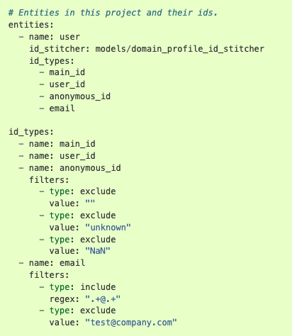
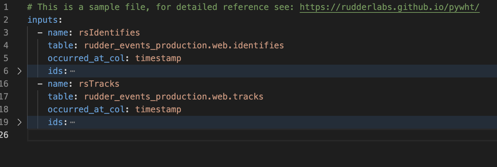
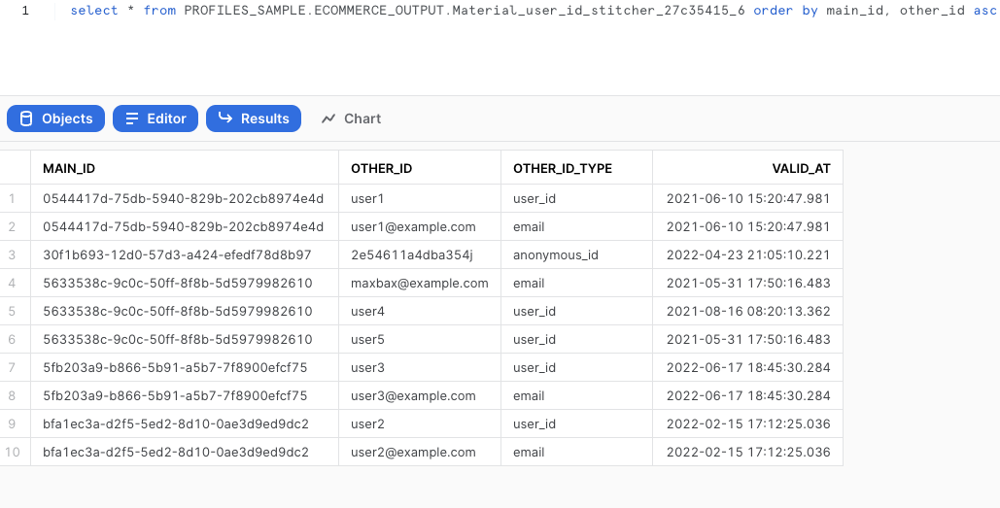
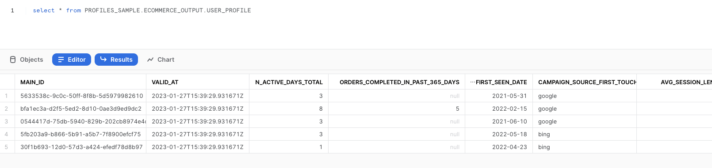

This guide walks you through RudderStack **Profiles**. It lets you build a unified customer profile from all the cross-platform data in your warehouse.

<GhBadge
  label={'Stability'}
  message={'Beta'}
  color={'blueviolet'}
  logo={'github'}
/>

## Introduction

Companies gather user data across various digital touchpoints like websites, mobile apps, enterprise systems like CRMs, marketing platforms, etc. Users are also identified with multiple identifiers across their product journey, like their email ID, phone number, device ID, anonymous ID, account usernames, and more. In addition, they might have multiple identifiers as they often change their devices and use work and personal emails together.

All of this data is typically scattered across multiple tables within a warehouse. **Profiles** is RudderStack's solution to tie all the user data from these tables into a unified view, giving you a 360-degree view of the user - often called **Customer 360**.

<div class="infoBlock">
Customer 360 is best represented as a table with one row per user, with multiple features or attributes computed for that user.
</div>

## 10-step guide to using Profiles

To understand how Profiles works, you will implement a use case by leveraging a sample dataset based on [RudderStack's ecommerce tracking plan](https://www.rudderstack.com/docs/event-spec/ecommerce-events-spec/). This data is available in Snowflake, which you can access by following the steps in this guide. 

You will create a simple Profiles project with the following capabilities:

- ID stitch `anonymous_id`, `user_id`, and `email` so that the user activity before signup can be tied to their post-signup activity. Also, connect different user IDs if they share the same email.
- Create the following features:

| Feature | Description |
| :-------| :------------|
| `n_active_days_total` | Number of days since the user first visited the app. |
| `orders_completed_in_past_365_days` | Number of orders completed in the past 365 days. |
|  `first_seen_date` | The date and time of the first user activity - including their time on the app as an anonymous user. |
| `campaign_source_first_touch` | Captured from the campaign data - this is **automatically tracked** by RudderStack. |
| `avg_session_length_in_sec_last_7_days` | Average length of the user session in the past week. |

<div class="infoBlock">
These are some basic features to demonstrate how you can use Profiles. You can add many more features with complex logic to explore its full capabilities.
</div>

The 10 steps are divided into the following sections:

- [Setup](#part-1-setup)
- [Setting up ID stitching](#part-2-setting-up-id-stitching)
- [Create customer 360 feature tables](#part-3-creating-feature-tables)

## Part 1: Setup

### 1: Install Profile Builder tool

Install the **Profile Builder (pb)** tool by running the following command:

```python
pip3 install profiles-rudderstack
```

### 2. Set up a connection profile

Next, you need to set up a connection profile to connect to the RudderStack warehouse having the test dataset for this use case. Go to your terminal, run `pb init profile`, and follow the prompts. A sample profile for a Snowflake account is as follows:

```
Enter profile_name: test
Enter target:  (default:dev):  # Just press enter, leaving it to default
Enter account: vmskhef-customer_sample_data
Enter warehouse: wh_guide
Enter dbname: profiles_sample
Enter schema: ecommerce_output
Enter user: rudder_profiles
Enter password: <password>  // We will share the password with you separately.
Enter role: rudder_profiles_role
Append to /Users/<user_name>/.pb/siteconfig.yaml? Specify 'yes' to confirm, anything else to deny.
yes
```

<div class="warningBlock">
We will share the password with you separately.
</div>

<div class="infoBlock">
<ul>
    <li>When prompted for a profile name in the CLI, enter <code class="inline-code">test</code>.</li>
    <li>You will see the last line <strong>only if</strong> you have already set up Profiles earlier. Enter <code class="inline-code">yes</code> in this case.</li>
</ul>
</div>

### 3. Create a sample project 

Create a sample project in a folder called `HelloPbProject` by running the following command:

```python
pb init pb-project
```

To choose another name for the project folder like `ProfilesDemo`, run the following command:

```python
pb init pb-project -o ProfilesDemo
```

Your project folder will have the following structure. These files contain some default prefilled values that you need to modify (explained in the next sections).


## Part 2: Setting up ID stitching

### 4. Modify `pb_project.yaml`

Go to the `pb_project.yaml` file in your project folder. This file contains the project name, schema version, project entities, ID types, etc. Under `entities`, change the `id_stitcher` name from `models/domain_profile_id_stitcher` to `models/<your_org_name>_user_id_stitcher` (ex: `models/rudderstack_user_id_stitcher`; In this guide, we used `models/user_id_stitcher`) - this is the name of the table created in the warehouse.

In the `pb_project` YAML  file, the `entities` and `id_types` fields play an essential role. **All the features are computed at an entity level**. A user is one of the most common entity types; other examples are organization/company, products, plans, etc. 

Also, an entity can have multiple identifiers like email, phone number, user ID, etc. These identifiers are listed under `id_types`.


<br /><br />

In the above example, both the `id_types` fields are the same. In the first instance, `id_types` is tied to `entities`, and the second instance contains the identifier definitions.

### 5. Modify `inputs.yaml`

Check the `inputs.yaml` file shown below (some lines are hidden). It outlines how to obtain the values for the model from the various tables. Rename the `identifies` table by replacing `rudder_events_production.web.identifies` with `profiles_sample.ecommerce.identifies`. Similarly, rename the `tracks` table by replacing `rudder_events_production.web.tracks` with `profiles_sample.ecommerce.tracks`.

<div class="infoBlock">
<code class="inline-code">identifies</code> and <code class="inline-code">tracks</code> are the test tables in the dataset that you set up in <Link to="#2-set-up-a-connection-profile">Step 2</Link>.
</div>

<div class="infoBlock">
Leave the rest of the file unchanged. However, you can add any new identifier for ID stitching or any new tables to the project, as required.
</div>



<br />

### 6. Modify `profiles.yaml`

Next, go to the `profiles.yaml` file where the models are defined. You will find two models here - `id_stitcher` and `feature_table_model`. 

For ID stitching, retain the first model (`model_type: id_stitcher`) and **comment out the entire second model** (`model_type: feature_table_model`). Also, change the model's `name` from `domain_profile_id_stitcher` to `<your_org_name>_user_id_stitcher` - the same name used in [Step 4](#4-modify-pb_projectyaml). 

<div class="warningBlock">
In the <code class="inline-code">name</code> field, it is important to use the same entity name set in <strong>Step 4</strong>. This links the ID stitcher in the <code class="inline-code">pb_project.yaml</code> file to the model spec in <code class="inline-code">profiles.yaml</code>.
</div>

### 7. Run Profile Builder

Go to your terminal and run the following command:

```python
pb run
```

The execution takes a couple of minutes. Once completed, two things happen:

- A SQL file gets written in the `output/dev/seq_no` folder.
- This SQL is run on the warehouse and a table gets created. Also, the table name is shown in the terminal. An example output is shown below: 

```
2023/01/27 16:19:24 Material Material_user_id_stitcher_27c35415_6 ran in 18.862061136s.
``` 

In the above example, the **table name** is `Material_user_id_stitcher_27c35415_6`, where:
- `Material` is a common prefix.
- `user_id_stitcher` is the name defined in [Step 4](#4-modify-pb_projectyaml) and [Step 6](#6-modify-profilesyaml).
- `27c35415_6` is a suffix generated by the Profile Builder tool. You can ignore this suffix for now.

### 8. Verify ID stitching

Go to the warehouse using the credentials defined in [Step 2](#2-set-up-a-connection-profile) to see the actual table. Run the following query after replacing <table_name> with the table name from your CLI output:

```sql
SELECT * FROM PROFILES_SAMPLE.ECOMMERCE_OUTPUT.<table_name> ORDER BY main_id, other_id ASC
```

You will see the following result:



You can see that five distinct **MAIN_ID** are created, each representing an actual user. Also, **user4** and **user5** have the same **MAIN_ID** as they share the same email - highlighting successful ID stitching.

At this point, the ID stitching is complete.

## Part 3: Creating feature tables

### 9. Define features in `profiles.yaml`

To create a feature table, you need to modify the feature table model (`model_type: feature_table_model`) in `profiles.yaml`. 

Uncomment the lines you commented out in [Step 6](#6-modify-profilesyaml). Then, modify the `name` from `domain_profile` to `<your_org_name>_user_profile` (in this doc, we used `user_profile` without the prefix ). Similar to `user_id_stitcher`, this is the name of the output table that is created in the warehouse. 

Also, delete all the information present in the `vars` key as you will <Link to="#feature-definitions">write your own features</Link> for the model instead, as mentioned in the <Link to="#use-case">use case</Link>.

<div class="infoBlock">
The <Link to="#feature-definitions">Feature definitions</Link> section contains details on each feature definition and the associated logic.
</div>

Once you define all the features, the `profiles.yaml` file should look something like this:

```yaml
# This is a sample file, for detailed reference see: https://rudderlabs.github.io/pywht/

models:
  - name: user_id_stitcher
    model_type: id_stitcher
    model_spec:
      validity_time: 24h # 1 day
      entity_key: user
      main_id_type: main_id
      edge_sources:
        - inputs/rsIdentifies
        - inputs/rsTracks

# Remove the section below, if you don't want to generate a feature table

  - name: user_profile
    model_type: feature_table_model
    model_spec:
      validity_time: 24h # 1 day
      entity_key: user
      vars:
        - entityvar:
            name: n_active_days_total # Alias for the temp feature
            select: count(distinct(date(timestamp))) # The sql function to first convert timestamp to date, then count distinct dates
            from: inputs/rsTracks # Refering to the tracks table defined in inputs.yaml file
            description: Number of days since the user first visited the app.

        - entityvar:
            name: orders_completed_in_past_365_days # Alias for the temp feature
            select: count( * ) # The sql function to count all rows from tracks table where event_type = 'order_completed' (see below); If there's an order_id field, you can also use count(distinct order_id) to prevent any duplicate records related to same order
            from: inputs/rsTracks # Refering to the tracks table defined in inputs.yaml file
            where: event = 'order_completed' and datediff(day, date(timestamp), current_date()) <= 365
            description: Number of orders completed in the past 365 days.

        - entityvar:
            name: first_seen_tracks # Alias for the temp feature
            select: min(timestamp) # The sql function to get oldest timestamp from tracks table
            from: inputs/rsTracks # Refering to the tracks table defined in inputs.yaml file
            description: First seen timestamp from tracks table.

        - entityvar: # The prev block is repeated with identifies table as source
            name: first_seen_identifies
            select: min(timestamp)
            from: inputs/rsIdentifies
            description: First seen timestamp from identifies table.

        - entityvar: # Once min timestamps from both tracks and identifies is defined, we pick the earliest timestamp of both here
            # The prev two are temp features used to derive this feature. 
            # In the profiles.yaml file, we can also see an attribute called features; 
            # We declare this name as a feature, so it doesn't get deleted and is stored in final feature table
            name: first_seen_date # This is the name with which the feature gets stored
            select: to_date(least(first_seen_tracks, first_seen_identifies)) # It uses the names we defined in above entityvars, and performs sql operations ot get lowest value of these            

        - entityvar:
            name: campaign_source_first_touch # Name of the feature
            select: first_value(context_campaign_source) # Window functions are supported in entityvars, as long as the value is unique for a given user id (ex: first_value, min, max etc - unlike rank, row_number etc); 
            window: 
              # All window functions in entityvars are partitioned by main_id by default. It can take only order_by as parameter
              order_by:
                # In this example, we take the oldest occurence of the campaign source, so we sort the rows by timestamp in asc order
                - timestamp asc
            from: inputs/rsIdentifies
            where: context_campaign_source is not null and context_campaign_source != '' # We can filter rows with a where condition.  In this case, we ignore all rows where the campaign source is null or blank - to ensure we ignore organic visits

        - inputvar:
            name: session_start_time
            select: min(timestamp)
            window:
              partition_by:
                - session_id # Partition on session_id, or any other key than main_id wouldn't have been possible in entityvar
                - main_id # inputvars do not make any assumptions around main_id being the primary key of the table, hence this needs to be given in partition by if required.
            from: inputs/rsTracks

        - inputvar:
            name: session_end_time
            select: max(timestamp)
            window:
              partition_by:
                - session_id
                - main_id
            from: inputs/rsTracks

        - inputvar:
            name: session_length
            select: datediff(second, session_start_time, session_end_time)
            from: inputs/rsTracks

        - entityvar:
            # This is the final query
            name: avg_session_length_in_sec_last_7_days
            select: avg(session_length)
            from: inputs/rsTracks
            where: datediff(day, date(session_start_time), current_date()) <= 7

      features:
        - n_active_days_total   
        - orders_completed_in_past_365_days
        - first_seen_date # Ensures that feature is stored in the final table (unlike first_seen_tracks or first_seen_identifies)
        - campaign_source_first_touch
        - avg_session_length_in_sec_last_7_days
```

### 10. Run Profile Builder and verify tables in warehouse

Go to your terminal and run the following command:

```python
pb run
```

In a few minutes, you will see a similar output as [Step 7](#7-run-profile-builder). However, you will get two SQL files this time - one for the ID stitcher and the other for the feature table. You will also see two tables created in the warehouse.

<div class="infoBlock">
The two SQL files are created in a new folder and are present for debugging purposes. You can check the queries to understand what is happening behind the scenes.
</div>

The CLI output will look something like the following:

```
2023/01/27 21:10:39 Material Material_user_id_stitcher_27c35415_7 ran in 20.173565021s
2023/01/27 21:11:11 Material Material_user_profile_ac394282_7 ran in 26.993571473s
```

This output confirms successful completion of the job. You can now verify the tables in the  warehouse.

The feature table output is shown below:



In the above image, you can see that 5 rows are created - one per `main_id`. For each row, all the five features are created with their values computed and filled in. There is one more column `valid_at` indicating when the feature was computed.

### How it works

The `pb run` command creates a new table of all the available models. Also, the Profile Builder creates a snapshot of the latest run with just the names given for the models - `user_id_stitcher` and `user_profile` in this case (or `<your_org_name>_user_id_stitcher` and `<your_org_name>_user_profile` based on the org_name prefix given). This ensures that the names are more predictable for using them in any downstream application.

## Feature definitions

<div class="infoBlock">
You will write each feature in the <code class="inline-code">entityvar</code> field. It can be considered as a declarative form of SQL to define the model features.
</div>

You can define the features in `profiles.yaml` as follows:

- `n_active_days_total`: This is a count of the distinct active days (when the user visited the app). The presence of a `tracks` event is a good indicator for this as every user visit triggers some events from the customer. This feature is defined as follows:

```yaml
vars:
  - entityvar:
		name: n_active_days_total # Alias for the temp feature
        select: count(distinct(date(timestamp))) # SQL function to first convert timestamp to date, then count the distinct dates
		from: inputs/rsTracks # Refering to the tracks table defined in the inputs.yaml file
		description: Number of days since the user first visited the app.
features:
  # This block is required to declare that the feature needs to be stored in feature table. 
  # Often, we may want entityvars that are temp features, which are not required later (see below). 
  # Such vars are not added to the features list.
	- n_active_days_total
```

- `orders_completed_in_past_365_days`: This feature computes the distinct orders completed in the past 365 days. Often, you may want to apply some filters to the table; you can do so with a `where` clause, as shown:

```yaml
vars:
  - entityvar:
	    name: orders_completed_in_past_365_days # Alias for the temp feature
        select: count( * ) # The SQL function to count all rows from tracks table where event_type = 'order_completed' (see below); If there's an order_id field, you can also use count(distinct order_id) to prevent any duplicate records related to same order
		from: inputs/rsTracks # Refering to the tracks table defined in inputs.yaml file
        where: event = 'order_completed' and datediff(day, date(timestamp), current_date()) <= 365
		description: Number of orders completed in the past 365 days.
features:
	- orders_completed_in_past_365_days
```

<div class="warningBlock">
This feature would be a continuation to the <code class="inline-code">vars</code> block mentioned above; the <code class="inline-code">vars</code> key need not repeat again. The same applies to all the features described below.
</div>

- `first_seen_date`: Takes the earliest timestamp from both `tracks` and `identifies`. To do so, select both of these tables separately and then take the earliest value, as shown:

```yaml
vars:
  - entityvar:
        name: first_seen_tracks # Alias for the temp feature
	    select: min(timestamp) # The SQL function to get oldest timestamp from the tracks table
        from: inputs/rsTracks # Refering to the tracks table defined in inputs.yaml file
		description: First seen timestamp from tracks table.
  - entityvar: # The prev block is repeated with identifies table as source
        name: first_seen_identifies
		select: min(timestamp)
        from: inputs/rsIdentifies
		description: First seen timestamp from identifies table
  - entityvar: # Once min timestamps from both tracks and identifies are defined, we pick the earliest timestamp of both here.
	    # The prev two are temp features used to derive this feature. 
        # In the profiles.yaml file, we can also see an attribute called features; 
        # We declare this name as a feature, so it doesn't get deleted and is stored in final feature table
        name: first_seen_date # This is the name with which the feature gets stored
		select: to_date(least(first_seen_tracks, first_seen_identifies)) # It uses the names we defined in above entityvars, and performs sql operations ot get lowest value of these
features:
   - first_seen_date   # Ensures that the feature is stored in the final table (unlike first_seen_tracks or first_seen_identifies)
```

- `campaign_source_first_touch`: From the `identifies` table, picks the earliest available `campaign_source`. Sometimes, the first touch may be organic (null source) but the same user may arrive later through a campaign. In such cases, it is desirable to capture the first non-organic touch. For this, you can filter out the empty rows through a `where` operator, as shown:

```yaml
vars:
	- entityvar:
		    name: campaign_source_first_touch # Name of the feature
		    select: first_value(context_campaign_source) # Window functions are supported in entityvars, as long as the value is unique for a given user id (ex: first_value, min, max etc - unlike rank, row_number etc); 
		    window: 
				# All the window functions in entityvars are partitioned by main_id by default. It can take only order_by as a parameter.
				order_by:
					# In this example, we take the oldest occurence of the campaign source, so we sort the rows by timestamp in ascending order
					- timestamp asc
			from: inputs/rsIdentifies
			where: context_campaign_source is not null and context_campaign_source != '' # We can filter rows with a where condition.  In this case, we ignore all rows where the campaign source is null or blank - to ensure we ignore organic visits
features:
  - campaign_source_first_touch  
```

- `avg_session_length_in_sec_last_7_days`: RudderStack captures a `session_id` and a `session_start_time` by default in the `page` and `track` calls. You can use this `session_id` to compute each session length and their average. 

To add a time-bounded feature, for example, only the sessions in the past one week, `entityvar` is not sufficient. The output of `entityvar` is assumed to be a single row per `user_id` / `main_id`. However, for calculating the average session length, you need to compute session length for each session, followed by averaging it across all the sessions. To do so, you can use `inputvar`. In `inputvar`, you can apply transformations on (a copy of) the input table itself, where row-level modifications are possible. You can also use the window functions with arbitrary `partition_by` clauses too, as shown:

```yaml
vars:
  - inputvar:
      name: session_start_time
			select: min(timestamp)
			window:
				partition_by:
					- session_id # Partition on session_id, or any other key than main_id wouldn't have been possible in entityvar
					- main_id # inputvars do not make any assumptions around main_id being the primary key of the table, hence this needs to be given in partition by if required.
			from: inputs/rsTracks
  - inputvar:
      name: session_end_time
			select: max(timestamp)
			window:
				partition_by:
					- session_id
					- main_id
			from: inputs/rsTracks
  - inputvar:
      name: session_length
			select: datediff(second, session_start_time, session_end_time)
			from: inputs/rsTracks
	- entityvar:
      # This is the final query
			name: avg_session_length_in_sec_last_7_days
			select: avg(session_length)
			from: inputs/rsTracks
			where: datediff(day, date(session_start_time), current_date()) <= 7
features:
	- avg_session_length_in_sec_last_7_days
```
