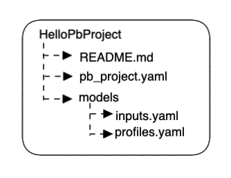

This guide walks you through RudderStack's **Profiles** feature. It lets you build a unified customer profile from all the cross-platform data residing in your warehouse.

## Introduction

Companies gather user data across various digital touchpoints like websites, mobile apps, enterprise systems like CRMs, marketing platforms, etc. A user is also identified with multiple identifiers across their product journey like their email ID, phone number, device ID, anonymous ID, account usernames. In addition, they might have multiple such identifiers as they often change their devices and use work and personal emails together.

All of this data is typically scattered across multiple tables within a warehouse in the form of hundreds or even thousands of rows and columns per user. **Profiles** is RudderStack's solution to tie all the user data from these tables into a unified view, giving you a 360-degree view of the user - often called as **Customer 360**.

<div class="infoBlock">
Customer 360 can be best represented as a table with one row per user, with bunch of features or attributes computed for that user.
</div>

## 10-step guide to using Profiles

To understand how the Profiles feature works, you will implement a use case by leveraging a sample dataset based on [RudderStack's ecommerce tracking plan](https://www.rudderstack.com/docs/event-spec/ecommerce-events-spec/). This data is available in Snowflake, which you can access by following the steps in this section. 

This section is divided into four parts:

- [Use case](#use-case)
- [Setup](#part-1-setup)
- [Setting up ID stitching](#part-2-setting-up-id-stitching)
- [Create customer 360 feature tables](#part-3-creating-feature-tables)

### Use case

You will create a simple Profiles project with the following capabilities:

- ID stitch `anonymous_id`, `user_id`, and `email` so that the user activity prior to signup can be tied to their post-signup activity. Also, connect different user IDs if they share the same email.
- Create the following features:

| Feature | Description |
| :-------| :------------|
| `n_active_days_total` | Number of days since the user first visited the app. |
| `orders_completed_in_past_365_days` | Number of orders completed in the past 365 days. |
|  `first_seen_date` | The date and time when the user was first seen, including their time as an anonymous user. |
| `campaign_source_first_touch` | Captured from the campaign data that is **automatically tracked** by RudderStack. |
| `avg_session_length_in_sec_last_7_days` | Average length of the user session. |

<div class="warningBlock">
This use case is a very basic demonstration of how you can use Profiles. You can add a lot more features with complex logic to explore its full capabilities.
</div>

### Part 1: Setup

1. Install the **Profile Builder (PB)** tool by running the following command:

```python
pip3 install profiles-rudderstack
```

<div class="infoBlock">
To install the PIP3 Python package manager - run the following commands:
<ol>
<li>Install Homebrew:</li>

<span>

```curl
/bin/bash -c "$(curl -fsSL https://raw.githubusercontent.com/Homebrew/install/HEAD/install.sh)""
```
</span>

<li>Install Python 3:</li>
<span>

```
brew install python3
```
</span>
</ol>
</div>

2. Set up a connection profile to connect to your data warehouse. To do so, go to your terminal and enter `pb init profile` and follow the prompts. A sample profile for a Snowflake account is shown below:

```
Enter profile_name: test
Enter target:  (default:dev):  # Just press enter, leaving it to default
Enter account: vmskhef-customer_sample_data
Enter warehouse: wh_guide
Enter dbname: profiles_sample
Enter schema: ecommerce_output
Enter user: CUSTOMER_ADMIN
Enter password: Admin890!
Enter role: sysadmin
Append to /Users/<user_name>/.pb/siteconfig.yaml? Specify 'yes' to confirm, anything else to deny.
yes
```

<div class="infoBlock">
<ul>
    <li>Use the name <code class="inline-code">test</code> in the CLI when asked for a profile name.</li>
    <li>You may see the last line only if you already have set up profiles earlier. Type <code class="inline-code">yes</code> in this case.</li>
</ul>
</div>

3. Run `pb init pb-project` to create a sample project in a folder called `HelloPbProject`. This folder is created automatically. To choose a custom folder name like `MyFirstProject`, run the following command:

```python
pb init pb-project -o MyFirstProject
```

The project folder contains three files with the below structure. These files are prefilled with some defaults that you need to modify.



### Part 2: Setting up ID stitching

4. In your project folder, go to the `pb_project.yaml` file. This file contains information like the project name, schema version, project entities, ID types, etc. Under `entities`, change the `id_stitcher` name from `models/domain_profile_id_stitcher` to `models/user_id_stitcher`. This is the name of the table that is created in the warehouse.

<div class="infoBlock">
In the <code class="inline-code">pb_project.yaml</code> file, <code class="inline-code">entities</code> and <code class="inline-code">id_types</code> are very important. <strong>All the features are computed at an entity level</strong>. A user is one of the most common entities. To treat multiple users within an organization as a single entity, you can set the entity <code class="inline-code">name</code> to <code class="inline-code">organization</code>. Also, an entity can have multple identifiers like email, phone number, user ID, etc. All these identifiers are listed under <code class="inline-code">id_types</code>.
</div>

5. Check the `inputs.yaml` file as shown below (some lines are hidden). It outlines how to obtain the values for the model from the various tables. Rename the `identifies` table by replacing `rudder_events_production.web.identifies` with `profiles_sample.ecommerce.identifies`. Similarly, rename the `tracks` table by replacing `rudder_events_production.web.tracks` with `profiles_sample.ecommerce.tracks`. These names point to the test tables that you can access.

<div class="infoBlock">
Leave the rest of the file unchanged. However, if you want to add any new identifier for ID stitching or add any new tables to the project, you can do so here.
</div>


6. Next, go to the `profiles.yaml` file where the models are defined. You will find two models here - `id_stitcher` and `feature_table_model`. For ID stitching, retain only the first model (`model_type: id_stitcher`) and **comment out the second model** (`model_type: feature_table_model`). Also, rename the `name` field from `domain_profile_id_stitcher` to `user_id_stitcher` as defined in **Step 4**. 

<div class="infoBlock">
It is important to rename the <code class="inline-code">name</code> field to the entity name set in <strong>Step 4</strong>. In doing so, you link the ID stitcher in the <code class="inline-code">pb_project.yaml</code> file to the model spec in <code class="inline-code">profiles.yaml</code>.
</div>

7. At this point, the ID stitching is complete. Go to the terminal and run the following command.

```python
pb run
```

The execution should take about one to two minutes. Once completed, two things happen:

- A SQL file gets written in the `output/dev/seq_no` folder.
- This SQL is run on the warehouse and a table gets created. Also, the table name is shown in the terminal. An example output is shown below: 

```
2023/01/27 16:19:24 Material Material_user_id_stitcher_27c35415_6 ran in 18.862061136s.
``` 

In the above example, the **table name** is `Material_user_id_stitcher_27c35415_6`, where:
- `Material` is a common prefix.
- `user_id_stitcher` is the name defined in Steps 4 and 6.
- `27c35415_6` is a suffix generated by the Profile Builder tool. Ignore this suffix for now.

8. Head over to your warehouse using the credentials defined in [Step 2](#part-1-setup) to see the actual table. Run the following query after replacing <table_name> with the table name from your CLI output:

```sql
SELECT * FROM PROFILES_SAMPLE.ECOMMERCE_OUTPUT.<table_name> ORDER BY main_id, other_id ASC
```

You will get the following result:


You can see that five distinct **MAIN_ID** are created, each representing an actual user. Also, **user4** and **user5** have the same **MAIN_ID** as they share the same email - highlighting successful ID stitching.

### Part 3: Creating feature tables

In this section, you will define the features mentioned in the [use case](#use-case). For this, you need to modify the `feature_table_model` model in the `profiles.yaml` file of your project folder.

9. Uncomment the lines you commented out in <Link to="#part-2-setting-up-id-stitching">Step 6</Link> and modify the `name` from `domain_profile` to `user_profile`. Similar to `user_id_stitcher`, this is the name of the output table that will be created in the warehouse. Also, delete all the information present in the `vars` key - as you will <Link to="#feature-definitions">write your own features</Link> instead.

<div class="infoBlock">
You will write the features in the <code class="inline-code">entityvars</code> field. It is considered as a declarative form of SQL to define the features.
</div>

You can define the features as follows:

- `n_active_days_total`: This is a count of the distinct active days (when the user visited the app). The presence of a `tracks` event is a good indicator for this as every user visit triggers some events from the customer. This feature is defined as follows:

```yaml
vars:
  - entityvar:
		name: n_active_days_total # Alias for the temp feature
        select: count(distinct(date(timestamp))) # SQL function to first convert timestamp to date, then count the distinct dates
		from: inputs/rsTracks # Refering to the tracks table defined in the inputs.yaml file
		description: Optional field describing the feature. It gets stored as feature metadata.
features:
  # This block is required to declare that the feature needs to be stored in feature table. 
  # Often, we may want entityvars that are temp features, which are not required later (see below). 
  # Such vars are not added to the features list.
	- n_active_days_total
```

- `orders_completed_in_past_365_days`: This feature computes the distinct orders completed in the past 365 days. Often, you may want to apply some filters to the table; you can do so with a `where` clause, as shown:

```yaml
vars:
  - entityvar:
	    name: orders_completed_in_past_365_days # Alias for the temp feature
        select: count( * ) # The SQL function to count all rows from tracks table where event_type = 'order_completed' (see below); If there's an order_id field, you can also use count(distinct order_id) to prevent any duplicate records related to same order
		from: inputs/rsTracks # Refering to the tracks table defined in inputs.yaml file
        where: event = 'order_completed' and datediff(day, date(timestamp), current_date()) <= 365
		description: Optional field describing the feature.
features:
	- orders_completed_in_past_365_days
```

<div class="warningBlock">
This feature would be a continuation to the <code class="inline-code">vars</code> block mentioned above; the <code class="inline-code">vars</code> key need not repeat again. The same applies to all the features described below.
</div>

- `first_seen_date`: Takes the earliest timestamp from both `tracks` and `identifies`. To do so, select both of these separately tables and then take the earliest value, as shown:

```yaml
vars:
  - entityvar:
        name: first_seen_tracks # Alias for the temp feature
	    select: min(timestamp) # The SQL function to get oldest timestamp from the tracks table
        from: inputs/rsTracks # Refering to the tracks table defined in inputs.yaml file
		description: Optional field describing the feature.
  - entityvar: # The prev block is repeated with identifies table as source
        name: first_seen_identifies
		select: min(timestamp)
        from: inputs/rsIdentifies
		description: First seen timestamp from identifies table; This is an optional field.
  - entityvar: # Once min timestamps from both tracks and identifies are defined, we pick the earliest timestamp of both here.
	    # The prev two are temp features used to derive this feature. 
        # In the profiles.yaml file, we can also see an attribute called features; 
        # We declare this name as a feature, so it doesn't get deleted and is stored in final feature table
        name: first_seen_date # This is the name with which the feature gets stored
		select: to_date(least(first_seen_tracks, first_seen_identifies)) # It uses the names we defined in above entityvars, and performs sql operations ot get lowest value of these
features:
   - first_seen_date   # Ensures that the feature is stored in the final table (unlike first_seen_tracks or first_seen_identifies)
```

- `campaign_source_first_touch`: From the `identifies` table, picks the earliest available `campaign_source`. Sometimes, the first touch may be organic (null source) but the same user may arrive later through a campaign. In such cases, it is desirable to capture the first non-organic touch. For this, you can filter out the empty rows through a `where` operator, as shown:


```yaml
vars:
	- entityvar:
		    name: campaign_source_first_touch # Name of the feature
		    select: first_value(context_campaign_source) # Window functions are supported in entityvars, as long as the value is unique for a given user id (ex: first_value, min, max etc - unlike rank, row_number etc); 
		    window: 
				# All the window functions in entityvars are partitioned by main_id by default. It can take only order_by as a parameter.
				order_by:
					# In this example, we take the oldest occurence of the campaign source, so we sort the rows by timestamp in ascending order
					- timestamp asc
			from: inputs/rsIdentifies
			where: context_campaign_source is not null and context_campaign_source != '' # We can filter rows with a where condition.  In this case, we ignore all rows where the campaign source is null or blank - to ensure we ignore organic visits
features:
  - campaign_source_first_touch  
```

- `avg_session_length_in_sec_last_7_days`: RudderStack captures a `session_id` and a `session_start_time` by default in the `page` and `track` calls. You can use this `session_id` to compute each session length and their average. 

To add a time-bounded feature, for example, only the sessions in the past one week, `entityvar` is not sufficient. The output of `entityvar` is assumed to be a single row per `user_id` / `main_id`. However, for calculating the average session length, you need to compute session length for each session, followed by averaging it across all the sessions. To do so, you can use `inputvar`. In `inputvar`, you can apply transformations on (a copy of) the input table itself, where row-level modifications are possible. You can also use the window functions with arbitrary `partition_by` clauses too, as shown:


```yaml
vars:
  - inputvar:
      name: session_start_time
			select: min(timestamp)
			window:
				partition_by:
					- session_id # Partition on session_id, or any other key than main_id wouldn't have been possible in entityvar
					- main_id # inputvars do not make any assumptions around main_id being the primary key of the table, hence this needs to be given in partition by if required.
			from: inputs/rsTracks
  - inputvar:
      name: session_end_time
			select: max(timestamp)
			window:
				partition_by:
					- session_id
					- main_id
			from: inputs/rsTracks
  - inputvar:
      name: session_length
			select: datediff(second, session_start_time, session_end_time)
			from: inputs/rsTracks
	- entityvar:
      # This is the final query
			name: avg_session_length_in_sec_last_7_days
			select: avg(session_length)
			from: inputs/rsTracks
			where: datediff(day, date(session_start_time), current_date()) <= 7
features:
	- avg_session_length_in_sec_last_7_days
```

Once you define all the features, the `profiles.yaml` file should look something like below:

```yaml
# This is a sample file, for detailed reference see: https://rudderlabs.github.io/pywht/

models:
  - name: user_id_stitcher
    model_type: id_stitcher
    model_spec:
      validity_time: 24h # 1 day
      entity_key: user
      main_id_type: main_id
      edge_sources:
        - inputs/rsIdentifies
        - inputs/rsTracks

# Remove the section below, if you don't want to generate a feature table

  - name: user_profile
    model_type: feature_table_model
    model_spec:
      validity_time: 24h # 1 day
      entity_key: user
      vars:
        - entityvar:
            name: n_active_days_total # Alias for the temp fature
            select: count(distinct(date(timestamp))) # The sql function to first convert timestamp to date, then count distinct dates
            from: inputs/rsTracks # Refering to the tracks table defined in inputs.yaml file
            description: This is an optional field, describing the feature. It gets stored as feature metadata

        - entityvar:
            name: orders_completed_in_past_365_days # Alias for the temp fature
            select: count( * ) # The sql function to count all rows from tracks table where event_type = 'order_completed' (see below); If there's an order_id field, you can also use count(distinct order_id) to prevent any duplicate records related to same order
            from: inputs/rsTracks # Refering to the tracks table defined in inputs.yaml file
            where: event = 'order_completed' and datediff(day, date(timestamp), current_date()) <= 365
            description: This is an optional field, describing the feature. It gets stored as feature metadata

        - entityvar:
            name: first_seen_tracks # Alias for the temp fature
            select: min(timestamp) # The sql function to get oldest timestamp from tracks table
            from: inputs/rsTracks # Refering to the tracks table defined in inputs.yaml file
            description: This is an optional field, describing the feature. 
        - entityvar: # The prev block is repeated with identifies table as source
            name: first_seen_identifies
            select: min(timestamp)
            from: inputs/rsIdentifies
            description: First seen timestamp from identifies table; This is optional field, only for documentation
        - entityvar: # Once min timestamps from both tracks and identifies is defined, we pick the earliest timestamp of both here
            # The prev two are temp features used to derive this feature. 
            # In the profiles.yaml file, we can also see an attribute called features; 
            # We declare this name as a feature, so it doesn't get deleted and is stored in final feature table
            name: first_seen_date # This is the name with which the feature gets stored
            select: to_date(least(first_seen_tracks, first_seen_identifies)) # It uses the names we defined in above entityvars, and performs sql operations ot get lowest value of these            

        - entityvar:
            name: campaign_source_first_touch # Name of the feature
            select: first_value(context_campaign_source) # Window functions are supported in entityvars, as long as the value is unique for a given user id (ex: first_value, min, max etc - unlike rank, row_number etc); 
            window: 
              # All window functions in entityvars are partitioned by main_id by default. It can take only order_by as parameter
              order_by:
                # In this example, we take the oldest occurence of the campaign source, so we sort the rows by timestamp in asc order
                - timestamp asc
            from: inputs/rsIdentifies
            where: context_campaign_source is not null and context_campaign_source != '' # We can filter rows with a where condition.  In this case, we ignore all rows where the campaign source is null or blank - to ensure we ignore organic visits
        - inputvar:
            name: session_start_time
            select: min(timestamp)
            window:
              partition_by:
                - session_id # Partition on session_id, or any other key than main_id wouldn't have been possible in entityvar
                - main_id # inputvars do not make any assumptions around main_id being the primary key of the table, hence this needs to be given in partition by if required.
            from: inputs/rsTracks
        - inputvar:
            name: session_end_time
            select: max(timestamp)
            window:
              partition_by:
                - session_id
                - main_id
            from: inputs/rsTracks
        - inputvar:
            name: session_length
            select: datediff(second, session_start_time, session_end_time)
            from: inputs/rsTracks
        - entityvar:
            # This is the final query
            name: avg_session_length_in_sec_last_7_days
            select: avg(session_length)
            from: inputs/rsTracks
            where: datediff(day, date(session_start_time), current_date()) <= 7

      features:
        - n_active_days_total   
        - orders_completed_in_past_365_days
        - first_seen_date # Ensures that feature is stored in the final table (unlike first_seen_tracks or first_seen_identifies)
        - campaign_source_first_touch
        - avg_session_length_in_sec_last_7_days
```

10. Run the command `pb run` from your terminal. In a few minutes, you should be able to see a similar output as <Link to="#part-2-setting-up-id-stitching">Step 7</Link>. However, you will get two SQL files this time - one for the ID stitcher and feature table respectively. 

<div class="infoBlock">
These files are created in a new folder and are present for debugging purposes. You can check the queries to understand what is happening behind the scenes.
</div>

You should now see two tables created in your warehouse. The CLI output will look something like the following:

```
2023/01/27 21:10:39 Material Material_user_id_stitcher_27c35415_7 ran in 20.173565021s
2023/01/27 21:11:11 Material Material_user_profile_ac394282_7 ran in 26.993571473s
```

This output confirms successful completion of the job. You can now verify the tables in your warehouse.

Each `pb run` command creates a new table of all the available models with a hash suffix. Also, the Profile Builder tool creates a snapshot of the latest run with just the names given for the models - `user_id_stitcher` and `user_profile` in this case. This ensures that the names are more predictable for using them in any downstream application without worrying about the latest created table suffix. 

The feature table output is shown below:


In the above image, you can see that 5 rows are created - one per `main_id`. For each row, all the five features are created with their values computed and filled in. There is one more column `valid_at` indicating when the feature was computed.