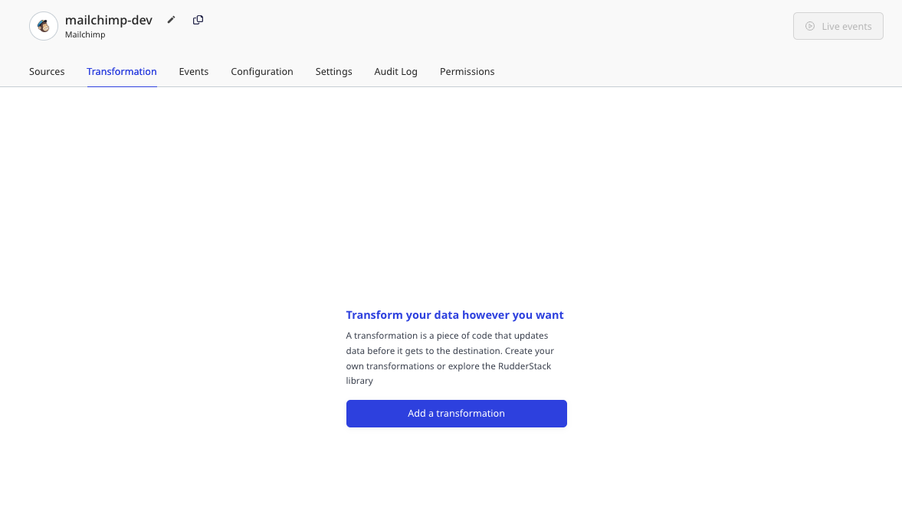
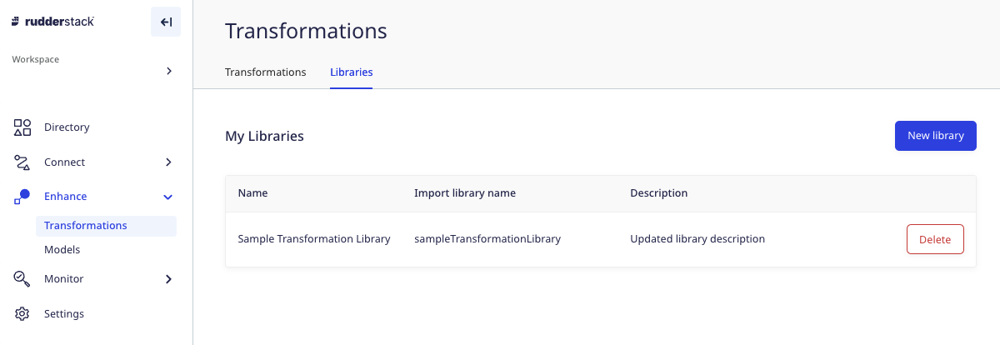
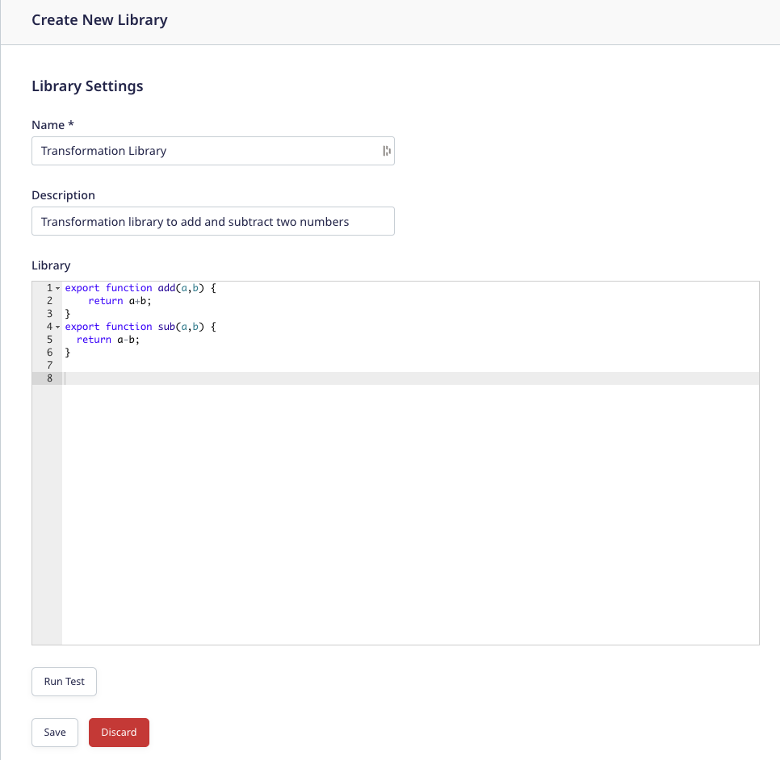

Transformations is one of RudderStack's key features. It gives you the ability to code custom JavaScript functions to implement specific use-cases on your event data, like:

- Filtering/sampling events.
- Enriching events by implementing static logic or leveraging an external API.
- Cleaning/aggregating data.
- Data masking or removing sensitive PII information in the events to ensure data privacy.
- Implementing external actions on the events using an API.

<div class="successBlock">
Transformations can be used across your <Link to="/sources/event-streams/cloud-apps/">Cloud Apps</Link>, <Link to="/sources/reverse-etl/">Reverse ETL</Link> and <Link to="/sources/extract/">Cloud Extract</Link> pipelines.
</div>

<div class="successBlock">
You can refer to our <a href="https://github.com/rudderlabs/sample-user-transformers">Sample Transformations</a> GitHub repository for some useful templates that you can use to create your own transformations.
</div>

<div class="warningBlock">
Transformations only work for the Cloud mode destinations.

To know more about the Cloud mode in RudderStack, check out the <Link to="/destinations/rudderstack-connection-modes/">RudderStack Connection Modes</Link> guide.
</div>

## Adding a transformation

To add a new transformation in the RudderStack dashboard, follow these steps:

1. Log into your [RudderStack dashboard](https://app.rudderstack.com/).
2. Go to **Enhance** > **Transformations**, as shown:


3. Click **New Transformation**.
4. Add a name for your transformation and an optional description.
5. Next, add your JavaScript function in the **Transformation** window, as shown:


<div class="successBlock">
You can also add other functions and call them from within <code class="inline-code">transformEvent</code>.
</div>

<div class="infoBlock">
Refer to the <a href="https://github.com/rudderlabs/sample-user-transformers">Sample User Transformations</a> GitHub repository for some useful templates that you can use to create your own transformations.
</div>

<div class="warningBlock">
Remember to delete the pre-populated <code class="inline-code">transformEvent</code> function before adding or pasting your transformation code.
</div>

6. To test your transformation on a sample event, click **Run Test**. RudderStack provides some sample events for you test if your transformation logic works as expected.


7. To save the transformation, click **Save**.

## Connecting transformation to a destination

You can connect a transformation to a destination in two cases:

### Case 1: While setting up a new destination

RudderStack gives you the option to add a transformation while setting up a destination, as shown:


### Case 2: Connecting to an existing destination

To add a transformation to an existing destination, follow these steps:

1. Go to the **Transformation** tab in your destination dashboard and click **Add a transformation**, as shown:



2. Then, choose the transformation to you want to connect to the destination.


## `transformEvent` definition

RudderStack applies the `transformEvent` function on each event and takes two inputs:
- `event`: This corresponds to the input event
- `metadata`: This is an **optional** input corresponding to the JavaScript function which you can use to access the metadata of the given event.

<div class="infoBlock">
For more information on <code class="inline-code">metadata</code>, refer to the <Link to="#accessing-event-metadata">Accessing metadata</Link> section below.
</div>

After the transformation is complete, `transformEvent` returns the final event to be sent to the destination.

## Using `transformBatch` instead of `transformEvent`

In cases where you want to perform any aggregation or roll-up operation on a micro batch of events, you can use the `transformBatch` function instead of `transformEvent`, as shown:

```javascript
export function transformBatch(events, metadata) {
    return events;
}
```

<div class="dangerBlock">
If you are using <code class="inline-code">transformBatch</code> and want to ensure event ordering, make sure you pass on the <code class="inline-code">messageId</code> from the input event to the output event. Without the <code class="inline-code">messageId</code>, there is a strong possibility that RudderStack will <strong>not</strong> maintain the event ordering.
</div>

<div class="warningBlock">
It is highly recommended to use <code class="inline-code">transformEvent</code> as much as possible, as it ensures event ordering in any case.
</div>

## Libraries

One of the key features of RudderStack Transformations is the ability to reuse the code written for a transformation in other transformations using the **Libraries** feature.

To add a new library, follow these steps:

1. In your RudderStack dashboard, go to **Enhance** > **Transformations** and click the **Libraries** tab, as shown:



2. Click **New library**.
3. Add the library **Name**, **Description** and write the function you want to reuse across different transformations.
4. You can also add multiple functions in a single library, as shown:



<div class="warningBlock">
Currently, RudderStack does not support deletion of libraries. This is to ensure that any existing transformations using the libraries do not break.
</div>

5. Click **Run Test** to ensure the code included in the library has the correct syntax.

## Using libraries in transformations

To use the libraries in your existing transformation, simply take the name of your library and convert it into **camel case without spaces** - this becomes your library handle.

For example, if your library name is **`is rudder email`**, then the library handle would be **`isRudderEmail`**.


Let's say you want to import a function called **`rudderEmail`**, which returns `true` for the emails from a specific domain \(e.g. RudderStack\) and `false` otherwise, from the **`is rudder email`** library. Also, you want to use this function to filter the events that don't have the email address of the specified domain.

The following code snippet demonstrates how we can implement this use-case:

```javascript
import { rudderEmail } from "isRudderEmail";
export function transformEvent(event) {
  const email =
    event.context && event.context.traits && event.context.traits.email;
  if (email) {
    if (!rudderEmail(email)) return;
  }
  return event;
}
```

On running a test, an example event not having the specified email domain is filtered out, as shown:


### Importing multiple functions from a single library

When importing a single function or multiple functions from a library, it is important to keep the import statement to one line. Breaking the import function into multiple lines will lead to an error.

The following snippets highlight how to properly import functions from a library:

```javascript
// Correct Way
// ---------------
import { getLoss } from "getFinanceData";

// OR

import { getLoss, getRevenue, getProfit } from "getFinanceData";
import {
  getLoss,
  getRevenue,
  getProfit
} from "getFinanceData";

// For default getPrice import
import getPrice, { getRevenue, getProfit } from "getFinanceData";

// alias imports
import getPrice as gp, { getRevenue as gr, getProfit } from "getFinanceData";
// usuage: gp(event), gr(event), getProfit(ev)

import * as GFD from "getFinanceData";
// usuage: GFD.getRevenue(ev), GFD.getProfit(ev)
// for default import: GFD.default(ev)
```

```javascript
// Incorrect Way
// -----------------
import * from "getFinanceData";

// OR

import getPrice as gp from "getFinanceData";
getPrice(ev)
```

## Accessing event metadata

RudderStack injects a function `metadata(event)` into your transformations as an argument. This allows you to access the event metadata variables that help you customize your transformations.

<div class="infoBlock">
<code class="inline-code">metadata()</code> takes the event as the input and returns the metadata of the event.
</div>

The following properties, if available, are present in the metadata response:

| Property   | Description       |
| :-------------- | :------------------------- |
| `sourceId`      | The ID of the source configured in your RudderStack dashboard. Note that it is different from the <Link to="/dashboard-guides/sources/#what-is-a-write-key-why-is-it-required">source write key</Link>. |
| `destinationId` | The ID of the destination configured in your RudderStack dashboard.           |
| `messageId`     | The unique ID for each event.            |
| `sessionId`     | The ID associated with a session. This is applicable only if sessions are enabled.    |

Since you may not need the event metadata in every transformation, you can include it as an **optional argument** in your function signature whenever required.

An example of using `metadata` is shown below:

```javascript
export function transformEvent(event, metadata) {
  const meta = metadata(event);
  event.sourceId = meta.sourceId;

  return event;
}
```

## External API requests

You can make any number of external API requests in your transformation functions and use the response to enrich your events data. RudderStack injects an asynchronous `fetch(url)` function into your transformations. It makes an API call to the given URL and returns the response in a JSON format.

An example of how to use the `fetch` function in transformations is shown below:

```javascript
export async function transformEvent(event, metadata) {
  const res = await fetch("post_url", {
    method: "POST", // POST, PUT, DELETE, GET, etc.
    headers: {
      "Content-Type": "application/json;charset=UTF-8",
      Authorization: "Bearer <your_authorization_token>"
    },
    body: JSON.stringify(event)
  });
  event.response = JSON.stringify(res);
  return event;
}
```

<div class="successBlock">
To see how this feature is used in more detail, refer to the <a href="https://github.com/rudderlabs/sample-user-transformers/blob/sampleTransformationV1/EnrichWithClearbit.js">Clearbit enrichment example</a> which uses the <code class="inline-code">fetch</code> function.
</div>

<div class="infoBlock">
For improved performance, we recommend using <code class="inline-code">batch</code> API requests instead of a separate API request for each event whenever possible.
</div>

### FetchV2

FetchV2 is a wrapper around the `fetch` call to provide more access to fetch the response properties.

The following properties are present in a `fetchV2` response:

| Property Name   | Description  |
| :-------------- | :----------- |
| `status`      | Status code of fetch response, e.g. `200`.|
| `url` | URL of the Fetch API.   |
| `headers`     | Response headers   |
| `body`     | Response body in JSON or TEXT. By default, it is JSON. |

<div class="infoBlock">
Use the <code class="inline-code">try-catch</code> block to capture the cause for failures during the <code class="inline-code">fetch</code> call, e.g. when a timeout is applied.
</div>

An example of how to use the `fetchV2` function in RudderStack transformations is shown below:
  
```javascript
export async function transformEvent(event) {
  try {
    const res = await fetchV2("url", { timeout: 1000});
    if (res.status == 200) {
      event.response = JSON.stringify(res.body);
    }
  } catch (err) {
    log(err.message);
  }
  return event;
}
```
  
## Debugging with logs

RudderStack enables you to access any event-related information in the form of logs while running a test on your transformation. You can do this by including the `log` function in your transformation code. 

An example of using the `log` function is shown below:

```javascript
export function transformEvent(event, metadata) {
  const meta = metadata(event);
  event.sourceId = meta.sourceId;

  log("Event Name is", event.event, ";", "Message ID is", event.messageId);
  log("Source ID is", meta.sourceId);

  return event;
}
```

On adding the above transformation and clicking **Run Test**, you can see the resulting log in the **Logs** section of the dashboard, as shown:


<div class="infoBlock">
You can pass a string, number, or an object as an argument to the <code class="inline-code">log</code> function.
</div>

## Limits

You should take into account the memory and time limits when adding a new transformation. Each transformation invocation should not exceed the following limits:

| Parameter    | Limit     |
| :----------- | :-------- |
| Memory limit | 8 MB      |
| Time limit   | 4 seconds |

<div class="dangerBlock">
The user transformation fails if these limits are exceeded.
</div>

## FAQ

## Why do I need to use RudderStack's Transformations feature?

RudderStack's Transformations feature lets you transform the events collected from a source into a destination-specific format. Some key benefits of this feature are:

- These transformations can be applied to your in-transit events, in real-time.
- You can implement specific use-cases depending on your business requirements using this feature. Some examples include PII masking, event filtering based on specific criteria, aggregating and enriching events, and so on.
- They're easier to build and manage, and can be reused as well.

<div class="successBlock">
Read more about why your data pipeline needs to have an efficient event transformations capability in our <a href="https://rudderstack.com/blog/the-future-of-data-pipeline-tools-must-include-better-transformations-than-etl-ever-had">blog</a>.
</div>

## I used to write transformations like `function transform(events) {}`. Why am I not able to create new transformations this way?

We have changed the way transformations are written. RudderStack now supports writing functions that transform a single event instead of a batch of events. You can now define your transformation in the following manner:

`export function transformEvent(event, metadata) {}`

## I want to write a transformation that can be applied to a small batch of events. Can I not do this anymore?

You can. Simply define your transformation in the following manner:

`export function transformBatch(events, metadata) {}`

<div class="warningBlock">
This can cause a loss of the event metadata that RudderStack uses internally to maintain event ordering for you.
</div>

## I cannot import libraries into my existing transformations. What do I do?

Previously created transformations shown as `Version: V0` don't support libraries. If you want to use libraries, please create a new transformation with `Version: V1` that support libraries. You can then reconnect your destinations with this new transformation that you have created.

## I want to update my existing version v0 transformation code to version v1. What do I do?

You cannot update transformation `Version: V0` directly to `Version: V1`. Please create a new transformation with updated code `Version: V1`. You can then reconnect your destinations with this new transformation that you have created and delete existing `Version: V0` transformation.


