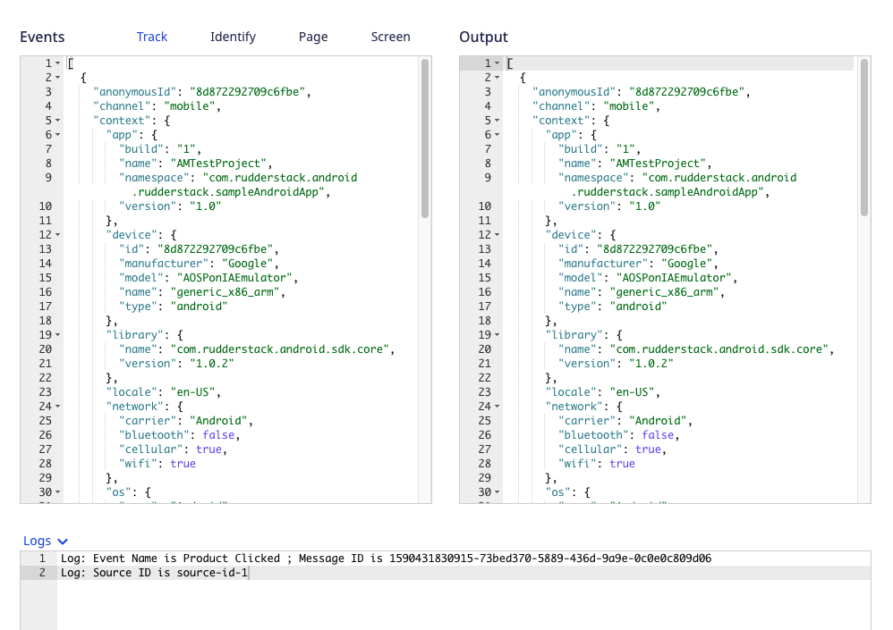

## How do transformations work?

At a high level, once you <Link to="#adding-a-transformation">add a transformation</Link> and connect it to a destination, RudderStack:

1. Tracks and collects events at the source
1. Applies the transformation logic to the your events
1. Forwards the transformed event to your connected destination


<div class="infoBlock">
Refer to the <Link to="/features/transformations/faq/">Transformations FAQ</Link> for commonly asked questions on this feature.
</div>


### Debugging with logs

RudderStack enables you to capture any event-related information in the form of logs while running a test on your transformation. You can do this by including the `log` function in your transformation code. 

An example of using the `log` function is shown below:

```javascript
export function transformEvent(event, metadata) {
  const meta = metadata(event);
  event.sourceId = meta.sourceId;

  log("Event Name is", event.event, ";", "Message ID is", event.messageId);
  log("Source ID is", meta.sourceId);

  return event;
}
```

On adding the above transformation and clicking **Run Test**, you can see the resulting log in the **Logs** section of the dashboard, as shown:



<div class="infoBlock">
You can pass a string, number, or an object as an argument to the <code class="inline-code">log</code> function.
</div>


## Applying transformation on a batch of events

You can also perform any aggregation or roll-up operation on a batch of events using the `transformBatch` function instead of `transformEvent`, as shown:

```javascript
export function transformBatch(events, metadata) {
    return events;
}
```

<div class="dangerBlock">
If you want to ensure event ordering while using <code class="inline-code">transformBatch</code>, make sure you pass the <code class="inline-code">messageId</code> from the input event to the output event. Without the <code class="inline-code">messageId</code>, RudderStack will <strong>not</strong> guarantee the event ordering. It is highly recommended to use <code class="inline-code">transformEvent</code> as much as possible, as it ensures event ordering.
</div>