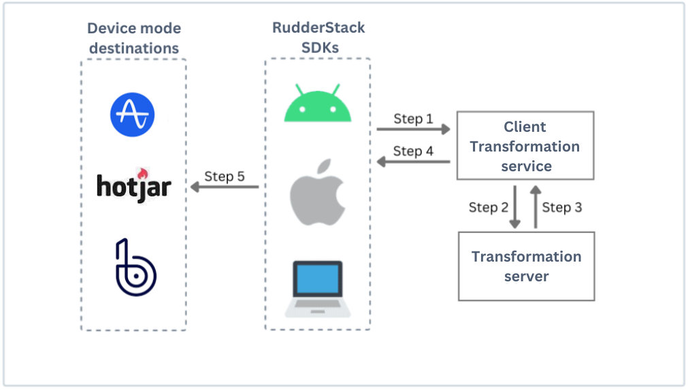

RudderStack's Device Mode Transformations feature enables you to use the powerful user transformations with the [device mode-only destinations](https://github.com/rudderlabs/rudder-sdk-js/tree/production/integrations), for example, Firebase, Hotjar, etc.

Using this feature, you can enrich the event data using your custom logic. Moreover, it provides an easier way to filter out the events to get rid of the bad data, sample events to reduce costs to some destinations, and many more interesting use cases. To learn more about the use cases, refer to the <Link to="/features/transformations/#use-case">Use case</Link> section.

<div class="warningBlock">
Only the <Link to="/sources/event-streams/sdks/rudderstack-android-sdk/">Android</Link>, <Link to="/sources/event-streams/sdks/rudderstack-ios-sdk/">iOS</Link>, and <Link to="/sources/event-streams/sdks/rudderstack-javascript-sdk/">JavaScript</Link>  SDKs support the Transformations feature to send events to the <Link to="/destinations/rudderstack-connection-modes/#device-mode">device mode</Link> destinations.
</div>

<GhBadge
  url={'https://rudderstack.com/enterprise-quote'}
  label={'Plan'}
  message={'Enterprise'}
  color={'blueviolet'}
  logo={'github'}
/>
<GhBadge
  label={'Stability'}
  message={'Beta'}
  color={'blueviolet'}
  logo={'github'}
/>

## Client Transformation service architecture

RudderStack provides the Client Transformation service to facilitate the Transformations feature for device mode destinations. It ensures that the event ingestion to RudderStack backend isn't affected, assuring minimum response time from the RudderStack backend.



When you <Link to="#adding-a-transformation">add a transformation</Link> and connect it to a destination supporting the <Link to="/destinations/rudderstack-connection-modes/#device-mode">device mode</Link>, the following steps are performed:

1. RudderStack SDK sends the event to the Client Transformation service. It multiplexes the event for different destinations and connects with the transformations attached to these device mode destinations.
2. Client Transformation service sends the event to the RudderStack Transformation service to transform the event according to the functions defined in the attached transformations.
3. After the transformation is applied, the transformed event is returned to the Client Transformation service.
4. Client Transformation service responds to the SDK with the transformed events for all the destinations.
5. Finally, the SDK parses the transformed events and forwards them to the specified device-mode destinations.

## SDK setup

After <Link to="#adding-a-transformation">adding a transformation</Link> and <Link to="/features/transformations/#connecting-transformation-to-a-destination">connecting it to a destination</Link> supporting device mode, you can connect your SDK source to it.

Further, follow the below steps for setting up the required SDK:

<Tabs>
  <TabList>
    <Tab>JavaScript</Tab>
    <Tab>Android</Tab>
    <Tab>iOS</Tab>
  </TabList>
    <TabPanels>
      <TabPanel>

The detailed steps to setup the JavaScript SDK are mentioned in the <Link to="/sources/event-streams/sdks/rudderstack-javascript-sdk/quick-start-guide/">Quickstart guide</Link>. You need to change the CDN URL in the SDK installation snippet to: <code class="inline-code">https://cdn.rudderlabs.com/v1.1/beta/dmt/v1/rudder-analytics.min.js</code>

Alternatively, you can use the following snippet with the updated URL:

<span>

```javascript
<script type="text/javascript">
!function(){var e=window.rudderanalytics=window.rudderanalytics||[];e.methods=["load","page","track","identify","alias","group","ready","reset","getAnonymousId","setAnonymousId","getUserId","getUserTraits","getGroupId","getGroupTraits","startSession","endSession","getSessionId"],e.factory=function(t){return function(){e.push([t].concat(Array.prototype.slice.call(arguments)))}};for(var t=0;t<e.methods.length;t++){var r=e.methods[t];e[r]=e.factory(r)}e.loadJS=function(e,t){var r=document.createElement("script");r.type="text/javascript",r.async=!0,r.src="https://cdn.rudderlabs.com/v1.1/beta/dmt/v1/rudder-analytics.min.js";var a=document.getElementsByTagName("script")[0];a.parentNode.insertBefore(r,a)},e.loadJS(),
e.load(<WRITE_KEY>,<DATA_PLANE_URL>),
e.page()}();
</script>
```
</span>

</TabPanel>
<TabPanel>

<div class="infoBlock">
Device mode transformations are supported in <strong>Android SDK v1.8.0 and above</strong>.
</div>

Install the Android SDK following the detailed steps mentioned in <Link to="/sources/event-streams/sdks/rudderstack-android-sdk/#installing-the-sdk">Installing the Android SDK</Link> section. Additionally, use the following dependency in the Android app level <code class="inline-code">build.gradle</code>:
<span>

```groovy
implementation 'com.rudderstack.android.sdk:core:1.8.0-beta.1'
```
</span>
    </TabPanel>
<TabPanel>

<div class="infoBlock">
Device mode transformations are supported in <strong>iOS SDK v1.8.0 and above</strong>.
</div>

Install the iOS SDK following the detailed steps mentioned in <Link to="/sources/event-streams/sdks/rudderstack-ios-sdk/#installing-the-rudderstack-ios-sdk">Installing the iOS SDK</Link> section. Additionally, use the following dependency in <code class="inline-code">Podfile</code>:
<span>

```ruby
pod 'Rudder', '1.8.0.beta.1'
```
</span>
      </TabPanel>
    </TabPanels>
</Tabs>

## Limitations

The following limitations are applicable when invoking a transformation in device mode:

- The network unavailability can lead to higher latency than expected while sending the events to the destinations. RudderStack doesn't lose data due to the network loss and stores the events in the client device until those are successfully delivered to the destination.

- The iOS SDK does not support the background processing of an event when the app is closed. However, the pending events are sent the next time the app is opened.

- The following memory and time limits must be followed:

    | Parameter    | Limit     |
    | :----------- | :-------- |
    | Memory limit | 128 MB      |
    | Execution time limit   | 4 seconds |

