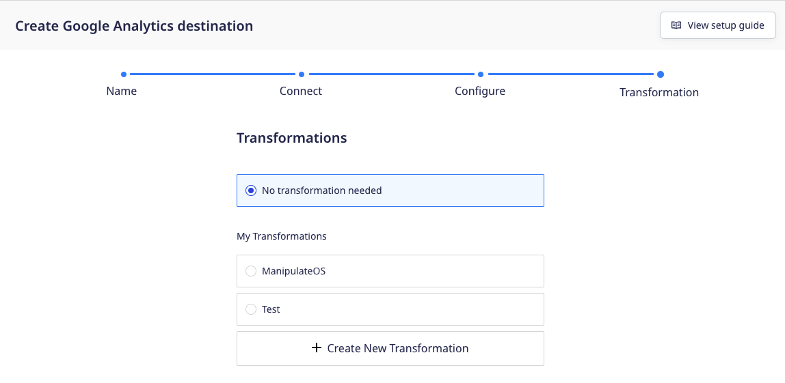
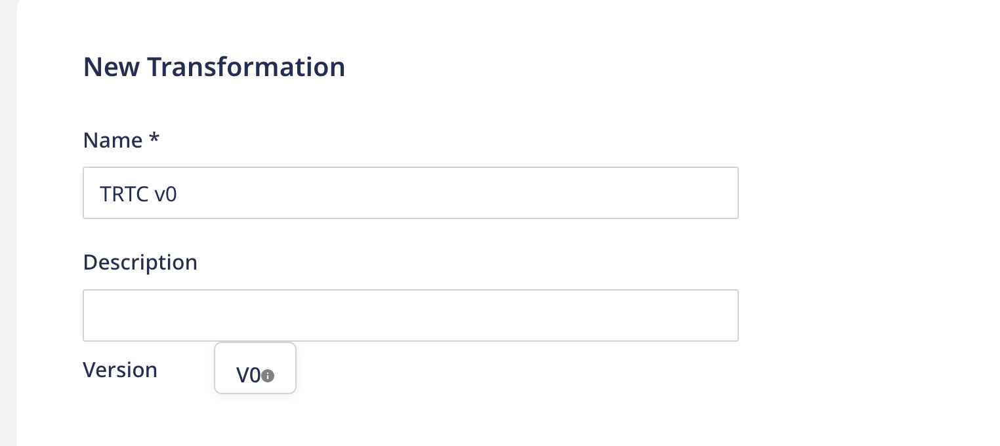

## Transformations

#### Are there any sample user transformations I can refer to?

Yes, you can refer to the [Sample RudderStack Transformations](https://github.com/rudderlabs/sample-user-transformers) GitHub repository.

#### Is the transformation connected to a source or destination?

A transformation is always connected to a destination. RudderStack gives you the option to add a transformation while setting up a destination, as shown:



####  Can I connect multiple transformations to a destination?

No, it is not possible to connect multiple transformations to a destination. Instead, you can implement multiple use-cases in the same transformaƒtion, for example, event filtering followed by cleaning.

#### Can I write a transformation that can be applied to a small batch of events?

Yes, you can use the `transformBatch` function to apply a transformation to a batch of events.

<div class="infoBlock">
For more information, refer to the <Link to="/features/transformations/cloud-mode-transformations#applying-transformation-on-a-batch-of-events">Applying transformation on a batch of events</Link> section.
</div>

#### What is a referenced transformation?

If a library `L` is <Link to="/features/transformations/using-libraries">imported by the transformations</Link> `T1`, `T2`, and `T3`, then `T1`, `T2`, and `T3`are called the referenced transformations to `L`.

#### I used to write transformations like `function transform(events) {}`. Why am I not able to create new transformations this way?

By default, RudderStack supports writing functions that transform a single event instead of a batch of events. You can now define your transformation in the following manner:

```javascript
export function transformEvent(event, metadata) {
    return event;
}
```

#### Can I update my existing version v0 transformation code to the the latest version?

You cannot update an existing `Version: V0` transformation to the current version.

Instead, you can <Link to="/features/transformations/#adding-a-transformation">create a new transformation</Link> based on the <Link to="/features/transformations/#transformevent-function">`transformEvent` function</Link>, then reconnect your destinations with this transformation. Finally, delete the existing `Version: V0` transformation.

#### What are transformation and library revisions?

Using the <Link to ="/api/transformation-api/">Transformations API</Link>, you can create and store a transformation or library as a draft without publishing them. These are called revisions.

Once the revisions meet the test criteria, you can restore and publish them for production use.

## Device mode transformations

#### While sending events in device mode, how should I choose between event filtering and transformations?

You can choose any based on your requirements:

- **<Link to="/sources/event-streams/sdks/event-filtering/">Event filtering</Link>**: When you just want to filter out the events based on the event names. The event filtering takes place within the SDK and is **only applicable** for the `track` events.
- **Transformations**: Transformations is a generic feature which can be used to manipulate the events, mask data, enrich events, implement specific actions on events. It involves a call to an external RudderStack service.

In case you plan to use both the above-mentioned features, your events will be filtered (based on the <Link to="/sources/event-streams/sdks/event-filtering/">event filtering</Link> settings in the RudderStack dashboard) and transformed (based on the applied transformation) before being sent to the destination.

#### Is there any added performance cost to using the transformations in device mode?
 
Yes, RudderStack makes a network call for each event (in case of JavaScript SDK) or a batch of events (in case of mobile SDKs) when the transformations are used in the device mode.
    
#### Can I switch back to the previous version of an SDK while using a transformation in device mode?

- **For Mobile SDKs**: Yes, you can switch back to the previous SDK version. However, the transformation might not be supported in the previous version.
- **For JavaScript SDK**: It depends on the SDK installation method:
    - If installed through RudderStack CDN, it's not possible to downgrade the SDK version.
    - If installed through NPM, it's possible to downgrade the SDK version. However, the transformation might not be supported in the previous version.

#### Will my event be lost in case of a network error while using a transformation in device mode?

**No events are lost in case of mobile SDK's** as they are saved locally in the database before being sent to the destination. Once sent successfully, they're removed from the database.

However, there is a chance of events getting lost while sending them via JavaScript SDK in case of a network error as they are not persisted. However, the SDK retries multiple times before dropping the event.

## Libraries

#### How does RudderStack test any library updates?

If you update a library that is referenced in any transformation, RudderStack tests the new library code along with the transformation code against the default event payload. This ensures that the transformation does not break due to any changes in the library.

<div class="warningBlock">
RudderStack currently does not support testing libraries with custom events.
</div>

#### Can I test my library with sample events?

RudderStack currently does not support testing libraries with custom events. It provides a default payload against which you can test the library code along with any referenced transformations.

For more information, refer to the <Link to="/features/transformations/#how-rudderstack-tests-library-updates">How RudderStack tests updates to a library</Link> section.

#### Why am I not able to update my library?

If you update a library, <Link to="/features/transformations/faq#how-does-rudderstack-test-any-library-updates">RudderStack tests the new library code</Link> along with the referenced transformation code. This ensures that the transformation does not break due to any changes in the library.

If you're unable to update the library, it is likely that that the transformation is breaking because of the changes. Add the referenced transformation code and test the changes thoroughly.

#### What is a referenced library?

If a transformation `T` <Link to="/features/transformations/using-libraries">imports a library</Link> `L` in its code, then `L` is called as a referenced library to `T`. 

#### I cannot import libraries into my existing transformations. What should I do?

If you cannot import libraries into your existing transformations, there is a strong likelihood that your existing transformations are based on the older version (`Version: V0`). To confirm if your transformation is based on an older version, check if your transformation has **Version: V0**, as shown:



To import the libraries in a transformation, follow these steps:

1. Create a new transformation by following the steps in the <Link to="/features/transformations/#adding-a-transformation">Adding a transformation</Link> section.
2. Add the updated transformation code as specified in the <Link to="/features/transformations/#transformevent-function">`transformEvent` function</Link> section.
3. Connect the transformation to your destination. For more information, refer to the <Link to="/features/transformations/#connecting-transformation-to-a-destination">Connecting a transformation to the destination</Link> section.
4. You can then import libraries in the transformation. For more information, refer to the <Link to="/features/transformations/using-libraries">Using libraries in transformations</Link> section.