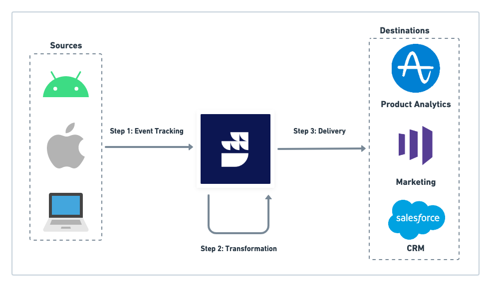

## Transformations

### What are RudderStack transformations? How do they work?

RudderStack's **Transformations** feature enables you to code custom JavaScript functions to implement specific use-cases on your event data. Some of the use-cases are:

- Filtering / sampling events
- Cleaning / aggregating data
- Data masking or removing sensitive PII information in the events to ensure data privacy
- Enriching events by implementing static logic or leveraging an external API
- Using an API to implement specific actions on the events

### Are there any sample user transformations I can refer to?

Yes, you can refer to the [Sample RudderStack Transformations](https://github.com/rudderlabs/sample-user-transformers) GitHub repository.

### Is the transformation connected to a source or destination?

A transformation is always connected to a destination. RudderStack gives you the option to add a transformation while setting up a destination, as shown:


###  Can I connect multiple transformations to a destination?

No, it is not possible to connect multiple transformations to a destination. Instead, you can implement multiple use-cases in the same transformation, for example, event filtering followed by cleaning.

### Where does RudderStack apply the transformations? Is it on the source or the destination events?

RudderStack tracks and collects the events at the source, applies the transformation logic to the events, and then forwards the transformed events to the destination (connected to the source).

The following image summarizes the transformation workflow:



### Can I write a transformation that can be applied to a small batch of events?

Yes, you can use the `transformBatch` function instead of `transformEvent`.

```javascript
export function transformBatch(events, metadata) {
    return events;
}
```

<div class="infoBlock">
For more information on using the <code class="inline-code">transformBatch</code> function, refer to the <Link to="/features/transformations/#using-transformbatch-instead-of-transformevent">Using <code class="inline-code">transformBatch</code> instead of <code class="inline-code">transformEvent</code></Link> section.
</div>

<div class="dangerBlock">
If you are using <code class="inline-code">transformBatch</code> and want to ensure event ordering, make sure you pass on the <code class="inline-code">messageId</code> from the input event to the output event. Without the <code class="inline-code">messageId</code>, there is a strong possibility that RudderStack will <strong>not</strong> maintain the event ordering.
</div>

### What is a referenced transformation?

If a library `L` is <Link to="/features/transformations/#using-libraries-in-transformations">imported by the transformations</Link> `T1`, `T2`, and `T3`, then `T1`, `T2`, and `T3`are called the referenced transformations to `L`.

### I used to write transformations like `function transform(events) {}`. Why am I not able to create new transformations this way?

By default, RudderStack supports writing functions that transform a single event instead of a batch of events. You can now define your transformation in the following manner:

```javascript
export function transformEvent(event, metadata) {
    return event;
}
```

### Can I update my existing version v0 transformation code to the the latest version?

You cannot update an existing `Version: V0` transformation to the current version.

Instead, you can <Link to="/features/transformations/#adding-a-transformation">create a new transformation</Link> based on the <Link to="/features/transformations/#transformevent-definition">`transformEvent` definition</Link>, then reconnect your destinations with this transformation. Finally, delete the existing `Version: V0` transformation.

### What are transformation and library revisions?

Using the <Link to ="/api/transformation-api/">Transformations API</Link>, you can create and store a transformation or library as a draft without publishing them. These are called revisions.

Once the revisions meet the test criteria, you can restore and publish them for production use.

## Tranformations in device mode 

### How should I choose between event filtering and tranformations in device mode?

You should go for event filtering when you need to allowlist or denylist any sets of events. However, if you want to mask your data or remove sensitive PII information from the events to ensure data privacy, you should opt for the transformations.

### Is there any trade-off while using the transformations in device mode?

Yes, RudderStack sends an HTTP request for each event transformation which can cause latency. Also, it increases the network consumption substantially which is an overhead.
    
    
### In case of device mode transformation, can I switch back to the previous version of an SDK?

- For Mobile SDKs, yes, after an upgrade you can switch back to the previous version of SDK without the DMT feature.
- For JS SDK, if you are using the npm package then you can switch to a specific version with or without DMT but for CDN this is not possible.

## Libraries

### How does RudderStack test any library updates?

If you update a library that is referenced in any transformation, RudderStack tests the new library code along with the transformation code against the default event payload. This ensures that the transformation does not break due to any changes in the library.

<div class="warningBlock">
RudderStack currently does not support testing libraries with custom events.
</div>

### Can I test my library with sample events?

RudderStack currently does not support testing libraries with custom events. It provides a default payload against which you can test the library code along with any referenced transformations.

For more information, refer to the <Link to="/features/transformations/#how-rudderstack-tests-library-updates">How RudderStack tests updates to a library</Link> section.

### Why am I not able to update my library?

If you update a library, <Link to="/features/transformations/#how-rudderstack-tests-library-updates">RudderStack tests the new library code</Link> along with the referenced transformation code. This ensures that the transformation does not break due to any changes in the library.

If you're unable to update the library, it is likely that that the transformation is breaking because of the changes. Add the referenced transformation code and test the changes thoroughly.

### What is a referenced library?

If a transformation `T` <Link to="/features/transformations/#using-libraries-in-transformations">imports a library</Link> `L` in its code, then `L` is called as a referenced library to `T`. 

### I cannot import libraries into my existing transformations. What should I do?

If you cannot import libraries into your existing transformations, there is a strong likelihood that your existing transformations are based on the older version (`Version: V0`). To confirm if your transformation is based on an older version, check if your transformation has **Version: V0**, as shown:


To import the libraries in a transformation, follow these steps:

1. Create a new transformation by following the steps in the <Link to="/features/transformations/#adding-a-transformation">Adding a transformation</Link> section.
2. Add the updated transformation code as specified in the <Link to="/features/transformations/#transformevent-definition">`transformEvent` definition</Link> section.
3. Connect the transformation to your destination. For more information, refer to the <Link to="/features/transformations/#connecting-transformation-to-a-destination">Connecting a transformation to the destination</Link> section.
4. You can then import libraries in the transformation. For more information, refer to the <Link to="/features/transformations/#using-libraries-in-transformations">Using libraries in transformations</Link> section.