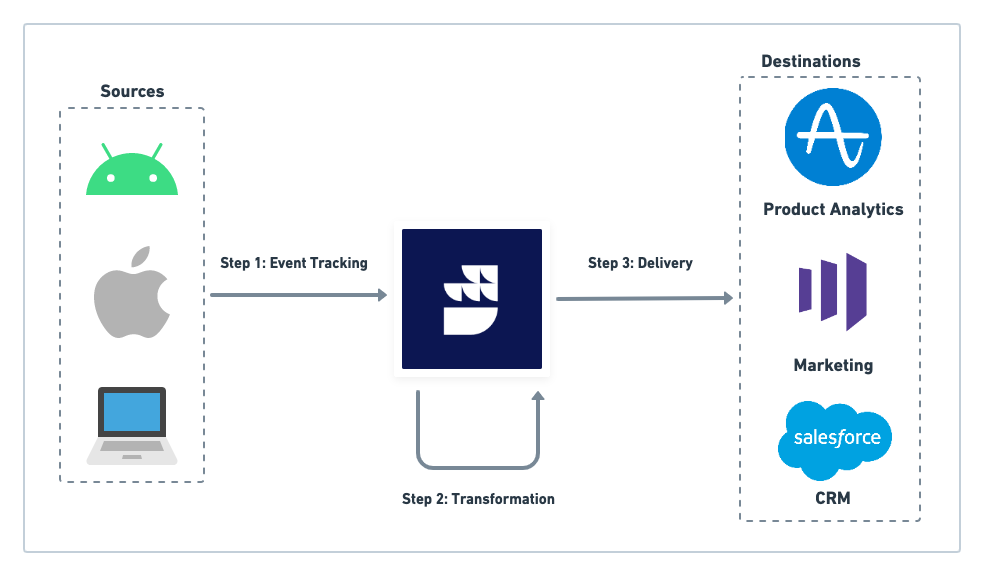
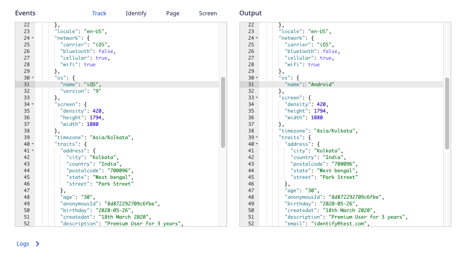

RudderStack's **Transformations** feature enables you to write custom JavaScript functions to implement specific use-cases on your event data, such as:

- Filtering or sampling events
- Cleaning or aggregating data
- Data masking or removing sensitive PII to ensure data privacy
- Enriching events by implementing static logic or leveraging an external API
- Using an API to implement specific actions on the events

You can use this feature across your <Link to="/sources/event-streams/">Event Streams</Link>, <Link to="/sources/extract/">Cloud Extract</Link>, and <Link to="/sources/reverse-etl/">Reverse ETL</Link> pipelines.

<div class="infoBlock">
In <Link to="/destinations/rudderstack-connection-modes/#cloud-mode">cloud mode</Link>, the Transformations feature is only available for the Pro/Enterprise customers.
<GhBadge
  url={'https://rudderstack.com/pricing/'}
  label={'Plan'}
  message={'Pro/Enterprise'}
  color={'blueviolet'}
/>
In <Link to="/destinations/rudderstack-connection-modes/#device-mode">device mode</Link>, the Transformations feature is only available for the Enterprise customers.
<GhBadge
  url={'https://www.rudderstack.com/enterprise-quote/'}
  label={'Plan'}
  message={'Enterprise'}
  color={'blueviolet'}
/>
</div>


<div class="warningBlock">
While using the Transformations feature to send events to destinations via the <Link to="/destinations/rudderstack-connection-modes/#device-mode">device mode</Link>, only the <Link to="/sources/event-streams/sdks/rudderstack-android-sdk/">Android</Link>, <Link to="/sources/event-streams/sdks/rudderstack-ios-sdk/">iOS</Link>, <Link to="/sources/event-streams/sdks/rudderstack-javascript-sdk/">JavaScript</Link>, <Link to="/sources/event-streams/sdks/rudderstack-react-native-sdk/">React-Native</Link>, and <Link to="/sources/event-streams/sdks/rudderstack-cordova-sdk/">Cordova</Link> SDKs are supported.
</div>

## Key features

Some key features of RudderStack Transformations are listed below:

- You can apply the Transformations to your events in real-time.
- You can programmatically add and remove Transformations using the <Link to="/api/transformation-api/">Transformations API</Link>.
- They're easier to build, manage, and debug, and reuse.
- You can create an organization-wide sandbox where your team can store the Transformations before publishing them in a production environment.
- You can version control your Transformations.

<div class="infoBlock">
Read more about why your data pipeline needs to have an efficient event transformations capability in the <a href="https://rudderstack.com/blog/the-future-of-data-pipeline-tools-must-include-better-transformations-than-etl-ever-had">RudderStack blog</a>.
</div>

## How do Transformations work?

At a high level, once you <Link to="/features/transformations/using-transformations#adding-a-transformation">add a Transformation</Link> and connect it to a destination, RudderStack:

1. Tracks and collects events at the source.
2. Applies the transformation logic to the your events.
3. Forwards the transformed event to your connected destination.



<div class="infoBlock">
Refer to the <a href="https://github.com/rudderlabs/sample-user-transformers">Sample RudderStack Transformations</a> repository for some useful templates that you can use to create your own transformations.
</div>

## Use case

Suppose you want to set the `context.os` field to `Android` for all the events, irrespective of the actual platform RudderStack tracks the event from. You can write a simple transformation to do this:

```javascript
export function transformEvent(event, metadata) {
    event.context.os = { name: "Android"};
    return event;
}
```

The `transformEvent` function overrides the event's `context.os.name` and sets it as `Android`, as seen below:



## Useful guides

Refer to the following guides to know more about how to use the Transformations feature:

| Guide          | Description    |
| :------------------- | :------------------------- |
| <Link to="/features/transformations/using-transformations">Using Transformations</Link>    | Detailed information on how to add, connect, delete transformations, and their usage via API functions.|
| <Link to="/features/transformations/using-libraries">Using Libraries</Link>    |  Detailed information on how to add, use, import, and delete libraries.|
| <Link to="/features/transformations/faq">FAQ</Link>     | Commonly asked questions on Transformations feature and their solutions.     |

