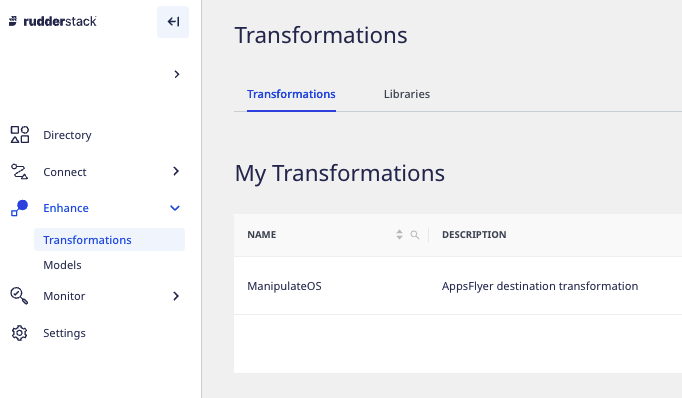
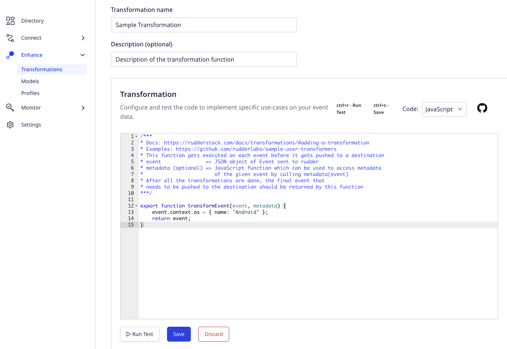
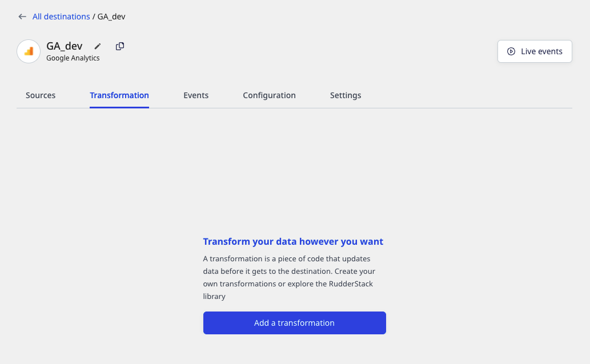
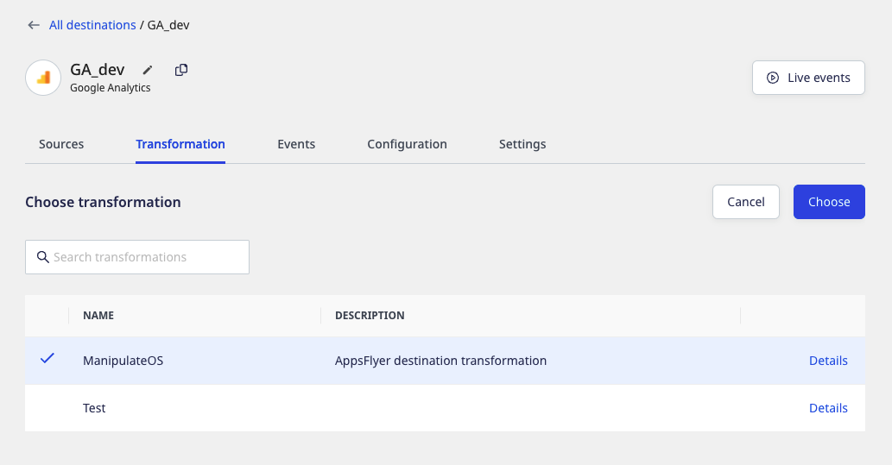
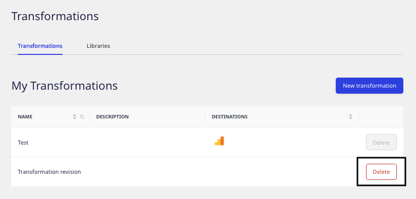

RudderStack's **Transformations** feature enables you to write custom JavaScript functions to implement specific use-cases on your event data, such as:

- Filtering or sampling events
- Cleaning or aggregating data
- Data masking or removing sensitive PII to ensure data privacy
- Enriching events by implementing static logic or leveraging an external API
- Using an API to implement specific actions on the events

<YouTube
  videoId={'C11Na9oIv-E'}
/>

You can use this feature across your <Link to="/sources/event-streams/">Event Streams</Link>, <Link to="/sources/extract/">Cloud Extract</Link>, and <Link to="/sources/reverse-etl/">Reverse ETL</Link> pipelines.

<div class="infoBlock">
  <ul>
<li>In <Link to="/destinations/rudderstack-connection-modes/#cloud-mode">cloud mode</Link>, you can use up to 3 transformations in the free plan. To use unlimited Transformations, you need to be a <a href="https://rudderstack.com/pricing/">Pro/Enterprise</a> user.</li>

<li>In <Link to="/destinations/rudderstack-connection-modes/#device-mode">device mode</Link>, the Transformations feature is only available for the <a href="https://www.rudderstack.com/enterprise-quote/">Enterprise</a> users.</li>
 </ul>
</div>

<div class="warningBlock">
While using the Transformations feature to send events to destinations via the <Link to="/destinations/rudderstack-connection-modes/#device-mode">device mode</Link>, only the <Link to="/sources/event-streams/sdks/rudderstack-android-sdk/">Android</Link>, <Link to="/sources/event-streams/sdks/rudderstack-ios-sdk/">iOS</Link>, <Link to="/sources/event-streams/sdks/rudderstack-javascript-sdk/">JavaScript</Link>, <Link to="/sources/event-streams/sdks/rudderstack-react-native-sdk/">React-Native</Link>, and <Link to="/sources/event-streams/sdks/rudderstack-cordova-sdk/">Cordova</Link> SDKs are supported.
</div>

## Key features

Some key features of RudderStack Transformations are listed below:

- You can apply the Transformations to your events in real-time.
- You can programmatically add and remove Transformations using the <Link to="/api/transformation-api/">Transformations API</Link>.
- They're easier to build, manage, and debug, and reuse.
- You can create an organization-wide sandbox where your team can store the Transformations before publishing them in a production environment.
- You can version control your Transformations.

<div class="infoBlock">
Read more about why your data pipeline needs to have an efficient event transformations capability in the <a href="https://rudderstack.com/blog/the-future-of-data-pipeline-tools-must-include-better-transformations-than-etl-ever-had">RudderStack blog</a>.
</div>

## Use case

Suppose you want to set the `context.os` field to `Android` for all the events, irrespective of the actual platform RudderStack tracks the event from. You can write a simple transformation to do this:

```javascript
export function transformEvent(event, metadata) {
    event.context.os = { name: "Android"};
    return event;
}
```

The `transformEvent` function overrides the event's `context.os.name` and sets it as `Android`, as seen below:


## Adding a transformation

To add a new transformation in the RudderStack dashboard, follow these steps:

1. Log into the [RudderStack dashboard](https://app.rudderstack.com/).
2. Go to **Enhance** > **Transformations**, as shown:



3. Click **New Transformation**.
4. Add a name for your transformation and an optional description.
5. Next, add your JavaScript function in the **Transformation** window, as shown:



<div class="successBlock">
You can also add other functions and call them from within <code class="inline-code">transformEvent</code>.
</div>

6. To test your transformation, paste your sample event in the **Events** block and click **Run Test**. By default, RudderStack provides some sample events to test if your transformation logic works as expected.

  

7. To save the transformation, click **Save**.

## Connecting transformation to a destination

You can connect a transformation to a destination in two cases:

### Case 1: While setting up a new destination

RudderStack provides the option to connect an existing transformation or create a new transformation while setting up a destination, as shown:


### Case 2: While connecting to an existing destination

To add a transformation to an existing destination, follow these steps:

1. In the dashboard, go to the **Transformation** tab in your destination dashboard and click **Add a transformation**, as shown:



2. Then, choose the transformation to connect to the destination.



## Deleting a transformation

To delete a transformation, go to **Enhance** > **Transformations** and click the **Delete** button next to the transformation that you want to delete, as shown:



<div class="warningBlock">
You cannot delete a transformation that is connected to a destination.
</div>

## `transformEvent` function

While using a transformation, RudderStack applies the `transformEvent` function on each event that takes two arguments:
- `event`: Corresponds to the input event.
- `metadata` (optional): Corresponds to the JavaScript function which you can use to access the metadata of the given event.

<div class="infoBlock">
For more information on <code class="inline-code">metadata</code>, refer to the <Link to="#accessing--the-event-metadata">Accessing metadata</Link> section below.
</div>

After the transformation is complete, `transformEvent` returns the final event to be sent to the destination.

## Accessing event metadata

RudderStack injects a function `metadata(event)` into your transformations as an argument. This allows you to access the event metadata variables that help you customize your transformations.

<div class="infoBlock">
<code class="inline-code">metadata()</code> takes the event as the input and returns the metadata of the event.
</div>

<div class="infoBlock">
Since you may not need the event metadata in every transformation, it is an <strong>optional argument</strong> and can be skipped.
</div>

The following properties, if available, are present in the metadata response:

| Property   | Description       |
| :-------------- | :------------------------- |
| `sourceId`      | The source ID in the **Settings** tab of your configured source in the dashboard. |
| `destinationId` | The destination ID in the **Settings** tab of your configured destination in the dashboard.           |
| `messageId`     | The unique ID for each event.            |

An example of using `metadata` is shown below:

```javascript
export function transformEvent(event, metadata) {
  const meta = metadata(event);
  event.sourceId = meta.sourceId;

  return event;
}
```

## Making external API requests

You can make any number of external API requests in your transformation functions and use the response to enrich your events. 

RudderStack injects an asynchronous `fetch` function in your transformations. It makes an API call to the given URL and returns the response in the JSON format.

You can use the `fetch` function in your transformations, as shown:

```javascript
export async function transformEvent(event, metadata) {
  const res = await fetch("post_url", {
    method: "POST",  // POST, PUT, DELETE, GET, etc.
    headers: {
      "Content-Type": "application/json;charset=UTF-8",
      Authorization: "Bearer <authorization_token>"
    },
    body: JSON.stringify(event)
  });
  event.response = JSON.stringify(res);
  return event;
}
```

<div class="infoBlock">
To see the <code class="inline-code">fetch</code> function in action, refer to the <a href="https://github.com/rudderlabs/sample-user-transformers/blob/sampleTransformationV1/EnrichWithClearbit.js">Clearbit enrichment</a> sample transformation.
</div>

<div class="infoBlock">
For improved performance, it is highly recommended to use the <code class="inline-code">batch</code> API requests instead of a separate API request for each event wherever possible.
</div>

### Fetching response properties using `fetchV2`

**FetchV2** is a wrapper for the `fetch` call. It enables you to fetch the response properties more efficiently while making the external API calls.

The following properties are present in a `fetchV2` response:

| Property | Description  |
| :-------------- | :----------- |
| `status`      | Status code of fetch response, for example, `200`. |
| `url` | The URL of the Fetch API.   |
| `headers`     | The response headers   |
| `body`     | The response body in JSON or TEXT. By default, it is JSON. |

The below example highlights the use of the `fetchV2` function in a transformation to capture failure due to a timeout: 
  
```javascript
export async function transformEvent(event) {
  try {
    const res = await fetchV2("url", { timeout: 1000});
    if (res.status == 200) {
      event.response = JSON.stringify(res.body);
    }
  } catch (err) {
    log(err.message);
  }
  return event;
}
```