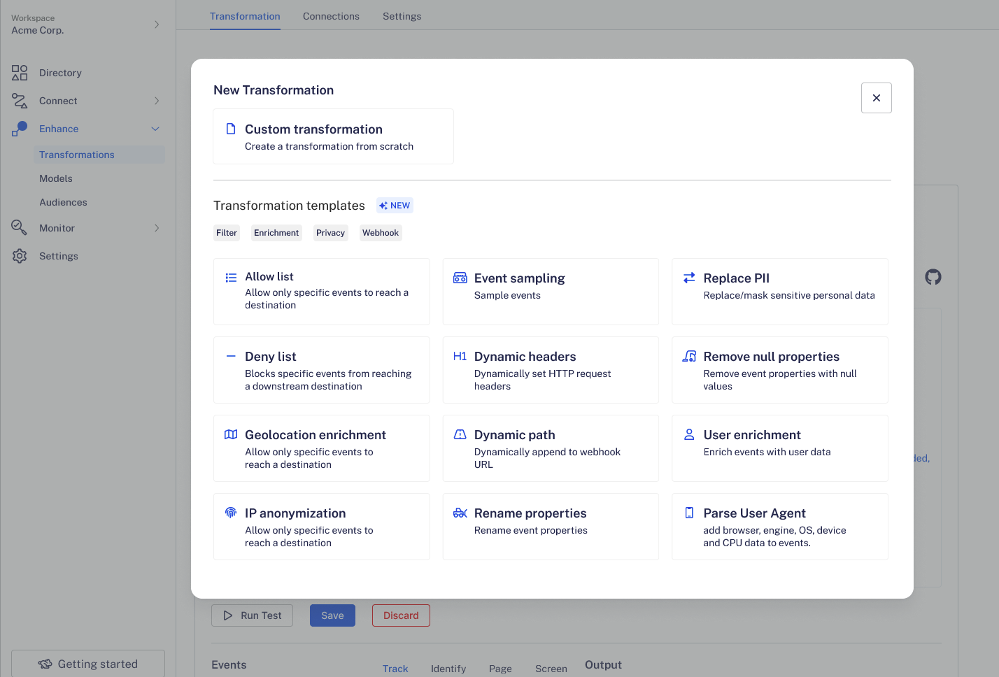

This guide details RudderStack's transformation templates that contain some prebuilt JavaScript functions that you can use to create your transformations and implement use cases on your event data. These include event filtering and sampling, replacing or hashing PII (Personal Identifiable Information), anonymizing IPs, and more.

<div class="infoBlock">
Currently, transformation templates support only JavaScript. Python support (applicable for <a href="https://www.rudderstack.com/pricing/">Growth/Enterprise</a> customers) is coming soon.
</div>

## Transformation templates

### Allowlist

This transformation allows events to reach a downstream destination only if a specific property contains certain values. 

Some examples of how you can use this template are listed below:
- You can allow only certain event names, like `Product Added` or `Order Completed`.
- You can send certain event types to a particular destination, like <Link to="/event-spec/standard-events/identify">`identify`</Link> or <Link to="/event-spec/standard-events/track">`track`</Link>.
- You can send only the events that have a tracking plan linked to the source.

A sample allowlist transformation is shown below:

```javascript
export function transformEvent(event, metadata) {
  const property = event.event;  // Edit property
  const allowlist = ["<VALUE>", "<OTHER_VALUE>"];  // Edit allowlist contents
  if (!property || !allowlist.includes(property)) return;
  return event;
}
```

### Denylist

This transformation blocks the events from reaching a downstream destination if a specifc property contains certain values. For example, you can block all `Product Added` and `Order Completed` events, block certain event types, etc.

A sample denylist transformation is shown below:

```javascript
export function transformEvent(event, metadata) {
  const property = event.event; // Edit property
  const denylist = ["<VALUE>", "<OTHER_VALUE>"]; // Edit denylist contents
  if (property && denylist.includes(property)) return;
  return event;
}
```

### Geolocation enrichment

This transformation enriches events with the geolocation data using an IP-to-geolocation API. This lets you easily query your events based on the geolocation data, for example, country or city.

A sample transformation is shown below:

```javascript
export async function transformEvent(event, metadata) {
  if (event.request_ip) {
    const res = await fetch("https://ip2.app/info.php?ip=" + event.request_ip); // Change API
    event.context.geolocation = res;
  }
  return event;
}
```

### IP anonymization

This transformation changes the last octet of the IP address to zero. For example, the IP `12.214.31.144` is transformed to `12.214.31.0`. This protects the privacy rights of your users and reduces the risk of accidentally disclosing their IP addresses.

A sample transformation is shown below:

```javascript
export function transformEvent(event, metadata) {
    const ip = event.request_ip;
    if (ip) event.request_ip = ip.replace(/\d{1,3}$/, "0");
    return event;
}
```

### Event sampling

This transformation sends only a subset of events to a downstream destination. You can anonymize the events and select a random subset from the anonymous events; this allows you to work with a small, manageable amount of data in the destination.

<div class="infoBlock">
This transformation uses the standard RudderStack <strong>cyrb53</strong> library.
</div>

A sample transformation is shown below:

```javascript
import {
  md5
} from "hash";

export function transformEvent(event, metadata) {
  const userId = event.userId;
  if (userId && parseInt(md5(userId)) % 10 < 5) return;
  return event;
}
```

### Dynamic headers

This transformation sets the HTTP headers for your webhook destintions dynamically. It allows you to set the headers based on values in the data.

A sample transformation is shown below:

```javascript
export function transformEvent(event, metadata) {
  event.header = {
    Authorization: "Basic <credentials>",  // Change headers and values
    header_2: "value"
  };
  return event;
}
```

### Dynamic path

This transformation dynamically appends to the URL specified in your webhook destination configuration. This lets you send events to different paths based on the values in your event data. For example, you can send `identify` events to only to the `/users` URL path and the `group` events to `/organizations`.

The following transformation appends a `/search?email=${email}` path to the webhook URL based on the  `email` property present in the event:

```javascript
export function transformEvent(event, metadata) {
  const email = event.context?.traits?.email;  // Change property
  if (email) event.appendPath = `/search?email=${email}`;  // Change property and appendPath
  return event;
}
```

### Rename properties

This transformation renames the properties to conform with the appropriate naming convention expected by the downstream destination, for example, `first_name` to `firstName`.

A sample transformation is shown below:

```javascript
export function transformEvent(event, metadata) {
    const firstName = event.context?.traits?.first_name;
    if (firstName) {
        event.context.traits.firstName = firstName;
        delete event.context.traits.first_name;
    }
    return event;
}
```

### Replace PII

This transformation replaces or masks sensitive personal data, for example, email, birthday, or social security number, reducing the risk of accidentally disclosing Personal Identifiable Information (PII). You can specify the properties to be masked or replaced and define the masking logic in the code.

The following transformation masks a social security number with zeros:

```javascript
export function transformEvent(event, metadata) {
  if (event.context.traits.ssn) event.context.traits.ssn = "000-00-000"; // Change property
  return event;
}
```

### Remove null properties

This transformation removes all the event properties with null values; this is helpful when you want to reduce the number of unnecessary fields generated in downstream destinations.

A sample transformation is shown below:

```javascript
export function transformEvent(event) {
  if (event.properties) {
    const keys = Object.keys(event.properties);
    if (keys) {
      keys.forEach(key => {
        if (event.properties[key] === null) delete event.properties[key];
      });
    }
  }
  return event;
}
```

### User enrichment

This transformation enriches the events by fetching user data like location, employment, or social media details using the Clearbit API and their email address. It is helpful when sending events with additional user metadata to various downstream destinations.

A sample transformation is shown below:

```javascript
export async function transformEvent(event) {
    const email = event.context?.traits?.email;
    if (email) {
        const res = await fetch("https://person.clearbit.com/v2/combined/find?email=" + email, {
            headers: {
                "Authorization": "Bearer <your_clearbit_secure_key"
            }
        });
        event.context.traits.enrichmentInfo = res;
    }
    return event;
}
```

### Parse user agent

This transformation lets you add the user's browser, engine, OS, device, and CPU-related information to the events. Adding this user metadata to your user events is helpful when you want to perform downstream actions later, for example, filter events coming from mobile devices.

<div class="infoBlock">
This template uses the standard RudderStack library <a href="https://github.com/rudderlabs/sample-user-transformers/blob/master/libraries/userAgentParser.js">User Agent Parser</a> which you can use for your custom transformations.
</div>

A sample transformation is shown below:

```javascript
import {
  UAParser
} from "userAgentParser";

export function transformEvent(event, metadata) {
  const userAgent = event.context?.userAgent;
  if (userAgent) {
    const parser = new UAParser();
    const parsedUserAgent = parser.setUA(userAgent).getResult();
    event.context.parsedUserAgent = parsedUserAgent;
  }
  return event;
}
```

## Library templates

You can also import the following templates into your transformations without adding them to your <Link to="/features/transformations/using-libraries">RudderStack libraries</Link> first:

### Encrypt/Decrypt PII

This library lets you encrypt and decrypt PII including those that are stored in cookies.

### User agent parser

The <Link to="#parse-user-agent">Parse user agent transformation template</Link> imports this library to add the user's browser, engine, OS, device, and CPU-related information to the events.

### Hashing PII

This library has two hash functions that hide sensitive PII like the user's email, birthday, social security number, etc.

<div class="infoBlock">
You can use either the MD5 or SHA256 method to hash your PII.
</div>

## Using transformation templates

To use transformation templates, go to **Enhance** > **Transformations** and click **Create Now**.


Under **Transformation templates**, select the prebuilt template depending on your use case:



To write a transformation from scratch, click **Custom transformation**.

<br />