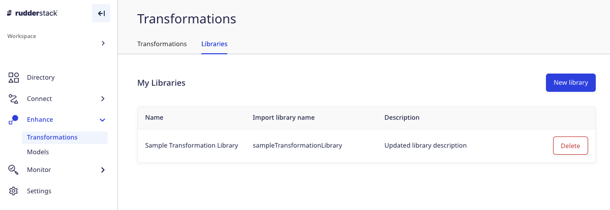
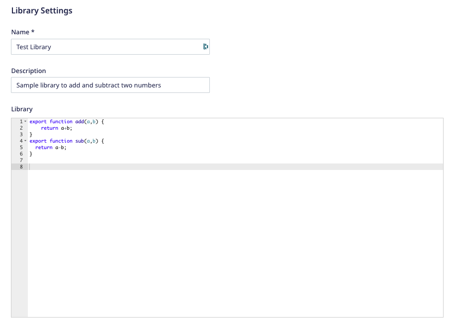
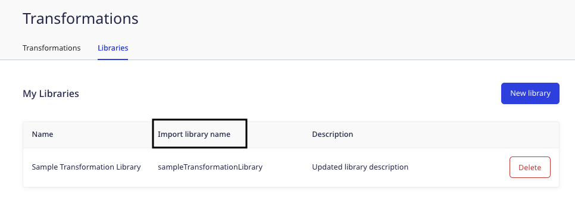
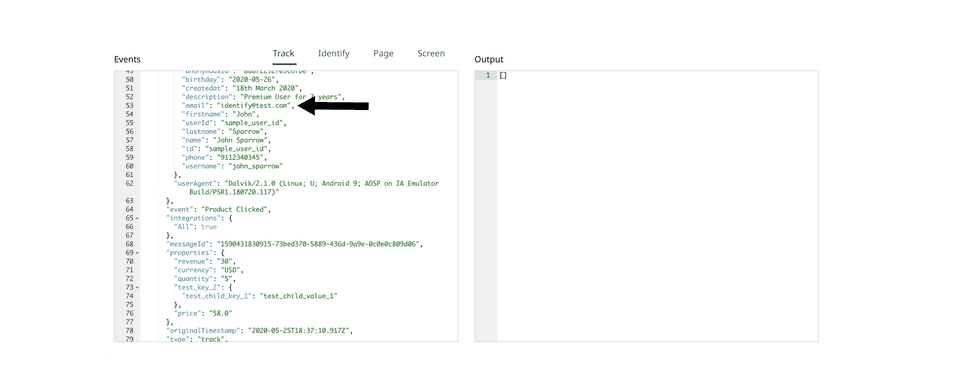

RudderStack's Transformations feature lets you reuse the transformation code in other transformations using **Libraries**.

<div class="infoBlock">
You can write a transformation library only in JavaScript. Support for Python will be added soon.
</div>

## Adding a library

1. In the [RudderStack dashboard](https://app.rudderstack.com/), go to **Enhance** > **Transformations** and click the **Libraries** tab.



2. Click **New library**.
3. Add the library **Name**, **Description** and write the function you want to reuse across different transformations. You can also add multiple functions in a single library, as shown:



4. Click **Run Test** to ensure the library code has the correct syntax.

## Using libraries in transformations

To use the libraries in your existing transformations, refer to the **Import Library Name** option in the RudderStack dashboard, as shown:



<div class="infoBlock">
RudderStack converts the library name into <strong>camel case without spaces</strong>; this becomes your <strong>library handle</strong> which you can use across multiple transformations. For example, if your library name is <code class="inline-code">Sample Transformation Library</code>, then the library handle would be <code class="inline-code">sampleTransformationLibrary</code>.
</div>

You can then use the library in a transformation with a simple `import` statement. Refer to the below use case for more information.

### Use case

Suppose you want to import a function `rudderEmail` from a transformation library called `Is Rudder Email` to filter events that don't have the email address containing the RudderStack domain.

The `rudderEmail` function is as follows:

```javascript
export function rudderEmail(email) {
    return /@(rudderlabs|rudderstack)| \+ruddertest/.test(email);
}
```

The following code snippet demonstrates how you can implement this in a transformation:

```javascript
import { rudderEmail } from "isRudderEmail";
export function transformEvent(event) {
  const email =
    event.context && event.context.traits && event.context.traits.email;
  if (email) {
    if (!rudderEmail(email)) return;
  }
  return event;
}
```

On clicking **Run Test**, a sample event not containing the RudderStack email domain is filtered out, as shown:



## Importing multiple functions from a single library

The following snippets highlight how to properly import functions from a library:

```javascript
// ---------------
import { getLoss } from "getFinanceData";

// OR

import { getLoss, getRevenue, getProfit } from "getFinanceData";
import {
  getLoss,
  getRevenue,
  getProfit
} from "getFinanceData";

// For default getPrice import
import getPrice, { getRevenue, getProfit } from "getFinanceData";

// alias imports
import getPrice as gp, { getRevenue as gr, getProfit } from "getFinanceData";
// usage: gp(event), gr(event), getProfit(ev)

import * as GFD from "getFinanceData";
// usage: GFD.getRevenue(ev), GFD.getProfit(ev)
// for default import: GFD.default(ev)
```

The following snippets highlight the **incorrect** way of importing the library functions:

```javascript
// -----------------
import * from "getFinanceData";
getPrice(ev)

// OR

import getPrice as gp from "getFinanceData";
getPrice(ev)
```

## Deleting a library

<div class="warningBlock">
You cannot delete a library that is referenced or imported in a transformation.
</div>

To delete a transformation, go to **Enhance** > **Transformations** and click the **Delete** button next to the library that you want to delete.

<br />
