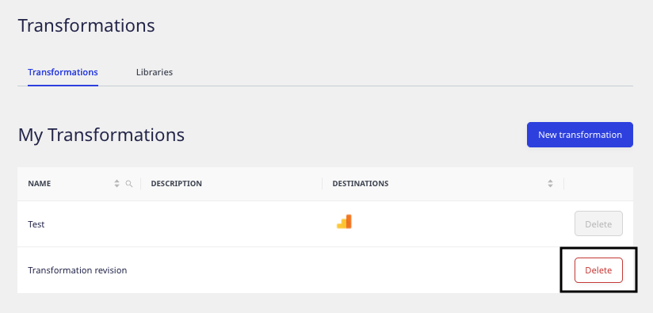

This guide takes you through the detailed steps on how to use the transformations along with different features.

## Adding a transformation

To add a new transformation in the RudderStack dashboard, follow these steps:

1. Log into the [RudderStack dashboard](https://app.rudderstack.com/).
2. Go to **Enhance** > **Transformations**, as shown:


3. Click **New Transformation**.
4. Add a name for your transformation and an optional description.
5. Next, add your JavaScript function in the **Transformation** window, as shown:


<div class="successBlock">
You can also add other functions and call them from within <code class="inline-code">transformEvent</code>.
</div>

6. To test your transformation, paste your sample event in the **Events** block and click **Run Test**. By default, RudderStack provides some sample events to test if your transformation logic works as expected.

  

7. To save the transformation, click **Save**.

### Debugging with logs

RudderStack enables you to capture any event-related information in the form of logs while running a test on your transformation. You can do this by including the `log` function in your transformation code. 

An example of using the `log` function is shown below:

```javascript
export function transformEvent(event, metadata) {
  const meta = metadata(event);
  event.sourceId = meta.sourceId;

  log("Event Name is", event.event, ";", "Message ID is", event.messageId);
  log("Source ID is", meta.sourceId);

  return event;
}
```

On adding the above transformation and clicking **Run Test**, you can see the resulting log in the **Logs** section of the dashboard, as shown:


<div class="infoBlock">
You can pass a string, number, or an object as an argument to the <code class="inline-code">log</code> function.
</div>

## Connecting transformation to a destination

You can connect a transformation to a destination in two cases:

### Case 1: While setting up a new destination

RudderStack provides the option to connect an existing transformation or create a new transformation while setting up a destination, as shown:


### Case 2: While connecting to an existing destination

To add a transformation to an existing destination, follow these steps:

1. In the dashboard, go to the **Transformation** tab in your destination dashboard and click **Add a transformation**, as shown:


2. Then, choose the transformation to connect to the destination.


## Deleting a transformation

To delete a transformation, go to **Enhance** > **Transformations** and click the **Delete** button next to the transformation that you want to delete, as shown:



<div class="warningBlock">
You cannot delete a transformation that is connected to a destination.
</div>

## `transformEvent` function

While using a transformation, RudderStack applies the `transformEvent` function on each event that takes two arguments:
- `event`: Corresponds to the input event.
- `metadata` (optional): Corresponds to the JavaScript function which you can use to access the metadata of the given event.

<div class="infoBlock">
For more information on <code class="inline-code">metadata</code>, refer to the <Link to="#accessing--the-event-metadata">Accessing metadata</Link> section below.
</div>

After the transformation is complete, `transformEvent` returns the final event to be sent to the destination.

## Accessing event metadata

RudderStack injects a function `metadata(event)` into your transformations as an argument. This allows you to access the event metadata variables that help you customize your transformations.

<div class="infoBlock">
<code class="inline-code">metadata()</code> takes the event as the input and returns the metadata of the event.
</div>

<div class="infoBlock">
Since you may not need the event metadata in every transformation, it is an <strong>optional argument</strong> and can be skipped.
</div>

The following properties, if available, are present in the metadata response:

| Property   | Description       |
| :-------------- | :------------------------- |
| `sourceId`      | The source ID in the **Settings** tab of your configured source in the dashboard. |
| `destinationId` | The destination ID in the **Settings** tab of your configured destination in the dashboard.           |
| `messageId`     | The unique ID for each event.            |

An example of using `metadata` is shown below:

```javascript
export function transformEvent(event, metadata) {
  const meta = metadata(event);
  event.sourceId = meta.sourceId;

  return event;
}
```

## Applying transformation on a batch of events

You can also perform any aggregation or roll-up operation on a batch of events using the `transformBatch` function instead of `transformEvent`, as shown:

```javascript
export function transformBatch(events, metadata) {
    return events;
}
```

<div class="dangerBlock">
If you want to ensure event ordering while using <code class="inline-code">transformBatch</code>, make sure you pass the <code class="inline-code">messageId</code> from the input event to the output event. Without the <code class="inline-code">messageId</code>, RudderStack will <strong>not</strong> guarantee the event ordering. It is highly recommended to use <code class="inline-code">transformEvent</code> as much as possible, as it ensures event ordering.
</div>


## Making external API requests

You can make any number of external API requests in your transformation functions and use the response to enrich your events. 

RudderStack injects an asynchronous `fetch` function in your transformations. It makes an API call to the given URL and returns the response in the JSON format.

You can use the `fetch` function in your transformations, as shown:

```javascript
export async function transformEvent(event, metadata) {
  const res = await fetch("post_url", {
    method: "POST",  // POST, PUT, DELETE, GET, etc.
    headers: {
      "Content-Type": "application/json;charset=UTF-8",
      Authorization: "Bearer <authorization_token>"
    },
    body: JSON.stringify(event)
  });
  event.response = JSON.stringify(res);
  return event;
}
```

<div class="infoBlock">
To see the <code class="inline-code">fetch</code> function in action, refer to the <a href="https://github.com/rudderlabs/sample-user-transformers/blob/sampleTransformationV1/EnrichWithClearbit.js">Clearbit enrichment</a> sample transformation.
</div>

<div class="infoBlock">
For improved performance, it is highly recommended to use the <code class="inline-code">batch</code> API requests instead of a separate API request for each event wherever possible.
</div>

### Fetching response properties using `fetchV2`

**FetchV2** is a wrapper for the `fetch` call. It enables you to fetch the response properties more efficiently while making the external API calls.

The following properties are present in a `fetchV2` response:

| Property | Description  |
| :-------------- | :----------- |
| `status`      | Status code of fetch response, for example, `200`. |
| `url` | The URL of the Fetch API.   |
| `headers`     | The response headers   |
| `body`     | The response body in JSON or TEXT. By default, it is JSON. |

The below example highlights the use of the `fetchV2` function in a transformation to capture failure due to a timeout: 
  
```javascript
export async function transformEvent(event) {
  try {
    const res = await fetchV2("url", { timeout: 1000});
    if (res.status == 200) {
      event.response = JSON.stringify(res.body);
    }
  } catch (err) {
    log(err.message);
  }
  return event;
}
```

## Limitations

The following memory and time limits are applicable when invoking a transformation in device or cloud mode:

| Parameter    | Limit     |
| :----------- | :-------- |
| Memory limit | 128 MB      |
| Execution time limit   | 4 seconds |

<div class="dangerBlock">
The user transformation fails if these limits are exceeded.
</div>

### Additional limitations in device mode

Along with the above-mentioned limitations, the following are applicable when using a transformation in the device mode:

- Events can't be pushed to the destination SDKs in real-time.
- The network availability and server response can lead to latency while sending the events.
- The iOS SDK does not support background processing of an event when the app is closed. However, the backlog event is sent the next time the app is opened.