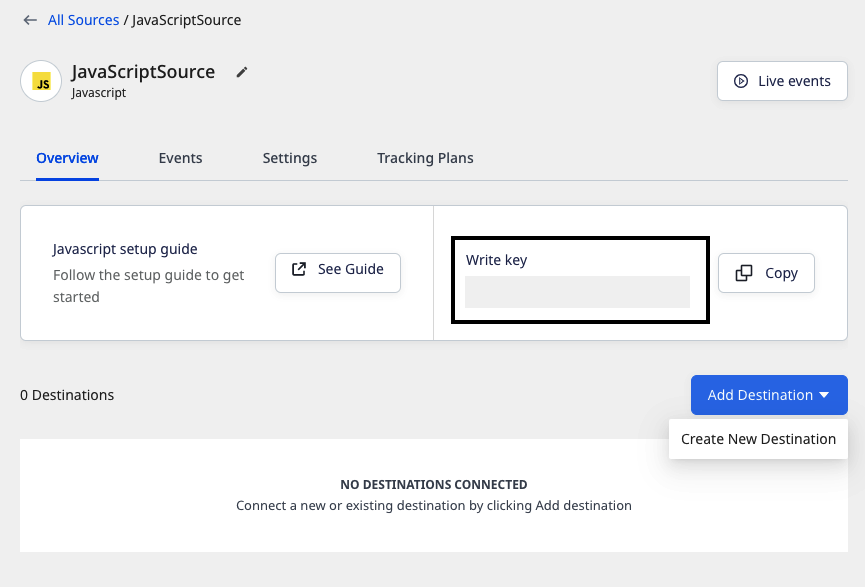

The easiest way to get started with RudderStack is to set up a source-destination connection in the RudderStack dashboard.  
Link to
<Link to="/google-bigquery/">Follow these steps-redirect</Link> 
<Link to="/destinations/warehouse-destinations/bigquery/">Follow these steps-correct</Link> 
<Link to="https://www.rudderstack.com/docs/destinations/warehouse-destinations/bigquery/">Follow these steps-absolute</Link> 
  
a href 
<a href="/google-bigquery/">Follow these steps-redirectNewTab</a> 
<a target="_self" href="/google-bigquery/">Follow these steps-redirectSameTab</a> 
<a href="/destinations/warehouse-destinations/bigquery/">Follow these steps-correct</a> 
<a href="https://www.rudderstack.com/docs/destinations/warehouse-destinations/bigquery/">Follow these steps-absolute</a>

Follow these steps to set up a connection in RudderStack:

1. Sign up for [RudderStack Cloud](https://app.rudderstack.com/signup?type=freetrial).
2. You will be presented with the **Get Started** page in the RudderStack dashboard, as shown:

3. Click on **Add Source** to set up a data source.

For more information on sources in RudderStack, refer to the <Link to="/sources/">Sources</Link> guide.

4. Choose a data source from the list of available sources. RudderStack supports the following types of sources:
 
    - <Link to="/sources/event-streams/sdks/">SDKs</Link>: Collect your event data from web, mobile, and server-side apps, then route it to a wide array of customer tools and data warehouses.
    - <Link to="/sources/event-streams/cloud-apps/">Cloud Apps</Link>: Ingest event data from your cloud apps and route it to the desired destinations.
    - <Link to="/sources/extract/">Cloud Extract</Link>: Build ELT pipelines from cloud apps to your data warehouse.
    - <Link to="/sources/reverse-etl/">Reverse ETL</Link>: Leverage your warehouse as a data source for your entire customer data stack.

5. Once you have configured the data source, you will see the following source details page.

Note the source <strong>Write key</strong>. This is required for integrating the RudderStack SDK with your source app.

6. Then, add a destination by clicking on the **Add Destination** button and selecting **Create new destination**.

7. From the list of destinations, select the destination you want to configure for the source. RudderStack currently supports **over 150** destinations, including <Link to="/destinations/streaming-destinations/">Cloud destinations</Link> and <Link to="/destinations/warehouse-destinations/">Warehouse destinations</Link>.
8. Configure the destination by entering the relevant connection settings. For detailed information on these settings, refer to the <Link to="/destinations/overview/">destination-specific documentation</Link>.

You can also transform your events in RudderStack before sending them to the destinations. Read the <Link to="/features/transformations/">Transformations</Link> guide for more information on this feature.

