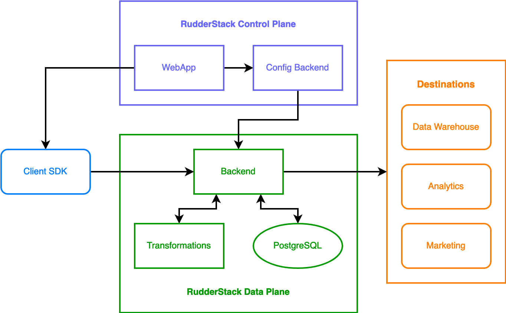

# RudderStack Architecture

RudderStack is a standalone system dependent only on a database (**PostgreSQL**). Its backend is written in Go, with a rich UI written in React.js.

RudderStack's architecture consists of 2 major components: the **control plane** and **data plane**, as seen in the following diagram:

## Control plane

The control plane offers a UI to configure your event data sources and destinations. It consists of:

- **RudderStack web app**: The [front-end application](https://app.rudderstack.com) where you set up and configure your data pipelines in RudderStack. 
- **Configuration backend**: The web app leverages this module to store all the relevant information around your configured sources, destinations, and the connections between them.

## Data plane

The data plane (backend) is RudderStack's core engine responsible for:

- Receiving and processing event data
- Transforming events in the required destination format
- Relaying events to the destination

The RudderStack data plane consists of three major components:

- RudderStack server ([rudder-server](https://github.com/rudderlabs/rudder-server))
- Transformations module
- Standalone streaming database (PostgreSQL) for event data

Refer to the <Link to="#data-plane-architecture">data plane architecture</Link> section below for more information on each of these components.

## Data plane architecture

RudderStack's data plane is responsible for receiving, transforming, and routing event data to the destination. To do so, it receives the event data from sources like websites, mobile apps, server-side applications, cloud apps, and data warehouses.

A simplified version of the RudderStack data plane architecture is as shown:

The following sections give an overview of each of the components of the RudderStack data plane.

### Gateway

The gateway module is primarily responsible for receiving event data from a source (web, mobile, or server-side) and forwarding it for processing and transformation. 

It accepts event requests and sends an acknowledgment back to the source depending on the acceptance (HTTP 200 response) or rejection of the event data.

The gateway rejects event data in case of the following scenarios:
<ul>
<li>Invalid JSON</li>
<li>Invalid write key</li>
<li>Improper request size</li>
</ul>

The gateway also temporarily stores all received event data into an internal PostgreSQL database before acknowledging successful receipt. Once event is successfully sent to the destination, it is then deleted from the database.

### Processor

The processor fetches data from the gateway and forwards it to the transformation module. Once event data is transformed, the processor forwards it to the router module that sends it to the required destination.
 
### Transformation module

RudderStack's Transformations module transforms received event data into a suitable destination-specific format. All the transformation code is written in JavaScript.

RudderStack also supports **user transformations** that let you code custom JavaScript functions to implement specific use-cases on your event data. These include but are not limited to: event enrichment, filtering, removing sensitive PII information, etc.

Refer to the <Link to="/transformations">Transformations</Link> guide for more information on user transformations.

Once events are transformed, the transformation module sends them back to the processor. The processor then forwards this data to the router, which in turn relays it to the desired destination.

### Router

The router module sends the processed and transformed event data to your desired destinations, like marketing and analytics platforms, CRMs, data warehouses, etc.

### Database

The data plane uses PostgreSQL as a streaming database for the event data. RudderStack temporarily stores the events in the database so that it can retry sending them in case of delivery failures. The events are deleted once they are successfully delivered.

  
RudderStack does not persist any events or store any user information in the database.

## Data plane workflow

The following steps detail the RudderStack data plane workflow:

1. The gateway module receives event data from the source.
2. The gateway then:
    - Stores event data in the router database (PostgreSQL).
    - Sends an **HTTP 200** status acknowledging receipt of the data.
3. The processor module picks the data from the gateway and forwards it to the transformation module.
4. The transformation module transforms the event and sends it back to the processor.
5. The processor forwards the transformed event to the router. This event is then deleted from the gateway store.
6. The router then:

   i. Sends the transformed event data to the specified destinations.

   ii. Stores the event information in a separate table in the database.

7. Once the event data reaches the destination, the router deletes it from the database.

## Customizing the RudderStack data plane

Although the default configuration works just fine for most use cases, RudderStack also gives you the flexibility to customize the data plane with a variety of configuration options. Some of these include backing up events to S3, rejecting malicious requests by defining the maximum size of the event, and more.

You can do so by editing the [`config.yaml`](https://github.com/rudderlabs/rudder-server/blob/master/config/config.yaml) file to suit your application's needs.

Refer to the <Link to="/user-guides/administrators-guide/config-parameters">Configuration Parameters</Link> guide for more information on these configuration options.

## Contact us

For more information on any of the sections covered in this guide, you can [contact us](mailto:%20docs@rudderstack.com) or start a conversation in our [Slack](https://rudderstack.com/join-rudderstack-slack-community) community.
