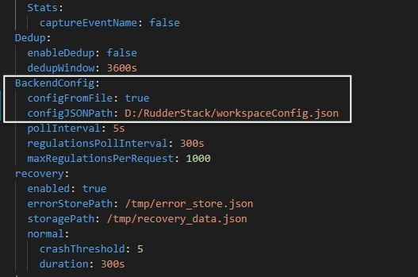

RudderStack's <Link to="/resources/rudderstack-architecture/#control-plane">control plane</Link> provides a UI that lets you manage your source and destination configurations.

<div class="successBlock">
The easiest way to manage your configurations is through <a href="https://app.rudderstack.com/signup">RudderStack Cloud</a>. It is free, requires no setup, and has some useful features like <Link to="/dashboard-guides/live-events/">Live Events</Link> and <Link to="/features/transformations/">Transformations</Link>.
</div>

To self-host your source-destination configurations, you can use the open-source <a href="https://github.com/rudderlabs/config-generator">Control Plane Lite</a> utility to set up your own control plane. It lets you manage your data pipelines locally by exporting or importing your configurations from a JSON file.

<div class="dangerBlock">
<a href="https://github.com/rudderlabs/config-generator">Control Plane Lite</a> is no longer actively maintained. As a result, some of the <a href="https://app.rudderstack.com/signup">RudderStack Cloud</a> features may not be available in your self-hosted control plane.
</div>

## Setting up the control plane

Before setting up your self-hosted control plane, make sure you have installed <a href="https://nodejs.org/en/download/">Node.js</a>.

<div class="warningBlock">
Node.js v16 and higher are not supported. For the best experience, using Node.js v14 is strongly recommended.
</div>

To set up your self-hosted control plane using Control Plane Lite, follow these steps: 

1. Clone the [RudderStack Control Plane Lite](https://github.com/rudderlabs/config-generator) repository. 
2. Open your terminal and navigate to the **Config Generator** folder. Then, run the following commands:

```bash
npm install
npm start
```

3. After the setup is complete, you can access the dashboard at `http://localhost:3000` by default.


## Exporting workspace configuration

After adding the required sources and destinations in the dashboard, you can export your workspace configuration by clicking the **EXPORT** button. The configuration is then exported and saved as a JSON file. This file is required to start the RudderStack server.

## Starting RudderStack server with the workspace configuration file

For RudderStack to pick up the exported workspace configuration file, follow the steps in the below sections depending on your setup method.

### Docker

1. Download and open [`rudder-docker.yml`](https://raw.githubusercontent.com/rudderlabs/rudder-server/master/rudder-docker.yml).
2. In the `environment` section under `backend` service, uncomment the following lines:

```yaml
  - RSERVER_BACKEND_CONFIG_CONFIG_FROM_FILE=true
  - RSERVER_BACKEND_CONFIG_CONFIG_JSONPATH=<workspace_config_filepath_in_container>
```

3. Then, replace `<workspace_config_filepath_in_container>`  in the above line with your container file path. By default, you can set it to `/etc/rudderstack/workspaceConfig.json`.
4. In the `volumes` section under the `backend` service, uncomment the following line:

```yaml
  - <absolute_path_to_workspace_config>:<workspace_config_filepath_in_container>
```

5. Next, replace `<absolute_path_to_workspace_config>` with the local path of your `workspaceConfig.json`(where your workspace configuration file is saved locally). Also, replace  `<workspace_config_filepath_in_container>`  with the container file path that you set in **Step 3**.

<div class="warningBlock">
The value for <code class="inline-code">&lt;workspace_config_filepath_in_container&gt;</code> should be the same as the value provided for the  <code class="inline-code">RSERVER_BACKEND_CONFIG_CONFIG_JSONPATH</code> variable. Otherwise, your workspace configuration will not be loaded and you will get an error.
</div>

6. At this stage, your `rudder-docker.yml` should look like the following:


7. Finally, navigate to the directory where you want to install RudderStack and run the following command:

```bash
docker-compose -f rudder-docker.yml up
```

Once you have completed these steps above successfully, <Link to="/get-started/rudderstack-open-source/sending-test-events/">send test events</Link>  to verify your installation.

### Kubernetes

1. Clone the [repository](https://github.com/rudderlabs/rudderstack-helm) containing the RudderStack Helm chart by running the following command:

```bash
git clone git@github.com:rudderlabs/rudderstack-helm.git
```

2. Navigate to the folder containing the Helm chart, as shown:

```bash
cd rudderstack-helm/
```

3. Open the `values.yaml` file.
4. Set the parameter `controlPlaneJSON` to `true`.
5. Export the workspace configuration from the dashboard by following the steps in the [Exporting workspace configuration](#exporting-workspace-configuration) section above. Place the exported file in the `rudderstack-helm` folder.
6. Finally, run the following command:

```bash
helm install my-release ./ --set backend.controlPlaneJSON=true
```

<div class="infoBlock">
Refer to the <Link to="/get-started/rudderstack-open-source/data-plane-setup/kubernetes/#configuration">Configurable parameters</Link> section for information on the parameters that can be configured during deployment.
</div>

Once you have completed these steps above successfully, <Link to="/get-started/rudderstack-open-source/sending-test-events/">send test events</Link> to verify your installation.

### Developer machine setup

1. First, set up the database in your preferred directory using the following commands:

```bash
createdb jobsdb
createuser --superuser rudder
psql "jobsdb" -c "alter user rudder with encrypted password 'rudder'";
psql "jobsdb" -c "grant all privileges on database jobsdb to rudder";
```

2. Next, clone the [RudderStack server](https://github.com/rudderlabs/rudder-server) repository.  
3. Then, run `git submodule init` and `git submodule update` to fetch the `rudder-transformer` repository.  
4. Next, navigate to the **rudder-transformer** directory:

```bash
cd rudder-transformer
```

5. Install the dependencies using the command `npm i` . Then, start the destination transformer using the following command:

```bash
node destTransformer.js
```

6. Navigate back to the main directory using the command `cd rudder-server`. 
7. Next, copy the `sample.env` to the main directory, as shown:

```bash
cp config/sample.env .env
```

8. Then, go to the `config` folder and open `config.yaml`.
9. Under `[BackendConfig]`, look for `configFromFile` and set it to `true`. 
10. Also, change the value of `configJSONPath` to the local path of your `workspaceConfig.json`(where your workspace configuration file is saved locally), as shown:



11. Finally, run the RudderStack server using the following command:

  ```bash
  go run main.go
  ```

Once you have completed these steps above successfully, <Link to="/get-started/rudderstack-open-source/sending-test-events/">send test events</Link> to verify the installation.

### Control plane URL

RudderStack's SDKs expect the source configurations and the associated device mode destination configurations for initialization. When self-hosting the control plane, you must serve these configurations (exported JSON files) on your web server and point the SDKs to them. 

These configurations must be available at `<CONTROL_PLANE_URL>/sourceConfig`. For more information, follow the below steps:

1. Set up your control plane using the Control Plane Lite utility. 
2. Go to the dashboard, set up your source, and export the source configuration by clicking the **EXPORT SOURCE CONFIG** button, as shown:


3. Host the exported file on your server such that they can be accessed via the path `<CONTROL_PLANE_URL>/sourceConfig`. Provide the base URL of your server `<CONTROL_PLANE_URL>` serving this file in your SDK initialization code snippet. 

For more information, refer to the following sections in the respective SDK guides:

* <Link to="/sources/event-streams/sdks/rudderstack-javascript-sdk/load-js-sdk/#loading-sdk-for-self-hosted-control-plane">JavaScript SDK instructions</Link>
* <Link to="/sources/event-streams/sdks/rudderstack-android-sdk/#configuring-your-rudderstack-client">Android SDK instructions</Link>
* <Link to="/sources/event-streams/sdks/rudderstack-ios-sdk/#configuring-the-rudderstack-client">iOS SDK instructions</Link>
* <Link to="/sources/event-streams/sdks/rudderstack-react-native-sdk/">React Native SDK instructions</Link>
* <Link to="/sources/event-streams/sdks/rudderstack-flutter-sdk/flutter-v1/#configuring-your-rudderstack-client">Flutter SDK instructions</Link>

<div class="successBlock">
The RudderStack SDKs automatically fetch the configuration by appending <code class="inline-code">/sourceConfig</code> to the base server URL provided above. For example, <code class="inline-code">&#123;CONTROL_PLANE_URL&#125;/sourceConfig</code>.
</div>

A sample exported source configuration is shown below:

```json
{
  "source": {
    "config": {},
    "id": "1im8yfXQsocRBGcQLXAaq5M8dYV",
    "name": "test-JS",
    "writeKey": "1im8yk2sz8oyHVCGVqViSNfKVDF",
    "enabled": true,
    "sourceDefinitionId": "1TW48i2bIzEl1HPf825cEznfIM8",
    "deleted": false,
    "createdAt": "Mon Oct 12 2020 16:51:54 GMT+0530 (India Standard Time)",
    "updatedAt": "Mon Oct 12 2020 16:51:54 GMT+0530 (India Standard Time)",
    "sourceDefinition": {
      "id": "1TW48i2bIzEl1HPf825cEznfIM8",
      "name": "Javascript",
      "displayName": "Javascript",
      "category": null,
      "createdAt": "2019-11-12T12:39:19.885Z",
      "updatedAt": "2020-06-18T11:54:06.114Z"
    },
    "destinations": [
      {
        "id": "1im927dBatOkbj1oPCV5JntGMj7",
        "name": "test-HJ",
        "enabled": true,
        "config": {
          "siteID": "dd41289"
        },
        "destinationDefinition": {
          "config": {
            "destConfig": {
              "web": [
                "useNativeSDK"
              ],
              "defaultConfig": [
                "siteID"
              ]
            },
            "secretKeys": [],
            "excludeKeys": [],
            "includeKeys": [
              "siteID"
            ],
            "supportedSourceTypes": [
              "web"
            ]
          },
          "id": "1SxbQXdfQ2NzIdqNO3GceshF4V0",
          "name": "HOTJAR",
          "displayName": "Hotjar",
          "createdAt": "2019-10-31T07:49:37.450Z",
          "updatedAt": "2020-09-05T10:02:39.744Z"
        }
      }
    ]
  },
  "metadata": {
    "version": "1.0.2"
  }
}
```

## FAQ

### How do I obtain the control plane URL for a self-hosted environment?

<div class="infoBlock">
This solution assumes that you have already set up the RudderStack data plane (backend) locally.
</div>

To use the control plane URL to initialize your SDKs, follow these steps:

1. [Set up](#setting-up-the-control-plane) the control plane using the Control Plane Lite utility.
2. Go to the dashboard, configure the source, and export the source configuration by clicking the **EXPORT SOURCE CONFIG** button as shown:


3. Host the exported file on your own server such that the configuration is available at  `<CONTROL_PLANE_URL>/sourceConfig`.