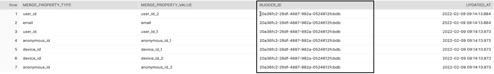
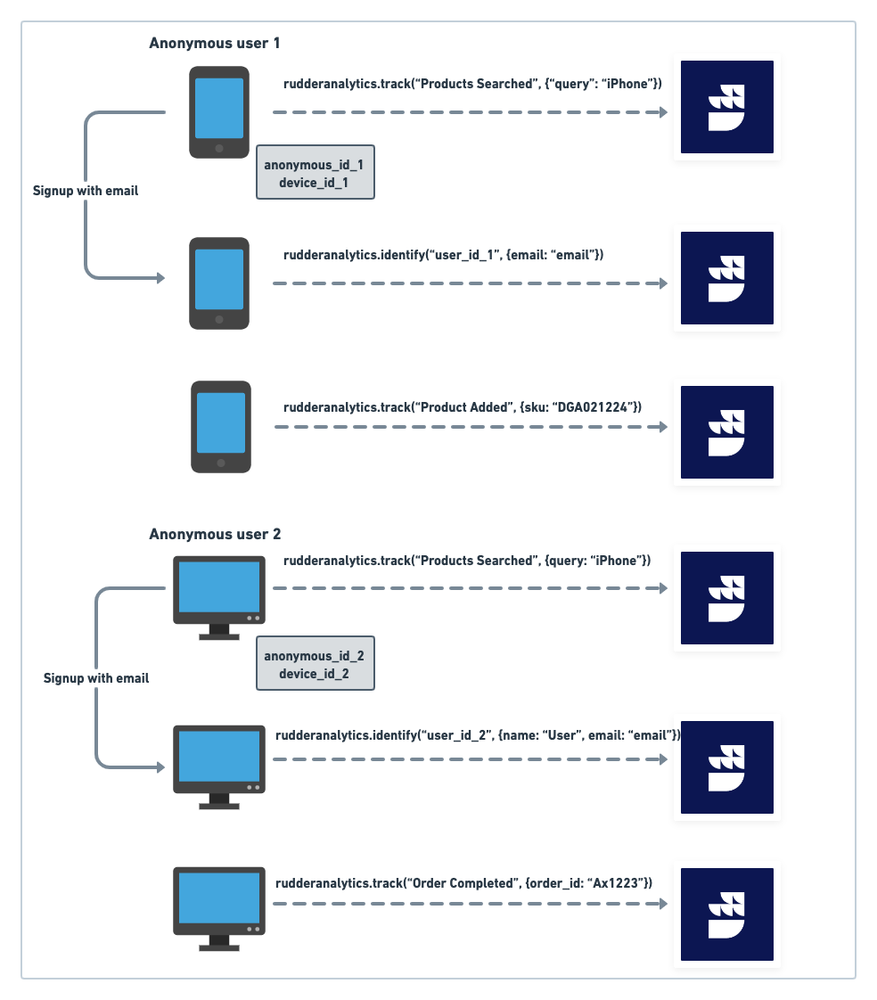
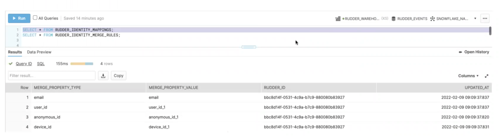
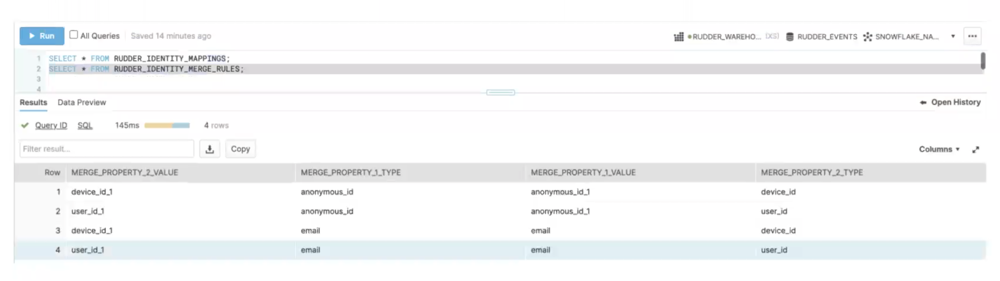

# Identity Resolution

Across a user's product journey, multiple identifiers get associated with them. These include their email ID, phone number, device IDs, anonymous ID, account usernames, etc. **Identity resolution** is the process of matching these different identifiers across multiple devices and digital touchpoints to build a cohesive and omnichannel customer profile. A unified customer view enables businesses to deliver relevant messaging and enhance the user's customer journey.

<div class="successBlock">

With RudderStack's warehouse-first architecture, you can send all your cross-platform data to your warehouse and perform identity resolution on it.
</div>

This guide walks you through RudderStack's identity resolution feature in detail.

## How identity resolution works

Identity resolution involves the usage of an **identity graph** - a database that houses and brings together all the different user identifiers throughout their journey into a single customer view. The identity graph collects and continually updates the customer profile with multiple identifiers mentioned above, like email, phone number, device IDs, etc.

The following three steps summarize the identity resolution process:

1. Collect the user identifiers across various touchpoints (device IDs, email addresses, cookies, etc.)
2. Connect these identifiers to an identity graph to build a unified user profile.
3. Activate this profile by connecting it to various analytics, marketing, CRM tools as per the business requirement.

## Identity resolution in RudderStack

In modern businesses, the identity graph used for cross-device identity stitching can be quite large, sometimes consisting of hundreds of millions of nodes. As you gather more data, this number increases rapidly. In such a scenario, storing the identity graph in your data warehouse makes a lot of sense from a storage and scalability perspective.

With RudderStack, you can build an identity graph on top of your enriched warehouse data and store it in your warehouse as a table. RudderStack associates a unique virtual ID (`RUDDER_ID`)with all the mapped user identifiers and updates it continuously as new data comes into your warehouse.



## Use case 

This use case gives a quick walkthrough of a user's product journey on an e-commerce app integrated with RudderStack. You will see how RudderStack can be used to track and merge different user identifiers to build a unified customer profile.

1. The user **anonymously** searches for a particular product on their mobile app - in this case, an iPhone. Here, RudderStack identifies the user with `anonymous_id_1` and the device with `device_id_1`.
2. After browsing through the app, the user adds a product to their cart and **logs in** using their email. Here, RudderStack generates an `identify` event and associates `anonymous_id_1` with the user's email ID `email` (user's unique identifier). Note that RudderStack also generates a `track` call with the details around the browsing activity and updates to the cart.
3. For some reason, the user does not proceed with the purchase and drops off.
4. Later, the same user uses a laptop and browses through the e-commerce website **anonymously**. Again, RudderStack generates an `anonymous_id_2` corresponding to the user and a device ID `device_id_2`.
5. The user then **logs in** with their email and password. RudderStack then generates an `identify` call associating the same `email` with `anonymous_id_2`. The user then proceeds to complete the purchase. A `track` call is then generated with the details around the purchase.

The above workflow is visually represented in the following image:



RudderStack then applies the [identity merges](#merging-identifiers-with-rudderstack) on all the events and generates a [`RUDDER_IDENTITY_MAPPINGS`](#what-happens-in-the-warehouse-after-merging-the-identifiers) table that includes all the identity mappings associated with the user. It also assigns a unique `RUDDER_ID` for all the merged identities.

## Merging identifiers with RudderStack

RudderStack has a `merge` API that you can use to send and merge different user identities and associate them to a single customer profile. You can also leverage RudderStack's [Transformations](#user-transformations) feature to merge different identifiers before sending the data to the warehouse.

<div class="infoBlock">

  RudderStack auto-merges the following user identifiers by default so you don't need to call the <code class="inline-code">merge</code> API for them or merge them via transformations:
  <ul>
    <li><code class="inline-code">userId</code> and <code class="inline-code">previousId</code> for <a href="https://www.rudderstack.com/docs/rudderstack-api/api-specification/rudderstack-spec/alias/"><code class="inline-code">alias</code></a> calls</li>
    <li> <code class="inline-code">userId</code> and <code class="inline-code">anonymousId</code> for <a href="https://www.rudderstack.com/docs/rudderstack-api/api-specification/rudderstack-spec/track/"><code class="inline-code">track</code></a>, <a href="https://www.rudderstack.com/docs/rudderstack-api/api-specification/rudderstack-spec/page/"><code class="inline-code">page</code></a>, <a href="https://www.rudderstack.com/docs/rudderstack-api/api-specification/rudderstack-spec/group/"><code class="inline-code">group</code></a>, and <a href="https://www.rudderstack.com/docs/rudderstack-api/api-specification/rudderstack-spec/screen/"><code class="inline-code">screen</code></a> calls</li>
  </ul>
</div>

<div class="successBlock">

  You can merge other user identifiers like device ID, phone number, email ID, etc. by calling the <code class="inline-code">merge</code> API or via user transformations.
</div>

### Using the `merge` API

As mentioned above, RudderStack provides a `merge` API to connect and merge different user identifiers in the warehouse.

The `merge` event structure is as shown:

```json
{
    "type": "merge",
    "mergeProperties": [
        {
            "type": "merge_property_type_1",
            "value": "merge_property_value_1"
        },
        {
            "type": "merge_property_type_2",
            "value": "merge_property_value_2"
        }
    ]
}
```

Here, `"type": "merge_property_type_*"` corresponds to a unique user identifier like email address, phone number, device ID, anonymous ID, etc. that can be merged and connected to a given user profile.

### User transformations

Alternatively, you can use [RuddderStack Transformations](https://www.rudderstack.com/docs/transformations/) to merge user identifiers in your event data before sending it to the warehouse destination.

A sample transformation is as shown:

```javascript
function transform(events) {
  const mergeEvents = [];
  events.forEach((ev) => {
    if (ev.type === "track" && ev.event === "<EVENT_NAME>") {
      let mergeEvent = {
        type: "merge",
        //mergeProperties expects an array of two objects with each mergeProperty type and value
        mergeProperties: [{
            type: "email",
            value: "email"
          },
          {
            type: "deviceID",
            value: "device-id-1"
          }
        ]
      }
      mergeEvents.push(mergeEvent)
    }
  })
  return events.concat(mergeEvents)
}
```

### What happens in the warehouse after merging the identifiers?

Once you call the `merge` API or leverage the user transformations to merge the user identifiers, RudderStack creates the following two tables in your warehouse:

| Table | Description |
| :----| :-------|
| `RUDDER_IDENTITY_MAPPINGS` | Contains the nodes (user properties and their values) associated with a given identity graph (customer profile). Each node has a  `RUDDER_ID` associated with it. |
| `RUDDER_IDENTITY_MERGE_RULES` | Contains all the edges that connect two different identifiers (nodes). |

In the context of the above [use case](#use-case), the `RUDDER_IDENTITY_MAPPINGS` table highlighting the different identifiers associated with the user is as shown:



The `RUDDER_IDENTITY_MERGE_RULES` table that connects different user identifiers is shown below:



## Enriching the identity graph

As the user logs in using more devices, different identifiers are associated with them. RudderStack easily tracks and merges them into the same virtual ID (`RUDDER_ID`) in the warehouse.

This allows you to enrich the user profile with more information across various digital touchpoints without worrying about the size or the scale. You can use this information to deliver personalized product and user experiences.

## FAQ

### Does RudderStack auto-merge any user identifiers?

Yes,  RudderStack auto-merges the following user identifiers by default so you don't need to call the`merge` API or leverage user transformations to merge them:

- `userId` and `previousId` for the [`alias`](https://www.rudderstack.com/docs/rudderstack-api/api-specification/rudderstack-spec/alias/) calls
- `userId` and `anonymousId` for the [`track`](https://www.rudderstack.com/docs/rudderstack-api/api-specification/rudderstack-spec/track/), [`group`](https://www.rudderstack.com/docs/rudderstack-api/api-specification/rudderstack-spec/group/), and [`screen`](https://www.rudderstack.com/docs/rudderstack-api/api-specification/rudderstack-spec/screen/) calls.

For merging other user identifiers like device ID, phone number, email ID, etc. RudderStack provides a <a href="#using-the-merge-api"><code class="inline-code">merge</code></a> API. Alternatively, you can use the [Transformations](https://www.rudderstack.com/docs/transformations/) feature to merge these identifiers.

## Contact us

For queries on any of the sections covered in this guide, you can [contact us](mailto:%20docs@rudderstack.com) or start a conversation on our [Slack](https://rudderstack.com/join-rudderstack-slack-community) channel.
