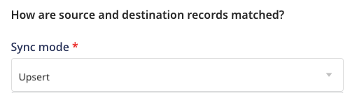
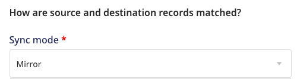

# Sync Modes

The Reverse ETL sources support two sync modes that let you define how to sync your data to the destination:
* Upsert mode
* Mirror mode

 
Currently, the <a href="https://www.rudderstack.com/docs/reverse-etl/amazon-redshift/">Redshift</a>, <a href="https://www.rudderstack.com/docs/reverse-etl/postgresql/">PostgreSQL</a>, <a href="https://www.rudderstack.com/docs/reverse-etl/snowflake/">Snowflake</a>, and <a href="https://www.rudderstack.com/docs/reverse-etl/google-bigquery/">BigQuery</a> warehouse sources support syncing data via these sync modes.

 
You can configure the sync mode while connecting a destination with your Reverse ETL source.

By default, these modes sync the data incrementally, meaning they only sync the new data. However, you can choose to run a full sync manually.

## Upsert mode

In this mode, RudderStack supports insertion of new records and updates to the existing records, while syncing data to the destination. 

 
The upsert mode is supported for all destinations connected to the above-mentioned Reverse ETL sources, except <a href="https://www.rudderstack.com/docs/destinations/advertising/fb-custom-audience/">Facebook Custom Audience</a>.

 

Whenever the columns mapping is changed, RudderStack runs a full sync the next time.

## Mirror mode

In this mode, RudderStack 'mirrors' the source by keeping the destination data the same as the source data. It performs insertion, updates, and deletion of records while syncing data to the destination. 

 This mode is currently supported only for the <a href="https://www.rudderstack.com/docs/destinations/advertising/fb-custom-audience/">Facebook Custom Audience</a> destination connected to the above-mentioned Reverse ETL sources.

Whenever the columns mapping is changed, RudderStack runs a full sync the next time. While performing a full sync, RudderStack first deletes all the existing records and then syncs the records as per the latest column mappings.

## FAQ

### What happens to the records that have not been successfully sent to the destination in the previous sync?

In case of an unsuccessful delivery, RudderStack retries sending the events in the next sync.

## Contact us

For queries on any of the sections covered in this guide, you can [**contact us**](mailto:%20docs@rudderstack.com) or start a conversation in our [**Slack**](https://rudderstack.com/join-rudderstack-slack-community) community.
