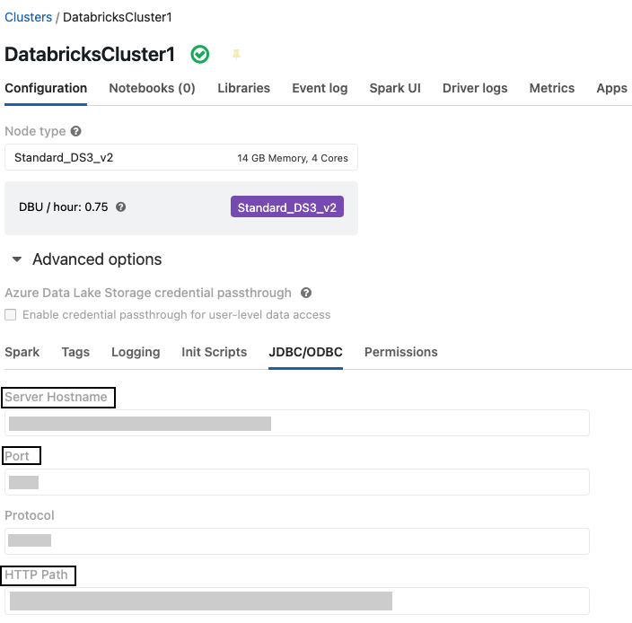
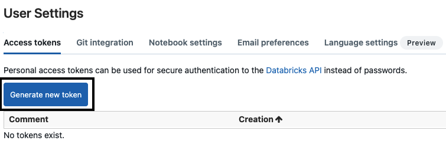

[Databricks](https://databricks.com/) is a data analytics platform that lets you easily integrate with open source libraries. It offers a simple collaborative environment to run interactive and scheduled data analysis workloads.

RudderStack supports Databricks as a source from which you can ingest data and route it to your desired downstream destinations.

## Granting permissions

RudderStack requires you to grant certain user permissions on Databricks to successfully access data from it.

Follow the steps listed in the following sections in the  **exact order** to grant these permissions:

### Step 1: Add a user

- Add a new user (for example, user@example.com) by following the steps in the [Databricks documentation](https://docs.databricks.com/administration-guide/users-groups/users.html#add-a-user).

### Step 2: Creating the RudderStack schema and granting permissions

1. Create a dedicated schema `_rudderstack`.

```sql
CREATE SCHEMA `_rudderstack`;
```

<div class="warningBlock">
The <code class="inline-code">_rudderstack</code> schema is used by RudderStack for storing the state of each data sync. <strong>This name should not be changed</strong>.
</div>

2. Grant full access to the schema `_rudderstack` for the user created in step 1.

```sql
GRANT ALL PRIVILEGES ON SCHEMA `_rudderstack` TO `user@example.com`
```
**Replace `user@example.com` with the user created in step 1.**

## Setting up the Databricks source in RudderStack

To set up Databricks as a source in RudderStack, follow these steps:

### Naming the source

1. Log into your [RudderStack dashboard](https://app.rudderstack.com).
2. From the left panel, go to **Source** > **New Source** > **Reverse ETL**. Then, select **Databricks**, as shown:


3. Assign a name to your source.

### Configuring the connection credentials

1. Enter the relevant settings from Databricks in the **Connection Credentials** section as shown below:
   - **Host** - Enter the server hostname.
   - **Port** - Enter the port number.
   - **Path** - Enter the HTTP path.
   - **Token** - Enter the personal access token.

<div class="infoBlock">
For more information on getting these settings in Databricks, refer to the <Link to="#faq">FAQ</Link> section below.
</div>

<div class="successBlock">
If you've already configured Databricks as a source before, your existing credentials will automatically appear under <strong>Use Existing Credentials</strong>.
</div>

2. Click on **Continue** to proceed.

### Schedule settings

1. Specify the **Schedule Settings** to schedule the data syncs from your Databricks source.

<div class="infoBlock">
RudderStack lets you schedule data syncs for your Reverse ETL sources and specify how and when the syncs will run. For more information on the <strong>Basic</strong>, <strong>CRON</strong>, and <strong>Manual</strong> schedule types, refer to the <Link to="/reverse-etl/common-settings/sync-schedule-settings">Sync Schedule Settings</Link> guide.
</div>

2. After specifying the schedule type and run settings, click on **Continue** to finish the setup.

Databricks is now successfully configured as a source in your RudderStack dashboard. You can further connect this source to your preferred destination by clicking on **Add Destination** button, as shown:


<div class="infoBlock">
If you have already configured a destination in RudderStack, choose the <strong>Use Existing Destination</strong> option which will take you to the <strong>Schema</strong> tab in the source settings. To add a new destination from scratch, select the <strong>Create New Destination</strong> option which will take you to the destination configuration page.
</div>

## Specifying the data to import

While connecting a destination to your Databricks source, you can use the default JSON mapping feature.

<div class="infoBlock">
Note that the <Link to="/reverse-etl/features/visual-data-mapper/">Visual Data Mapping</Link> feature is not supported for Databricks currently.
</div>

<div class="infoBlock">
For more information on the data import settings, refer to the <a href="https://www.rudderstack.com/docs/reverse-etl/common-settings/importing-data-using-tables/">Importing Data using Tables</a> guide.
</div>

## FAQ

### Where can I obtain the connection credentials for Databricks?

To obtain the **Host**, **Path**, and **Port** number, go to your Databricks account and follow these steps:

1. Go to the **Compute** tab and select your Databricks cluster.
2. Click on **Advanced options** > **JDBC/ODBC** tab to find the required settings:


To obtain the **Token**, go to the **Settings** > **User Settings** in your Databricks account and generate a new personal access token, as shown:


<div class="infoBlock">
Refer to the <a href="https://docs.databricks.com/dev-tools/api/latest/authentication.html#generate-a-personal-access-token">Databricks documentation</a> for more details on generating a personal access token.
</div>

## Contact us

For queries on any of the sections covered in this guide, you can [contact us](mailto:%20docs@rudderstack.com) or start a conversation in our [Slack](https://rudderstack.com/join-rudderstack-slack-community) community.
