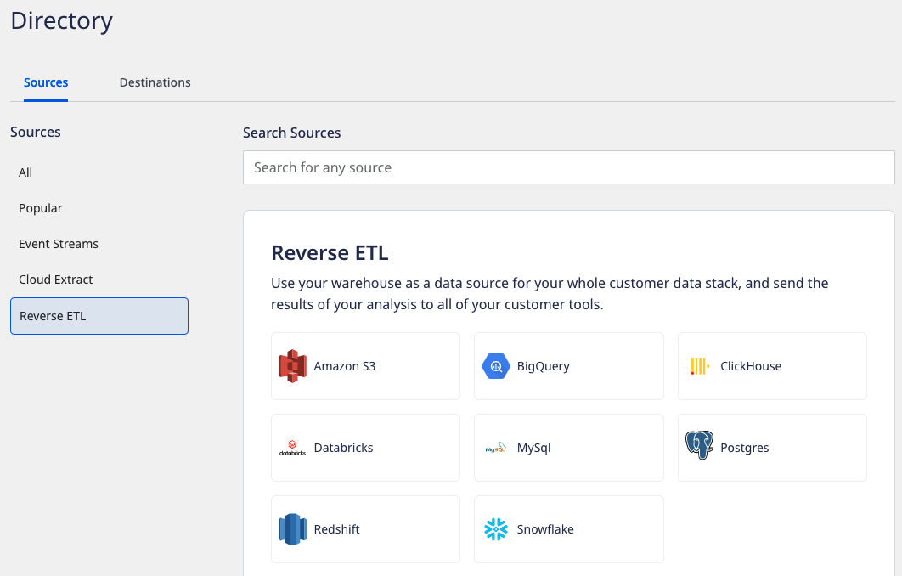

# Databricks

[Databricks](https://databricks.com/) provides a unified, open platform for all our data. It offers a simple collaborative environment to run interactive and scheduled data analysis workloads.

RudderStack supports Databricks as a source from which you can ingest data and route it to your desired downstream destinations.

## Setting up the Databricks source in RudderStack

To set up Databricks as a source in RudderStack, follow these steps:

### Naming the source

1. Log into your [RudderStack dashboard](https://app.rudderstack.com).
2. From the left panel, go to **Source** > **New Source** > **Reverse ETL**. Then, select **Databricks**, as shown:

3. Assign a name to your source.

### Configuring the connection credentials

1. Enter the relevant settings in the **Connection Credentials** sections as shown below:
   - **Host** - Enter the Server Hostname of your Databricks service.
   - **Port** - Enter the port number of your Databricks service.
   - **Path** - Enter your HTTP Path of your Databricks service.
   - **Token** - Enter the personal access token .

Refer to the <Link to="#faq">FAQ</Link> section to know more about where to obtain these settings in Databricks.

  If you've already configured Databricks as a source before, your existing credentials will automatically appear under <strong>Use Existing Credentials</strong>.

2. Click on **Continue** to proceed.

### Schedule settings

1. Specify the **Schedule Settings** to schedule the data syncs from your Databricks source.

RudderStack lets you schedule data syncs for your Reverse ETL sources and specify how and when the syncs will run. For more information on the <strong>Basic</strong>, <strong>CRON</strong>, and <strong>Manual</strong> schedule types, refer to the <Link to="/reverse-etl/common-settings/sync-schedule-settings">Sync Schedule Settings</Link> guide.

2. After specifying the schedule type and run settings, click on **Continue** to finish the setup.

Databricks is now successfully configured as a source in your RudderStack dashboard. You can further connect this source to your preferred destination by clicking on **Add Destination** button, as shown:

If you have already configured a destination in RudderStack, choose the <strong>Use Existing Destination</strong> option which will take you to the <strong>Schema</strong> tab in the source settings. To add a new destination from scratch, select the <strong>Create New Destination</strong> option which will take you to the destination configuration page.

## Specifying the data to import

While connecting a destination to your Databricks source, you can use the default JSON mapping feature.

For more information on the data import settings, refer to the <a href="https://www.rudderstack.com/docs/reverse-etl/common-settings/importing-data-using-tables/">Importing Data using Tables</a> guide.

## FAQ

### Where can I obtain the Host, Port, Path and Token for Databricks?

To get the **Host**, **Path** and **Port**, follow these steps:

1. Login to the Azure portal, 
2. Select the required Databricks resource and then click Launch Workspace
3. Go to Compute tab and select your databricks clkuster
4. Click on Advanced options > JDBC/ODBC tab to find the details:

To get the **Token**, follow these steps:
1. Login to the Azure portal, 
2. Select the required Databricks resource and then click Launch Workspace
3. Go to Settings > User settings to generate persoinal access token:

## Contact us

For queries on any of the sections covered in this guide, you can [contact us](mailto:%20docs@rudderstack.com) or start a conversation in our [Slack](https://rudderstack.com/join-rudderstack-slack-community) community.
