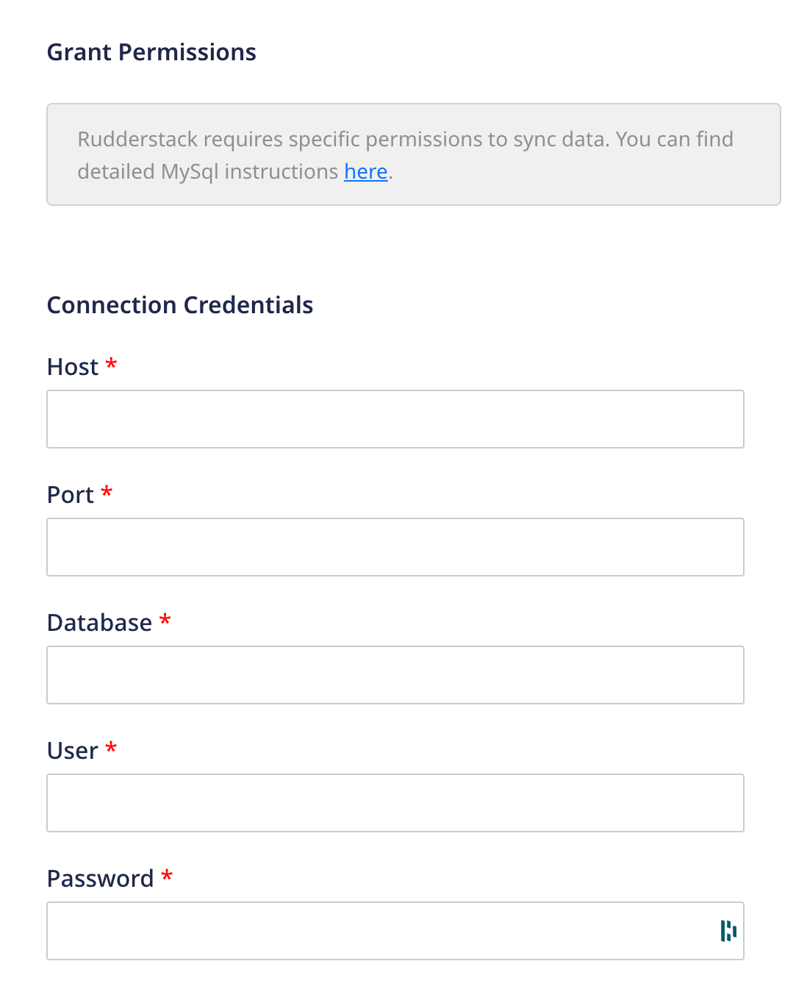
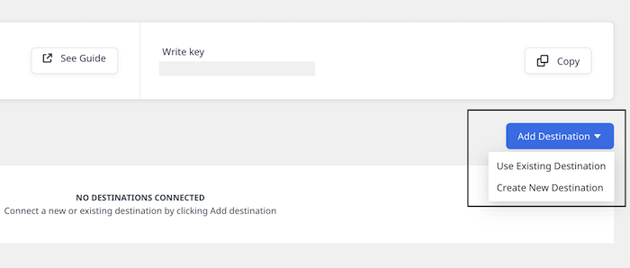
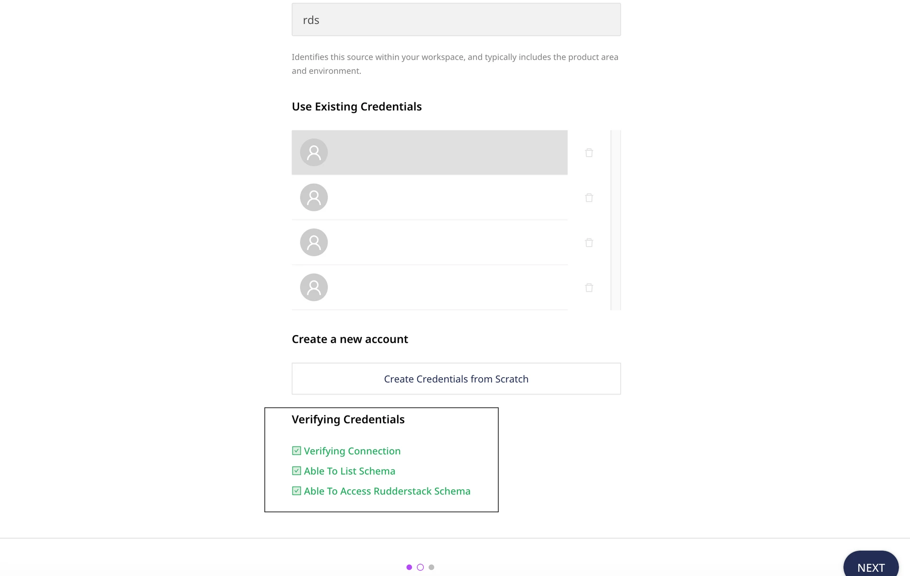

# MySQL

[MySQL](https://www.mysql.com/) is a popular open source relational DBMS.

RudderStack supports MySQL as a source from which you can ingest data and route it to your desired downstream destinations.

## Granting permissions

RudderStack requires you to grant certain user permissions on your MySQL database to successfully access data from it.

Run the SQL queries listed in the following sections in the  **exact order** to grant these permissions:

### Step 1: Creating the user

- Create a new user `RUDDER` with a password `<strong_unique_password>` in MySQL, as shown:

```sql
CREATE USER RUDDER IDENTIFIED BY '<strong_unique_password>';
```

<div class="warningBlock">

Set a strong, unique password for creating the user in MySQL.
</div>

### Step 2: Creating the RudderStack schema and granting permissions

1. Create a dedicated schema `_rudderstack`.

```sql
CREATE SCHEMA _rudderstack;
```

<div class="warningBlock">

The <code class="inline-code">_rudderstack</code> schema is used by RudderStack for storing the state of each data sync. <strong>This name should not be changed</strong>.
</div>

2. Grant full access to the schema `_rudderstack` for the user `RUDDER`.

```sql
GRANT ALL PRIVILEGES ON _rudderstack.* TO RUDDER;
```

## Setting up the MySQL source in RudderStack

To set up MySQL as a source in RudderStack, follow these steps:

### Naming the source

1. Log into your [RudderStack dashboard](https://app.rudderstack.com/).
2. From the left navigation bar, go to **Source** > **New Source** > **Reverse ETL**.  Then, select **MySQL**.
3. Assign a name to your source and click on **Continue**.

### Configuring the connection credentials

1. Enter the relevant connection details in the **Connection Credentials**, as shown:



* **Host**: Enter the host name of your MySQL service.
* **Port**: Enter the port number of your MySQL service.
* **Database**: Enter the database name in your MySQL instance where the data is loaded.
* **User**: Specify the username which has the required read/write access to the above database.
* **Password**: Enter the password for the above user.

<div class="infoBlock">

If you've configured a MySQL source before, you can select the existing credentials under the <strong>Use existing credentials</strong> option.
</div>

2. Click on **Continue**. RudderStack will then verify and validate your credentials. 

<div class="infoBlock">

For more information on these validation steps, refer to the <a href="#faq">FAQ</a> section. 
</div>

3. Once verified, click on **Continue** to proceed.

### Schedule settings

1. Specify the **Schedule Settings** to schedule the data syncs from your MySQL instance.

<div class="infoBlock">

RudderStack lets you schedule data syncs for your Reverse ETL sources and specify how and when the syncs will run. For more information on the <strong>Basic</strong>, <strong>CRON</strong>, and <strong>Manual</strong> schedule types, refer to the <a href="https://www.rudderstack.com/docs/reverse-etl/common-settings/sync-schedule-settings/">Sync Schedule Settings</a> guide.
</div>

2. After specifying the schedule type and run settings, click on **Continue** to finish the setup.

MySQL is now successfully configured as a source in your RudderStack dashboard. You can further connect this source to your preferred destination by clicking on **Add Destination** button, as shown:



<div class="infoBlock">
<ul>
    <li>If you have already configured a destination in RudderStack, select the <strong>Use Existing Destinations</strong> option which will take you to the <strong>Schema</strong> tab in the source settings.</li>
    <li>To add a new destination from scratch, select the <strong>Create New Destination</strong> option which will take you to the destination configuration page.</li>
</ul>
</div>

## Specifying the data to import

While connecting your MySQL source to a destination, you can configure the data to be imported using any one of the following methods:

- <Link to="/reverse-etl/features/visual-data-mapper/">Visual Data Mapper</Link>
- <Link to="/reverse-etl/common-settings/importing-data-using-tables/">JSON mapping</Link>

## FAQ

### What do the three validations under Verifying Credentials imply?

When setting up a Reverse ETL source, once you proceed after entering the connection credentials, you will see the following three validations under the **Verifying Credentials** option:



These options are explained below:

* **Verifying Connection**: This option indicates that RudderStack is trying to connect to the warehouse with the information specified in the connection credentials. 

<div class="warningBlock">

If this option gives an error, it means that one or more fields specified in the connection credentials are incorrect. Verify your credentials in this case.
</div>

* **Able to List Schema**: This option checks if RudderStack is able to fetch all the schema details using the provided credentials. 
* **Able to Access RudderStack Schema**: This option implies that RudderStack is able to access the `_rudderstack` schema you have created by successfully running all the commands in the [User Permissions](#step-2-creating-the-rudderstack-schema-and-granting-permissions) section. 

<div class="warningBlock">

If this option gives an error, verify if you have successfully created the `_rudderstack` schema and given RudderStack the required permissions to access it. For more information, refer to the <a href="#step-2-creating-the-rudderstack-schema-and-granting-permissions">User Permissions</a> sections.
</div>

## Contact us

For queries on any of the sections covered in this guide, you can [contact us](mailto:%20docs@rudderstack.com) or start a conversation in our [Slack](https://rudderstack.com/join-rudderstack-slack-community) community.
