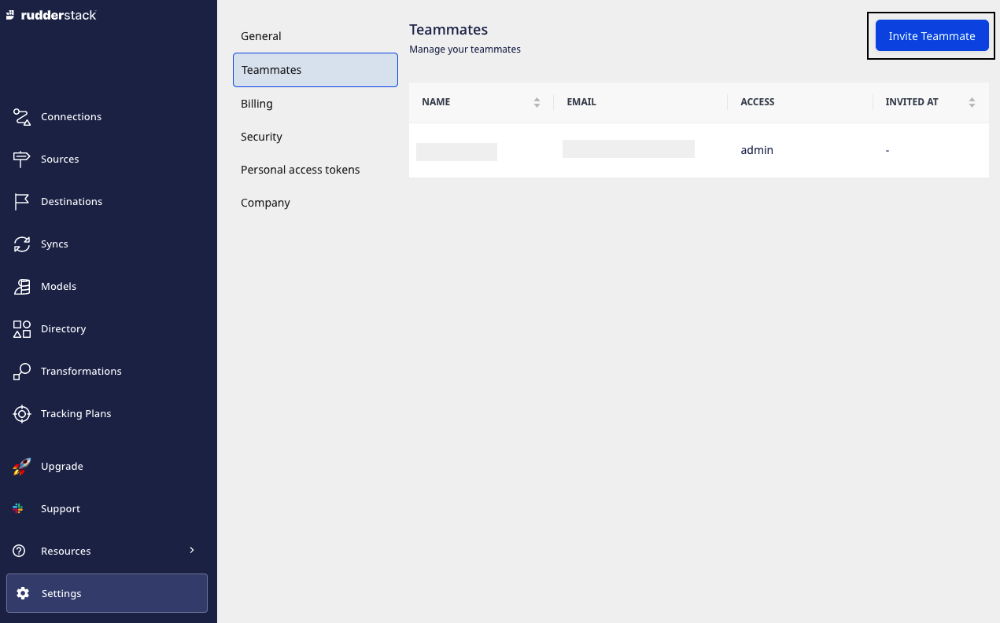
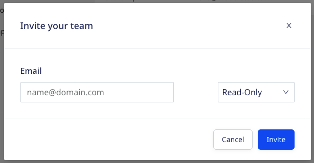

# Teammates (User Management)

The **Teammates** feature lets you add and manage other users in the current workspace of RudderStack dashboard. It also enables easier collaboration between you and other members of your team or organization.

The below table specifies the number of teammates you can add to your workspace in different RudderStack Cloud plans:

| Plan                        | Number of Teammates |
| :------------------------------- | :---------------------- |
| [RudderStack Cloud Free](https://app.rudderstack.com/signup?type=freetrial)       | 3                       |
| [RudderStack Cloud Pro](https://www.rudderstack.com/pricing/)      | 10                      |
| [RudderStack Cloud Enterprise](https://www.rudderstack.com/pricing/) | Unlimited               |

  Check <a href="https://rudderstack.com/pricing/">RudderStack pricing plans</a> for a
  complete list of the supported features or to upgrade the <a href="https://app.rudderstack.com/profile/billing">free plan</a>.

## Inviting a new user

To invite a user in your current workspace, follow these steps:

1. Click on the **Settings** option in the left navigation bar. 
2. Select **Teammates** and click on **Invite Teammate**.

2. Enter the **Email** and select the permissions you want to assign to the user. Then, click on **Invite**.

## User permissions

An invited user can be assigned any of the following three roles:

### Read-Only

This user role has the following permissions:

| Option       | View | Add | Modify | Delete |
| :----------- | :--- | :-- | :----- | :----- |
| [Sources](https://www.rudderstack.com/docs/rudderstack-cloud/sources/)     | Yes  | No  | No     | No     |
| [Destinations](https://www.rudderstack.com/docs/rudderstack-cloud/destinations/) | Yes  | No  | No     | No     |
| Setting up connections     | Yes  | No  | No     | No     |
| [Transformations](https://rudderstack.com/docs/transformations/) | Yes  | No  | No     | No     |

Some things to note regarding the read-only user permissions:
- Read-only users can view the settings of all the destinations. However, secrets like access keys are hidden from them.
- They can run tests on existing transformations but they cannot add, modify, or delete transformations.
- They can also view any secrets, like API keys in the transformation code.

### Read-Write

A read-write user has all the permissions of a read-only user. Additionally, they have permissions for different workspace features and options, as listed below:

| Option          | View | Add | Modify | Delete |
| :-------------- | :--- | :-- | :----- | :----- |
| [Sources](https://www.rudderstack.com/docs/rudderstack-cloud/sources/)         | Yes  | Yes | Yes    | Yes    |
| [Destinations](https://www.rudderstack.com/docs/rudderstack-cloud/destinations/)    | Yes  | Yes | Yes    | Yes    |
| Setting up connections     | Yes  | Yes | Yes    | Yes    |
| [Transformations](https://rudderstack.com/docs/transformations/) | Yes  | Yes | Yes    | Yes    |

### Admin

This user role has complete access to the RudderStack workspace, including all the options and features in the current plan:

| Option          | View | Add | Modify | Delete |
| :-------------- | :--- | :-- | :----- | :----- |
| [Sources](https://www.rudderstack.com/docs/rudderstack-cloud/sources/)      | Yes  | Yes | Yes    | Yes    |
| [Destinations](https://www.rudderstack.com/docs/rudderstack-cloud/destinations/)    | Yes  | Yes | Yes    | Yes    |
| Setting up connections    | Yes  | Yes | Yes    | Yes    |
| [Transformations](https://rudderstack.com/docs/transformations/) | Yes  | Yes | Yes    | Yes    |

The read-write and admin roles only differ when it comes to the <a href="#team">Team</a> feature.

### Other permissions

These user roles have specific permissions on other RudderStack features, as explained below:

#### Live Events

| Option  | Read-Only | Read-Write | Admin |
| :-------| :---------| :----------| :------|
| View live events at source and destination level | Yes  | Yes | Yes  |

Read-only users can view the events that might contain sensitive user information like PII. In some cases, they can also view the API keys and other API secrets of the destinations.

#### Syncs

| Option  | Read-Only | Read-Write | Admin |
| :-------| :---------| :----------| :------|
| Sync Cloud Extract and Warehouse Actions sources | No  | Yes | Yes  |
| View sync and history details | Yes  | Yes | Yes  |

#### Audit logs

| Option  | Read-Only | Read-Write | Admin |
| :-------| :---------| :----------| :------|
| View audit logs | No  | Yes | Yes  |

#### Team

| Option  | Read-Only | Read-Write | Admin |
| :-------| :---------| :----------| :------|
| View team member and role | Yes  | Yes | Yes  |
| Invite new user | No  | No | Yes  |
| Modify permissions of any user | No  | No | Yes  |
| Delete pending invitation | No  | No | Yes  |
| Remove user from workspace | No  | No | Yes  |

## Contact us

For queries on any of the sections covered in this guide, you can [contact us](mailto:%20docs@rudderstack.com) or start a conversation in our [Slack](https://rudderstack.com/join-rudderstack-slack-community) community.
