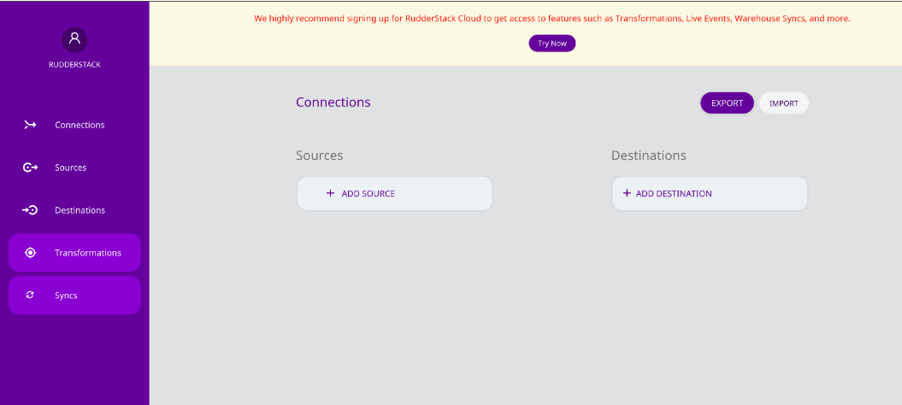
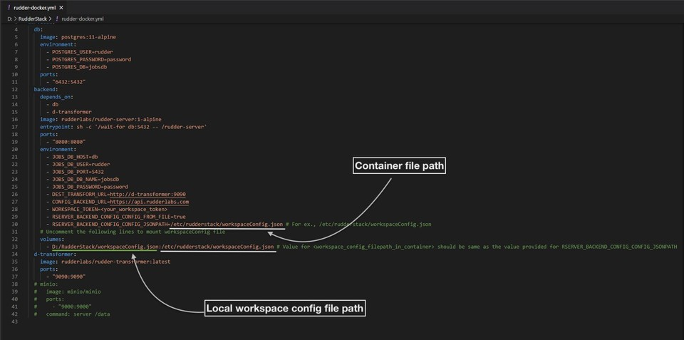
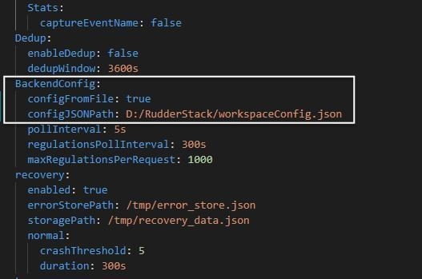
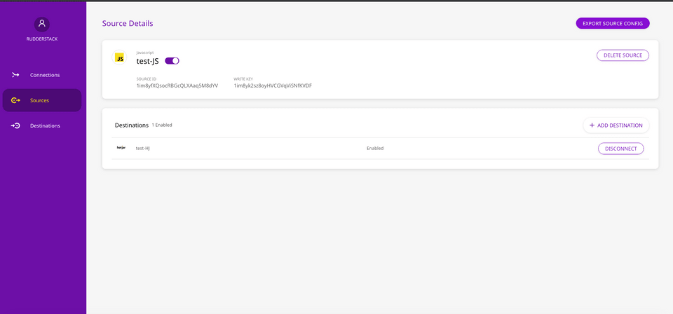

# Control Plane Setup

RudderStack's control plane manages the configuration of your sources and destinations.

<div class="infoBlock">

  For more information on the control plane, refer to RudderStack's <a href="https://rudderstack.com/docs/get-started/rudderstack-architecture/#control-plane">Architecture</a>.
</div>

The easiest way to manage these configurations is through RudderStack's [self-hosted control plane](https://app.rudderstack.com/). It is free, requires no setup, and has some useful features like [Live Events](https://www.rudderstack.com/docs/rudderstack-cloud/live-events/) and [Transformations](https://rudderstack.com/docs/transformations/).

If you don't wish to sign up for RudderStack and want to self-host these configurations instead, you can use the open-source **Control Plane Lite** utility to set up your own control plane. You can then manage the source and destination configurations locally by exporting or importing from a JSON file.

<div class="warningBlock">

The control plane set up using Control Plane Lite does not support Live Events and Transformations.
</div>

## Setting up the control plane

To set up your self-hosted control plane using the Control Plane Lite utility, follow these steps:

<div class="infoBlock">

Make sure you have <a href="https://nodejs.org/en/download/">Node.js</a> installed before setting up your self-hosted control plane.
</div>

1. Clone the [RudderStack Control Plane Lite](https://github.com/rudderlabs/config-generator) repository. 
2. Open your terminal and navigate to the **Config Generator** folder. Then, run the following commands:  


```bash
  npm install
  npm start
```

3. Upon successful setup, you can access the dashboard at `http://localhost:3000` by default.



## Exporting workspace configuration

After adding the required sources and destinations in the dashboard, you can export your workspace configuration by clicking on the **EXPORT** button. The configuration is then exported and saved as a JSON file. This file is required to start the RudderStack server.

## Starting RudderStack server with the workspace configuration file

For RudderStack to pick up the exported workspace configuration file, follow the steps for your preferred RudderStack setup.

### Docker

1. Download and open [`rudder-docker.yml`](https://raw.githubusercontent.com/rudderlabs/rudder-server/master/rudder-docker.yml).
2. In the `environment` section under `backend` service, uncomment the following lines:

```yaml
  - RSERVER_BACKEND_CONFIG_CONFIG_FROM_FILE=true
  - RSERVER_BACKEND_CONFIG_CONFIG_JSONPATH=<workspace_config_filepath_in_container>
```

3. Then, replace `<workspace_config_filepath_in_container>`  in the above line with your container file path. By default, you can set it to `/etc/rudderstack/workspaceConfig.json`.
4. In the `volumes` section under the `backend` service, uncomment the following line:

```yaml
  - <absolute_path_to_workspace_config>:<workspace_config_filepath_in_container>
```

5. Next, replace `<absolute_path_to_workspace_config>` with the local path of your `workspaceConfig.json`(where your workspace configuration file is saved locally). Also, replace  `<workspace_config_filepath_in_container>`  with the container file path that you set in **Step 3**.

<div class="warningBlock">

  The value for <code class="inline-code">&lt;workspace_config_filepath_in_container&gt;</code> should be the same as the value provided for the  <code class="inline-code">RSERVER_BACKEND_CONFIG_CONFIG_JSONPATH</code> variable. Otherwise, your workspace configuration will not be loaded and you will get an error.
</div>

6. At this stage, your `rudder-docker.yml` should look like the following:



7. Finally, navigate to the directory where you want to install RudderStack and run the following command:

```bash
  docker-compose -f rudder-docker.yml up
```

Once you have completed these steps above successfully, [send test events](https://rudderstack.com/docs/rudderstack-open-source/installing-and-setting-up-rudderstack/sending-test-events) to verify your installation.

### Kubernetes

1. Clone the [repository](https://github.com/rudderlabs/rudderstack-helm) containing the RudderStack Helm chart by running the following command:

```bash
git clone git@github.com:rudderlabs/rudderstack-helm.git
```

2. Navigate to the folder containing the Helm chart, as shown:

```bash
cd rudderstack-helm/
```

3. Open the `values.yaml` file.
4. Set the parameter `controlPlaneJSON` to `true`.
5. Export the workspace configuration from the dashboard by following the steps in the [Exporting workspace configuration](#exporting-workspace-configuration) section above. Place the exported file in the `rudderstack-helm` folder.
6. Finally, run the following command:

```bash
helm install my-release ./ --set backend.controlPlaneJSON=true
```

<div class="infoBlock">

  Refer to the <a href="https://rudderstack.com/docs/rudderstack-open-source/installing-and-setting-up-rudderstack/kubernetes/#configuration">Configurable parameters</a> section for information on the parameters that can be configured during deployment.
</div>

Once you have completed these steps above successfully, [send test events](https://rudderstack.com/docs/rudderstack-open-source/installing-and-setting-up-rudderstack/sending-test-events) to verify your installation.

### Developer machine setup

1. First, set up the database in your preferred directory using the following commands:

```bash
createdb jobsdb
createuser --superuser rudder
psql "jobsdb" -c "alter user rudder with encrypted password 'rudder'";
psql "jobsdb" -c "grant all privileges on database jobsdb to rudder";
```

2. Next, clone the [RudderStack server](https://github.com/rudderlabs/rudder-server) repository.  
3. Then, run `git submodule init` and `git submodule update` to fetch the `rudder-transformer` repository.  
4. Next, navigate to the **rudder-transformer** directory:

```bash
cd rudder-transformer
```

5. Install the dependencies using the command `npm i` . Then, start the destination transformer using the following command:

```bash
node destTransformer.js
```

6. Navigate back to the main directory using the command `cd rudder-server`. 
7. Next, copy the `sample.env` to the main directory, as shown:

```bash
cp config/sample.env .env
```

8. Then, go to the `config` folder and open `config.yaml`.
9. Under `[BackendConfig]`, look for `configFromFile` and set it to `true`. 
10. Also, change the value of `configJSONPath` to the local path of your `workspaceConfig.json`(where your workspace configuration file is saved locally), as shown:



11. Finally, run the RudderStack server using the following command:

  ```bash
  go run main.go
  ```

Once you have completed these steps above successfully, [send test events](https://rudderstack.com/docs/rudderstack-open-source/installing-and-setting-up-rudderstack/sending-test-events) to verify the installation.

## Using hosted control plane for device mode destinations

RudderStack's web and mobile SDKs expect the source configurations and the associated device mode destination configurations for initialization. If you are self-hosting the control plane, you will need to host these configurations on your own server such that the source configuration is available at  `<CONTROL_PLANE_URL>/sourceConfig`.

<div class="infoBlock">

To know more about the difference between cloud mode and device mode in RudderStack, read the <a href="https://rudderstack.com/docs/rudderstack-cloud/rudderstack-connection-modes/">RudderStack Connection Modes</a> guide.
</div>

<div class="infoBlock">

  For RudderStack Cloud, the SDKs fetch this source configuration from <code class="inline code">https://api.rudderlabs.com/sourceConfig</code>.
</div>

### Control plane URL

Since the RudderStack SDKs need the source configuration and the backend/SDKs are not aware of it by default, you must serve the configuration on your web servers and point the SDKs to the same. This configuration must be available at `<CONTROL_PLANE_URL>/sourceConfig`. To do so, follow these steps:

1. Set up your control plane using the Control Plane Lite utility. 
2. Go to the dashboard, set up your source, and export the source configuration by clicking the **EXPORT SOURCE CONFIG** button, as shown:



3. Host the exported file on your own server at `/sourceConfig`. Provide the base URL of your server that is serving this file in the SDK initialization code snippet. For more information, refer to the following sections in the respective SDK guides:

  * [JavaScript SDK instructions](https://github.com/rudderlabs/rudder-sdk-js#self-hosted-control-plane)
  * [Android SDK instructions](https://rudderstack.com/docs/stream-sources/rudderstack-sdk-integration-guides/rudderstack-android-sdk/#configuring-your-rudderstack-client)
  * [iOS SDK instructions](https://rudderstack.com/docs/stream-sources/rudderstack-sdk-integration-guides/rudderstack-ios-sdk/#configuring-the-rudderstack-client)
  * [React Native SDK instructions](https://www.rudderstack.com/docs/stream-sources/rudderstack-sdk-integration-guides/rudderstack-react-native-sdk/#configuring-your-rudderstack-client)
  * [Flutter SDK instructions](https://rudderstack.com/docs/stream-sources/rudderstack-sdk-integration-guides/rudderstack-flutter-sdk/#configuring-your-rudderstack-client)

<div class="successBlock">

  The RudderStack SDKs fetch the configuration by appending the <code class="inline-code">/sourceConfig</code> path to the base URL provided above.
</div>

The SDKs will then fetch the config from `<CONTROL_PLANE_URL>/sourceConfig`. A sample exported source configuration is shown below:

```json
{
  "source": {
    "config": {},
    "id": "1im8yfXQsocRBGcQLXAaq5M8dYV",
    "name": "test-JS",
    "writeKey": "1im8yk2sz8oyHVCGVqViSNfKVDF",
    "enabled": true,
    "sourceDefinitionId": "1TW48i2bIzEl1HPf825cEznfIM8",
    "deleted": false,
    "createdAt": "Mon Oct 12 2020 16:51:54 GMT+0530 (India Standard Time)",
    "updatedAt": "Mon Oct 12 2020 16:51:54 GMT+0530 (India Standard Time)",
    "sourceDefinition": {
      "id": "1TW48i2bIzEl1HPf825cEznfIM8",
      "name": "Javascript",
      "displayName": "Javascript",
      "category": null,
      "createdAt": "2019-11-12T12:39:19.885Z",
      "updatedAt": "2020-06-18T11:54:06.114Z"
    },
    "destinations": [
      {
        "id": "1im927dBatOkbj1oPCV5JntGMj7",
        "name": "test-HJ",
        "enabled": true,
        "config": {
          "siteID": "dd41289"
        },
        "destinationDefinition": {
          "config": {
            "destConfig": {
              "web": [
                "useNativeSDK"
              ],
              "defaultConfig": [
                "siteID"
              ]
            },
            "secretKeys": [],
            "excludeKeys": [],
            "includeKeys": [
              "siteID"
            ],
            "supportedSourceTypes": [
              "web"
            ]
          },
          "id": "1SxbQXdfQ2NzIdqNO3GceshF4V0",
          "name": "HOTJAR",
          "displayName": "Hotjar",
          "createdAt": "2019-10-31T07:49:37.450Z",
          "updatedAt": "2020-09-05T10:02:39.744Z"
        }
      }
    ]
  },
  "metadata": {
    "version": "1.0.2"
  }
}
```

## FAQs

### For a self-hosted environment, how do I obtain the control plane URL?

To use the control plane URL to initialize your SDKs, follow these steps:

1. [Set up](#setting-up-the-control-plane) the control plane using the Control Plane Lite utility.
2. Go to dashboard, configure the source, and export the source configuration by clicking the **EXPORT SOURCE CONFIG** button as shown:


3. Host the exported file on your own server such that the configuration is available at  `<CONTROL_PLANE_URL>/sourceConfig`.

<div class="infoBlock">

This solution assumes that you have already set up the RudderStack data plane (backend) locally.
</div>

## Contact us

If you across any issues while setting up your self-hosted control plane using the Control Plane Lite utility, [contact us](mailto:%20docs@rudderstack.com) or start a conversation in our [Slack](https://rudderstack.com/join-rudderstack-slack-community) community.
