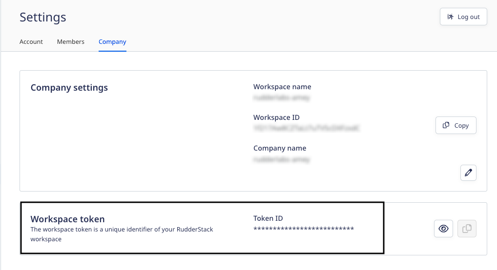

# Kubernetes

You can deploy the RudderStack data plane on your Kubernetes cluster using the [Helm](https://helm.sh) package manager.

You can find the Helm chart in the [RudderStack GitHub repository](https://github.com/rudderlabs/rudderstack-helm).

<div class="waringBlock">

  If you are planning to use RudderStack in production, it is strongly recommended to use the Kubernetes Helm charts.
</div>

## Setup prerequisites

- [Kubectl](https://kubernetes.io/docs/tasks/tools/) installed and connected to your Kubernetes cluster
- [Helm](https://helm.sh/) installed

## RudderStack-hosted control plane

If you're using the RudderStack-hosted control plane, follow these steps to set up the data plane on your Kubernetes cluster:

1. Log into your [RudderStack Open Source dashboard](https://app.rudderstack.com/signup?type=opensource).
2. Copy your workspace token by going to **Settings** > **Company**, as shown:



<div class="infoBlock">

The <Link to="/rudderstack-cloud/dashboard-overview/#workspace-token">workspace token</Link> is required for setting up the data plane.
</div>

3. Clone the [RudderStack Helm repository](https://github.com/rudderlabs/rudderstack-helm) containing the RudderStack Helm chart by running the following command:

  ```bash
  git clone git@github.com:rudderlabs/rudderstack-helm.git
  ```

4. Navigate to the folder containing the Helm chart, as shown:

  ```bash
  cd rudderstack-helm
  ```

5. To install the chart with the release name `my-release`, run the following command after replacing `<your_workspace_token>` with the workspace token copied above.

```bash
helm install my-release ./ --set rudderWorkspaceToken="<your_workspace_token>"
```

The above command deploys RudderStack on your default Kubernetes cluster configured with `kubectl`.

<div class="infoBlock">

Refer to the <a href="#configuration">Configuration</a> section below for more information on the parameters that you can configure during the deployment.
</div>

## Self-hosted control plane

If you have self-hosted the control plane using the open-source [Control Plane Lite](https://rudderstack.com/docs/rudderstack-open-source/control-plane-lite/) utility, follow [Kubernetes instructions](https://rudderstack.com/docs/rudderstack-open-source/control-plane-lite/#kubernetes) to set up the data plane.

## Sending test events

Once you have successfully performed the steps above, follow the [Sending Test Events](https://rudderstack.com/docs/rudderstack-open-source/installing-and-setting-up-rudderstack/sending-test-events/) guide to verify the installation.

## Upgrading the Helm chart

The following sections contain detailed steps for upgrading your Helm chart depending on your RudderStack control plane setup.

### RudderStack-hosted control plane

Update the configuration or version of the images and run the following command:

```bash
helm upgrade my-release ./ --set rudderWorkspaceToken="<your_workspace_token>"
```

### Self-hosted control plane

Update the configuration or version of the images and run the following command:

```bash
helm upgrade my-release ./ --set backend.controlPlaneJSON=true
```

## Uninstalling the chart

To uninstall or delete the `my-release` deployment, run the following command:

```bash
helm uninstall my-release
```

This removes all the components created by the chart.

## Instructions for Google Cloud Platform

If you are using Google Cloud Storage or Google BigQuery for the following cases:

- [Google Cloud Storage](https://rudderstack.com/docs/destinations/storage-platforms/google-cloud-storage/) as a destination for dumping jobs, or
- [Google BigQuery](https://rudderstack.com/docs/data-warehouse-integrations/google-bigquery/) as a warehouse destination

Make sure you replace the contents of the file [rudder-google-application-credentials.json](https://github.com/rudderlabs/rudderstack-helm/blob/master/rudder-google-application-credentials.json) in the repository with the details of your Google service account.

## Configuration

The following table lists the configurable parameters of the RudderStack chart and their default values:

| Parameter                           | Description                                                                                                                                        | Default value                      |
| :---------------------------------- | :----------------------------------------------------------------------- | :--------------------------- |
| `rudderWorkspaceToken`              | Workspace token obtained from the dashboard.                                                                                                                | `-`                          |
| `backend.image.repository`          | Container image repository for the backend                                                                                                         | `rudderlabs/rudder-server`   |
| `backend.image.version`             | Container image tag for the backend. Check the [available versions](https://hub.docker.com/r/rudderlabs/rudder-server/tags)                    | `0.1.9`                      |
| `backend.image.pullPolicy`          | Container image pull policy for the backend image                                                                                                  | `Always`                     |
| `transformer.image.repository`      | Container image repository for the transformer                                                                                                     | `rudderlabs/transformer`     |
| `transformer.image.version`         | Container image tag for the transformer. Check the [available versions](https://hub.docker.com/r/rudderlabs/rudder-transformer/tags)           | `0.1.4`                      |
| `transformer.image.imagePullPolicy` | Container image pull policy for the transformer image                                                                                              | `Always`                     |
| `backend.extraEnvVars`              | Extra environments variables to be used by the backend in the deployments                                                                         | Refer the `values.yaml` file |
| `backend.controlPlaneJSON`          | Set this to `true` for the data plane to read the configuration from the `workspaceConfig.json` file if you have a self-hosted control plane. | `false`                      |

Each of these parameters can be changed in `values.yaml`. You can also specify each parameter using the `--set key=value[,key=value]` argument while running the `helm install` command, as shown:

```bash
helm install --name my-release \
  --set backend.image.version=v0.1.6 \
  ./
```

<div class="infoBlock">

  <ul>
    <li>
      The data plane-specific configuration can be edited in the <a href="https://github.com/rudderlabs/rudder-server/blob/master/config/config.yaml"><code class="inline-code">config.yaml</code></a> file.
    </li>
    <li>
      The PostgreSQL-specific configuration can be configured in <code class="inline-code">pg_hba.conf</code> and <code class="inline-code">postgresql.conf</code>.
    </li>
  </ul>
</div>

## Components

Installing this Helm chart will deploy the following pods and containers in the configured cluster:

**POD - {Release name}-rudderstack-0 :**

- `rudderstack-backend`
- `rudderstack-telegraf-sidecar`

**POD - {Release name}-rudderstack-postgresql-0 :**

- `{Release name}-rudderstack-postgresql`

**POD - {Release name}-rudderstack-transformer-xxxxxxxxxx-xxxxx:**

- `transformer`

## Contact us

If you come across any issues while setting up RudderStack on your Kubernetes cluster, [contact us](mailto:%20docs@rudderstack.com) or start a conversation in our [Slack](https://rudderstack.com/join-rudderstack-slack-community) community.
