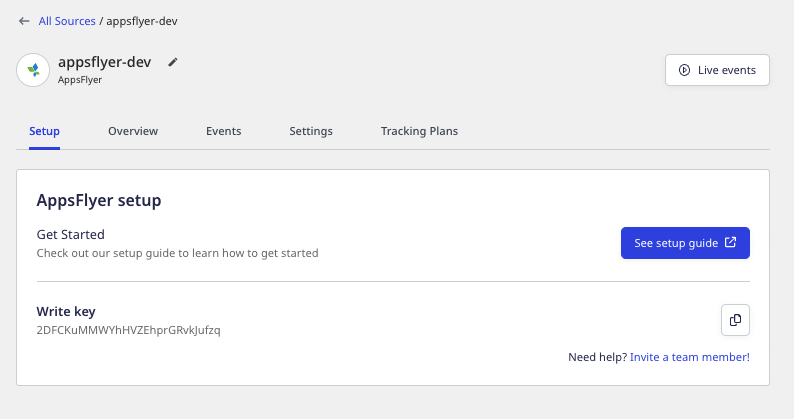
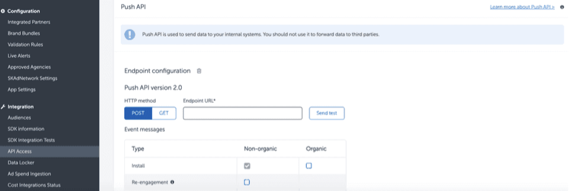

[AppsFlyer](https://www.appsflyer.com/) is an industry-leading mobile attribution and marketing analytics platform. It enables you to understand your customers better through intuitive dashboards, real-time data reports, and a unique deep linking technology.

You can send your AppsFlyer events by adding an endpoint that points to RudderStack and using AppsFlyer's **Push API** option. This way, you can capture all the relevant AppsFlyer events related to re-engagement, reattribution, in-app install events, etc., and send them to RudderStack.

This guide will help you set up AppsFlyer as a source in RudderStack.

## Getting started

Follow these steps to set up your AppsFlyer source in the RudderStack dashboard:

1. Go to your [RudderStack dashboard](https://app.rudderstack.com/) and click **Add Source**. From the list of **Event Stream** sources, select **AppsFlyer**.
2. Assign a name to your source and click **Continue***.
3. Your AppsFlyer source is now configured. Note the source **Write key** required to configure the endpoint URL.



4. Go to your AppsFlyer account. From the sidebar, go to **Integrations** >  **API Access** > **Push API**, as shown:



5. Add the **Endpoint URL** pointing to RudderStack in the following format:

```
<DATA_PLANE_URL>/v1/webhook?writeKey=<WRITE_KEY>
```

<div class="infoBlock">
For more information on the data plane URL, refer to the <Link to="/resources/glossary/#data-plane-url">Glossary</Link>.
</div>

<div class="warningBlock">
Make sure you add the source write key obtained in <strong>Step 3</strong> as a query parameter to the URL. This is required to prevent the webhook from failing for the lack of a valid write key. 
</div>

A sample URL is as shown:

```http
https://hosted.rudderlabs.com/v1/webhook?writeKey=1bCenS7ynqHh8ETX8s5Crjh22J
```

<div class="infoBlock">
It is highly recommended to validate the endpoint using the <strong>Send Test</strong> button.
</div>


6. Finally, save the endpoint.

## Event transformation

The AppsFlyer Push events are ingested into RudderStack after converting them into the RudderStack event format. For example, RudderStack converts the `customer_user_id` property set by AppsFlyer into `userId`.

RudderStack populates the following properties from AppsFlyer event payload into the RudderStack event:

| AppsFlyer Property  | RudderStack Property                                       |
| :------------------ | :--------------------------------------------------------- |
| `customer_user_id`  | `userId`, `context.traits.userId`                          |
| `event_name`        | `event`                                                    |
| `event_time`        | `timestamp`, `originalTimestamp`                           |
| `ip`                | `context.ip`                                               |
| `selected_timezone` | `context.timezone`                                         |
| `user_agent`        | `context.userAgent`                                        |
| `bundle_id`         | `context.app.namespace`                                    |
| `app_version`       | `context.app.version`                                      |
| `app_name`          | `context.app.name`                                         |
| `device_type`       | `context.device.model`                                     |
| `wifi`              | `context.network.wifi`                                     |
| `carrier`           | `context.network.carrier`                                  |
| `platform`          | `platform`, `context.os.name`                              |
| `idfa`              | `context.device.advertisingId` (for iOS)                     |
| `android_id`        | `context.device.advertisingId` (for Android)                 |
| `appsflyer_id`      | `context.externalId[0].value`                              |
| `os_version`        | `context.os.version`                                       |
| `city`              | `traits.address.city`, `context.traits.address.city`       |
| `postal_code`       | `traits.address.zip`, `context.traits.address.zip`         |
| `country_code`      | `traits.address.country`, `context.traits.address.country` |


