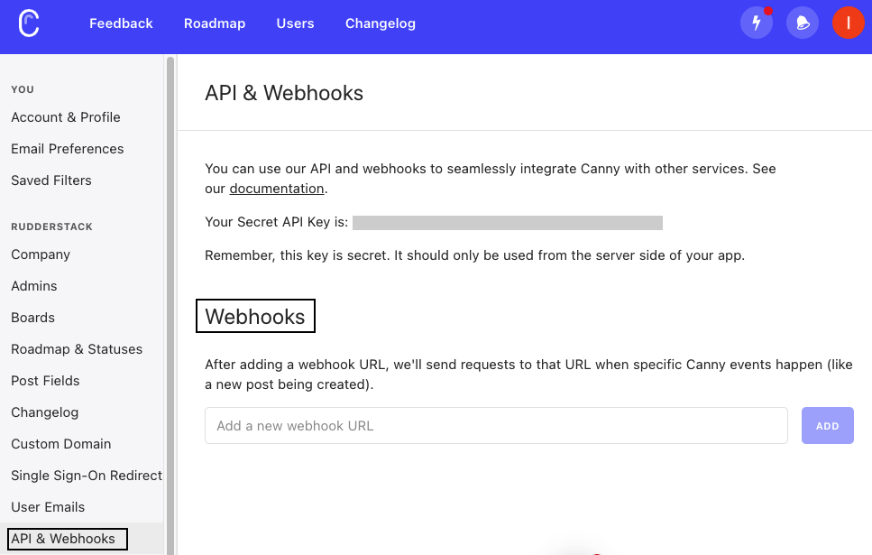

[Canny](https://canny.io/) is a customer feedback management tool which captures, organizes, and analyzes product feedback in one place to help you make informed product decisions.

This guide will help you set up Canny as a source in RudderStack.

## Getting started

Follow these steps to set up Canny as a source in the RudderStack dashboard:

1. Go to your [RudderStack dashboard](https://app.rudderstack.com/) and click on **Add Source**. Then, select **Canny** from the list of **Event Stream** sources, as shown:


2. Assign a name to your source and click on **Next**.
3. The Canny source is now configured. Note the **Webhook URL** in the **Settings** tab.


4. Go to your Canny account and navigate to **Settings** > **API & Webhooks** under your profile.
5. Enter the **Webhook URL** under **Webhooks** section, as shown:



6. Finally, click on **Add**. 

## Event transformation

RudderStack ingests the events from Canny after converting them into the RudderStack event format. It also maps the following properties from the Canny event payload to the RudderStack properties:

| Canny property  | RudderStack property| Notes |
| :------------------ | :------------- |:------------- |
| `created`  | `timestamp`,`originalTimestamp`    | - |
| `object`        | `properties`        | -|
| `objectType`        | `properties.objectType`        | -|
| `type`    | `event`  | -|
| `object.author.userId`     | `userId`   |- |
| sha256 hash of(`object.author.email`)        | `anonymousId` | Only if `userId` is not present |
| sha256 hash of(`object.voter.email`)        | `anonymousId` |Only if `userId` is not present AND `type`is `vote.created`/`vote.deleted`|
| `object.voter.userId`    | `userId`  | Only if `type`is `vote.created`/`vote.deleted` |
| `object.voter.id`        | `context.externalId[0].value` | Only if `type`is `vote.created`/`vote.deleted`|
| `cannyUserId`    | `context.externalId[0].type`  |- |
| `object.author.id`     | `context.externalId[0].value`   |- |


Canny supports the following events:

| Canny events  | Description | 
| :------------------ | :------------- |
| `post.created`  | Occurs when a new post is created.    | 
| `post.deleted`        | Occurs when a post is deleted.        | 
| `post.jira_issue_linked`    | Occurs when a Jira issue is linked to a post.  | 
| `post.jira_issue_unlinked`    | Occurs when a Jira issue is unlinked from a post.  | 
| `post.status_changed`     | Occurs when a post's status is changed.  | 
| `comment.created`        | Occurs when a new comment is created. | 
| `comment.deleted`        | Occurs when a comment is deleted. | 
| `vote.created`        | Occurs when a user votes on a post. | 
| `vote.deleted`    | Occurs when a user unvotes on a post.  | 

## How RudderStack creates the event payload

This section details how RudderStack receives the data from Canny source and creates the resulting payload.

A sample payload sent by Canny is shown below:

```json
{
    "created": "2022-07-28T10:52:46.294Z",
    "object": {
        "author": {
            "created": "2022-07-15T11:16:32.648Z",
            "email": "alex@example.com",
            "id": "1hKOmRA4el9Zt1WSfVJIVo4GRlm",
            "isAdmin": true,
            "name": "Alex Keener",
            "url": "https://rudder.canny.io/admin/users/alex-keener",
            "userID": null
        },
        "board": {
            "created": "2022-07-25T12:11:19.895Z",
            "id": "VJIVo4GRlm",
            "name": "features",
            "postCount": 13,
            "url": "https://rudder.canny.io/admin/board/features"
        },
        "by": null,
        "category": null,
        "commentCount": 0,
        "created": "2022-07-28T10:52:46.172Z",
        "customFields": [{
            "id": "62e1382",
            "name": "John",
            "value": "123"
        }],
        "details": "Array of images",
        "eta": null,
        "id": "62e26a",
        "imageURLs": [
            "https://canny.io/images/6371453a825c79351c52a6063c3af476.jpg",
            "https://canny.io/images/47db6ee5035bfb45ea87a74f2eb17928.jpg"
        ],
        "owner": null,
        "score": 1,
        "status": "open",
        "tags": [],
        "title": "Custom Fields Testing",
        "url": "https://rudder.canny.io/admin/board/features/p/custom-fields-testing"
    },
    "objectType": "post",
    "type": "post.created"
}
```

RudderStack transforms the above payload into the following payload:

```json
{
    "anonymousId": "d6a9d06e8a464324d448003ff0467d971a55ca2950e11fc51faaec4e2850ecc6",
    "event": "post.created",
    "integrations": {
        "Canny": false
    },
    "context": {
        "library": {
            "name": "unknown",
            "version": "unknown"
        },
        "integration": {
            "name": "Canny",
            "version": "1.0.0"
        },
        "traits": {
        "created": "2022-07-15T11:16:32.648Z",
        "email": "alex@example.com",
        "isAdmin": true,
        "name": "Alexx Keener",
        "url": "https://rudder.canny.io/admin/users/alex-keener"
      },
        "externalId": [{
            "type": "cannyUserId",
            "value": "1hKOmRA4el9Zt1WSfVJIVo4GRlm"
        }]
    },
    "timestamp": "2022-07-28T10:52:46.294Z",
    "originalTimestamp": "2022-07-28T10:52:46.294Z",
    "type": "track",
    "properties": {
        "board": {
            "created": "2022-07-25T12:11:19.895Z",
            "id": "VJIVo4GRlm",
            "name": "features",
            "postCount": 13,
            "url": "https://rudder.canny.io/admin/board/features"
        },
        "by": null,
        "category": null,
        "commentCount": 0,
        "created": "2022-07-28T10:52:46.172Z",
        "customFields": [{
            "id": "62e1382",
            "name": "abc",
            "value": "123"
        }],
        "details": "Array of images",
        "eta": null,
        "id": "62e26a",
        "imageURLs": [
            "https://canny.io/images/6371453a825c79351c52a6063c3af476.jpg",
            "https://canny.io/images/47db6ee5035bfb45ea87a74f2eb17928.jpg"
        ],
        "objectType": "post",
        "owner": null,
        "score": 1,
        "status": "open",
        "tags": [],
        "title": "Custom Fields Testing",
        "url": "https://rudder.canny.io/admin/board/features/p/custom-fields-testing"
    }
}
```
