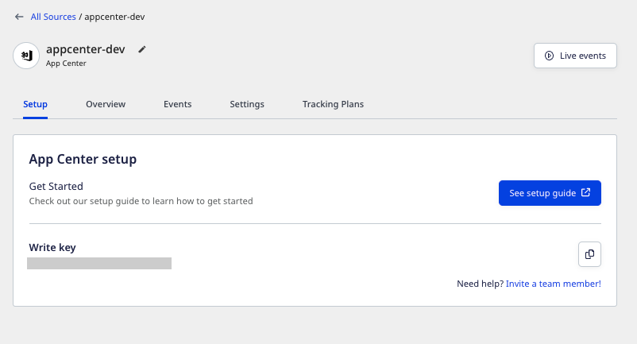
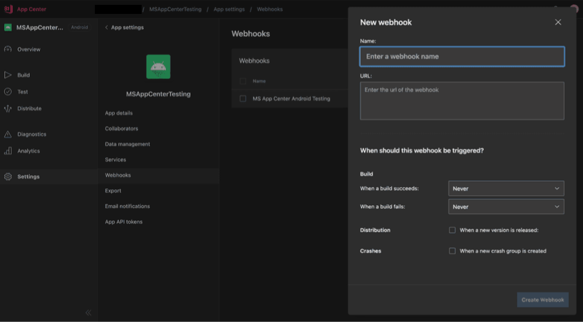
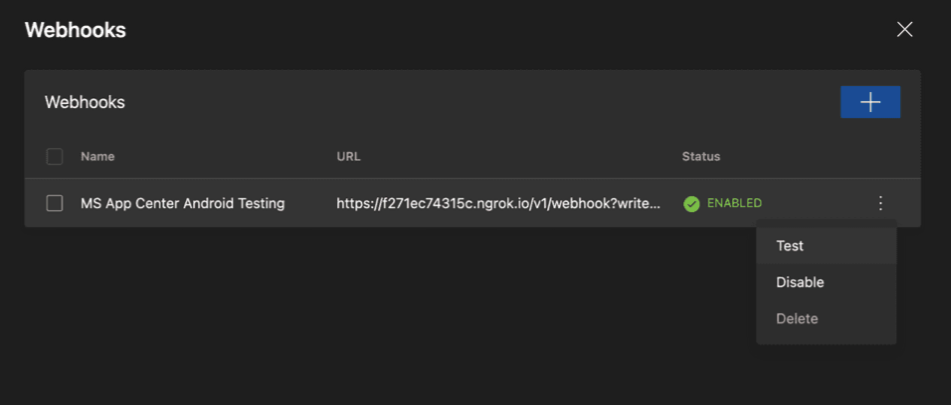

[App Center](https://appcenter.ms/) is Microsoft's cross-platform build automation and management platform. It lets you automate your builds, test your apps in the cloud, and monitor their real-time usage with the help of crash data and analytics.

You can send your App Center events by adding a webhook that points to RudderStack. These events include activities related to build success or failure, new app version releases, or app crashes. You can also configure what events to send per your requirement on their dashboard.

This guide will help you set up App Center as a source in RudderStack.

## Getting started

Follow these steps to set up your App Center source in the RudderStack dashboard:

1. Go to your [RudderStack dashboard](https://app.rudderstack.com/) and click on **Add Source**. From the list of **Event Streams** sources, select **App Center**.
2. Assign a name to your source and click **Continue**.
3. Your App Center source is now configured. Note the source **Write key** required to configure the webhook URL.



4. Then, head over to your App Center account and select the application you want to configure. Here, navigate to the **Webhooks** section under **Settings** from the sidebar, and then create a new webhook, as shown:



5. In the **URL** text box, add the URL pointing to RudderStack in the following format: 

```
<DATA_PLANE_URL>/v1/webhook?writeKey=<WRITE_KEY>
```

<div class="infoBlock">
For more information on the data plane URL, refer to the <Link to="/resources/glossary/#data-plane-url">Glossary</Link>.
</div>

<div class="warningBlock">
Make sure you add the source write key obtained in <strong>Step 3</strong> as a query parameter to the URL. This is required to prevent the webhook from failing for the lack of a valid write key. 
</div>

A sample URL is as shown:

```http
https://hosted.rudderlabs.com/v1/webhook?writeKey=1bCenS7ynqHh8ETX8s5Crjh22J
```

<div class="infoBlock">
It is highly recommended to validate the endpoint using the <strong>Send Test</strong> button.
</div>



6. Finally, save the endpoint.

## Event transformation

The App Center events are ingested into a RudderStack `track` call with the designated name and properties as the entire event received from App Center. For example, the `app_name` set by App Center is set as `context.app.name`.

The following table highlights the mapping of various App Center events from App to RudderStack's `track` calls:

| App Center Event              | RudderStack Track Event Name |
| :---------------------------- | :--------------------------- |
| `On Success of a Build`       | `Build Succeeded`            |
| `On Failure of a Build`       | `Build Failed`               |
| `On Release of a new version` | `Released Version <X.YY>`    |
| `On an App Crash`             | `App Crashed`                |

Also, RudderStack populates the following properties from the App Center event payload to the RudderStack event:

| App Center Property            | RudderStack Property                     |
| :----------------------------- | :--------------------------------------- |
| `app_name`, `app_display_name` | `context.app.name`                       |
| `build_id`                     | `context.app.build`                      |
| `os`, `platform`               | `context.device.type`, `context.os.name` |
| `start_time`                   | `originalTimeStamp`                      |
| `sent_at`                      | `sentAt`                                 |
| `short_version`, `app_version` | `context.app.version`                    |
| `bundle_identifier`            | `context.app.namespace`                  |