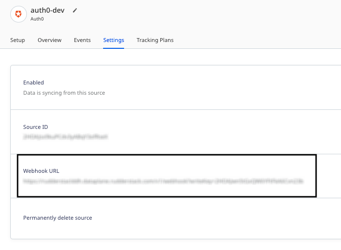
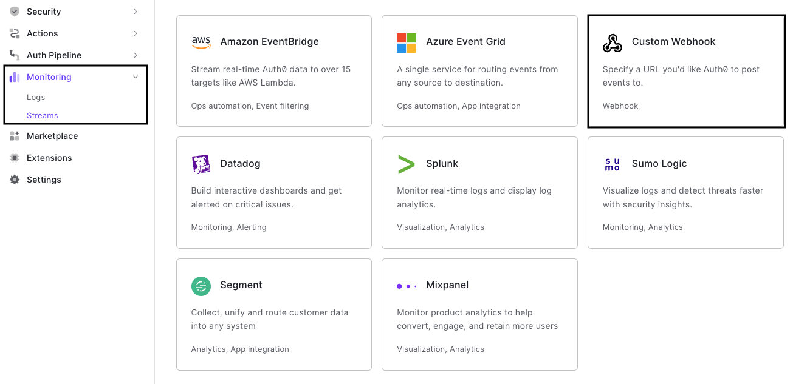
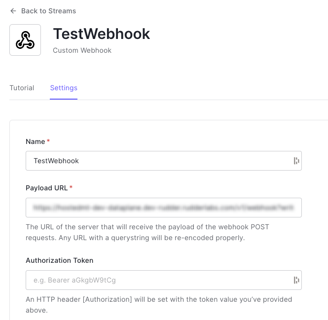

[Auth0](https://auth0.com/) is a popular solution used by many companies to add authentication and authorization services to their applications. 

You can now send your Auth0 authentication and user behavior-related events by adding a custom webhook that points to RudderStack.

This guide will help you set up Auth0 as a source in RudderStack.

## Getting started

Follow these steps to set up your Auth0 source in the RudderStack dashboard:

1. Go to your [RudderStack dashboard](https://app.rudderstack.com/) and click **Add Source**. From the list of **Event Streams** sources, select **Auth0**.
2. Assign a name to your source and click **Continue**.
3. Your Auth0 source is now configured. Note the **Webhook URL** in the **Settings** tab, as shown:

4. Next, log into your [Auth0 dashboard](https://manage.auth0.com/).
5. Go to **Monitoring** > **Streams** > **Create Log Stream** > **Custom Webhook**, as shown:

6. Name your custom webhook. In the **Payload URL** field, enter the webhook URL obtained in Step 3.

7. Configure the other webhook settings as required.

You can also filter the events sent to your custom webhook by category. For more information on these categories, refer to the <a href="https://auth0.com/docs/customize/log-streams/event-filters">Auth0 documentation</a>.

8. Click **Save** to save the custom webhook.

## Event transformation

RudderStack supports ingesting the Auth0 events as <Link to="/event-spec/standard-events/track">`track`</Link>, <Link to="/event-spec/standard-events/group">`group`</Link>, and <Link to="/event-spec/standard-events/identify">`identify`</Link> calls.

RudderStack ingests the <a href="https://auth0.com/docs/manage-users/organizations/configure-organizations/assign-members">Add member to an Organisation</a> event as a <code class="inline-code">group</code> call and the <a href="">Signup</a> event as an <code class="inline-code">identify</code> call. All the other Auth0 events are ingested as <code class="inline-code">track</code> calls.

The following table lists the properties populated from the Auth0 event payload directly to the RudderStack event:

| **Auth0 Property**        | **RudderStack Property**                  |
| :------------------------ | :--------------------------------- |
| `auth0_client`      | `properties.auth0_client`   |
| `client_id`      | `properties.client_id`       |
| `client_name`       | `properties.client_name`    |
| `connection` | `traits.connection` |
| `connection_id` | `traits.connection_id` |
| `description`    | `properties.description`        |
| `details`       | `properties.details` |
| `details.auth.user.email` | `context.traits.email`    |
| `details.auth.user.name`  | `context.traits.name`      |
| `log_id`      | `properties.log_id`     |
| `isMobile`    | `properties.is_mobile`       |
| `ip`         | `context.request_ip`          |
| `user_name`      | `context.traits.user_name`  |
| `user_agent`     | `context.userAgent`  |
| `user_id` | `userId` |

## Debugging

If you are unable to see any events flowing from the Auth0 API webhooks to RudderStack, you can troubleshoot the issue by viewing the API webhooks logs. To do so, go to your Auth0 dashboard and navigate to **Monitoring** > **Logs**.

Refer to the <a href="https://auth0.com/docs/customize/log-streams/custom-log-streams#troubleshoot-webhooks">Auth0 documentation</a> for more information on troubleshooting your webhook.

