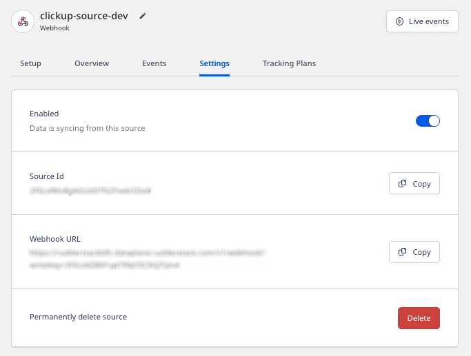
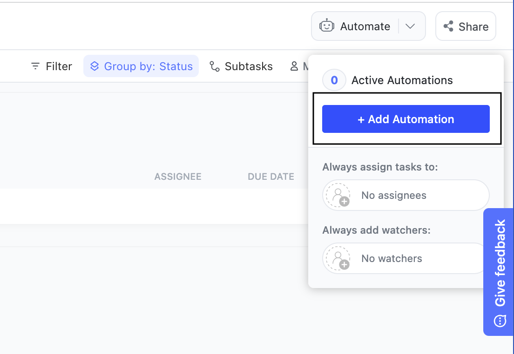
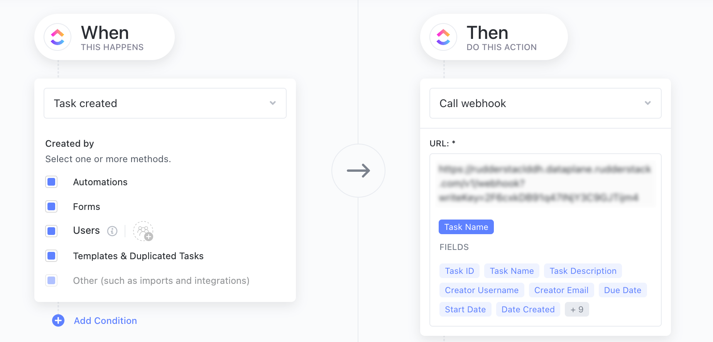

[ClickUp](https://clickup.com/) is a productivity tool that lets you set up project workflows and tasks, and enable smooth cross-team collaboration.

You can use RudderStack's <Link to="/sources/event-streams/cloud-apps/webhook-source/">Webhook</Link> source to capture real-time updates from your ClickUp workspace and send that data to your preferred downstream destinations.

## Getting started

Follow these steps to set up a ClickUp webhook source in the RudderStack dashboard:

1. Go to your [RudderStack dashboard](https://app.rudderstack.com/) and click **Add Source**. From the list of **Event Streams** sources, select **Webhook**.
2. Assign a name to your source and click **Continue**.
3. Your source is now configured. Note the **Webhook URL** in the **Settings** tab, as shown:



4. Next, go to your [ClickUp dashboard](https://app.clickup.com/) and open the ClickUp [space](https://help.clickup.com/hc/en-us/articles/6309466958103-Spaces-overview) of your choice.
5. From the top-right side of the dashboard, click the **Automate** option and select **Add Automation**.



6. Select the relevant ClickUp trigger from the dropdown under **When** for the automation to happen.
7. In the **Then** section, select **Call webhook** from the dropdown.
8. Enter the webhook URL copied in step 3, as shown below. You can also add specific fields in the event sent to the webhook.



9. Finally, click **Create**.

## How RudderStack creates the event payload

This section details how RudderStack receives the data from ClickUp source and creates the resulting payload.

A sample payload ingested by RudderStack when you create a new task in ClickUp is shown below:

```json
{
  "event": "taskCreated",
  "history_items": [{
      "id": "2800763136717140857",
      "type": 1,
      "date": "1642734631523",
      "field": "status",
      "parent_id": "162641062",
      "data": {
        "status_type": "open"
      },
      "source": null,
      "user": {
        "id": 183,
        "username": "Alex",
        "email": "alex@example.com",
        "color": "#7b68ee",
        "initials": "A",
        "profilePicture": null
      },
      "before": {
        "status": null,
        "color": "#000000",
        "type": "removed",
        "orderindex": -1
      },
      "after": {
        "status": "to do",
        "color": "#f9d900",
        "orderindex": 0,
        "type": "open"
      }
    },
    {
      "id": "2800763136700363640",
      "type": 1,
      "date": "1642734631523",
      "field": "task_creation",
      "parent_id": "162641062",
      "data": {},
      "source": null,
      "user": {
        "id": 183,
        "username": "Alex",
        "email": "alex@example.com",
        "color": "#7b68ee",
        "initials": "A",
        "profilePicture": null
      },
      "before": null,
      "after": null
    }
  ],
  "task_id": "1vj37mc",
  "webhook_id": "7fa3ec74-69a8-4530-a251-8a13730bd204"
}
```

RudderStack transforms the above payload into the following <Link to="/event-spec/standard-events/track/">`track`</Link> payload:

```json
{
  "anonymousId": "97647e18-1ca0-4560-8c28-b54c1e066c8e",
  "event": "webhook_source_event",
  "messageId": "8cc5bc1e-8084-4690-989b-ece1514c2019",
  "properties": {
    "date": "2022-09-22T07:04:40.637Z",
    "id": "c5a074ac-b1d4-4a38-af4b-520d28a86e16",
    "payload": {
      "archived": false,
      "assignees": [],
      "checklists": [],
      "creator": {
        "color": "#f42c2c",
        "email": "alex@example.com",
        "id": 61234949,
        "profilePicture": null,
        "username": "Alex"
      },
      "custom_fields": [],
      "custom_id": null,
      "date_closed": null,
      "date_created": "1663830276995",
      "date_updated": "1663830276995",
      "dependencies": [],
      "description": "Another test task",
      "due_date": null,
      "folder": {
        "access": true,
        "hidden": true,
        "id": "121234504",
        "name": "hidden"
      },
      "id": "2v1x5rh",
      "linked_tasks": [],
      "list": {
        "access": true,
        "id": "199323204",
        "name": "MyList"
      },
      "name": "New Task",
      "orderindex": "3.67423161831345930000000000000000",
      "parent": null,
      "points": null,
      "priority": null,
      "project": {
        "access": true,
        "hidden": true,
        "id": "121234504",
        "name": "hidden"
      },
      "space": {
        "id": "61467145"
      },
      "start_date": null,
      "status": {
        "color": "#d3d3d3",
        "id": "p61467145_ArejskXD",
        "orderindex": 0,
        "status": "to do",
        "type": "open"
      },
      "tags": [],
      "team_id": "43251777",
      "text_content": "Another test task",
      "time_estimate": null,
      "url": "https://app.clickup.com/t/2v1x5rh",
      "watchers": [{
        "color": "#f42c2c",
        "email": "alex@example.com",
        "id": 61234949,
        "initials": "A",
        "profilePicture": null,
        "username": "Alex"
      }]
    },
    "trigger_id": "3559b3b0-ac61-4b0e-8f9b-ad783e3e0c74"
  },
  "rudderId": "257a4754-0719-46af-a6cc-5f7753682650",
  "type": "track"
}
```

<div class="infoBlock">
To send this data to the downstream destinations, you need to transform it into a destination-specific format using RudderStack's <Link to="/features/transformations/">Transformations</Link> feature. Refer to the below <Link to="#use-case">use case</Link> for more information.
</div>

## Use case

Consider a scenario where a new contact is automatically created in HubSpot whenever a new assignee is added to a ClickUp task. 

To do this, set up a ClickUp source by following the steps in the <Link to="#getting-started">Getting started</Link> section above. Then, connect this source to the <Link to="/destinations/streaming-destinations/hubspot/">HubSpot destination</Link>.

Once the connection is set up, RudderStack automatically receives a payload from ClickUp whenever a new assignee is added to a ClickUp task. It then transforms the payload in the following format:

```json
{
  "anonymousId": "38c5a078-c1ea-4024-9628-7f8971aeb915",
  "event": "webhook_source_event",
  "messageId": "cbd5e04a-8e0b-4bf9-959d-26c4d8e455b0",
  "properties": {
    "event": "taskAssigneeUpdated",
    "history_items": [{
      "after": {
        "color": "#02579b",
        "email": "alex@example.com",
        "id": 61217234,
        "initials": "A",
        "profilePicture": null,
        "username": "Alex"
      },
      "data": {},
      "date": "1663044688239",
      "field": "assignee_rem",
      "id": "3141509348132974740",
      "parent_id": "175476135",
      "source": null,
      "type": 1,
      "user": {
        "color": "#536cfe",
        "email": "jane@doe.com",
        "id": 55300044,
        "initials": "JD",
        "profilePicture": null,
        "username": "Jane Doe"
      }
    }],
    "task_id": "2rc0nvx",
    "webhook_id": "3425a884-4f24-4d81-a373-1991c2d20743"
  },
  "rudderId": "0240a617-9492-47f8-ac5c-c842ab2cd9f4",
  "type": "track"
}
```

To automatically add a new contact in HubSpot for this event, you need to add the following user transformation and <Link to="/features/transformations/#connecting-transformation-to-a-destination">connect it to your HubSpot destination</Link>:

```javascript
export function transformEvent(event, metadata) {
  let indetifyEvent;

  if (event.properties.event === "taskAssigneeUpdated") {
    indetifyEvent = {
      type: "identify",
      userId: event.properties?.history_items[0]?.after?.id,
      traits: {
        email: event.properties?.history_items[0]?.after?.email
      }
    }
  }
  return indetifyEvent;
}
```

RudderStack sends the following transformed event payload to HubSpot:

```javascript
{
  "version": "1",
  "type": "REST",
  "method": "POST",
  "endpoint": "https://api.hubapi.com/contacts/v1/contact/batch/",
  "headers": {
    "Content-Type": "application/json",
    "Authorization": "Bearer ******2b27"
  },
  "params": {},
  "body": {
    "JSON": {},
    "JSON_ARRAY": {
      "batch": "[{\"email\":\"alex@example.com\",\"properties\":[]}]"
    },
    "XML": {},
    "FORM": {}
  },
  "files": {}
}
```

The above payload then creates the contact in HubSpot.