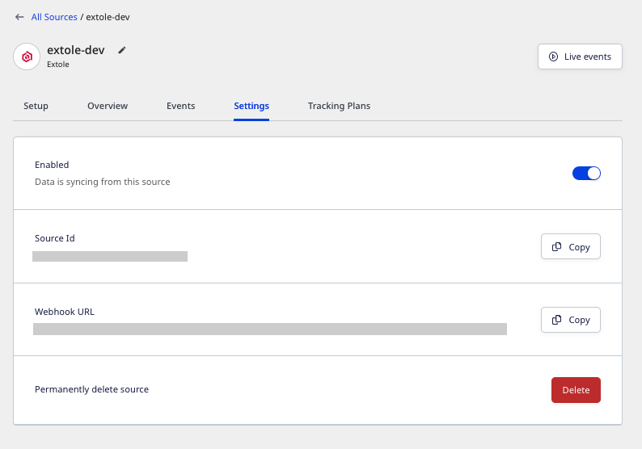
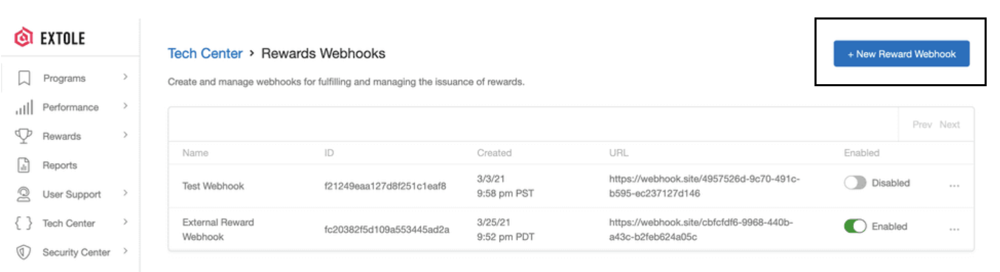

[Extole](https://www.extole.com/) is a popular referral marketing tool. It enables you to offer an integrated, optimized, and effective customer experience for your audience.

You can now send your Extole events to RudderStack by adding a webhook that points to RudderStack. These events include the reward-specific events such as `reward_earned`,`reward_fulfilled`,`reward_sent`, etc. along with other Extole custom events.

This guide will help you in setting up Extole as a source in RudderStack.

## Getting started

Follow these steps to set up your Extole source in the RudderStack dashboard:

1. Go to your [RudderStack dashboard](https://app.rudderstack.com/) and click on **Add Source**. From the list of **Event Streams** sources, select **Extole**.
2. Assign a name to your source and click **Continue**.
3. Your Extole source is now configured. Go to the **Settings** tab and note the **Webhook URL**, as shown:



4. Next, head over to your Extole account and select the **program** you want to use for RudderStack to ingest your data. 
5. Then, navigate to the **Tech Center** section from the sidebar and then select [Rewards WebHooks](https://my.extole.com/tech-center/rewards-webhooks). 
6. Then, click on the **New Reward Webhook** option as seen in the following image:



7. In the **URL** text box, add the webhook URL obtained in **Step 3**. The URL should be of the following format:

```
<DATA_PLANE_URL>/v1/webhook?writeKey=<WRITE_KEY>
```

<div class="infoBlock">
For more information on the data plane URL, refer to the <Link to="/resources/glossary/#data-plane-url">Glossary</Link>.
</div>

8. Finally, save the endpoint.

## Event transformation

RudderStack ingests the Extole events after converting them into the RudderStack event format. For example, Extole's `event_id` is converted and set to `properties.eventId`. 

<div class="infoBlock">
The Extole events are converted into a RudderStack <code class="inline-code">track</code> call with the designated event name and associated properties received from Extole.
</div>

<div class="infoBlock">
RudderStack retains the Extole event name during the mapping.
</div>

RudderStack populates the following properties from the Extole event payload to the RudderStack event:

| **Extole Property**              | **RudderStack Property**                                          |
| :--------------------------- | :------------------------------------------------------------ |
| `event_id`,                  | `properties.eventId`                                          |
| `event_time`                 | `originalTimestamp`                                           |
| `reward_id`                  | `properties.rewardId`                                         |
| `reward_supplier_name`       | `properties.rewardSupplierName`                               |
| `reward_supplier_id`         | `properties.rewardSupplierId`                                 |
| `partner_reward_supplier_id` | `properties.partnerRewardSupplierId`                          |
| `reward_supplier_type`       | `properties.partnerRewardSupplierType`                        |
| `person_id`                  | `properties.personId`                                         |
| `partner_user_id`            | `properties.partnerUserId`, `userId`, `context.traits.userId` |
| `face_value`                 | `properties.faceValue`                                        |
| `face_value_type`            | `properties.faceValueType`                                    |
| `message`                    | `properties.message`                                          |
| `partner_reward_id`          | `properties.partnerRewardId`                                  |
| `email`                      | `properties.email`                                            |
| `data`                       | `properties.data`                                             |
| `schema_version`             | `properties.schemaVersion`                                    |

<div class="warningBlock">
All the Extole event properties other than <code class="inline-code">reward_earned</code>, <code class="inline-code">reward_fulfilled</code>, and <code class="inline-code">reward_sent</code> sent to Rudderstack will be directly mapped to the Rudderstack event properties.
</div>