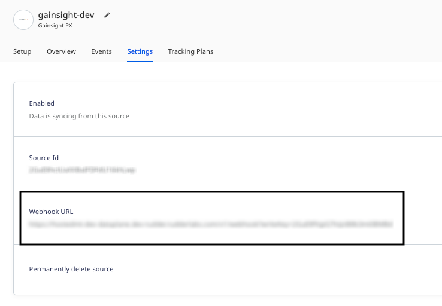
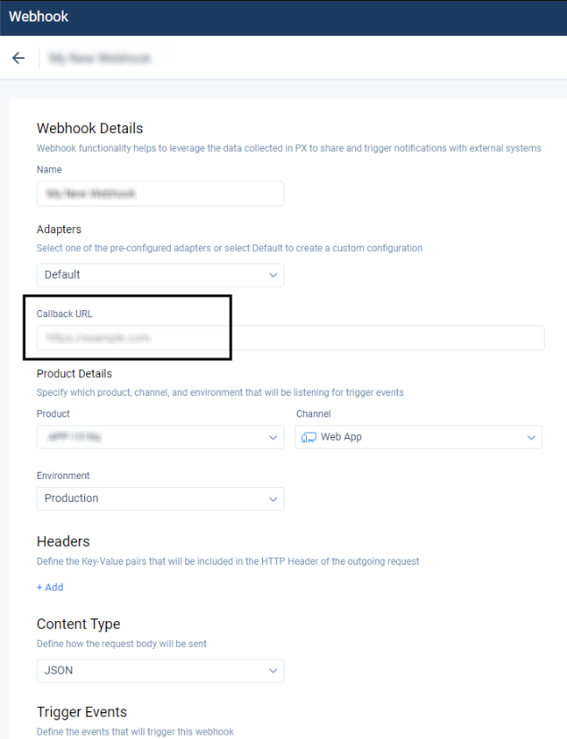

[Gainsight PX](https://www.gainsight.com/product-experience/) is a popular product experience platform. It offers cutting-edge product analytics, product engagement features, and powers the product teams to optimize their customer adoption and onboarding flows.

This guide will help you set up Gainsight PX as a source in RudderStack.

## Getting started

Follow these steps to set up your Gainsight PX source in the RudderStack dashboard:

1. Go to your [RudderStack dashboard](https://app.rudderstack.com/) and click **Add Source**. From the list of **Event Streams** sources, select **Gainsight PX**.
2. Assign a name to your source and click **Continue**.
3. Your Gainsight PX source is now configured. Note the **Webhook URL** in the **Settings** tab, as shown:



4. Follow this <a href="https://support.gainsight.com/PX/Integrations/01Technology_Partner_Integrations/Integrate_with_Gainsight_PX_Using_Webhooks#Configure_Webhook_in_Gainsight_PX">Gainsight PX user guide</a> to configure a custom webhook in Gainsight PX.
5. In the **Callback URL** field, paste the RudderStack webhook URL copied in Step 3 above.



## Event transformation

The input payload for the both the <Link to="/event-spec/standard-events/identify/">`identify`</Link> and <Link to="/event-spec/standard-events/track/">`track`</Link> calls sent to Gainsight PX is the same. In case of a signup event (`event.eventType == SIGN_UP`), RudderStack calls `identify`, otherwise it calls `track`.

<div class="infoBlock">
The signup event indicates whether a new user is created in Gainsight PX or an event is sent.
</div>

<div class="warningBlock">
Gainsight PX allows sending a maximum of 10000 webhook events per day.
</div>

### Identify

As mentioned above, RudderStack maps a Gainsight PX event to the `identify` event in case of a user signup.

A sample input payload is shown below:

```json
{
  "user": {
    "aptrinsicId": "cab9c469-8602-4933-acdb-68338fbb9ab1",
    "identifyId": "New!",
    "type": "USER",
    "gender": "EMPTY_GENDER",
    "email": "alex@example.com",
    "firstName": "Alex",
    "lastName": "Keener",
    "lastSeenDate": 1665582808669,
    "signUpDate": 1665582791753,
    "firstVisitDate": 1665582791753,
    "title": "",
    "phone": "",
    "score": 0,
    "role": "",
    "subscriptionId": "",
    "accountId": "IBM",
    "numberOfVisits": 1,
    "location": {
      "countryName": "",
      "countryCode": "",
      "stateName": "",
      "stateCode": "",
      "city": "",
      "street": "",
      "postalCode": "",
      "continent": "",
      "regionName": "",
      "timeZone": "",
      "coordinates": {
        "latitude": 0,
        "longitude": 0
      }
    },
    "propertyKeys": [
      "AP-EOXPSEZGC5LA-2-1"
    ],
    "createDate": 1665582808376,
    "lastModifiedDate": 1665582808717,
    "customAttributes": null,
    "globalUnsubscribe": false,
    "sfdcContactId": "",
    "lastVisitedUserAgentData": null,
    "id": "New!",
    "lastInferredLocation": null
  },
  "account": {
    "id": "IBM",
    "name": "International Business Machine",
    "trackedSubscriptionId": "",
    "sfdcId": "",
    "lastSeenDate": 1665582808669,
    "dunsNumber": "",
    "industry": "",
    "numberOfEmployees": 0,
    "sicCode": "",
    "website": "",
    "naicsCode": "",
    "plan": "",
    "location": {
      "countryName": "",
      "countryCode": "",
      "stateName": "",
      "stateCode": "",
      "city": "",
      "street": "",
      "postalCode": "",
      "continent": "",
      "regionName": "",
      "timeZone": "",
      "coordinates": {
        "latitude": 0,
        "longitude": 0
      }
    },
    "numberOfUsers": 0,
    "propertyKeys": [
      "AP-EOXPSEZGC5LA-2-1"
    ],
    "createDate": 1665578567565,
    "lastModifiedDate": 1665582808669,
    "customAttributes": null,
    "parentGroupId": ""
  },
  "event": {
    "eventType": "SIGN_UP",
    "eventId": "1283c08b-f290-4bc4-9deb-75c7867d69ee",
    "propertyKey": "AP-EOXPSEZGC5LA-2-1",
    "date": 1665582808376,
    "sessionId": "AP-EOXPSEZGC5LA-2-1665582441084-16821368",
    "globalContext": {},
    "userType": "USER"
  },
  "configId": "32f07727-d231-4c9d-881e-fb50b80bad63"
}
```

RudderStack transforms this payload into the following event:

```javascript
aptrinsic("identify", {
  //User Fields
  "id": "New!", // Required for logged in app users
  "email": "alex@example.com",
  "firstName": "Alex",
  "lastName": "Keener",
  "signUpDate": 1665582791753, //unix time in ms
  "plan": "gold", //Custom attributes - please create those custom attributes in Aptrinsic via Account Settings to be tracked.
  "price": 95.5
}, {
  //Account Fields
  "id": "IBM", //Required
  "name": "International Business Machine",
  "Program": "Platinum" // flat custom attributes
});
```

RudderStack also maps the following properties from the Gainsight PX event payload to the RudderStack properties:

| Gainsight PX property  | RudderStack property|
| :------------------ | :------------- |
| `user`  | `traits`    | 
| `user.identifyId`        | `userId`        | 
|  `user.aptrinsicId` | `context.externalId[]`        | 
| `user.signUpDate` | `createdAt` |
| `user.location.countryName` | `traits.country` |
| `user.location.stateName` | `traits.state` |
| `user.location` | `traits` |
| `account` | `traits.account` |
| `account.name` | `traits.companyName` |
| `event.remoteHost` | `context.ip` |
| `user.lastVisitedUserAgentData` | `context.userAgent` | 

### Track

RudderStack ingests different event payloads depending on the Gainsight PX event type. It currently supports the following event types before mapping them to the `track` call:

- Feature match
- Engagement
- Survey
- Segment match
- Custom event

The general property mappings for these events are listed in the below table:

| Gainsight PX property  | RudderStack property|
| :------------------ | :------------- |
| `event.eventType` | `category` |
| `event.attributes` | `properties` |
| `event.date` | `sentAt` |
| `user` | `context.traits` |
| `event.url` | `properties.url` | 
| `event.remoteHost` | `properties.ip` |
| `user.identifyId` | `userId` |
|  `user.aptrinsicId` | `context.externalId[]`        | 
| `user.lastVisitedUserAgentData` | `userAgent` | 
| `event.globalContext` | `properties.globalContext` |

The specific property mappings based on the different Gainsight PX event types are listed as follows:

#### Feature match

| Gainsight PX property  | RudderStack property |
| :------------------ | :------------- |
| `event.featureName` | `name` |
| `event.featureId` | `properties.featureId` |

#### Engagement

| Gainsight PX property  | RudderStack property |
| :------------------ | :------------- |
| `event.engagementName` | `name` |
| `event.engagementId` | `properties.engagementId` |
| `event.contentType` | `properties.contentType` |
| `event.engagementType` | `properties.engagementType` |
| `event.interaction` | `properties.interaction` |
| `event.stepNumber` | `properties.engagement.stepNumber` |
| `event.activation` | `properties.engagement.activation` |

#### Survey

| Gainsight PX property  | RudderStack property |
| :------------------ | :------------- |
| `event.engagementName` | `name` |
| `event.engagementId` | `properties.engagementId` |
| `event.contentType` | `properties.contentType` |
| `event.score` | `properties.survey.score` |
| `event.stepNumber` | `properties.survey.stepNumber` |
| `event.userInput` | `properties.survey.userInput` |
| `event.questionType` | `properties.survey.questionType` |
| `event.scoreType` | `properties.survey.scoreType` |
| `event.surveyType` | `properties.survey.surveyType` |
| `event.contactMeAllowed` | `properties.survey.contactMeAllowed` |
| `event.questionText` | `properties.survey.questionText` |
| `event.questionHtml` | `properties.survey.questionHtml` |
| `event.answers` | `properties.survey.answers` |
| `event.questionId` | `properties.survey.questionId` |
| `event.activation` | `properties.engagement.activation` |

#### Segment

| Gainsight PX property  | RudderStack property |
| :------------------ | :------------- |
| `event.segmentName` | `name` | 
| `event.segmentId` | `properties.segmentId` |

#### Custom event

| Gainsight PX property  | RudderStack property |
| :------------------ | :------------- |
| `event.eventName` | `name` |

## FAQ

### Why am I unable to view a new user event even after adding it in Gainsight PX?

Gainsight PX lets you track new user signups in your application, add them to your webhook queue, and send this data to your destination. However, this occurs only when Gainsight PX receives an `identify` event for the new user signed up in the last hour. For more information, refer to this <a href="https://support.gainsight.com/PX/Integrations/01Technology_Partner_Integrations/Integrate_with_Gainsight_PX_Using_Webhooks">Gainsight PX webhook integration guide</a>.