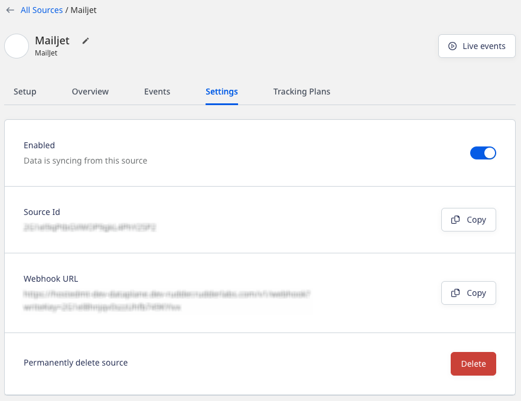
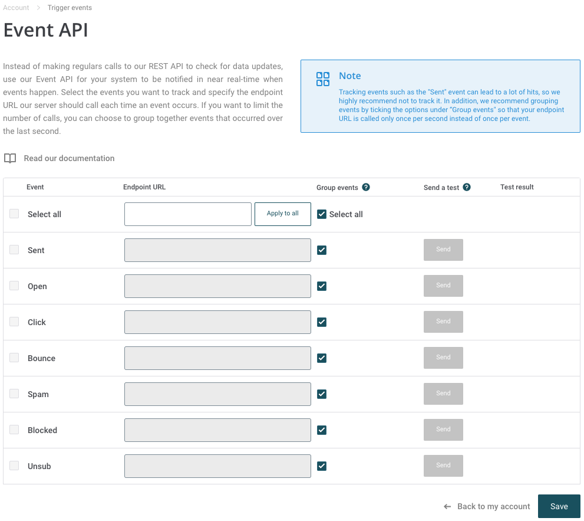

[Mailjet](https://www.mailjet.com/) is a popular email marketing and delivery platform. It lets you create and send impactful email marketing campaigns, newsletters, and automated emails to grow your business.

This guide will help you set up Mailjet as a source in RudderStack.

## Getting started

Follow these steps to set up your Mailjet source in the RudderStack dashboard:

1. Go to your [RudderStack dashboard](https://app.rudderstack.com/) and click **Add Source**. From the list of **Event Streams** sources, select **Mailjet**.
2. Assign a name to your source and click **Continue**.
3. Your Mailjet source is now configured. Note the **Webhook URL** in the **Settings** tab, as shown:



4. Log into your [Mailjet account](https://app.mailjet.com/).
5. Click your profile and select **Account Settings**. Under the **Rest API** section, click **Event notifications (webhooks)**.
You can either select all the events or the specific ones and add the webhook URL, as shown:



## Event transformation

RudderStack ingests all the events mentioned in the [Mailjet documentation](https://dev.mailjet.com/email/guides/webhooks/#event-types). The event name is mapped on the basis of the `event` property which is present in each event.

RudderStack ingests the Mailjet events after converting them into the RudderStack event format. It also maps the following properties from the Mailjet event payload to the RudderStack properties:

| Mailjet property  | RudderStack property| 
| :------------------ | :------------- |
| `event`  | `event`    | 
| `mj_contact_id`    | `context.externalId[]`        | 
| `messageId`       | `properties.mailJetMessageId`|
| `email` | `context.traits.email`        |
| `url`     | `properties.url` <br/> `context.page.url`  | 
| `ip`    | `properties.ip` <br/> `context.ip` | 
| `customId`  <br/> SHA-256 hash of `email`     | `userID`   |
| `customcampaign`  | `properties.customcampaign`    | 
| `mj_campaign_id`    | `cproperties.mj_campaign_id`        | 
| `Payload` | `properties.Payload`        |
| `agent`    | `context.userAgent`  | 
| `source`     | `context.campaign.source`   |
| `mj_list_id`     | `context.externalId[]`   |

## How RudderStack creates the event payload

This section details how RudderStack receives the data from Mailjet source and creates the resulting payload.

A sample payload sent by Mailjet is shown below:

```json
{
  "event": "open",
  "time": 1664443614,
  "MessageID": 94857068804950690,
  "Message_GUID": "54d6cdec-f659-4547-8926-13d9c4126b82",
  "email": "alex@example.com",
  "mj_campaign_id": 108760,
  "mj_contact_id": 399962859,
  "customcampaign": "mj.nl=58424",
  "ip": "66.249.84.231",
  "geo": "US",
  "agent": "Mozilla/5.0 (Windows NT 5.1; rv:11.0) Gecko Firefox/11.0 (via ggpht.com GoogleImageProxy)",
  "CustomID": "",
  "Payload": ""
}
```

RudderStack transforms the above payload into the following <Link to="/event-spec/standard-events/track/">`track`</Link> payload:

```json
{
  "Message": {
    "context": {
      "library": {
        "name": "unknown",
        "version": "unknown"
      },
      "integration": {
        "name": "MailJet"
      },
      "traits": {
        "email": "alex@example.com"
      },
      "ip": "66.249.84.231",
      "userAgent": "Mozilla/5.0 (Windows NT 5.1; rv:11.0) Gecko Firefox/11.0 (via ggpht.com GoogleImageProxy)",
      "externalId": [{
        "type": "mailjetContactId",
        "id": 399962859
      }]
    },
    "integrations": {
      "MailJet": false
    },
    "type": "track",
    "event": "open",
    "properties": {
      "ip": "66.249.84.231",
      "customcampaign": "mj.nl=58424",
      "mj_campaign_id": 108760,
      "Payload": ""
    },
    "originalTimestamp": "2022-09-29T09:26:54.000Z",
    "userId": "9c51bf2b379a4c773b1eaa9732405b86"
  }
}
```
