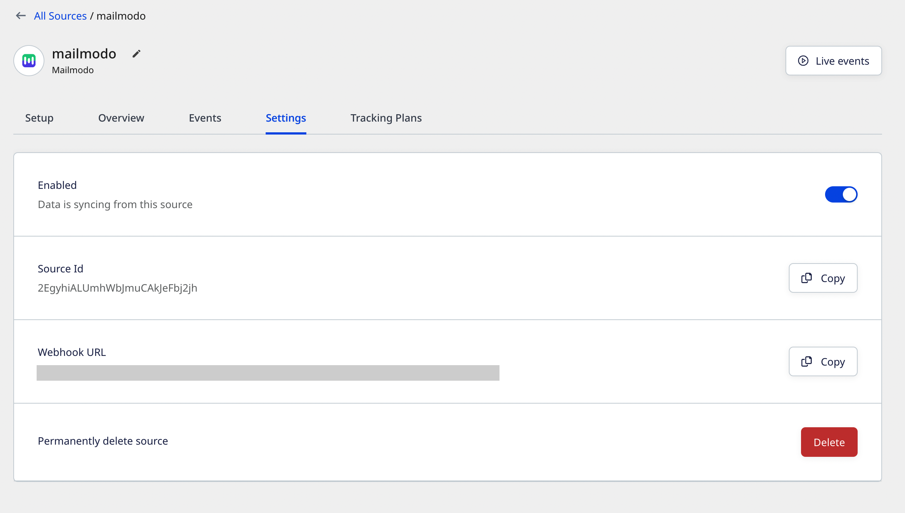
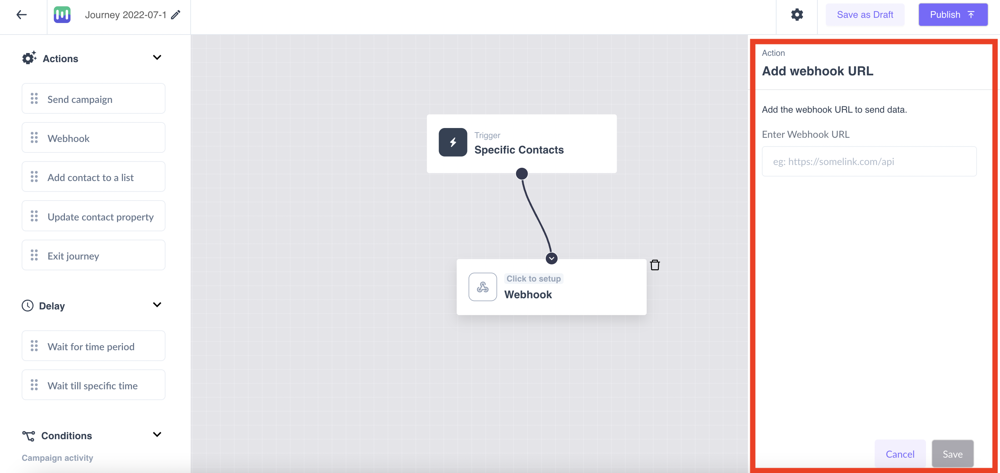
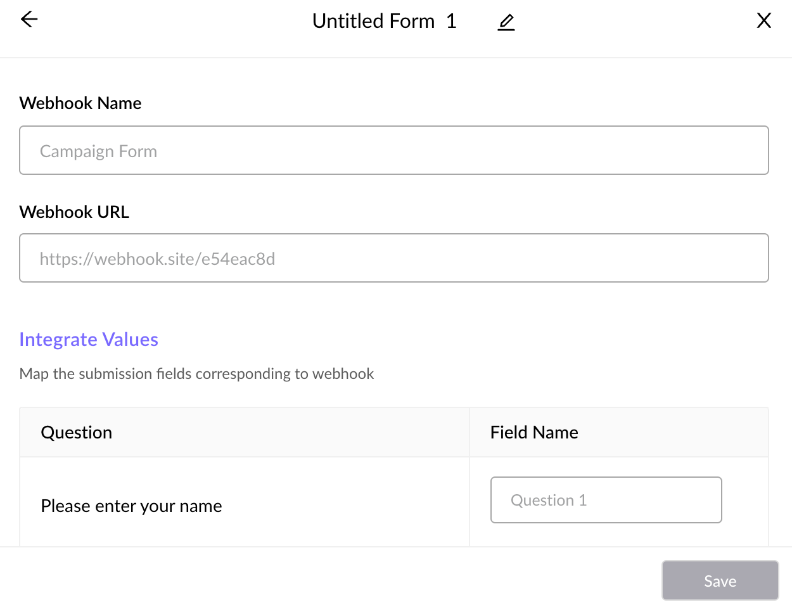

[Mailmodo](https://www.mailmodo.com/) is an interactive email marketing tool that provides several useful features such as, sending transactional campaigns, email automation and drip emails with customer journeys, WYSIWYG email editor and many other tool integrations.

This guide will help you set up Mailmodo as a source in RudderStack.

## Getting started

Follow these steps to set up your Mailmodo source in the RudderStack dashboard:

1. Go to your [RudderStack dashboard](https://app.rudderstack.com/) and click on **Add Source**. From the list of **Event Streams** sources, select **Mailmodo**.
2. Assign a name to your source and click **Continue**.
3. Your Mailmodo source is now configured. Note the **Webhook URL** in the **Settings** tab, as shown:



Mailmodo can send data to a webhook in any of the following formats:

- Send data via webhook by setting it up as an action in the user journey. Log into your <a href="https://manage.mailmodo.com/auth/logi">Mailmodo account</a> and enter the webhook URL by following the detailed steps in [Mailmodo documentation](https://support.mailmodo.com/support/solutions/articles/84000365396-send-webhook-as-an-action-in-the-journey):



- Add Mailmodo's webhook integration from the template builder and use it to export data easily. Log into your <a href="https://manage.mailmodo.com/auth/logi">Mailmodo account</a> and enter the webhook URL by following the detailed steps in [Mailmodo documentation](https://support.mailmodo.com/support/solutions/articles/84000351525-exporting-mailmodo-template-submissions-to-your-software-stack-using-webhook):



## Event transformation

RudderStack ingests the Mailmodo events after converting them into the RudderStack event format. It also maps the following properties from the Mailmodo event payload to the RudderStack properties:

| Mailmodo property  | RudderStack property| Notes |
| :------------------ | :------------- |:------------- |
| `created`  | `timestamp`,`originalTimestamp`    | - |
| `object`        | `properties`        | RudderStack excludes `author`/`voter` from the properties. |
| `objectType`        | `properties.objectType`        | -|
| `type`    | `event`  | -|
| `object.author`    | `context.traits`  | RudderStack excludes `userId` and `id`. |
| `object.author.userId`     | `userId`   |- |
| SHA-256 hash of `object.author.email`      | `anonymousId` | Only if `userId` is not present |
| SHA-256 hash of `object.voter.email`        | `anonymousId` |Only if `userId` is not present **and** `type` is `vote.created`/`vote.deleted`|
| `object.voter.userId`    | `userId`  | Only if `type` is `vote.created`/`vote.deleted` |
| `object.voter.id`        | `context.externalId[0].value` | Only if `type` is `vote.created`/`vote.deleted`|
| `MailmodoUserId`    | `context.externalId[0].type`  |- |
| `object.author.id`     | `context.externalId[0].id`   |- |

## How RudderStack creates the event payload

This section details how RudderStack receives the data from Mailmodo source and creates the resulting payload.

A sample payload sent by Mailmodo is shown below:

```json
{
    "created": "2022-07-28T10:52:46.294Z",
    "object": {
        "author": {
            "created": "2022-07-15T11:16:32.648Z",
            "email": "alex@example.com",
            "id": "1hKOmRA4el9Zt1WSfVJIVo4GRlm",
            "isAdmin": true,
            "name": "Alex Keener",
            "url": "https://rudder.Mailmodo.io/admin/users/alex-keener",
            "userID": null
        },
        "board": {
            "created": "2022-07-25T12:11:19.895Z",
            "id": "VJIVo4GRlm",
            "name": "features",
            "postCount": 13,
            "url": "https://rudder.Mailmodo.io/admin/board/features"
        },
        "by": null,
        "category": null,
        "commentCount": 0,
        "created": "2022-07-28T10:52:46.172Z",
        "customFields": [{
            "id": "62e1382",
            "name": "John",
            "value": "123"
        }],
        "details": "Array of images",
        "eta": null,
        "id": "62e26a",
        "imageURLs": [
            "https://Mailmodo.io/images/6371453a825c79351c52a6063c3af476.jpg",
            "https://Mailmodo.io/images/47db6ee5035bfb45ea87a74f2eb17928.jpg"
        ],
        "owner": null,
        "score": 1,
        "status": "open",
        "tags": [],
        "title": "Custom Fields Testing",
        "url": "https://rudder.Mailmodo.io/admin/board/features/p/custom-fields-testing"
    },
    "objectType": "post",
    "type": "post.created"
}
```

RudderStack transforms the above payload into the following payload:

```json
{
    "anonymousId": "d6a9d06e8a464324d448003ff0467d971a55ca2950e11fc51faaec4e2850ecc6",
    "event": "post.created",
    "integrations": {
        "Mailmodo": false
    },
    "context": {
        "library": {
            "name": "unknown",
            "version": "unknown"
        },
        "integration": {
            "name": "Mailmodo",
            "version": "1.0.0"
        },
        "traits": {
        "created": "2022-07-15T11:16:32.648Z",
        "email": "alex@example.com",
        "isAdmin": true,
        "name": "Alexx Keener",
        "url": "https://rudder.Mailmodo.io/admin/users/alex-keener"
      },
        "externalId": [{
            "type": "MailmodoUserId",
            "id": "1hKOmRA4el9Zt1WSfVJIVo4GRlm"
        }]
    },
    "timestamp": "2022-07-28T10:52:46.294Z",
    "originalTimestamp": "2022-07-28T10:52:46.294Z",
    "type": "track",
    "properties": {
        "board": {
            "created": "2022-07-25T12:11:19.895Z",
            "id": "VJIVo4GRlm",
            "name": "features",
            "postCount": 13,
            "url": "https://rudder.Mailmodo.io/admin/board/features"
        },
        "by": null,
        "category": null,
        "commentCount": 0,
        "created": "2022-07-28T10:52:46.172Z",
        "customFields": [{
            "id": "62e1382",
            "name": "abc",
            "value": "123"
        }],
        "details": "Array of images",
        "eta": null,
        "id": "62e26a",
        "imageURLs": [
            "https://Mailmodo.io/images/6371453a825c79351c52a6063c3af476.jpg",
            "https://Mailmodo.io/images/47db6ee5035bfb45ea87a74f2eb17928.jpg"
        ],
        "objectType": "post",
        "owner": null,
        "score": 1,
        "status": "open",
        "tags": [],
        "title": "Custom Fields Testing",
        "url": "https://rudder.Mailmodo.io/admin/board/features/p/custom-fields-testing"
    }
}
```