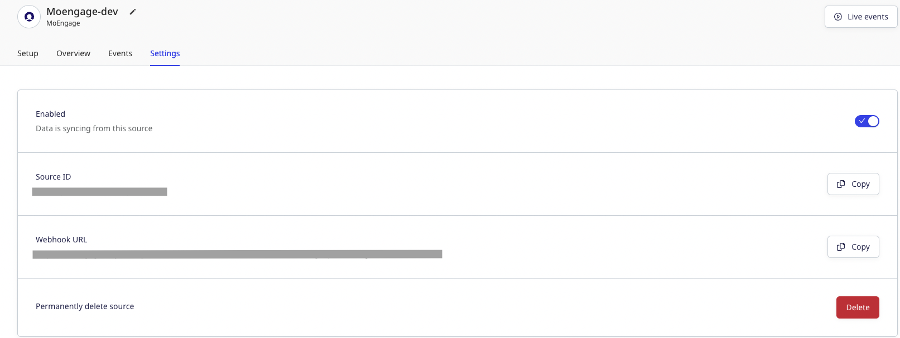
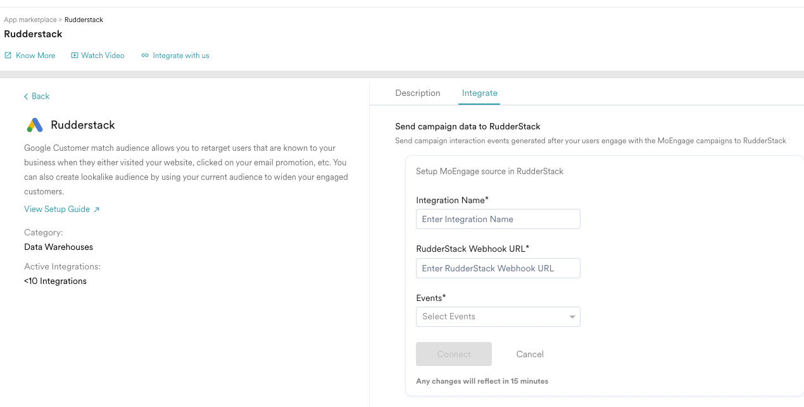

[Moengage](https://moengage.com) s an insights-led Customer Engagement platform for consumer brands, that empowers marketers and product owners with AI-driven insights to create omnichannel experiences that consumers love..

You can now send your Moengage event data to RudderStack by adding a webhook endpoint that points to RudderStack. This way, you can forward any events received by Moengage to RudderStack.

## Getting started

Follow these steps to set up your Segment source in the RudderStack dashboard:

1. Go to your [RudderStack dashboard](https://app.rudderstack.com/) and click on **Add Source**. From the list of **Event Streams** sources, select **Moengage**.
2. Assign a name to your source and click **Continue**.
3. Your Segment source is now configured. Go to the **Settings** tab and note the **Webhook URL**.

4. Go to your [Moengage dashboard](https://dashboard-01.moengage.com/v4/#/partners/rudderstack). Go to **Integration** tab, click on  **Add Integration**.

5. In the configuration screen, enter the integration name, RudderStack webhook URL obtained in Step 3 in the **Webhook URL** field and select the events to be send to RudderStack.