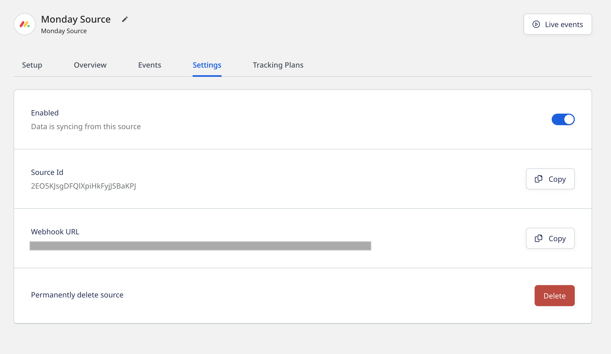

[Monday](https://monday.com/) is a popular workflow management tool. It lets you create efficient cross-team workflows and automations for better collaboration and maximum productivity.

This guide will help you set up Monday as a source in RudderStack.

## Getting started

Follow these steps to set up your Monday source in the RudderStack dashboard:

1. Go to your [RudderStack dashboard](https://app.rudderstack.com/) and click **Add Source**. From the list of **Event Streams** sources, select **Monday**.
2. Assign a name to your source and click **Continue**.
3. Your Monday source is now configured. Note the **Webhook URL** in the **Settings** tab, as shown:



4. Next, create a new webhook in your Monday dashboard by clicking the **Integrate** button and searching for the **Webhooks** app in the the **Integrations Center**.
5. Choose the relevant Monday actions to get the instant event payloads.
6. Finally, specify the webhook URL obtained in Step 3. All the event payloads will be sent to this URL.

<div class="infoBlock">
For more information on creating a new webhook in Monday, refer to the <a href="https://support.monday.com/hc/en-us/articles/360003540679-Webhook-Integration-#">Monday Webhook Integration</a> guide.
</div>

## Event transformation

RudderStack ingests the Monday events after converting them into the RudderStack event format. It also maps the following properties from the Monday event payload to the RudderStack properties:

| Monday property  | RudderStack property |
| :------------------ | :------------- |
| `userId` | `userId` |
| `triggerTime` | `originalTimestamp` |
| `boardId` | `properties.boardId` |
| `pulseId` | `properties.pulseId` |
| `pulseName` | `properties.pulseName` |
| `groupId` | `properties.groupId` |
| `groupName` | `properties.groupName` |
| `groupColor` | `properties.groupColor` |
| `isTopGroup` | `properties.isTopGroup` |
| `columnValues` | `properties.columnValues` |
| `app` | `properties.app` |
| `type` | `properties.type` | 
| `subscriptionId` | `properties.subscriptionId` |
| `triggerUuid` | `properties.triggerUuid` |
| `parentItemId` | `properties.parentItemId` |
| `parentItemBoardId` | `properties.parentItemBoardId` |
| `itemId` | `properties.itemId` |
| `previousValue` | `properties.previousValue` |
| `value` | `properties.value` |

RudderStack supports ingesting the events related to the following Monday.com standard actions:

- A new update is posted.
- A column is changed.
- An item is created.
- A status is changed.
- A specific column is changed.
- An item name is changed.
- A subitem is created.
- A new update is posted on a subitem.
- A subitem column is changed.
- A subitem name is changed.
- An item is deleted.
- A subitem is deleted.
- An item is archived.
- A subitem is archived.

## How RudderStack creates the event payload

This section details how RudderStack receives the data from Monday source and creates the resulting payload.

A sample payload sent by Monday when an item is deleted, is shown below:

```json
{
  event: {
    userId: 33556506,
    originalTriggerUuid: null,
    boardId: 3139815405,
    itemId: 3160188786,
    itemName: "New Sprint Item",
    app: "monday",
    type: "delete_pulse",
    triggerTime: "2022-08-30T09:06:09.176Z",
    subscriptionId: 150882006,
    triggerUuid: "4e4f87c8255c4ba4ba2f5e9934cb6d40",
  },
}
```

RudderStack transforms the above payload into the following payload:

```json
{
  "type": "track",
  "event": "deletePulse",
  "context": {
    "library": {
      "name": "unknown",
      "version": "unknown"
    },
    "externalId": [{
      "id": 33556506,
      "type": "mondayUserId"
    }],
    "integration": {
      "name": "MONDAY"
    }
  },
  "rudderId": "a2073e09-4646-437c-b197-7d2517d202ce",
  "messageId": "4e4f0cfa-c7e2-444f-af70-b90292c3775a",
  "timestamp": "2022-08-30T09:06:09.176Z",
  "properties": {
    "app": "monday",
    "type": "delete_pulse",
    "itemId": 3160188786,
    "boardId": 3139815405,
    "itemName": "New Sprint Item",
    "triggerUuid": "4e4f87c8255c4ba4ba2f5e9934cb6d40",
    "subscriptionId": 150882006,
    "originalTriggerUuid": null
  },
  "anonymousId": "6f0a3dc76a335860e17fa1d8ab779742e2ca",
  "integrations": {
    "MONDAY": false
  },
  "originalTimestamp": "2022-08-30T09:06:09.176Z"
}
```

<div class="infoBlock">
RudderStack transforms the incoming event payload into a <code class="inline-code">track</code> call.
</div>