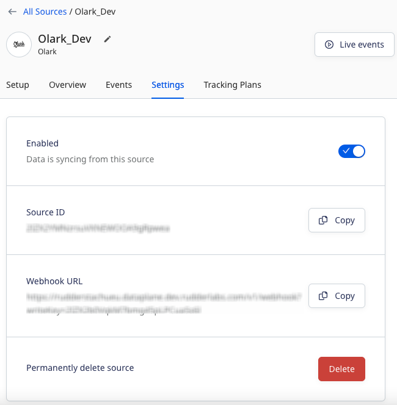

[Olark](https://www.olark.com/) is a cloud-based live chat platform that lets your business connect with customers in an effective and timely manner. It provides various features, like automated messages, team management, real-time reporting, searchable transcripts, and more.

## Getting started

Follow these steps to set up your Olark source in the RudderStack dashboard:

1. Go to your [RudderStack dashboard](https://app.rudderstack.com/) and click **Add Source**. From the list of **Event Streams** sources, select **Olark**.
2. Assign a name to your source and click **Continue**.
3. Your Olark source is now configured. Note the **Webhook URL** in the **Settings** tab, as shown:



4. Login to your <a href="https://www.olark.com/login">Olark account</a>.
5. Enter the webhook URL obtained in the above step by following the steps mentioned in [Olark Webhook integrations](https://www.olark.com/help/webhooks/) guide.
6. Finally, click **Save**.

## Event transformation

RudderStack ingests the Olark events after converting them into the RudderStack event format. It also maps the following properties from the Olark event payload to the RudderStack properties:

| Olark property  | RudderStack property|
| :------------------ | :------------- |
| `visitor.id`  | `userId`    | 
| `visitor.fullName`        | `name`        | 
|  `visitor.phoneNumber` | `phone`        | 
| `visitor.emailAddress`  | `email`        | 
| `visitor.city`     | `city`   | 
| `visitor.region`    | `region`  | 
| `visitor.country`     | `country`   |
| `visitor.operatingSystem`  | `context.browser.name` <br/> `context.browser.version`    | 
| `visitor.referrer`        | `context.page.referrer`        | 
|  `visitor.conversationBeginPage` | `traits.countryCode`        | 
| `visitor.ip`  | `context.ip`        | 
| `visitor.organization`     | `traits.organization`   | 
| `items`    | `properties.items`  | 
| `tags`     | `properties.tags`   |
| `visitor.chat_feedback`  | `traits.chat_feedback`    | 
| `operators`        | `properties.operators`        | 
|  `groups.id` | `groupId`        | 
| `groups.kind`  | `properties.kind`        | 
| `groups.name`     | `traits.name`   | 
| `kind`    | `event`  | 
| `visitor.kind`     | `traits.kind`   |

## How RudderStack creates the event payload

This section details how RudderStack receives the data from Olark source and creates the resulting payload.

A sample payload sent by Olark is shown below:

```json
{
  "kind": "Conversation",
  "id": "NOTAREALTRANSCRIPT5LGcbVTa3hKBRB",
  "manuallySubmitted": false,
  "items": [{
      "kind": "MessageToVisitor",
      "nickname": "Olark operator",
      "operatorId": "6208911878914048",
      "timestamp": "1473774819.263083",
      "body": "Hi from an operator"
    },
    {
      "kind": "MessageToOperator",
      "nickname": "Returning Visitor | USA (San Francisco, CA) #7617",
      "timestamp": "1473774821.411154",
      "body": "Hi from a visitor",
      "visitor_nickname": "Olark Visitor"
    }
  ],
  "tags": [
    "test_example"
  ],
  "visitor": {
    "kind": "Visitor",
    "id": "NOTAREALVISITORIDS5LGl6QUrK2OaPP",
    "fullName": "Olark",
    "phoneNumber": "5555555555",
    "emailAddress": "support+integrationtest@olark.com",
    "ip": "",
    "city": "San Francisco",
    "region": "CA",
    "country": "United States",
    "countryCode": "US",
    "organization": "Visitor Organization",
    "browser": "Internet Explorer 11",
    "operatingSystem": "Windows",
    "referrer": "http://www.olark.com",
    "conversationBeginPage": "http://www.olark.com",
    "chat_feedback": {
      "overall_chat": 4,
      "responsiveness": 5,
      "knowledge": 4,
      "friendliness": 5
    }
  },
  "operators": {
    "6208911878914048": {
      "kind": "Operator",
      "id": "6208911878914048",
      "nickname": "integration",
      "emailAddress": "integration-accounts@rudderstack.com",
      "username": "integration-accounts-92750bc547"
    }
  }
}
```

RudderStack transforms the above payload into the following payload:

```json
{
  "type": "track",
  "event": "Conversation",
  "traits": {
    "organization": "Visitor Organization",
    "chat_feedback": {
      "knowledge": 4,
      "friendliness": 5,
      "overall_chat": 4,
      "responsiveness": 5
    }
  },
  "userId": "NOTAREALVISITORIDS5LGl6QUrK2OaPP",
  "context": {
    "os": {
      "name": "Windows"
    },
    "page": {
      "url": "http://www.olark.com",
      "referrer": "http://www.olark.com"
    },
    "traits": {
      "city": "San Francisco",
      "name": "Olark",
      "email": "support+integrationtest@olark.com",
      "phone": "5555555555",
      "region": "CA",
      "country": "United States"
    },
    "browser": {
      "name": "Internet Explorer",
      "version": "11"
    },
    "library": {
      "name": "unknown",
      "version": "unknown"
    },
    "integration": {
      "name": "Olark"
    }
  },
  "rudderId": "62b1b505-2826-4e08-a266-dd64ba9f36b7",
  "messageId": "a98d637b-7e9b-44c3-a0fe-90a50823c7ba",
  "properties": {
    "tags": [
      "test_example"
    ],
    "items": [{
        "body": "Hi from an operator",
        "kind": "MessageToVisitor",
        "nickname": "Olark operator",
        "timestamp": "1473774819.263083",
        "operatorId": "6208911878914048"
      },
      {
        "body": "Hi from a visitor",
        "kind": "MessageToOperator",
        "nickname": "Returning Visitor | USA (San Francisco, CA) #7617",
        "timestamp": "1473774821.411154",
        "visitor_nickname": "Olark Visitor"
      }
    ]
  },
  "integrations": {
    "Olark": false
  }
}
```