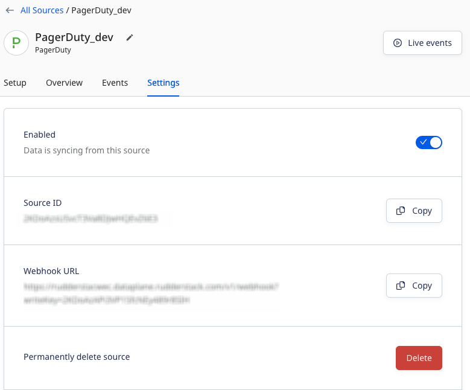

[PagerDuty](https://www.PagerDuty.com/) is a SaaS platform that helps you prevent and resolve business-impacting incidents, thereby improving the customer experience.

## Getting started

Follow these steps to set up your PagerDuty source in the RudderStack dashboard:

1. Go to your [RudderStack dashboard](https://app.rudderstack.com/) and click **Add Source**. From the list of **Event Streams** sources, select **PagerDuty**.
2. Assign a name to your source and click **Continue**.
3. Your PagerDuty source is now configured. Note the **Webhook URL** in the **Settings** tab, as shown:



4. Log into your <a href="https://app.pagerduty.com/">PagerDuty account</a>. 
5. Go to **Integrations** > **Generic Webhooks (v3)**. Click **New Webhook** and enter the webhook URL obtained in **Step 3** and other required details, as shown:


6. Finally, click **Add Webhook**. 

## Event transformation

RudderStack ingests all the events mentioned in the [PagerDuty documentation](https://developer.pagerduty.com/docs/ZG9jOjQ1MTg4ODQ0-overview#event-types) after converting them into the RudderStack event format. It also maps the following properties from the PagerDuty event payload to the RudderStack properties:

| PagerDuty property  | RudderStack property| 
| :------------------ | :------------- |
| `event_type`  | `event`    | 
| `id`        | `messageId`        | 
| `occurred_at` | `OriginalTimeStamp`        | 
| `resource_type`        | `properties.resourceType`|
| `data`     | `properties.data`   | 
| `client`    | `properties.client`  |
| `agent`     | `context.traits`   |
| `userId`  | `agent.id`    | 

## How RudderStack creates the event payload

This section details how RudderStack receives the data from PagerDuty source and creates the resulting payload.

A sample payload sent by PagerDuty is shown below:

```json
{
  "event": {
    "id": "01DEN0V2VIFEN5871PQGX72URP",
    "event_type": "incident.triggered",
    "resource_type": "incident",
    "occurred_at": "2022-12-07T10:56:52.337Z",
    "agent": {
      "html_url": "https://rudderlabs-com.pagerduty.com/users/PXZZD2E",
      "id": "PXZZD2E",
      "self": "https://api.pagerduty.com/users/PXZZD2E",
      "summary": "mihir patel",
      "type": "user_reference"
    },
    "client": {
      "name": "Monitoring Service",
      "url": "https://monitoring.service.com"
    },
    "data": {
      "id": "Q3S7IX2U5KTCOY",
      "type": "incident",
      "self": "https://api.pagerduty.com/incidents/Q3S7IX2U5KTCOY",
      "html_url": "https://rudderlabs-com.pagerduty.com/incidents/Q3S7IX2U5KTCOY",
      "number": 2,
      "status": "triggered",
      "incident_key": "faaecfc0aca04b6ea07154188b5d3c6c",
      "created_at": "2022-12-07T10:56:52Z",
      "title": "Server Crashed",
      "service": {
        "html_url": "https://rudderlabs-com.pagerduty.com/services/PAJBUTT",
        "id": "PAJBUTT",
        "self": "https://api.pagerduty.com/services/PAJBUTT",
        "summary": "Database",
        "type": "service_reference"
      },
      "assignees": [{
        "html_url": "https://rudderlabs-com.pagerduty.com/users/PXZZD2E",
        "id": "PXZZD2E",
        "self": "https://api.pagerduty.com/users/PXZZD2E",
        "summary": "mihir patel",
        "type": "user_reference"
      }],
      "escalation_policy": {
        "html_url": "https://rudderlabs-com.pagerduty.com/escalation_policies/PB7HKU4",
        "id": "PB7HKU4",
        "self": "https://api.pagerduty.com/escalation_policies/PB7HKU4",
        "summary": "Default",
        "type": "escalation_policy_reference"
      },
      "teams": [],
      "priority": {
        "html_url": "https://rudderlabs-com.pagerduty.com/account/incident_priorities",
        "id": "PPMNDVQ",
        "self": "https://api.pagerduty.com/priorities/PPMNDVQ",
        "summary": "P1",
        "type": "priority_reference"
      },
      "urgency": "high",
      "conference_bridge": null,
      "resolve_reason": null
    }
  }
}
```

RudderStack transforms the above payload into the following <Link to="/event-spec/standard-events/track/">`track`</Link> payload:

```json
{
  "type": "track",
  "event": "Incident Triggered",
  "userId": "PXZZD2E",
  "context": {
    "traits": {
      "id": "PXZZD2E",
      "self": "https://api.pagerduty.com/users/PXZZD2E",
      "type": "user_reference",
      "summary": "mihir patel",
      "html_url": "https://rudderlabs-com.pagerduty.com/users/PXZZD2E"
    },
    "library": {
      "name": "unknown",
      "version": "unknown"
    },
    "integration": {
      "name": "PagerDuty"
    }
  },
  "rudderId": "a44e6807-d09c-4613-93f8-83ccd8b55901",
  "messageId": "01DEN0V2VIFEN5871PQGX72URP",
  "properties": {
    "data": {
      "id": "Q3S7IX2U5KTCOY",
      "self": "https://api.pagerduty.com/incidents/Q3S7IX2U5KTCOY",
      "type": "incident",
      "teams": [],
      "title": "Server Crashed",
      "number": 2,
      "status": "triggered",
      "service": {
        "id": "PAJBUTT",
        "self": "https://api.pagerduty.com/services/PAJBUTT",
        "type": "service_reference",
        "summary": "Database",
        "html_url": "https://rudderlabs-com.pagerduty.com/services/PAJBUTT"
      },
      "urgency": "high",
      "html_url": "https://rudderlabs-com.pagerduty.com/incidents/Q3S7IX2U5KTCOY",
      "priority": {
        "id": "PPMNDVQ",
        "self": "https://api.pagerduty.com/priorities/PPMNDVQ",
        "type": "priority_reference",
        "summary": "P1",
        "html_url": "https://rudderlabs-com.pagerduty.com/account/incident_priorities"
      },
      "assignees": [{
        "id": "PXZZD2E",
        "self": "https://api.pagerduty.com/users/PXZZD2E",
        "type": "user_reference",
        "summary": "mihir patel",
        "html_url": "https://rudderlabs-com.pagerduty.com/users/PXZZD2E"
      }],
      "created_at": "2022-12-07T10:56:52Z",
      "incident_key": "faaecfc0aca04b6ea07154188b5d3c6c",
      "resolve_reason": null,
      "conference_bridge": null,
      "escalation_policy": {
        "id": "PB7HKU4",
        "self": "https://api.pagerduty.com/escalation_policies/PB7HKU4",
        "type": "escalation_policy_reference",
        "summary": "Default",
        "html_url": "https://rudderlabs-com.pagerduty.com/escalation_policies/PB7HKU4"
      }
    },
    "client": {
      "url": "https://monitoring.service.com",
      "name": "Monitoring Service"
    },
    "resourceType": "incident"
  },
  "integrations": {
    "PagerDuty": false
  },
  "originalTimestamp": "2022-12-07T10:56:52.000Z"
}
```
