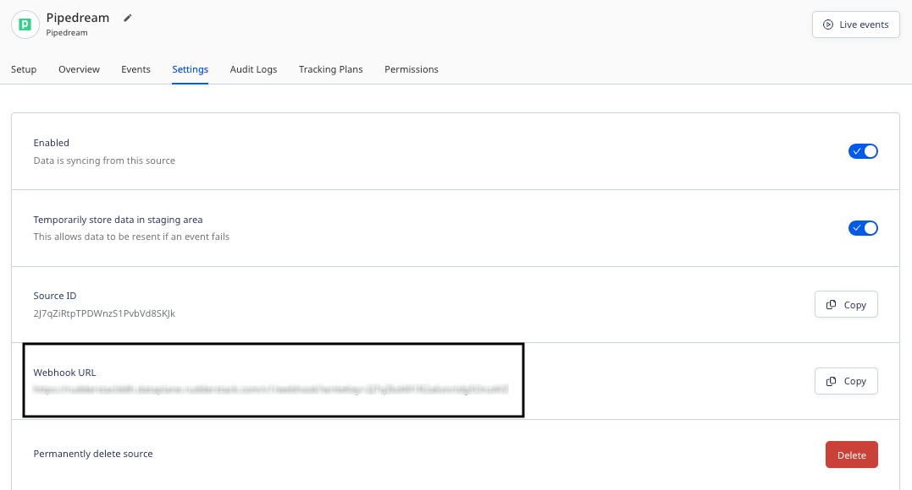

[Pipedream](https://pipedream.com/) lets you build and automate processes that connect APIs. It supports open source triggers and actions for hundreds of integrations.

This guide will help you set up Pipedream as a source in RudderStack.

<YouTube
  videoId={'uaZk2mjQKhQ'}
/>

## Getting started

Follow these steps to set up your Pipedream source in the RudderStack dashboard:

1. Go to your [RudderStack dashboard](https://app.rudderstack.com/) and click **Add Source**. From the list of **Event Streams** sources, select **Pipedream**.
2. Assign a name to your source and click **Continue**.
3. Your Pipedream source is now configured. Note the **Webhook URL** in the **Settings** tab, as shown:



4. Log in to your [Pipedream dashboard](https://pipedream.com/workflows/) and set up your workflow.
5. After <a href="https://pipedream.com/new?tutorial=1">adding a trigger</a>, click the **+** icon to add a step. Then, select the **HTTP / Webhook** option and choose **Send any HTTP Request**, as shown:


6. In the **HTTP Request Configuration** section, choose **POST** as the request type and enter the RudderStack webhook URL obtained in Step 3 above. Also, configure the other request configuration settings as required.

<div class="warningBlock">
RudderStack only accepts the incoming HTTP requests of type <strong>POST</strong>.
</div>


7. Click **Deploy** to finish setting up the workflow.

## Event transformation

RudderStack ingests the Pipedream events and checks for the `userId`/`anonymousId` field and the event type (`identify`, `track`, etc.). If both are present, it considers the event to be in a RudderStack payload format. Otherwise, it converts it into a RudderStack payload according to the below property-value mapping:

| RudderStack property  | Value | 
| :------------------ | :------------- |
| `message.event`  | `pipedream_source_event`    | 
|  `message.type`   |  `track`       | 
| `message.properties`     | Pipedream input payload |

## How RudderStack creates the event payload

RudderStack supports all the <Link to="/event-spec/standard-events/">standard events</Link> in the specified format. For the other events, it transforms the incoming data to a <Link to="/event-spec/standard-events/track/">`track`</Link> payload.

A sample incoming payload is as shown:

```json
{
    "artist": "Artist One",
    "genre": "Jazz",
    "song": "Take Five"
  }
```

RudderStack transforms the above payload into the following `track` payload: 

```json
{
  "event": "pipedream_soure_event",
  "anonymousId": "63767499ca6fb1b7c988d5bb",
  "integration": {
    "name": "PIPEDREAM"
  },
  "integrations": {
    "PIPEDREAM": false
  },
  "type": "track",
  "properties": {
    "artist": "Artist One",
    "genre": "Jazz",
    "song": "Take Five"
  }
}
```

<br />