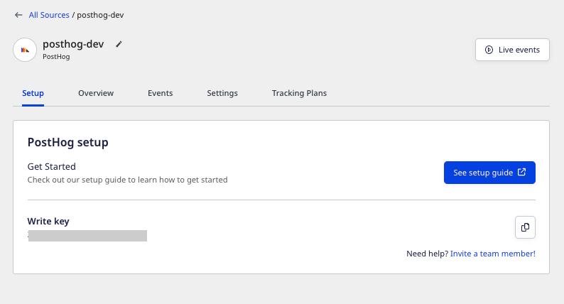
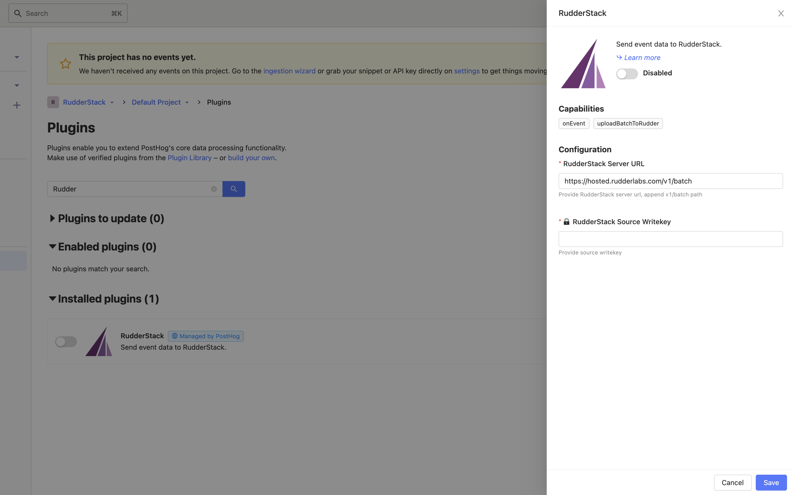

[PostHog](https://posthog.com/) is a complete product analytics stack that you can seamlessly deploy on your infrastructure. It simplifies scalable product analytics while giving you full control over all your user data.

RudderStack now supports PostHog as a source. You can send your PostHog events to RudderStack by using the [ RudderStack PostHog plugin](https://github.com/rudderlabs/rudderstack-posthog-plugin).

## ‌Getting started

Follow these steps to set up your PostHog source in the RudderStack dashboard:

1. Go to your [RudderStack dashboard](https://app.rudderstack.com/) and click on **Add Source**. From the list of **Event Streams** sources, select **PostHog**.
2. Assign a name to your source and click **Continue**.
3. Your PostHog source is now configured. Note the source **Write key**, as shown:



## Setting up the RudderStack-PostHog plugin

Once you've successfully set up PostHog as a source in RudderStack, follow these steps to configure and set up the PostHog-managed RudderStack plugin.

1. Copy your PostHog source **Write key** from the RudderStack dashboard and your data plane URL.

<div class="infoBlock">
For more information on the data plane URL, refer to the <Link to="/resources/glossary/#data-plane-url">Glossary</Link>.
</div>

2. Then, go to your PostHog dashboard and go to **Plugins**. In the search bar, type **RudderStack**.
3. Configure this plugin using the write key and the data plane URL from **Step 1**. Append `v1/batch` to this URL so that it is of the following format:

```
https://<DATA_PLANE_URL>/v1/batch
```

If you are using RudderStack Cloud, set `<DATA_PLANE_URL` to `https://hosted.rudderlabs.com/v1/batch`



4. Finally, enable this plugin. 

Any events generated in your PostHog instance will now be automatically sent to RudderStack. You can then route these events to your specified destinations.

## License

The RudderStack PostHog Plugin is released under the [MIT License](https://opensource.org/licenses/MIT).