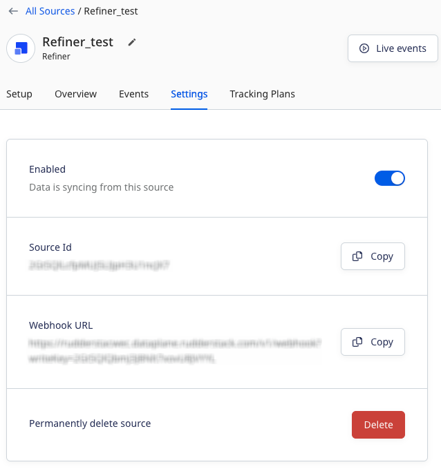
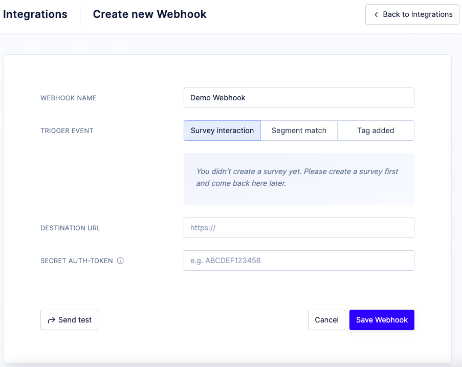

[Refiner](https://refiner.io/) is a customer feedback and survey platform. It lets you create tailored microsurveys to get a better understanding of your customers, how they interact with your product, and identify new growth opportunities.

This guide will help you set up Refiner as a source in RudderStack.

<YouTube
  videoId={'HGQCXEzgBvs'}
/>

## Getting started

Follow these steps to set up your Refiner source in the RudderStack dashboard:

1. Go to your [RudderStack dashboard](https://app.rudderstack.com/) and click **Add Source**. From the list of **Event Streams** sources, select **Refiner**.
2. Assign a name to your source and click **Continue**.
3. Your Refiner source is now configured. Note the **Webhook URL** in the **Settings** tab, as shown:



4. Log into your <a href="https://app.refiner.io/auth/login">Refiner account</a>.
5. Go to **Integrations** and select **Create Webhook**.
6. Name your webhook and enter the webhook in the **Destination URL** field as shown: 



7. Finally, click **Save Webhook**.

## Event transformation

RudderStack ingests the Refiner events after converting them into the RudderStack event format. It also maps the following properties from the Refiner event payload to the RudderStack properties:

| Refiner property  | RudderStack property|
| :------------------ | :------------- |
| `email`  | `email`    | 
| `triggered_event`        | `event`        | 
|  `attributes.user_id` | `userId`        | 
| `attributes` <br/> `segments` | `context.traits`        | 
| `account`     | `traits`   | 
| `response` <br/>`form`    | `properties`  | 
| `last_form_submission_at`     | `originaltimestamp`   |

## How RudderStack creates the event payload

This section details how RudderStack receives the data from Refiner source and creates the resulting payload.

A sample payload sent by Refiner is shown below:

```json
{
  "uuid": "69b83e20-4ea2-11ed-941c-e1cb6c7a3870",
  "cookie_uuid": "2f9b7e6a-9ba8-1c68-d474-48d719d92a60",
  "project_uuid": "0d8759d0-401c-11ed-8ded-9757c4929b55",
  "remote_id": "sdk@30",
  "email": "sdk30@gmail.com",
  "display_name": "",
  "first_seen_at": "2022-10-18T05:04:58.000000Z",
  "last_seen_at": "2022-10-18T05:04:58.000000Z",
  "attributes": {
    "address": null,
    "address_city": null,
    "address_state": null,
    "age": null,
    "another_attribute": null,
    "city": null,
    "country": null,
    "created_at": null,
    "email": "sdk30@gmail.com",
    "event": null,
    "first_name": null,
    "first_seen_at": "2022-10-18T05:04:58.000000Z",
    "form_submissions_count": "1",
    "form_views_count": "1",
    "gender": null,
    "last_form_submission_at": "2022-10-18T05:05:45.000000Z",
    "last_form_view_at": "2022-10-18T05:05:29.000000Z",
    "last_name": null,
    "last_seen_at": "2022-10-18T05:04:58.000000Z",
    "name": null,
    "phone": null,
    "some_attribute": null,
    "status": null,
    "student": null,
    "tag": null,
    "trait1": null,
    "trait2": null,
    "trait3": null,
    "url": null,
    "user_address_city": null,
    "user_address_state": null,
    "user_country": null,
    "user_id": null,
    "username": null,
    "useroccupation": null,
    "why_did_you_cancel_your_subscription": "Missing features"
  },
  "segments": [{
      "uuid": "0d91d7a0-401c-11ed-8898-bb1ee0c23ae5",
      "name": "All Users",
      "created_at": "2022-10-18T05:04:58.000000Z",
      "updated_at": "2022-10-18T05:04:58.000000Z"
    },
    {
      "uuid": "f71ad940-455c-11ed-85e0-bf25f168b224",
      "name": "test-segment",
      "created_at": "2022-10-18T05:04:58.000000Z",
      "updated_at": "2022-10-18T05:04:58.000000Z"
    }
  ],
  "account": {
    "uuid": "69ba2030-4ea2-11ed-adfc-595e70c7ab07",
    "remote_id": null,
    "domain": null,
    "display_name": "",
    "first_seen_at": "2022-10-18T05:04:58.000000Z",
    "last_seen_at": "2022-10-18T05:04:58.000000Z",
    "attributes": {
      "1": null,
      "2": null,
      "3": null,
      "4": null,
      "a_date_at": null,
      "business_email": null,
      "company": null,
      "email": null,
      "isfunded": null,
      "location": null,
      "name": null,
      "revenue": null,
      "some_account_data": null,
      "trait1": null,
      "trait2": null,
      "trait3": null,
      "user_id": null
    }
  },
  "triggered_event": "Completed Survey",
  "form": {
    "uuid": "0d94c790-401c-11ed-bb27-e31f6832c5ae",
    "name": "Customer Churn Survey"
  },
  "response": {
    "uuid": "7c508c60-4ea2-11ed-9302-57708fe11d26",
    "first_shown_at": "2022-10-18T05:05:29.000000Z",
    "last_shown_at": "2022-10-18T05:05:29.000000Z",
    "show_counter": null,
    "first_data_reception_at": "2022-10-18T05:05:45.000000Z",
    "last_data_reception_at": "2022-10-18T05:05:45.000000Z",
    "completed_at": "2022-10-18T05:05:45.000000Z",
    "dismissed_at": null,
    "received_at": "2022-10-18T05:05:45.000000Z",
    "data": {
      "why_did_you_cancel_your_subscription": "Missing features"
    },
    "tags": []
  }
}
```

RudderStack transforms the above payload into the following payload:

```json
{
  "type": "identify",
  "traits": {
    "why_did_you_cancel_your_subscription": "Missing features"
  },
  "userId": "sdk@30",
  "context": {
    "traits": {
      "email": "sdk30@gmail.com",
      "segments": [{
          "name": "All Users",
          "uuid": "0d91d7a0-401c-11ed-8898-bb1ee0c23ae5",
          "created_at": "2022-10-18T05:04:58.000000Z",
          "updated_at": "2022-10-18T05:04:58.000000Z"
        },
        {
          "name": "test-segment",
          "uuid": "f71ad940-455c-11ed-85e0-bf25f168b224",
          "created_at": "2022-10-18T05:04:58.000000Z",
          "updated_at": "2022-10-18T05:04:58.000000Z"
        }
      ]
    },
    "library": {
      "name": "unknown",
      "version": "unknown"
    },
    "formName": "Customer Churn Survey",
    "formUuid": "0d94c790-401c-11ed-bb27-e31f6832c5ae",
    "integration": {
      "name": "Refiner"
    }
  },
  "rudderId": "0b10eeb2-0949-4cc9-9d38-3fd1348392e2",
  "messageId": "579f213b-5f7d-4dd4-9fa4-d3dca8a0a661",
  "integrations": {
    "Refiner": false
  },
  "originalTimestamp": "2022-10-18T05:05:45.000000Z"
} {
  "type": "track",
  "event": "Completed Survey",
  "userId": "sdk@30",
  "context": {
    "library": {
      "name": "unknown",
      "version": "unknown"
    },
    "formName": "Customer Churn Survey",
    "formUuid": "0d94c790-401c-11ed-bb27-e31f6832c5ae",
    "integration": {
      "name": "Refiner"
    }
  },
  "rudderId": "0b10eeb2-0949-4cc9-9d38-3fd1348392e2",
  "messageId": "94e5747f-4324-4d32-8a1d-33d0a3b718e1",
  "properties": {
    "response": {
      "data": {
        "why_did_you_cancel_your_subscription": "Missing features"
      },
      "tags": [],
      "uuid": "7c508c60-4ea2-11ed-9302-57708fe11d26",
      "received_at": "2022-10-18T05:05:45.000000Z",
      "completed_at": "2022-10-18T05:05:45.000000Z",
      "last_shown_at": "2022-10-18T05:05:29.000000Z",
      "first_shown_at": "2022-10-18T05:05:29.000000Z",
      "last_data_reception_at": "2022-10-18T05:05:45.000000Z",
      "first_data_reception_at": "2022-10-18T05:05:45.000000Z"
    },
    "refiner_form_name": "Customer Churn Survey",
    "refiner_form_uuid": "0d94c790-401c-11ed-bb27-e31f6832c5ae"
  },
  "integrations": {
    "Refiner": false
  },
  "originalTimestamp": "2022-10-18T05:05:45.000000Z"
}
```
