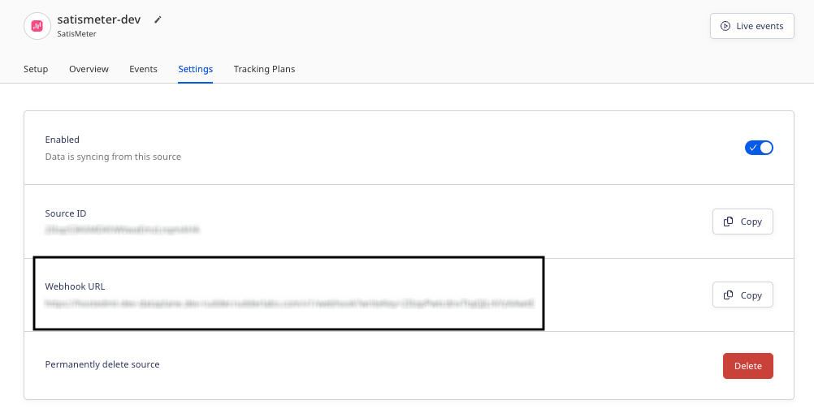

[SatisMeter](https://www.satismeter.com/) is a customer feedback collection tool. It helps you derive real-time insights on customer satisfaction and monitor your product's performance.

This guide will help you set up SatisMeter as a source in RudderStack.

## Getting started

Follow these steps to set up your SatisMeter source in the RudderStack dashboard:

1. Go to your [RudderStack dashboard](https://app.rudderstack.com/) and click **Add Source**. From the list of **Event Streams** sources, select **SatisMeter**.
2. Assign a name to your source and click **Continue**.
3. Your SatisMeter source is now configured. Note the **Webhook URL** in the **Settings** tab, as shown:



4. Log into your [SatisMeter account](https://app.satismeter.com/login).
5. From the left sidebar, go to **Settings** > **Integrations** > **Webhooks** and enter the webhook URL, as shown:


<div class="infoBlock">
Refer to the <a href="https://support.satismeter.com/hc/en-us/articles/6980495785107-Webhooks">SatisMeter documentation</a> for more information on configuring webhooks.
</div>

6. Finally, click **Save Changes**.

## Event transformation

RudderStack ingests the SatisMeter events after converting them into the RudderStack event format. It also maps the following properties from the SatisMeter event payload to the RudderStack properties:

| SatisMeter property  | RudderStack property| 
| :------------------ | :------------- |
| `traits`  | `context.traits`    | 
| `response.user.userId`    | `userId`        | 
| `response.user.id`       | `anonymousId`|
| `response.answers` | `properties.answers`        |
| `response.pending`     | `properties.surveyPending`  | 
| `response.dismissed`    | `properties.surveyDismissed` | 
| `response.created`    | `properties.receivedAt`   |
| `campaign`  | `context.campaign`    | 
| `event`    | `survey${event}`        | 
| `response.category` | `properties.category`        |
| `response.location`    | `context.location`  | 
| `response.user.deleted`     | `context.traits.userDeleted`   |
| `response.user.groups`     | `traits.groups`   |
| `response.device`    | `context.device`  | 
| `response.language`     | `context.locale`   |
| `response.referrer`     | `context.page.referrer`   |

## How RudderStack creates the event payload

This section details how RudderStack receives the data from SatisMeter source and creates the resulting payload.

A sample payload sent by SatisMeter is shown below:

```json
{
  "response": {
    "id": "63767499ca6fb1b7c988d5bb",
    "created": "2022-11-17T17:51:21.764Z",
    "rating": 5,
    "feedback": "Many things to improve",
    "dismissed": false,
    "pending": false,
    "answers": [{
      "label": "How likely are you to recommend us to your friends and colleagues?",
      "id": "7ddb22b0-64a8-11ed-a4c7-b3bed73771cd",
      "value": 5,
      "name": "SM_rating",
      "type": "scale",
      "metric": "nps"
    }],
    "category": "detractor",
    "score": -100,
    "user": {
      "id": "63766fbb7ac7b72676145338",
      "name": "Alex Keener",
      "email": "alex@example.com",
      "userId": "No response",
      "deleted": false,
      "groups": {
        "group1": "grooupId"
      },
      "traits": {
        "createdAt": "2022-10-15T05:41:06.016Z",
        "custom": {
          "key1": "v1",
          "key2": "V2"
        },
        "email": "alex@example.com",
        "name": "Alex Keener"
      }
    },
    "device": {
      "os": "macOS",
      "type": "desktop"
    },
    "location": {
      "country": "IN",
      "countryName": "India",
      "region": "",
      "city": "",
      "short": "India",
      "long": "India"
    },
    "referrer": "http://127.0.0.1:5500/testSm.html",
    "method": "In-app",
    "language": "en",
    "project": "6372247a764986ebee62bf66",
    "campaign": "6373271b764986ebee62bfca"
  },
  "traits": {
    "createdAt": "2022-10-15T05:41:06.016Z",
    "custom": {
      "key1": "v1",
      "key2": "V2"
    },
    "email": "alex@example.com",
    "name": "Alex Keener"
  },
  "campaign": {
    "id": "6373271b764986ebee62bfca",
    "name": "NPS Survey"
  },
  "event": "completed"
}
```

RudderStack transforms the above payload into the following <Link to="/event-spec/standard-events/track/">`track`</Link> payload:

```json
{
  "event": "Survey completed",
  "anonymousId": "63766fbb7ac7b72676145338",
  "context": {
    "library": {
      "name": "unknown",
      "version": "unknown"
    },
    "traits": {
      "createdAt": "2022-10-15T05:41:06.016Z",
      "custom": {
        "key1": "v1",
        "key2": "V2"
      },
      "email": "alex@example.com",
      "name": "Alex Keener"
      "userDeleted": false
    },
    "locale": "en",
    "campaign": {
      "id": "6373271b764986ebee62bfca",
      "name": "NPS Survey"
    },
    "integration": {
      "name": "SATISMETER"
    },
    "location": {
      "country": "IN",
      "countryName": "India",
      "short": "India",
      "long": "India"
    },
    "device": {
      "os": "macOS",
      "type": "desktop"
    },
    "page": {
      "referrer": "http://127.0.0.1:5500/testSm.html"
    }
  },
  "integrations": {
    "SATISMETER": false
  },
  "type": "track",
  "traits": {
    "groups": {
      "group1": "grooupId"
    }
  },
  "userId": "No response",
  "properties": {
    "category": "detractor",
    "answers": [{
        "label": "How likely are you to recommend us to your friends and colleagues?",
        "id": "7ddb22b0-64a8-11ed-a4c7-b3bed73771cd",
        "value": 5,
        "name": "SM_rating",
        "type": "scale",
        "metric": "nps"
      }

    ],
    "surveyDismissed": false,
    "surveyPending": false,
    "receivedAt": "2022-11-17T17:51:21.764Z"
  }
}
```
