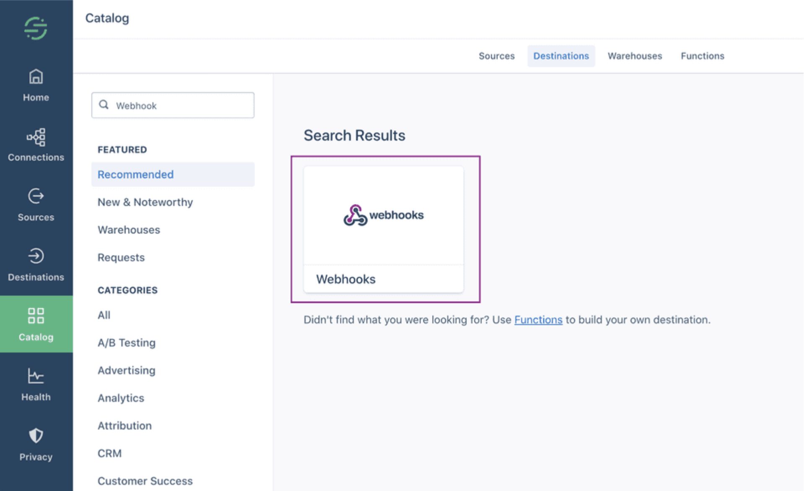
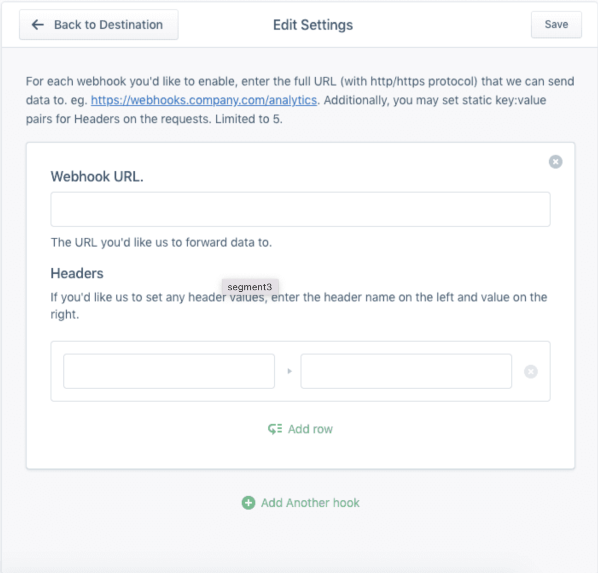

[Segment](https://segment.com) is a Customer Data Platform that lets you collect your customer data.

You can now send your Segment event data to RudderStack by adding a webhook endpoint that points to RudderStack. This way, you can forward any events received by Segment to RudderStack.

## Getting started

Follow these steps to set up your Segment source in the RudderStack dashboard:

1. Go to your [RudderStack dashboard](https://app.rudderstack.com/) and click **Add Source**. From the list of **Event Streams** sources, select **Segment**.
2. Assign a name to your source and click **Continue**.
3. Your Segment source is now configured. Go to the **Settings** tab and note the **Webhook URL**.

4. Go to your [Segment dashboard](https://app.segment.com/workspaces). From the sidebar, go to **Destinations** > **Add Destination**. In the destinations catalog page, search for **Webhooks**.

5. In the configuration screen, enter the RudderStack webhook URL obtained in Step 3 in the **Webhook URL** field:

## Event transformation

As RudderStack is fully Segment-compatible, it does not perform any modifications on the event data received from Segment.