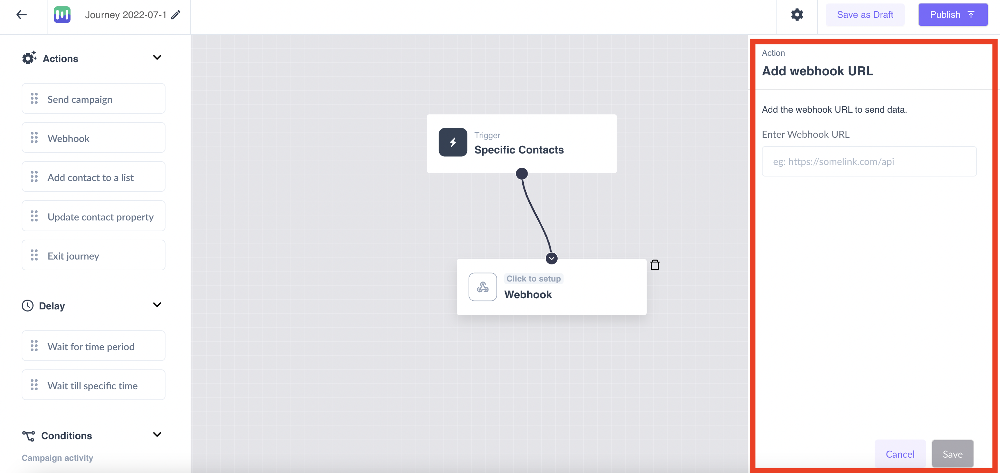

[Signl4](https://www.signl4.com/) is used as a mobile alerting service that alerts the members of a team for a particular event along with the feature of acknowledging and closing those alerts.

This guide will help you set up Signl4 as a source in RudderStack.

## Getting started

Follow these steps to set up your Signl4 source in the RudderStack dashboard:

1. Go to your [RudderStack dashboard](https://app.rudderstack.com/) and click **Add Source**. From the list of **Event Streams** sources, select **Signl4**.
2. Assign a name to your source and click **Continue**.
3. Your Signl4 source is now configured. Note the **Webhook URL** in the **Settings** tab, as shown:


4. Log into your <a href="https://manage.mailmodo.com/auth/logi">Signl4 account</a> and enter the **Webhook URL** based on the required format. Signl4 can send data to a webhook in any of the following ways:    

- By setting it up as an action in the user journey. Follow the detailed steps from [Signl4 documentation](https://support.mailmodo.com/support/solutions/articles/84000365396-send-webhook-as-an-action-in-the-journey):



- By adding Signl4's webhook integration from the template builder and use it to export data. Follow the detailed steps from [Signl4 documentation](https://support.mailmodo.com/support/solutions/articles/84000351525-exporting-mailmodo-template-submissions-to-your-software-stack-using-webhook):


## Event transformation

RudderStack ingests the Signl4 events after converting them into the RudderStack event format. It also maps the following properties from the Signl4 event payload to the RudderStack properties:

| Signl4 property  | RudderStack property| Notes |
| :------------------ | :------------- |:------------- |
| `mailmodoUserId`  | `context.externalId[0].type`    | Only when [the webhook is set up as an action in the user journey](https://support.mailmodo.com/support/solutions/articles/84000365396-send-webhook-as-an-action-in-the-journey). |
| `triggerData.userId`        | `context.externalId[0].value`        | Only when [the webhook is set up as an action in the user journey](https://support.mailmodo.com/support/solutions/articles/84000365396-send-webhook-as-an-action-in-the-journey). |
| SHA-256 hash of `triggerData.email`/`recipientData.email`/`recipientEmail` | `anonymousId`        | -|
| `triggerData.email`/`recipientData.email`/`recipientEmail` | `context.traits.email`        | -|
| `triggerData.triggerSource`     | `event`   | If `triggerData.triggerSource` is not present, the event name is sent as **Form Submitted**.  |
| `recipientData`    | `context.traits`  | - |
| `recordedAt.ts`     | `originalTimestamp`   |- |

<div class="infoBlock">
Barring <code class="inline-code">recipientData</code>, <code class="inline-code">recordedAt</code>, <code class="inline-code">email</code>, and <code class="inline-code">userId</code>, RudderStack assigns the rest of the payload fields to <code class="inline-code">properties</code> after flattening them.
</div>

## How RudderStack creates the event payload

This section details how RudderStack receives the data from Signl4 source for different formats and creates the resulting payload.

- If you choose to send webhook as an action in the journey, a sample payload sent by Signl4 is shown below:

```json
{
  "triggerData": {
    "data": {},
    "eventProperty": {
      "Name": "APPLE iPhone 13 (Blue, 128 GB)",
      "Category": "Mobiles",
      "Is Purchased": "false",
      "Price": "829",
      "Currency": "USD"
    },
    "triggerSource": "New Custom Event Trigger - Product Viewed",
    "email": "alex@example.com",
    "userId": "d3775892-****-4f2f-b9d5-e49810eb2cae",
    "journeyId": "3f135bf7-****-4e31-b265-f61cfe1bd423"
  }
}
```

RudderStack transforms the above payload into the following payload:

```json
{
  "anonymousId": "26c9ad4b531287858155ffa834be13dddc2c45df6e29af7230408953d732dd92",
  "context": {
    "externalId": [{
      "id": "d3775892-****-4f2f-b9d5-e49810eb2cae",
      "type": "mailmodoUserId"
    }],
    "traits": {
      "email": "alex@example.com"
    },
    "integration": {
      "name": "Signl4",
      "version": "1.0.0"
    },
    "library": {
      "name": "unknown",
      "version": "unknown"
    }
  },
  "event": "New Custom Event Trigger - Product Viewed",
  "integrations": {
    "Signl4": false
  },
  "properties": {
    "triggerData.eventProperty.Category": "Mobiles",
    "triggerData.eventProperty.Currency": "USD",
    "triggerData.eventProperty.Is Purchased": "false",
    "triggerData.eventProperty.Name": "APPLE iPhone 13 (Blue, 128 GB)",
    "triggerData.eventProperty.Price": "829",
    "triggerData.journeyId": "3f135bf7-****-4e31-b265-f61cfe1bd423",
    "triggerData.triggerSource": "New Custom Event Trigger - Product Viewed"
  },
  "type": "track"
}
```


- If you choose to export the Signl4 template submissions to your software stack using a webhook, a sample payload sent by Signl4 is shown below:

```json
{
  "fuuid": "27905",
  "next-step-id": "success",
  "total-steps": "3",
  "responseId": "b9a5d224-cc5a-4e64-9800-5a3db9515fdf",
  "recipientEmail": "alex@example.com",
  "formId": "formosztd5",
  "recordedAt": {
    "ts": 1662695704,
    "date": "2022-09-09",
    "hour": 9,
    "minute": 25
  },
  "submissionSource": "amp",
  "elementjbtz42": "Everything ",
  "element8jzo13": ["Reliable", "High Quality", "Useful"],
  "recipientData": {
    "email": "alex@example.com"
  },
  "recommend": "9",
  "liking": "upvote",
  "satisfaction": "4",
  "campaignId": "0b53e1bf-84ae-4198-9184-8a4d6e1fa3dd",
  "campaignName": "Campaign-testing"
}
```

RudderStack transforms the above payload into the following payload:

```json
{
  "anonymousId": "cd5dbd2727742c2957771e61eef4e296f3fb263294e184fcb8af98b7ccd372c7",
  "context": {
    "integration": {
      "name": "Signl4",
      "version": "1.0.0"
    },
    "library": {
      "name": "unknown",
      "version": "unknown"
    },
    "traits": {
      "email": "alex@example.com",
      "recipientData": {
        "email": "alex@example.com"
      }
    }
  },
  "event": "Form Submitted",
  "integrations": {
    "Signl4": false
  },
  "originalTimestamp": "2022-09-09T03:55:04.000Z",
  "properties": {
    "campaignId": "0b53e1bf-84ae-4198-9184-8a4d6e1fa3dd",
    "campaignName": "Campaign-testing",
    "element8jzo13[0]": "Reliable",
    "element8jzo13[1]": "High Quality",
    "element8jzo13[2]": "Useful",
    "elementjbtz42": "Everything ",
    "formId": "formosztd5",
    "fuuid": "27905",
    "liking": "upvote",
    "next-step-id": "success",
    "recommend": "9",
    "responseId": "b9a5d224-cc5a-4e64-9800-5a3db9515fdf",
    "satisfaction": "4",
    "submissionSource": "amp",
    "total-steps": "3"
  },
  "type": "track"
}
```
