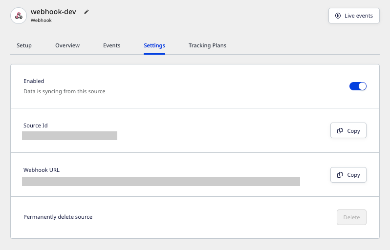

RudderStack lets you add any source that supports a webhook and use it to send events to your preferred destinations.

<div class="warningBlock">
You can configure webhooks as sources only for the platforms that support them.
</div> 

## Getting started

Follow these steps to set up your webhook source in the RudderStack dashboard:

<div class="infoBlock">
In this example, events are ingested from <a href="https://mailchimp.com">Mailchimp</a> into RudderStack by configuring a webhook.
</div>

1. Go to your [RudderStack dashboard](https://app.rudderstack.com/) and click on **Add Source**. From the list of **Event Stream** sources, select **Webhook**.
2. Assign a name to your source and click **Continue**.
3. Your webhook source is now created. Note the **Webhook URL** containing the **Write key** as a query parameter, as shown:



4. Then, <Link to="/dashboard-guides/destinations/#adding-a-destination">add a destination in RudderStack</Link> and connect it to this webhook source.

<div class="infoBlock">
For this example, <Link to="/destinations/streaming-destinations/google-analytics-ga/">Google Analytics</Link> is configured as a destination.
</div>

5. Next, add the webhook URL to your source platform - in this case, **Mailchimp**. 

<div class="warningBlock">
You can configure webhooks as sources only for the platforms that support them.
</div> 

The following image shows the webhook URL added in Mailchimp:


<div class="warningBlock">
Add and test your webhook URL. You can use the <Link to="/dashboard-guides/live-events/#source-live-events">Live Events</Link> functionality to view the events tracked in real time.
</div>

When the users perform any action configured in the source, the source platform will automatically send the generated events to the webhook URL.

In this example, Mailchimp sends the updates under **Trigger on Events** \(seen in the above image\) as the user events to the webhook URL with the content type `application/x-www-form-urlencoded`.

<div class="infoBlock">
The content type can vary in case of the other webhook sources.
</div>

RudderStack then takes the data, creates the payload, and sends it to the destinations connected to the webhook source (Google Analytics, in this case).

<div class="warningBlock">
You must also add the appropriate <Link to="/features/transformations/">Transformation</Link> to transform the payload into a destination-specific format before sending it to the destination. Refer to the <Link to="#payload-creation-and-transformation">Payload creation and transformation</Link> section for more details.
</div>

## Payload creation and transformation

This section details how RudderStack receives the data from the webhook source platform and creates the resulting payload.

1. Continuing with our Mailchimp example, suppose a customer subscribes to Mailchimp. Mailchimp then sends the following data to RudderStack:

```
type=subscribe&fired_at=2021-07-28+08%3A06%3A59&data%5Bid%5D=e2ff089583&data%5Bemail%5D=ruchira%40rudderlabs.com&data%5Bemail_type%5D=html&data%5Bip_opt%5D=115.187.35.152&data%5Bweb_id%5D=161912900&data%5Bmerges%5D%5BEMAIL%5D=name%40rudderlabs.com&data%5Bmerges%5D%5BFNAME%5D=Name&data%5Bmerges%5D%5BLNAME%5D=Surname&data%5Bmerges%5D%5BADDRESS%5D=&data%5Bmerges%5D%5BPHONE%5D=&data%5Bmerges%5D%5BBIRTHDAY%5D=&data%5Blist_id%5D=ec4689c266
```

2. RudderStack receives this data and creates the following payload:

```javascript
  {
  type: "track",
  event: "webhook_source_event",
  rudderId: "044448e2-a674-426c-ba61-8341262babcc",
  messageId: "4379907d-689a-4e3a-a2f7-477e29a02299",
  properties: {
    type: ["subscribe"],
    "data[id]": ["e2ff089583"],
    fired_at: ["2021-07-28 08:06:59"],
    "data[email]": ["[name@rudderlabs.com](mailto:name@rudderlabs.com)"],
    "data[ip_opt]": ["115.187.35.152"],
    "data[web_id]": ["161912900"],
    "data[list_id]": ["ec4689c266"],
    "data[email_type]": ["html"],
    "data[merges][EMAIL]": [
      "[name@rudderlabs.com](mailto:name@rudderlabs.com)",
    ],
    "data[merges][FNAME]": ["Name"],
    "data[merges][LNAME]": ["Surname"],
    "data[merges][PHONE]": [""],
    "data[merges][ADDRESS]": [""],
    "data[merges][BIRTHDAY]": [""],
  },
  anonymousId: "d6597ba2-54db-4bd7-8769-86ac067b4178",
}
```

3. Transform this payload as per the event format accepted by destination. To do this, use RudderStack's <Link to="/features/transformations/">Transformation</Link> feature. A sample transformation is as shown below:

```javascript
export function transformEvent(event) {
  const updatedEvent = event
  const { properties } = event

  if (properties) {
    updatedEvent.event = properties.type
    updatedEvent.userId = properties["data[email]"]
    updatedEvent.properties.name = `${properties["data[merges][FNAME]"]} ${properties["data[merges][LNAME]"]}`
    updatedEvent.properties.phone = properties["data[merges][PHONE]"]

    delete updatedEvent.properties["data[merges][PHONE]"]
    delete updatedEvent.properties["data[merges][FNAME]"]
    delete updatedEvent.properties["data[merges][LNAME]"]
  }

  return updatedEvent
}
```

The transformed payload is shown below:

```javascript
{
  type: 'track',
  event: [
    'subscribe'
  ],
  rudderId: '044448e2-a674-426c-ba61-8341262babcc',
  messageId: '4379907d-689a-4e3a-a2f7-477e29a02299',
  properties: {
    type: [
      'subscribe'
    ],
    'data[id]': [
      'e2ff089583'
    ],
    fired_at: [
      '2021-07-28 08:06:59'
    ],
    'data[email]': [
      'name@rudderlabs.com'
    ],
    'data[ip_opt]': [
      '115.187.35.152'
    ],
    'data[web_id]': [
      '161912900'
    ],
    'data[list_id]': [
      'ec4689c266'
    ],
    'data[email_type]': [
      'html'
    ],
    'data[merges][EMAIL]': [
      'name@rudderlabs.com'
    ],
    'data[merges][ADDRESS]': [
      ''
    ],
    'data[merges][BIRTHDAY]': [
      ''
    ],
    name: 'Name Surname',
    phone: [
      ''
    ]
  },
  anonymousId: 'd6597ba2-54db-4bd7-8769-86ac067b4178',
  userId: [
    'name@rudderlabs.com'
  ]
}
```

4. RudderStack then sends this payload to the destinations connected to your source - Google Analytics, in this case.