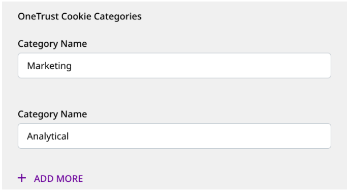

<div class="warningBlock">
The OneTrust integration with the JavaScript SDK is applicable only for the <Link to="/destinations/rudderstack-connection-modes/#device-mode">device mode</Link> connections. For the <Link to="/destinations/rudderstack-connection-modes/#cloud-mode">cloud mode</Link> connections, you can write a <Link to="/features/transformations/#adding-a-transformation">transformation</Link> to implement your desired use case.
</div>

The JavaScript SDK seamlessly integrates with the OneTrust SDK. It lets you map the OneTrust cookie/consent groups to RudderStack's consent purposes. RudderStack, in turn, uses this consent information to enable/disable tracking and sending the data.

## How the OneTrust-JavaScript SDK integration works

Whenever a user starts browsing a website, OneTrust pops up a modal to take consent from the user. This modal contains a list of cookie groups representing the GDPR consent purposes that the user needs to decline or accept.

The JavaScript SDK fetches these consented groups and the destination (OneTrust category) mappings specified in the RudderStack dashboard. Depending on these settings, the SDK filters the destinations.

## Setting up the integration

The following sections highlight the steps to set up the JavaScript SDK integration with OneTrust.

### Step 1: Configuring OneTrust

Follow these steps to configure OneTrust for your web app:

1. Create a [OneTrust account](https://my.onetrust.com/s/login/SelfRegister?language=en_US&startURL=%2Fs%2F%3Ft%3D1587743884774) and get subscription to their <Link to="https://www.onetrust.com/products/cookie-consent/">Cookie Consent</Link> product.
2. Navigate to **Websites** > **Add Websites**. 
3. Enter your top-level website URL to scan and click **Start Scan**.
4. Go to the **Categorizations** tab and define the new categories or modify the existing ones, as required.

<div class="infoBlock">
The categories should be associated with/attached to at least one cookie to be displayed in your RudderStack dashboard's OneTrust modal.
</div>

5. Go to the **Scripts** tab, select the domain to be published and click **Publish** to publish the script.

### Step 2: Specifying the OneTrust Cookie Categories

You need to enable OneTrust for a given JavaScript source. To do so, specify the consent category names defined in OneTrust (**Step 1**) for each destination connected to that JavaScript source.



### Step 3: Setting up your website

1. Load the OneTrust script that you published in your web app in <Link to="#step-1-configuring-onetrust">Step 1</Link>, as shown below:

```javascript

<!-- OneTrust Cookies Consent Notice start for samplewebsite.com -->
<script
        src="https://cdn.cookielaw.org/scripttemplates/otSDKStub.js"
        type="text/javascript"
        charset="UTF-8"
        data-domain-script="xxxxxxxx-xxxx-xxxx-xxxx-xxxxxxxxxxxx" >
</script>
<script type="text/javascript">
        // Required OneTrust callback
        function OptanonWrapper() { }
</script>
<!-- OneTrust Cookies Consent Notice end for samplewebsite.com -->
```

<div class="warningBlock">
As seen in the above snippet, you <strong>must</strong> first load the OneTrust script and then load the JavaScript SDK <strong>only if</strong> the user provides their consent. This is because the SDK determines whether to send events to a destination based on the user's consent. If a user denies consent in OneTrust, then Rudderstack does not load the destination SDKs or send any events to them.
</div>

2. One way to load the JavaScript SDK after the user provides the consent is to modify the `OptanonWrapper()` callback function provided by OneTrust. You also need to add the `cookieConsentManager` option in the `load()` call as shown:

```javascript
function OptanonWrapper() {
  if (window.OneTrust.IsAlertBoxClosed()) {
    // Load the SDK
    rudderanalytics.load(WRITE_KEY, DATA_PLANE_URL, {
      cookieConsentManager: {
        oneTrust: {
          enabled: true
        }
      },
      //other options
    });
  }
}
```

<div class="infoBlock">
If a user updates the consent settings, the web page must be refreshed for the changes to take effect in the SDK.
</div>

Once completed, RudderStack reads the consented categories and filters the destinations accordingly.

<div class="infoBlock">
Replace <Link to="/resources/glossary/#write-key"><code class="inline-code">WRITE_KEY</code></Link> and <Link to="/dashboard-guides/overview/#data-plane-url"><code class="inline-code">DATA_PLANE_URL</code></Link> in the above snippet with the actual values.
</div>

## FAQ

### What happens if the JavaScript SDK is loaded before the OneTrust modal is closed?

In this case, the JavaScript SDK will not be able to capture the user consent. Hence, it will load all the connected destinations and all the events will flow through to them.

### Can I integrate the RudderStack JavaScript SDK with any consent manager?

If you are using a consent manager other than OneTrust, you can configure the cookie categories to show on your website whenever a user visits.

Next, you need to create an internal mapping between these cookie categories and the destinations configured in RudderStack. For example:

- Analytical cookie: Amplitude, Google Analytics
- Targeting cookie: Bing Ads, Google Ads
- Marketing cookie: Braze, Mailchimp, Customer.io

When the user provides consent, you should fetch the consent (via the API or SDK provided by your consent manager) and filter the destinations depending on the consent. Once you have the list of destinations for which the user has provided consent, you can load the JavaScript SDK only for those destinations.

For example, if a user has provided consent for an analytical cookie, then you can load the JavaScript SDK as shown:

```javascript
rudderanalytics.load(WRITE_KEY,DATA_PLANE_URL,{
   integrations: {
       All: false,
       "Amplitude": true,
       "Google Analytics": true
       // only provide the destinations the user has provide consent for
   }
   // pass other initialization options
});
```